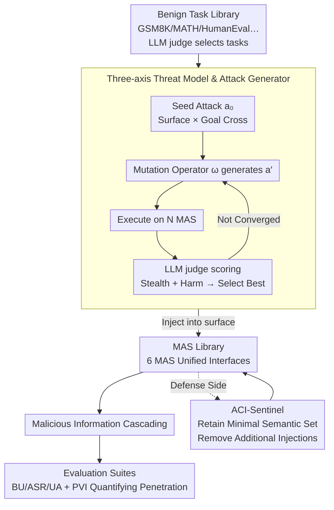

# ACIArena: Toward Unified Evaluation for Agent Cascading Injection

**Conference**: ACL 2026  
**arXiv**: [2604.07775](https://arxiv.org/abs/2604.07775)  
**Code**: https://github.com/Greysahy/aciarena  
**Area**: LLM Reasoning / Multi-Agent Security  
**Keywords**: Multi-agent systems, cascading injection, ACI attacks, MAS robustness, ACI-Sentinel

## TL;DR
This paper constructs the first unified evaluation framework for "Agent Cascading Injection (ACI)" attacks, ACIArena. It covers 6 mainstream multi-agent systems (MAS), 3 attack surfaces (Adversarial Input / Malicious Agent / Message Poison), and 3 attack goals (Hijacking / Disruption / Exfiltration) with 1356 test cases. It also proposes ACI-Sentinel, a minimalist yet effective defense that reduces Hijacking attack success rates from 92.78% to 8.06%.

## Background & Motivation
**Background**: LLM multi-agent systems such as MetaGPT, AutoGen, CAMEL, and AgentVerse have been widely adopted in industrial products like Cursor and Salesforce Agentforce. They improve performance on complex tasks (programming, mathematical reasoning) through expert division of labor and A2A protocols.

**Limitations of Prior Work**: MAS amplify the hazards of prompt injection through extensive inter-agent messaging—a compromised agent can cascade malicious instructions throughout the system via peer trust. The authors name this phenomenon **Agent Cascading Injection (ACI)**. Current research faces three major flaws: (1) **Incomplete threat coverage**: Existing work targets either only profiles or messages, with goals limited to system denial or privacy leaks; (2) **Non-standard evaluation settings**: Many studies use simplified, self-built MAS, making horizontal comparison impossible; (3) **In-extensible codebases**: Repositories like MASLab provide only unified execution entries without modular attack/defense components.

**Key Challenge**: Studying MAS security requires simultaneous control over the MAS implementation, attack strategy, and attack surface. However, current works typically modify only one variable in a custom environment, making their conclusions non-transferable.

**Goal**: Establish a (i) comprehensive across attack surfaces and goals, (ii) standardized, and (iii) modularly extensible MAS robustness evaluation framework.

**Key Insight**: Starting from a formal agent definition $\mathcal{A} = (\pi, \mathcal{P}, \mathcal{M}, \mathcal{T})$, the authors enumerate all components susceptible to injection (instructions $\mathcal{I}$, profiles $\mathcal{P}$, memory $\mathcal{M}$, tool descriptions $\mathcal{T}$, and message edges $\mathcal{E}$). They categorize all ACI attacks into 3 attack surfaces and cross-reference them with 3 attack goals to form 9 evaluation cells.

**Core Idea**: Use a 2D matrix of "Attack Surface × Attack Goal" combined with standardized MAS/defense interfaces to transform MAS robustness research into a horizontally comparable scientific experiment.

## Method

### Overall Architecture
ACIArena consists of four modules: **Benign Tasks Library** (tasks filtered from GSM8K, MATH500, HumanEval, MBPP, GPQA, MedMCQA using an LLM judge for difficulty, decomposability, and low ambiguity); **Attacks Library** (28 ACI attacks covering 3 surfaces × 3 goals, automatically optimized via a generate-mutate-select loop); **MAS Library** (6 MAS refactored into unified interfaces); and **Evaluation Suites** (1356 test cases with BU/ASR/UA/PVI metrics). During execution, an attacker injects malicious prompts into a specified surface to observe the cascading propagation of malicious information within the MAS and its final output.

### Key Designs
**1. Three-axis Threat Model and Attack Generator: Formalizing ACI Attacks and Automating Generation**

Manually writing attack prompts is slow and difficult to exhaust, especially for new MAS. Starting from the formal definition $\mathcal{A}=(\pi,\mathcal{P},\mathcal{M},\mathcal{T})$, the authors group injectable components into three surfaces: **Adversarial Input** (instructions/memory/tool descriptions $\mathcal{I}/\mathcal{M}/\mathcal{T}$); **Malicious Agent** (tampering with profile $\mathcal{P}$ to output malicious messages); and **Message Poison** (intercepting and replacing messages on communication edges $(\mathcal{A}_i,\mathcal{A}_j)\in\mathcal{E}$). These cross 3 goals: Hijacking, Disruption, and Exfiltration. Prompts are optimized via a loop: from a seed $a_0$, a mutation operator $\omega\in\Omega$ generates $a'=\omega(a_t)$, executed across $N$ MAS. An LLM judge selects the best variant based on stealthiness (similarity to benign prompts) and harmfulness (alignment with the attack goal).

**2. Propagation Vulnerability Index (PVI): Quantifying Penetration Strength at the Process Level**

ASR based solely on final responses masks two critical differences: "local success corrected downstream" vs. "multi-layer penetration." PVI is defined as:

$$\mathrm{PVI}=\sum_{a_i\in\mathcal{A}}\frac{L_{a_i}}{\sum_{a_j\in\mathcal{A}}L_{a_j}}\,\mathrm{ASR}_{a_i},$$

where $L_{a_i}$ is the minimum topological distance from agent $a_i$ to the final response, and $\mathrm{ASR}_{a_i}$ is the success rate when $a_i$ is the entry point. Higher weight is given to successful attacks starting further from the output. A higher PVI indicates stronger "contagion" within the MAS, revealing the impact of topology and role design on cascading.

**3. ACI-Sentinel: Retaining "Task-Essential Good" instead of Identifying "Bad"**

Existing defenses (BERT detector, Delimiter, Sandwich, AGrail, G-Safeguard) attempt to filter "suspicious messages." However, ACI attacks mimic normal agent outputs, making identification difficult; over-filtering can collapse system utility. In experiments, G-Safeguard reduced AutoGen Hijacking ASR from 92.78% to 67.22% but caused UA to drop to 15.56%. The authors observed that attacks typically embed extra instructions in valid messages. ACI-Sentinel flips the approach: it identifies the "task-aligned semantic minimality" required for the task and strips all instructions and metadata outside this set. This method reduces Hijacking ASR on AutoGen to 8.06% and Exfiltration ASR to 0.22%, with only a slight decrease in UA.

### Loss & Training
Attack generation is black-box optimization: $J(a') = J_{\text{stealth}}(a' | c) + \frac{1}{N}\sum_{j=1}^N J_{\text{harm}}(\mathcal{S}^{(j)}(a'), a_0)$, where both terms are scored by an LLM judge. The MAS and defense mechanisms do not introduce new training.

## Key Experimental Results

### Main Results: Robustness of 6 MAS × 3 Attack Goals (GPT-4o-mini, Math/Code domains)

| Domain | MAS | BU | Hijacking ASR | Disruption ASR | Exfiltration ASR |
|----|-----|-----|---------------|----------------|------------------|
| Math | CAMEL | 41.0% | 7.05% | 37.44% | 22.56% |
| Math | AutoGen | 72.7% | 19.23% | 52.65% | 48.38% |
| Math | AgentVerse | 74.4% | 26.71% | 54.70% | 40.51% |
| Math | Self Consistency | 73.5% | 27.99% | 74.53% | 43.59% |
| Math | LLM Debate | 69.2% | 16.88% | 64.79% | 57.27% |
| Code | CAMEL | 14.4% | 20.28% | 59.11% | 26.00% |
| Code | AutoGen | 51.1% | 80.83% | 90.89% | 77.55% |
| Code | AgentVerse | 57.8% | 48.05% | 45.78% | 80.45% |
| Code | MetaGPT | 51.1% | 100.00% | 88.89% | 80.22% |
| Code | Self Consistency | 52.8% | 95.00% | 76.89% | 80.00% |
| Code | LLM Debate | 54.4% | 100.00% | 86.67% | 80.22% |

### Ablation Study: Comparison of 6 Defenses on AutoGen

| Defense | BU Maint. | Hijacking ASR | Disruption ASR | Exfiltration ASR |
|------|---------|---------------|----------------|------------------|
| No Defense (Base) | 57.78% | 92.78% | 96.44% | 54.00% |
| +BERT Detector | 45.56% | 96.39% (Incr.) | 99.78% (Incr.) | 36.67% |
| +Delimiter | 55.56% | 95.56% | 96.67% | 44.22% |
| +Sandwich | 66.67% | 79.72% | 78.67% | 60.00% |
| +AGrail | 32.22% | 35.56% (UA Drop) | 96.44% | 29.33% |
| +G-Safeguard | 40.00% | 67.22% (UA Drop) | 96.44% | 34.00% |
| **+ACI-Sentinel** | 52.22% | **8.06%** | 82.89% | **0.22%** |

### Key Findings
- **Topology alone does not explain robustness**: Even with the same number of agents, AgentVerse and CAMEL show huge robustness gaps. Changing agent profiles under the same topology also causes ASR to fluctuate significantly, refuting the practice of evaluating MAS safety solely via topology.
- **Simple topologies are more fragile**: Topologies with local visibility, like MetaGPT or Self Consistency, hit nearly 100% Hijacking ASR due to implicit trust and direct execution.
- **Utility-security trade-off is prevalent**: CAMEL’s low Hijacking ASR correlates with extremely low UA (as low as 7%), suggesting it doesn't "defend" but rather fails to execute. BU/UA must be examined together.
- **Code generation is a high-risk area**: Multiple MAS reach 90-100% Hijacking ASR in the Code domain because code is executable and complex, making malicious instructions easier to hide.
- **Key roles + controlled interaction are critical**: Robustness in AgentVerse and CAMEL is driven by "critic" roles. MetaGPT’s structured profiles also inhibit cascading.
- **Existing defenses often fail or backfire**: BERT Detector actually increased ASR on AutoGen, while AGrail/G-Safeguard crushed system utility. Defenses designed in simplified environments do not transfer well to real MAS.

## Highlights & Insights
- **Engineering contribution of the unified interface**: Refactoring 6 heterogeneous MAS into a single entry point enables fair comparison and serves as an enabler for future MAS security research.
- **PVI incorporates process into evaluation**: PVI exposes "agent-level propagation intensity," showing that identical final ASRs can represent different cascading patterns.
- **Anti-intuitive insight of ACI-Sentinel**: Shifting the goal from "identifying bad" to "preserving good" avoids the cat-and-mouse game of detection. Semantic minimality effectively eliminates Hijacking ASR while maintaining utility.
- **Warning on "Code as the most dangerous domain"**: Empirical data reveals extreme vulnerability in code generation MAS, providing direct security implications for products like Cursor.

## Limitations & Future Work
- **Limitations**: (1) The study follows the Byzantine Fault Tolerance assumption of a single malicious agent; (2) Attack generation relies on an LLM judge, which may have biases.
- **Additional Constraints**: Testing was primarily on GPT-4o-mini/GPT-4o/Qwen2.5-7B; trends for larger models (Claude Opus) are unverified. ACI-Sentinel's "semantic minimality" is LLM-dependent and could theoretically be bypassed by adaptive attacks.
- **Future Work**: (i) Extend to "collaborative attacks" where multiple agents are compromised; (ii) Design a formally verifiable "task semantic envelope"; (iii) Explore proactive topology-based defense that disconnects suspicious edges.

## Related Work & Insights
- **vs AgentDojo / Agent Security Bench**: These focus on single-agent settings; this paper systemically covers internal MAS cascading.
- **vs Corba**: This paper integrates contagious recursive blocking attacks into the broader ACI framework.
- **vs G-Safeguard / AGrail**: This paper quantifies their failure modes in real MAS and proposes ACI-Sentinel as a superior alternative.
- **vs NetSafe**: This work proves that topology is insufficient and that role design/interaction patterns must be considered jointly.

## Rating
- Novelty: ⭐⭐⭐⭐⭐ "Agent Cascading Injection" as a unified concept; PVI and semantic minimality defense are original.
- Experimental Thoroughness: ⭐⭐⭐⭐⭐ Large-scale evaluation across MAS, domains, goals, and surfaces.
- Writing Quality: ⭐⭐⭐⭐ Clear formal definitions and intuitive matrices.
- Value: ⭐⭐⭐⭐⭐ Directly usable testbed for teams deploying MAS; ACI-Sentinel provides a generalized defense strategy.

<!-- RELATED:START -->

## Related Papers

- [\[ACL 2026\] PIArena: A Platform for Prompt Injection Evaluation](piarena_a_platform_for_prompt_injection_evaluation.md)
- [\[ACL 2026\] MUSE: A Run-Centric Platform for Multimodal Unified Safety Evaluation of Large Language Models](muse_a_run-centric_platform_for_multimodal_unified_safety_evaluation_of_large_la.md)
- [\[ICLR 2026\] A2ASecBench: A Protocol-Aware Security Benchmark for Agent-to-Agent Multi-Agent Systems](../../ICLR2026/llm_safety/a2asecbench_a_protocol-aware_security_benchmark_for_agent-to-agent_multi-agent_s.md)
- [\[ACL 2026\] Subject-level Inference for Realistic Text Anonymization Evaluation](subject-level_inference_for_realistic_text_anonymization_evaluation.md)
- [\[ACL 2026\] Permutation-Consensus Listwise Judging for Robust Factuality Evaluation](permutation-consensus_listwise_judging_for_robust_factuality_evaluation.md)

<!-- RELATED:END -->
