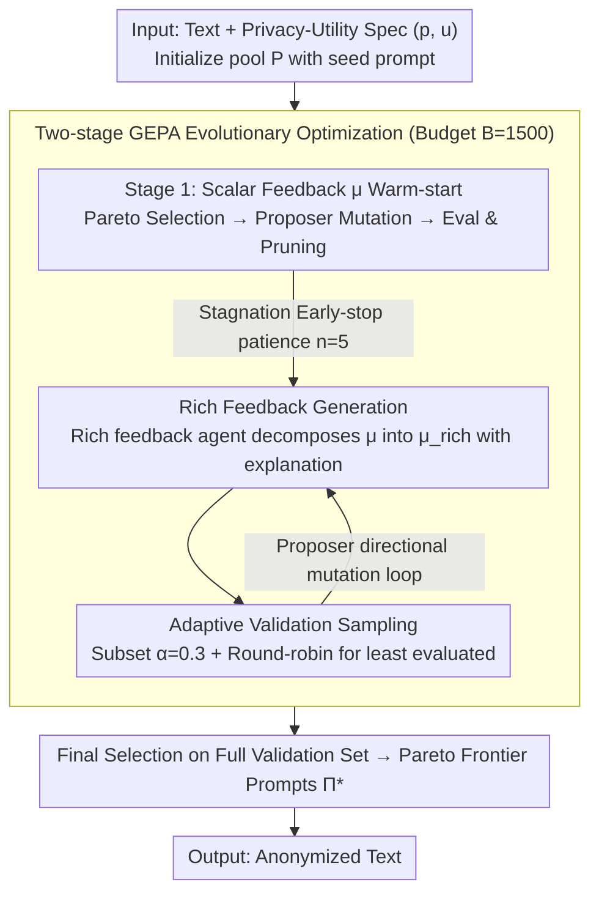

# Adaptive Text Anonymization: Learning Privacy-Utility Trade-offs via Prompt Optimization

**Conference**: ACL 2026 Findings  
**arXiv**: [2602.20743](https://arxiv.org/abs/2602.20743)  
**Code**: [https://github.com/gabrielloiseau/adaptive-text-anonymization](https://github.com/gabrielloiseau/adaptive-text-anonymization)  
**Area**: AI Safety  
**Keywords**: Text Anonymization, Privacy Protection, Prompt Optimization, Evolutionary Algorithms, Privacy-Utility Trade-off

## TL;DR

Ours proposes an adaptive text anonymization framework that automatically discovers task-specific anonymization instructions for LLMs through evolutionary prompt optimization. It outperforms manually designed strategies across various privacy-utility trade-off scenarios and is executable on open-source models.

## Background & Motivation

**Background**: Text anonymization is a foundational technology for sharing and analyzing sensitive data. Current methods are primarily divided into traditional sequence labeling (detecting and masking PII entities) and LLM-based adversarial collaborative pipelines (e.g., the AF method using an attacker LLM to guide anonymization decisions).

**Limitations of Prior Work**: Existing LLM anonymization pipelines face three major limitations: (1) Fixed trade-off paradigms—manually designing a strategy for every scenario lacks flexibility; (2) Dependency on manual prompt engineering, which is subjective, labor-intensive, and sub-optimal; (3) Most rely on closed-source API models (e.g., GPT-4/5), where sending sensitive data through external APIs contradicts the privacy objective itself.

**Key Challenge**: Anonymization is inherently context-dependent—strategies for medical reports and social media comments differ significantly. No "one-size-fits-all" solution exists, yet existing methods cannot adaptively adjust strategies.

**Goal**: Design an adaptive framework capable of (1) automatically discovering anonymization prompts for specific privacy-utility requirements, (2) running on open-source models, and (3) finding multiple Pareto-optimal strategies in a single optimization run.

**Key Insight**: Reframe the anonymization problem as a "string discovery" problem—rather than modifying model parameters, ours searches for the optimal natural language instructions to guide model behavior.

**Core Idea**: Utilize a Genealogical Evolutionary Prompt Optimization (GEPA) algorithm to automatically search the anonymization prompt space. Evolution starts from a general seed prompt to generate task-adapted instructions, achieving an adaptive privacy-utility trade-off.

## Method

### Overall Architecture

This paper addresses the following: anonymization strategies are highly context-dependent, but existing LLM pipelines either use fixed manual trade-offs or rely on closed-source APIs. The authors redefine anonymization as a "string discovery" problem: searching for an optimal natural language instruction to guide open-source models without parameter updates.

The overall process is: given a text to be anonymized and a privacy-utility task specification $(p, u)$, the system starts from a general seed prompt and uses GEPA to search for the anonymization instruction $\Pi^*$ within a fixed computational budget of $B=1500$ LLM forward passes. The output is the final anonymized text. The search follows three steps: initializing the prompt pool, warm-starting with coarse-grained scalar feedback, and refining with rich feedback containing natural language explanations after performance plateaus.

### Key Designs

**1. Two-stage GEPA Evolutionary Optimization: Replacing "Single Fixed Trade-off" with "Pareto Frontier Generation"**

Traditional pipelines require manual re-design for every scenario. This method maintains a prompt pool $P$. In each iteration, Pareto sorting identifies high-performance and diverse prompts. A proposer agent reads execution trajectories and feedback to suggest mutations. New candidates are evaluated on the validation set and integrated into the pool via Pareto pruning. The first stage uses a simple scalar aggregate feedback $\mu$, while the second stage introduces rich feedback after performance plateaus ($n=5$). Evolutionary search naturally supports multi-objective optimization, allowing one run to yield a spectrum of Pareto-optimal solutions from privacy-centric to utility-centric.

**2. Rich Feedback Mechanism: Informing the Proposer "Where and How to Improve"**

Scalar feedback $\mu$ is too coarse for the proposer to determine the direction of improvement. During the refinement stage, a dedicated rich feedback agent (an LLM) decomposes the aggregate metric $\mu$ into a structured, natural language explanation $\mu_{rich}$. This provides an interpretable signal for directional behavior updates, allowing the proposer to achieve larger, more accurate improvements within the remaining budget.

**3. Adaptive Validation Sampling: Prioritizing the Evaluation Budget**

Evaluating candidates on the full validation set would quickly exhaust the $B=1500$ budget. During refinement, evaluation is performed on a sampled subset $D'_{valid} \subset D_{valid}$ with a sampling ratio $\alpha=0.3$. A round-robin strategy prioritizes samples that have been evaluated the fewest times to ensure diversity. The full validation set is only used during final selection to ensure fair ranking.

### Loss & Training

This method involves no gradient-based training. The optimization goal is the aggregation of privacy and utility scores (e.g., mean), with multi-objective trade-offs handled via Pareto selection. The evolution budget is $B=1500$ LLM forward passes, with early-stopping patience $n=5$.

## Key Experimental Results

### Main Results

| Benchmark | Method | Privacy↑ | Utility↑ |
|------|------|-------|-------|
| DB-Bio | Optimized Qwen3 | 65.5 | 100 |
| DB-Bio | AF (GPT-5) | 78.0 | 92.1 |
| TAB | Optimized Qwen3 | 92.3 | 56.2 |
| TAB | AF (GPT-5) | 59.9 | 42.5 |
| PUPA | Optimized Qwen3 | 98.0 | 79.3 |
| PUPA | AF (GPT-5) | 94.2 | 46.0 |
| MedQA | Optimized Qwen3 | 24.6 | 45.9 |
| MedQA | AF (GPT-5) | 24.4 | 45.8 |

### Ablation Study

| Configuration | Privacy-Utility Performance | Description |
|------|-------------|------|
| Seed Prompt | Baseline | General seed prompt without optimization |
| Task-Specific Prompt | Medium | Manually designed task-specific prompt |
| Optimized Prompt | Optimal | Automatically optimized prompt |
| OpenPII (Entity Detection) | High Utility, Low Privacy | Only detects PII; insufficient protection |
| DP-Prompt ($\epsilon=100$) | High Privacy, Low Utility | Differential privacy noise severely damages utility |

### Key Findings
- Optimized open-source Qwen3-30B is competitive with or superior to the GPT-5 baseline in most tasks, particularly in utility retention.
- Different models exhibit distinct optimization profiles: Mistral tends toward aggressive privacy gains (at potential utility cost), Gemma improves conservatively, and Qwen is the most robust.
- A single optimization run can discover multiple Pareto-optimal strategies, covering the full spectrum from privacy-first to utility-first preferences.

## Highlights & Insights
- Reforming anonymization into a "string search" problem is a clever abstraction. Since each Pareto solution is just a natural language string, deployment and storage costs are extremely low.
- Evolutionary optimization naturally supports multi-objective discovery. Finding various trade-off points in one run is far more efficient than traditional methods requiring individual strategy designs for each point.
- The rich feedback mechanism—decomposing scalar metrics into structured natural language explanations—is transferable to any scenario requiring LLM self-improvement.

## Limitations & Future Work
- Evaluation of privacy and utility metrics still relies on closed-source LLMs (e.g., Gemini-2.5-flash), which partially conflicts with the goal of full local deployment.
- Each task still requires a small amount of labeled data (111 for training + 111 for validation), making it not entirely zero-shot.
- The anonymization capabilities of reasoning models (e.g., CoT models) were not considered, which could be a complementary direction.

## Related Work & Insights
- **vs AF (Staab et al.)**: AF uses fixed adversarial collaboration strategies and relies on GPT-5; ours use evolutionary optimization to search for strategies automatically on open-source models.
- **vs DP-Prompt**: While differential privacy offers theoretical guarantees, it severely damages utility. Ours significantly outperforms DP-Prompt in practical privacy-utility trade-offs.

## Rating
- Novelty: ⭐⭐⭐⭐ Innovative reframing of anonymization as prompt optimization.
- Experimental Thoroughness: ⭐⭐⭐⭐⭐ 5 datasets, 3 open-source models, multiple baselines, and comprehensive ablations.
- Writing Quality: ⭐⭐⭐⭐ Clear problem definitions and systematic methodology.
- Value: ⭐⭐⭐⭐ Direct utility for sensitive data processing scenarios.

<!-- RELATED:START -->

## Related Papers

- [\[CVPR 2026\] Unsafe2Safe: Controllable Image Anonymization for Downstream Utility](../../CVPR2026/llm_safety/unsafe2safe_controllable_image_anonymization_for_downstream_utility.md)
- [\[ACL 2026\] Subject-level Inference for Realistic Text Anonymization Evaluation](subject-level_inference_for_realistic_text_anonymization_evaluation.md)
- [\[ICLR 2026\] Resource-Adaptive Federated Text Generation with Differential Privacy](../../ICLR2026/llm_safety/resource-adaptive_federated_text_generation_with_differential_privacy.md)
- [\[NeurIPS 2025\] InvisibleInk: High-Utility and Low-Cost Text Generation with Differential Privacy](../../NeurIPS2025/llm_safety/invisibleink_high-utility_and_low-cost_text_generation_with_differential_privacy.md)
- [\[ACL 2026\] Look Twice before You Leap: A Rational Framework for Localized Adversarial Anonymization](look_twice_before_you_leap_a_rational_framework_for_localized_adversarial_anonym.md)

<!-- RELATED:END -->
