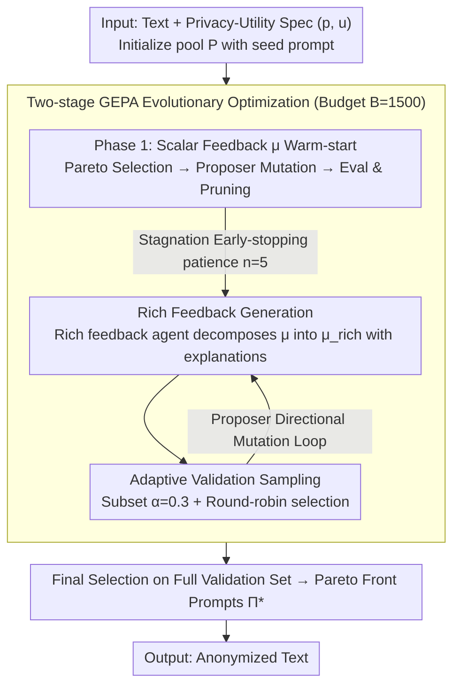

# Adaptive Text Anonymization: Learning Privacy-Utility Trade-offs via Prompt Optimization

**Conference**: ACL 2026 Findings  
**arXiv**: [2602.20743](https://arxiv.org/abs/2602.20743)  
**Code**: [https://github.com/gabrielloiseau/adaptive-text-anonymization](https://github.com/gabrielloiseau/adaptive-text-anonymization)  
**Area**: AI Safety  
**Keywords**: Text Anonymization, Privacy Protection, Prompt Optimization, Evolutionary Algorithms, Privacy-Utility Trade-off

## TL;DR

Discovered task-specific anonymization instructions for LLMs via an adaptive framework using evolutionary prompt optimization. It outperforms hand-crafted strategies across multiple privacy-utility trade-off scenarios and is executable on open-source models.

## Background & Motivation

**Background**: Text anonymization is a fundamental technology for sensitive data sharing and analysis. Current methods primarily consist of traditional sequence labeling (detecting and masking PII entities) and LLM-based adversarial collaboration pipelines (e.g., Using attacker LLMs to guide anonymization decisions in AF methods).

**Limitations of Prior Work**: Existing LLM anonymization pipelines face three limitations: (1) Fixed trade-off paradigm—manually designing a strategy for every scenario lacks flexibility; (2) Dependence on manual prompt engineering, which is subjective, labor-intensive, and often sub-optimal; (3) Reliance on closed-source API models (e.g., GPT-4/5), which contradicts privacy goals when processing sensitive data via external APIs.

**Key Challenge**: Anonymization is inherently context-dependent—strategies for medical reports and social media comments differ significantly. No "one-size-fits-all" solution exists, yet current methods cannot adaptively adjust strategies.

**Goal**: Design an adaptive framework capable of (1) automatically discovering anonymization prompts for specific privacy-utility requirements, (2) running on open-source models, and (3) identifying multiple Pareto-optimal strategies in a single optimization run.

**Key Insight**: Redefine the anonymization problem as a "string discovery" problem—rather than modifying model parameters, the system searches for optimal natural language instructions to guide model behavior.

**Core Idea**: Use Genomic Evolutionary Prompt Adaptation (GEPA) to automatically search the anonymization prompt space. Starting from a generic seed prompt, it evolves task-adapted instructions to achieve adaptive privacy-utility trade-offs.

## Method

### Overall Architecture

This paper addresses the issue where anonymization strategies are highly context-dependent (de-identification needs for medical reports vs. social comments differ) while existing LLM pipelines use fixed trade-offs or rely on closed APIs—the latter being contradictory to privacy goals. The authors redefine anonymization as a "string discovery" problem: searching for an optimal natural language instruction to guide an open-source model without updating weights.

The process involves: given input text and a privacy-utility task specification $(p, u)$, starting from a general seed prompt, GEPA searches for the anonymization instruction $\Pi^*$ within a fixed computational budget of $B=1500$ LLM forward passes. The search proceeds in three steps: initializing the prompt pool, warm-starting with coarse-grained scalar feedback, and refining with rich feedback containing natural language explanations after performance plateaus.

### Key Designs

**1. Two-stage GEPA Optimization: Replacing "Single Fixed Trade-off" with "Generating the Entire Pareto Front"**
Traditional fixed trade-offs require manual redesign for every scenario. This method maintains a prompt pool $P$. In each iteration, prompts that are both high-performing and diverse are selected via Pareto sorting. A proposer agent reviews execution traces and feedback to propose mutations. New candidates are evaluated on a validation set and added to the pool after Pareto pruning. Phase one uses simple scalar feedback $\mu$. When performance plateaus (early-stopping patience $n=5$), it upgrades to rich feedback refinement. Evolutionary search naturally supports multi-objective optimization, allowing the discovery of Pareto-optimal solutions ranging from privacy-first to utility-first in a single run.

**2. Rich Feedback Mechanism: Letting the Proposer Know "What is Wrong and How to Fix It"**
Scalar feedback $\mu$ is too coarse for the proposer to determine the direction of improvement. During refinement, a dedicated rich feedback agent (an LLM) decomposes the aggregate metric $\mu$ into structured feedback $\mu_{rich}$ with natural language explanations. This provides an interpretable signal for directional updates, allowing for larger and more accurate behavioral shifts with fewer evaluations.

**3. Adaptive Validation Sampling: Prioritizing the Evaluation Budget**
Evaluating every candidate prompt on the full validation set would quickly deplete the $B=1500$ budget. The refinement phase evaluates only on a sampled subset $D'_{valid} \subset D_{valid}$ with a ratio $\alpha=0.3$. A round-robin strategy prioritizes samples that have been evaluated the fewest times to ensure diversity. The full validation set is only used during the final selection to ensure fair ranking, significantly improving budget efficiency without sacrificing representation.

### Loss & Training

No gradient-based training is involved. The optimization objective is the aggregation of privacy and utility scores (e.g., mean), with multi-objective trade-offs managed via Pareto selection. The evolution budget is $B=1500$ LLM forward passes with a plateau patience of $n=5$.

## Key Experimental Results

### Main Results

| Benchmark | Method | Privacy↑ | Utility↑ |
|-----------|--------|----------|----------|
| DB-Bio    | Ours (Optimized Qwen3) | 65.5     | 100      |
| DB-Bio    | AF (GPT-5)              | 78.0     | 92.1     |
| TAB       | Ours (Optimized Qwen3) | 92.3     | 56.2     |
| TAB       | AF (GPT-5)              | 59.9     | 42.5     |
| PUPA      | Ours (Optimized Qwen3) | 98.0     | 79.3     |
| PUPA      | AF (GPT-5)              | 94.2     | 46.0     |
| MedQA     | Ours (Optimized Qwen3) | 24.6     | 45.9     |
| MedQA     | AF (GPT-5)              | 24.4     | 45.8     |

### Ablation Study

| Config | Privacy-Utility Performance | Description |
|--------|-----------------------------|-------------|
| Seed Prompt | Baseline | Generic seed prompt, no optimization |
| Task-Specific Prompt | Medium | Manually designed task-specific prompt |
| Optimized Prompt | Optimal | Automatically optimized prompt |
| OpenPII (Entity Detection) | High Utility, Low Privacy | Detects PII only; insufficient protection |
| DP-Prompt ($\epsilon=100$) | High Privacy, Low Utility | DP noise severely degrades utility |

### Key Findings
- Optimized open-source Qwen3-30B is competitive with or superior to the GPT-5 baseline in most tasks, particularly in utility retention.
- Different models exhibit distinct optimization profiles: Mistral tends toward aggressive privacy (at the cost of utility), Gemma is conservative, and Qwen is the most robust.
- A single optimization run can discover multiple Pareto-optimal strategies covering the full spectrum from privacy-priority to utility-priority.

## Highlights & Insights
- Transforming anonymization into a "string search" problem is a clever abstraction; each Pareto solution is merely a natural language string with negligible storage and deployment costs.
- Evolutionary optimization naturally supports multi-objective discovery, finding multiple trade-off points in one run, which is far more efficient than traditional methods requiring separate manual designs for every requirement.
- The rich feedback mechanism—decomposing scalar metrics into structured natural language explanations—is transferable to any scenario requiring LLM self-improvement.

## Limitations & Future Work
- Privacy and utility metrics still rely on closed-source LLMs (e.g., Gemini-2.5-flash) for evaluation, contradicting the goal of fully localized deployment.
- Each task still requires a small amount of labeled data (111 train + 111 val), making it not entirely zero-shot.
- The anonymization capabilities of reasoning-heavy models (e.g., CoT models) were not explored, which could be a complementary direction.

## Related Work & Insights
- **vs AF (Staab et al.)**: AF uses a fixed adversarial collaboration strategy and relies on GPT-5; Ours automatically searches for strategies via evolutionary optimization and runs on open-source models.
- **vs DP-Prompt**: Differential privacy methods provide theoretical guarantees but severely harm utility; Ours performs significantly better in practical privacy-utility trade-offs.

## Rating
- Novelty: ⭐⭐⭐⭐ Innovative perspective by redefining anonymization as prompt optimization.
- Experimental Thoroughness: ⭐⭐⭐⭐⭐ 5 datasets, 3 open-source models, multiple baselines, and thorough ablations.
- Writing Quality: ⭐⭐⭐⭐ Clear problem definition and systematic methodology description.
- Value: ⭐⭐⭐⭐ Direct practical value for sensitive data processing scenarios.

<!-- RELATED:START -->

## Related Papers

- [\[ACL 2026\] Subject-level Inference for Realistic Text Anonymization Evaluation](subject-level_inference_for_realistic_text_anonymization_evaluation.md)
- [\[ICLR 2026\] Resource-Adaptive Federated Text Generation with Differential Privacy](../../ICLR2026/llm_safety/resource-adaptive_federated_text_generation_with_differential_privacy.md)
- [\[ACL 2026\] Look Twice before You Leap: A Rational Framework for Localized Adversarial Anonymization](look_twice_before_you_leap_a_rational_framework_for_localized_adversarial_anonym.md)
- [\[NeurIPS 2025\] InvisibleInk: High-Utility and Low-Cost Text Generation with Differential Privacy](../../NeurIPS2025/llm_safety/invisibleink_high-utility_and_low-cost_text_generation_with_differential_privacy.md)
- [\[ACL 2026\] AGSC: Adaptive Granularity and Semantic Clustering for Uncertainty Quantification in Long-text Generation](agsc_adaptive_granularity_and_semantic_clustering_for_uncertainty_quantification.md)

<!-- RELATED:END -->
