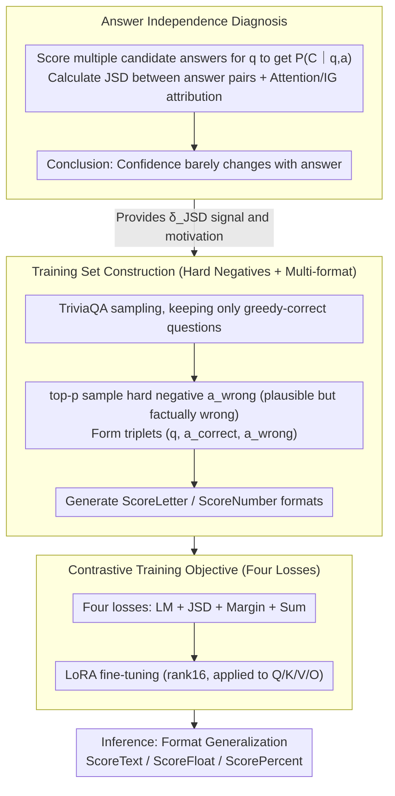

# ADVICE: Answer-Dependent Verbalized Confidence Estimation

**Conference**: ACL 2026  
**arXiv**: [2510.10913](https://arxiv.org/abs/2510.10913)  
**Code**: None  
**Area**: LLM Evaluation / Confidence Calibration  
**Keywords**: verbalized confidence, calibration, answer-grounded, contrastive fine-tuning, overconfidence

## TL;DR
This paper diagnoses the root cause of LLM verbalized overconfidence as "confidence hardly depends on the generated answer" through JSD and attribution analysis. It proposes ADVICE, a lightweight contrastive fine-tuning framework using answer pairs, which employs JSD/Margin/Sum losses to force the confidence distribution for correct answers to be significantly higher than for incorrect ones. This reduces Gemma2-9b's ECE on TriviaQA from 21.9% to 6.2% while maintaining task accuracy.

## Background & Motivation

**Background**: The reliable use of LLMs increasingly depends on "verbalized confidence," where the model outputs its own confidence score (e.g., integers 0-9, letters A-E, or percentages 0-100%) alongside an answer. This paradigm is more general than post-hoc logit calibration, is friendly to black-box APIs, and has been promoted by works such as Lin, Tian, and Xiong.

**Limitations of Prior Work**: In practice, LLMs almost always provide extremely high scores (10/10 or A) regardless of whether the answer is correct, leading to ECEs generally between 20%-50%. Existing mitigation methods fall into three categories—prompt engineering, self-consistency sampling, and fine-tuning for token probability refitting (like ConfTuner)—but these focus on "how to suppress confidence" while few analyze "why they are overconfident."

**Key Challenge**: The authors identified the root cause as "answer independence" through two diagnostic experiments. First, by fixing a question $q$ and asking the model to provide confidence for 30 different candidate answers $a_i$, they calculated the Jensen-Shannon Divergence between distributions $P_M(C\mid q,a_i)$ and found JSD highly concentrated near 0 ($\mathrm{JSD}\le0.1$), meaning the confidence barely changes when the answer changes. Second, using Attention Rollout and Integrated Gradients to measure the attribution from "confidence tokens" to "answer tokens," they found this path weight was much lower than "answer $\to$ question" or "confidence $\to$ question," and even lower than meaningless tokens like BOS.

**Goal**: To make "confidence truly conditional on the answer" the optimization objective, rather than generally lowering the maximum value of the output distribution, thereby avoiding degradation in calibration, generalization, and task accuracy simultaneously.

**Key Insight**: Organize training samples into triplets $(q,a_{\text{correct}},a_{\text{wrong}})$ and use contrastive loss to force the model to provide discriminative and correctly directed confidence distributions for different answers to the same question—directly addressing the root cause of "answer independence."

**Core Idea**: "Do not directly fit the confidence value; instead, directly fit the sensitivity of $P(C\mid q,a)$ to the answer."

## Method

### Overall Architecture
ADVICE is a contrastive fine-tuning framework based on LoRA. Process: (1) Sample 4,000 questions from the TriviaQA training set, keeping only those where the model's greedy decoding is correct; (2) Use random sampling to obtain a "semantically plausible but factually incorrect" hard negative answer $a_{\text{wrong}}$ for each question, paired with the original $a_{\text{correct}}$ to form a triplet; (3) Generate one set of training data for each of the two formats: ScoreLetter and ScoreNumber; (4) Simultaneously calculate LM loss (to maintain QA capability) + JSD loss (to pull distributions apart) + Margin loss (to ensure correct direction) + Sum loss (absolute constraint) on each triplet, fine-tuning for 4 epochs using AdamW and LoRA ($rank=16, \alpha=32$ applied to Q/K/V/O); (5) At inference, the format can generalize to unseen ScoreText/ScoreFloat/ScorePercent.

### Key Designs

**1. Diagnosis-driven answer independence metric: Quantify the root cause of overconfidence before using it as a training signal**

Prior work attributed overconfidence to vague explanations like "high-frequency high scores in training data" or "RLHF preference for optimistic responses," which were hard to measure. The authors' approach for each question $q$ and candidate answer $a$ is to project the output probabilities of confidence tokens onto a fixed set of discrete values $C$ (e.g., 0-9) to obtain the distribution $P_M(C\mid q,a)$. Then, they calculate JSD for all $(a_i, a_j)$ answer pairs in the training set as direct evidence of "answer sensitivity." Simultaneously, they use Attention Rollout (recursive aggregation $0.5W_{\text{att}}+0.5I$ across layers) and Integrated Gradients ($n\_steps=1024$) to verify the attribution path of "confidence token $\to$ answer token." The diagnosis points to the same root: confidence barely changes with the answer. Calibration can only be improved from the source by explicitly writing this independence metric into the training objective.

**2. Format generalization and hard negative sampling for training set construction: Create data that forces the model to "change confidence when the answer changes" and improve the identification of similar incorrect answers**

After finding the root cause, the first step is to organize training data in a way that reflects answer sensitivity. If hard negative samples are too obviously wrong, discrimination becomes too easy, and the model won't learn fine-grained identification. The authors use top-$p$ sampling from the original model to obtain "semantically plausible, contextually relevant, but factually incorrect" hard negatives (e.g., if the question is about the state where Mike Tyson's 1998 boxing license was granted, the correct answer is Nevada, and a hard negative would be California), forming triplets $(q,a_{\text{correct}},a_{\text{wrong}})$. During training, only ScoreLetter (E/D/C/B/A mapped to 0.1-0.9) and ScoreNumber (0-9 mapped to $i/9$) formats are used, and a single expression format is enforced within each mini-batch to stabilize optimization. At inference, this can be extended to ScoreText, ScoreFloat, and ScorePercent. This "multi-format training + same-format single batch" ensures generalization to unseen formats while stabilizing gradients—Table 4 shows Gemma2's ECE on TriviaQA-Float dropped from 27.5 to 6.2.

**3. Triplet contrastive training objective: Use four losses to force the model to provide correctly directed, discriminative, and normalized confidence for correct/incorrect answers**

With triplet data, a target function that directly attacks "answer independence" is needed. ADVICE defines four losses for each triplet: $\mathcal{L}_{\mathrm{LM}}$ is the NLL of $a_{\text{correct}}$ to preserve QA ability; $\mathcal{L}_{\mathrm{JSD}}=\max(0,\delta_{\mathrm{JSD}}-D_{\mathrm{JSD}}(P_{\text{correct}}\Vert P_{\text{wrong}}))$ forces the divergence between the two distributions to be at least $\delta_{\mathrm{JSD}}=0.6$ (close to the upper bound of $\ln 2\approx 0.693$); $\mathcal{L}_{\mathrm{Margin}}=\max(0,\delta_{\mathrm{Margin}}-(\mu_{\text{correct}}-\mu_{\text{wrong}}))$ forces the expected confidence of the correct answer to be higher than the incorrect one by $\delta_{\mathrm{Margin}}=1$; $\mathcal{L}_{\mathrm{Sum}}=|1-(\mu_{\text{correct}}+\mu_{\text{wrong}})|$ forces their sum to be approximately 1, corresponding to the semantics that "the answer should be almost fully credible when the accuracy is about 1." The total loss is the equal-weighted sum $\mathcal{L}=\mathcal{L}_{\mathrm{LM}}+\mathcal{L}_{\mathrm{JSD}}+\mathcal{L}_{\mathrm{Margin}}+\mathcal{L}_{\mathrm{Sum}}$. All three are indispensable: using JSD alone only guarantees "different distributions" but the direction might be flipped; using Margin alone lacks control over the distribution shape and can lead to both being too high; the Sum term hardcodes the definition of "confidence = probability of correctness" into the loss, preventing overall conservativeness after training (as confirmed by ablation).

### Loss & Training
Four losses are added with equal weights; LoRA rank=16, $\alpha=32$, added to Q/K/V/O projections; AdamW + 5% warmup + linear decay, lr is $3\times 10^{-5}$ for Mistral and $1\times 10^{-5}$ for others; batch size 16, gradient accumulation 2, 4 epochs; single H200 GPU.

## Key Experimental Results

### Main Results
Comparison of Default, Prompting, Self-Consistency, and ConfTuner on TriviaQA (In-distribution) + MMLU, LogiQA (OOD), covering Llama-3.1-8B, Mistral-7B-v0.3, and Gemma-2-9b. Primary metrics are ECE/|NCE|/Brier/AUROC (lower is better for the first three).

| Model | Dataset | Metric | Default | ConfTuner | ADVICE | ADVICE+ConfTuner |
|------|--------|------|---------|-----------|--------|------------------|
| Gemma2-9b | TriviaQA | ECE↓ | 21.9 | 5.7 | 6.2 | 3.4 |
| Gemma2-9b | TriviaQA | AUROC↑ | 52.7 | 82.7 | 77.4 | 77.1 |
| Gemma2-9b | MMLU | ECE↓ | 21.0 | 11.0 | 5.6 | 11.7 |
| Gemma2-9b | LogiQA | ECE↓ | 39.1 | 18.4 | 11.9 | 8.0 |
| Llama3.1-8B | TriviaQA | ECE↓ | 16.9 | 5.2 | 10.4 | 9.4 |
| Llama3.1-8B | MMLU | ECE↓ | 26.9 | 13.9 | 8.6 | 9.6 |

ADVICE outperformed ConfTuner in 19 out of 24 OOD comparisons, and ADVICE+ConfTuner generally further reduced ECE, indicating complementarity.

### Ablation Study
Ablation of training objectives for Gemma2-9b on TriviaQA / MMLU (ECE↓):

| Training Objective | TriviaQA ECE | MMLU ECE | Description |
|----------|--------------|----------|------|
| LM only | 23.0 | 22.5 | Equivalent to untuned |
| LM+JSD | 8.6 | 13.2 | Divergent distributions but no direction guarantee |
| LM+Margin | 16.8 | 21.9 | Correct direction but coarse distribution |
| LM+Sum | 21.1 | 19.5 | Sum constraint alone is ineffective |
| LM+JSD+Margin | 11.0 | 14.3 | Weak OOD without Sum |
| LM+JSD+Sum | 15.3 | 7.5 | ID rebound without direction constraint |
| ADVICE (Full) | **6.2** | **5.6** | All three are indispensable |

### Key Findings
- The "answer mask experiment" is crucial: when $a$ is replaced by an equal-length `<pad>`, the Default confidence distribution remains concentrated in the A/9 range (showing confidence is nearly independent of the answer), while ADVICE clearly pushes probability mass toward E/0/1 (i.e., "I don't know"), proving ADVICE truly learned answer dependency.
- During fine-tuning, the rank of answer tokens (e.g., `_Exile`) in the Top-K tokens for IG attribution climbed from outside the top 10 to the top 5, quantitatively verifying that ADVICE strengthens answer sensitivity at the attention/gradient levels.
- ADVICE is optimal in terms of both performance and efficiency in the token budget (Fig. 7): self-consistency methods improve ECE negligibly with 5x more samples, while ADVICE achieves calibration parity with ConfTuner in a single inference with the lowest token budget.

## Highlights & Insights
- "Diagnosis before prescription" research paradigm: Quantify the root cause of "answer independence" using three independent tools (JSD + Attention Rollout + IG) before having the loss function directly attack the root cause. This is much more interpretable than cramming all black-box symptoms into a KL regression.
- $\mathcal{L}_{\mathrm{Sum}}=|1-(\mu_{\text{correct}}+\mu_{\text{wrong}})|$ is a severely underrated design: it directly translates the definition "confidence corresponds to the probability of being correct" into a constraint, preventing all answers from being suppressed (conservativeness bias) post-training.
- The "answer mask counterfactual" in the experiments is a rare causal verification paradigm in verbalized confidence research, transferable to any trustworthy task where "output should be based on a specific input segment" (e.g., attribution, citations, tool call selection).

## Limitations & Future Work
- Validated only on short-answer QA and multiple-choice questions; answer token boundaries and the semantics of "confidence corresponding to the answer" are less clear in long-context or complex reasoning (e.g., multi-hop, agent).
- Coupling of calibration metrics and task accuracy: On tasks like SciQ with >90% accuracy, even Default looks calibrated (Appendix Table 7 shows ADVICE is slightly worse), suggesting the need for harder benchmarks to truly differentiate calibration methods.
- Training depends on model-generated hard negatives; construction costs grow linearly with model size. For low-capability models, it might be impossible to sample "plausible but wrong" hard negatives, limiting the scope of the method.

## Related Work & Insights
- **vs ConfTuner**: ConfTuner directly aligns token probability distributions to the Brier score, which is "numerical fitting"; ADVICE uses contrastive triplets to constrain "sensitivity to the answer," which is "mechanism alignment." The 19/24 advantage on OOD and complementarity with ConfTuner suggest they attack different dimensions of overconfidence.
- **vs Self-Consistency**: Self-Consistency uses the weighted average of 5 samples to approximate true confidence, increasing token costs by 5x with limited ECE improvement; ADVICE requires only a single inference.
- **vs Prompting/RLHF Calibration**: Those methods do not provide an explanation for "why overconfidence occurs"; after this work identifies answer independence as the root cause, "changing confidence when the answer changes" preferences could be added to future RLHF reward designs.

## Rating
- Novelty: ⭐⭐⭐⭐ The diagnosis of "answer independence" and the corresponding contrastive loss are genuine new mechanisms, though the idea shares roots with process supervision/contrastive learning.
- Experimental Thoroughness: ⭐⭐⭐⭐ 3 models × 3 datasets × 5 formats + 5 ablations + answer mask counterfactual + IG tracking; a rare density of experiments.
- Writing Quality: ⭐⭐⭐⭐ The three-part Diagnosis-Method-Verification logic is clear, with formulas and takeaways highlighted.
- Value: ⭐⭐⭐⭐ Directly helpful for making black-box LLM deployments trustworthy (medical/legal), and is plug-and-play as it is orthogonal to methods like ConfTuner.

<!-- RELATED:START -->

## Related Papers

- [\[ACL 2026\] Illusions of Confidence? Diagnosing LLM Truthfulness via Neighborhood Consistency](illusions_of_confidence_diagnosing_llm_truthfulness_via_neighborhood_consistency.md)
- [\[ACL 2026\] Please Refuse to Answer Me: Mitigating Over-Refusal in LLMs via Adaptive Contrastive Decoding](please_refuse_to_answer_me_mitigating_over-refusal_in_large_language_models_via_.md)
- [\[ACL 2026\] Evaluating Answer Leakage Robustness of LLM Tutors against Adversarial Student Attacks](evaluating_answer_leakage_robustness_of_llm_tutors_against_adversarial_student_a.md)
- [\[NeurIPS 2025\] Probabilistic Reasoning with LLMs for K-Anonymity Estimation](../../NeurIPS2025/llm_safety/probabilistic_reasoning_with_llms_for_k-anonymity_estimation.md)
- [\[AAAI 2026\] The Confidence Trap: Gender Bias and Predictive Certainty in LLMs](../../AAAI2026/llm_safety/the_confidence_trap_gender_bias_and_predictive_certainty_in_llms.md)

<!-- RELATED:END -->
