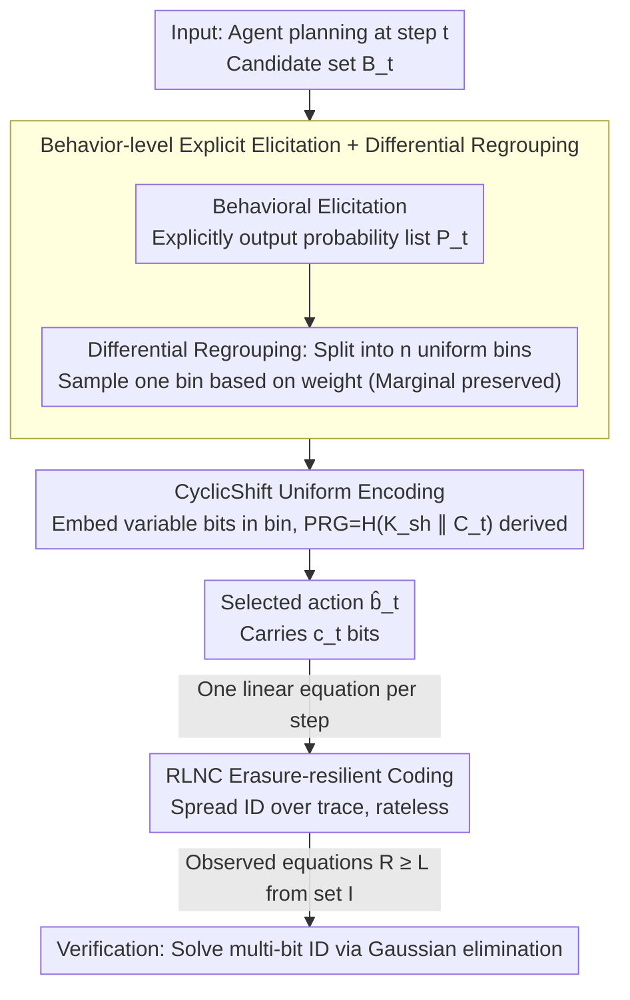

# AgentMark: Utility-Preserving Behavioral Watermarking for Agents

**Conference**: ACL 2026  
**arXiv**: [2601.03294](https://arxiv.org/abs/2601.03294)  
**Code**: https://github.com/Tooooa/AgentMark (Available)  
**Area**: LLM Safety / Watermarking / Agent Governance  
**Keywords**: agent watermarking, planning behavior, distribution-preserving sampling, erasure-resilient coding, provenance

## TL;DR
AgentMark models the "next tool/subgoal selection" of an LLM agent as a time-varying discrete channel. By explicitly eliciting the behavioral distribution $P_t$ and applying FDPSS-style distribution-preserving sampling, it embeds multi-bit IDs into planning decisions. Combined with RLNC encoding, the watermark can be recovered from residual logs even if the trace is cropped or steps are deleted. Across ALFWorld, ToolBench, and OASIS tasks, it maintains accuracy (SR difference from baseline <0.7 pp) while providing stable multi-bit capacity of 1.2-2.3 bps, and it is orthogonally stackable with content-level watermarks like SynthID-Text.

## Background & Motivation

**Background**: LLM content watermarking (e.g., KGW, SynthID-Text) can reliably attribute model-generated text; Google Gemini has deployed SynthID. However, what truly causes social impact in agents is the "sequence of behavioral decisions"—which tool to select, which subgoal to follow—rather than the final text. GUI assistants, financial tool calls, and social bots all fall into this category.

**Limitations of Prior Work**: Direct application of content watermarking to agent behavior suffers from three failure modes: (1) training-time watermarking requires modifying weights, while agents often use closed-source APIs; (2) inference-time token-level watermarking (KGW, SynthID) acts on token distributions, but "behavior" is not a token—an action like "Alice bookmarked a post with the tag #TravelInspiration" is compiled into tool calls `bookmark()` + `tag(#TravelInspiration)`, stripping the watermark signal during compilation; (3) directly biasing behavioral probabilities (e.g., the RG strategy in Agent Guide) causes distribution drift, where errors compound over long-horizon execution, leading to task failure.

**Key Challenge**: To address governance risks such as "impersonation/IP theft/loss of control," watermarks must be embedded at the planning layer. However, perturbations at the planning layer typically destroy utility—this is the fundamental contradiction.

**Goal**: Implement "distribution-preserving behavioral watermarking" that satisfies: (a) no modification of model weights; (b) usability with black-box APIs; (c) unchanged behavioral distribution after embedding; (d) recovery of multi-bit IDs even from erased/truncated traces; (e) orthogonality with content watermarking.

**Key Insight**: Planning is treated as a process of sampling from an implicit distribution $P_t^\star$. The agent is made to explicitly elicit the behavioral distribution $P_t \approx P_t^\star$. An FDPSS framework (differential regrouping + cyclic shift uniform encoding) is then applied for distribution-preserving sampling—embedding bits while sampling, ensuring the marginal distribution remains unchanged.

**Core Idea**: "First elicit the implicit policy into an explicit probability list $P_t$. The watermarking action only occurs during the sampling process of $P_t$, without modifying $P_t$ itself."

## Method

### Overall Architecture

AgentMark aims to embed a multi-bit ID into the sequence of decisions ("which tool/subgoal to choose next") such that the behavioral distribution remains unchanged and the ID can be recovered from cropped traces. It views each planning step as sampling from a time-varying discrete channel. At step $t$, instead of outputting an action $b_t$ directly from a black box, the agent explicitly provides a probability list $P_t$ over a candidate set $\mathcal{B}_t$. Watermarking only occurs during the "sampling from $P_t$" step, leaving the distribution itself intact.

In the AgentMark-F implementation, each step involves four processes: **behavioral elicitation** to obtain $P_t$; **differential regrouping** to decompose $P_t$ into several uniform bins (sampling a bin based on its weight first to ensure marginal consistency); **CyclicShift** to encode bits into a specific action $\hat b_t$ within the selected bin (using randomness derived from a shared key and step context via a PRG); and **RLNC** (Random Linear Network Coding) to spread the bits across the entire trace. Each step provides an independent linear equation for the payload, allowing ID recovery via Gaussian elimination once sufficient equations are observed.

### Key Designs

**1. Behavior-level Explicit Elicitation + Differential Regrouping: Moving watermarking to sampling to preserve utility**

The core issue is that biasing behavioral probabilities (RG baseline) leads to distribution drift. Errors compound in long-range execution, causing Success Rates (SR) on ALFWorld-ID to drop from 89.5% to 78.8%. AgentMark addresses this by having the agent elicit its implicit policy into an explicit probability list $P_t$, then uses differential regrouping to decompose any distribution into a mixture of $n$ uniform distributions. By sorting $p_1\ge\dots\ge p_n$ and setting $d_k=p_k-p_{k+1}$, the $k$-th bin $T_k=\{b_{t,1},\dots,b_{t,k}\}$ is internally uniform with weight $q_k=k\cdot d_k$. A bin is sampled according to $\mathrm{Cat}(q_1,\dots,q_n)$, followed by uniform sampling within the bin.

The critical benefit is that the marginal distribution is strictly preserved: $\Pr[\hat{b}_t=b_{t,i}]=\sum_{k=i}^n q_k/k=\sum_{k=i}^n(p_k-p_{k+1})=p_i$, which exactly matches the original probability. Consequently, the conflict between watermarking and utility is resolved. This also transforms the challenge of distribution-preserving sampling into steganography over uniform distributions.

**2. CyclicShift Uniform Encoding + Key-Derived PRG: High-capacity variable-length encoding with sync**

Since uniform bin sizes $n$ are rarely powers of 2, fixed-length encoding would waste capacity. CyclicShift uses variable-length prefix-free codes to approach the theoretical limit. For a bin of size $n$, let $k=\lfloor\log_2 n\rfloor$ and $m=n-2^k$. Then $2^k-m$ indices are assigned $k$-bit codewords and $2m$ indices are assigned $k+1$ bits. A PRG-derived cyclic shift $R$ maps payload bits to a specific bin index $j$. The expected capacity per bin is $\mathbb{E}[c\mid n]\in[\log_2 n-0.0861,\ \log_2 n]$, nearly saturating the information-theoretic bound.

For verification, the encoder and decoder must share the same randomness. AgentMark derives the PRG via $K_t=H(K_{\mathrm{sh}}\Vert C_t)$, where $K_{\mathrm{sh}}$ is a shared key and $C_t$ is the step context (index, observations, history). By binding the seed to $C_t$, the decoder can reconstruct the per-step randomness without extra communication, even under black-box APIs.

**3. RLNC Erasure-resilient Coding: Handling truncated or dropped traces**

Agent traces are often filtered or truncated. Repetition coding fails quickly under high erasure. AgentMark employs Random Linear Network Coding: the $c_t$ bits embedded at step $t$ are viewed as $c_t$ linear equations over the payload $m\in\mathbb{F}_2^L$. Coefficients $a_{t,j}=\mathrm{PRG}(K_t,j)\in\mathbb{F}_2^L$ generate equations $y_{t,j}=\langle a_{t,j},m\rangle$. Verification uses the set of equations from actually observed steps $\mathcal{I}\subseteq\{1,\dots,T\}$ to form $A_{\mathcal{I}}m=y_{\mathcal{I}}$. Multi-bit IDs are solved via Gaussian elimination.

This design is "rateless," like Fountain codes: every step is an independent linear measurement. Any subset of steps can be lost without affecting unique solvability, provided the total observed capacity $R \ge L$. Theoretically, when $R=L+\Delta$, the probability of a full-rank matrix is $\ge 1-2^{-\Delta}$. This provides optimal robustness for long-duration traces that may be arbitrarily cropped.

## Key Experimental Results

### Main Results
Comparison of SR and watermark capacity on ALFWorld (DeepSeek-Chat) and ToolBench (450 tasks):

| Environment | Method | SR (%) ↑ | Steps | bps ↑ | bpt ↑ | Δs/step ↓ |
|------|------|----------|-------|-------|-------|-----------|
| ALFWorld-ID | Baseline | 89.5 | 19.7 | – | – | – |
| ALFWorld-ID | RG (Agent Guide) | 78.8 (↓10.7) | 26.1 (↑6.4) | 0 bit | 0 bit | – |
| ALFWorld-ID | **Ours (AgentMark-F)** | 89.3 (↓0.2) | 19.4 (↓0.3) | 1.19 | 25.5 | +0.10 |
| ALFWorld-OOD | Baseline | 96.8 | 15.9 | – | – | – |
| ALFWorld-OOD | RG | 94.5 (↓2.3) | 15.4 | 0 bit | 0 bit | – |
| ALFWorld-OOD | **Ours (AgentMark-F)** | 97.5 (↑0.7) | 14.1 (↓1.8) | 1.34 | 28.4 | −0.18 |
| ToolBench | Baseline | 59.9 | 6.7 | – | – | – |
| ToolBench | **Ours (AgentMark-F)** | 59.7 (↓0.2) | 7.2 | 0.49 | 4.93 | −1.27 |

### Ablation Study

| Dimension | Setting | Key Result |
|----------|------|---------|
| Step Loss Robustness | Erasure rate $p\in[0,0.7]$ | RLNC is significantly more stable; near 100% recovery with global aggregation. |
| False Positive Rate (FPR) | $k\in[0,16]$ overhead | FPR < 1% for $k\ge 8$; zero false positives for $k\ge 14$. |
| Semantic Rewriting | ALFWorld-OOD (2326 steps) | Behavior Match 49.45%, Bit Recovery 16.84% (Rewriting disrupts sync). |
| SynthID-Text Stacking | ToolBench | 100% behavioral decoding, 96.6% content detection. Orthogonal. |
| OASIS Social Simulation | 100 trajectories | Social quality metrics unchanged; high watermark detection rate. |

### Key Findings
- The RG baseline significantly harms utility in long-horizon tasks (ALFWorld-ID SR −10.7 pp); Ours shows <1 pp difference, proving the "distribution-preserving" promise is strictly met.
- Token/latency overhead is negligible (ALFWorld Δtok/step ±0.5%), indicating that elicitation costs are acceptable in engineering.
- Behavioral watermarking and SynthID-Text address different failure modes: behavioral layers resist trace truncation, while content layers resist paraphrasing.
- Cross-model verification (Gemini 2.0 Flash) shows nearly identical SR and stable capacity (1.96-2.28 bps), confirming the method is model-agnostic.

## Highlights & Insights
- "Behavior is the new token" is the core reframing—porting the theory of content watermarking (KGW/SynthID/FDPSS) to the planning layer is an elegant cross-over.
- Distribution-preserving sampling is crucial for long-horizon agents: while direct bias compounds errors, preservation ensures marginals remain unchanged, proving security does not require sacrificing utility.
- RLNC "rateless measurement" provides a robust solution for partially observed sequences, potentially applicable to distributed log auditing or long video metadata embedding.

## Limitations & Future Work
- Requires the agent to expose explicit planning distributions $P_t$. If closed-source APIs do not provide this, forced elicitation via prompt engineering may slightly lose fidelity.
- Weakness against semantic rewriting: bit recovery drops to 16.84% when observations are altered, requiring semantic-level reproducibility for improvement.
- Capacity becomes 0 when $P_t$ is highly peaked (e.g., only 1 candidate). Cross-task aggregation is needed for compensation.
- While elicitation works for closed-source APIs, native distribution outputs from providers would be preferred in the long term.

## Related Work & Insights
- **vs SynthID-Text (Nature 2024)**: SynthID embeds low-bit watermarks in token distributions to prevent paraphrasing; AgentMark embeds multi-bit IDs in behavioral distributions to resist trace truncation. They are orthogonal.
- **vs Agent Guide (Huang 2025)**: Agent Guide introduced biasing behavioral probabilities but caused distribution drift. AgentMark uses FDPSS to strictly preserve the distribution.
- **vs Meteor/Discop**: These are distribution-preserving steganography for token sequences; AgentMark applies this paradigm to behavioral sequences and adds RLNC to solve erasure.

## Rating
- Novelty: ⭐⭐⭐⭐ (First systematic use of DP-steganography + RLNC for agent planning).
- Experimental Thoroughness: ⭐⭐⭐⭐ (Diverse environments, robustness tests, and theoretical derivations).
- Writing Quality: ⭐⭐⭐⭐ (Clear formal definitions and worked examples).
- Value: ⭐⭐⭐⭐⭐ (Directly addresses agent governance with black-box compatibility).

<!-- RELATED:START -->

## Related Papers

- [\[ACL 2026\] SharedRequest: Privacy-Preserving Model-Agnostic Inference for Large Language Models](sharedrequest_privacy-preserving_model-agnostic_inference_for_large_language_mod.md)
- [\[ACL 2026\] RISK: A Framework for GUI Agents in E-commerce Risk Management](risk_a_framework_for_gui_agents_in_e-commerce_risk_management.md)
- [\[ACL 2026\] A Survey on the Safety and Security Threats of Computer-Using Agents: JARVIS or Ultron?](a_survey_on_the_safety_and_security_threats_of_computer-using_agents_jarvis_or_u.md)
- [\[ACL 2026\] CI-Work: Benchmarking Contextual Integrity in Enterprise LLM Agents](ci-work_benchmarking_contextual_integrity_in_enterprise_llm_agents.md)
- [\[ACL 2026\] SSG: Logit-Balanced Vocabulary Partitioning for LLM Watermarking](ssg_logit-balanced_vocabulary_partitioning_for_llm_watermarking.md)

<!-- RELATED:END -->
