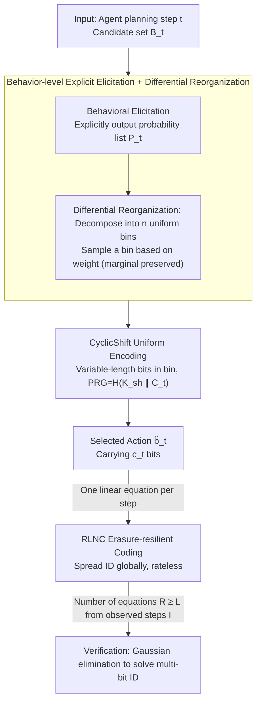

# AgentMark: Utility-Preserving Behavioral Watermarking for Agents

**Conference**: ACL 2026  
**arXiv**: [2601.03294](https://arxiv.org/abs/2601.03294)  
**Code**: https://github.com/Tooooa/AgentMark (Available)  
**Area**: LLM Safety / Watermarking / Agent Governance  
**Keywords**: agent watermarking, planning behavior, distribution-preserving sampling, erasure-resilient coding, provenance

## TL;DR
AgentMark models the "next tool/subgoal selection" of an LLM agent as a time-varying discrete channel. By explicitly eliciting the behavioral distribution $P_t$ and applying FDPSS-style distribution-preserving sampling, it embeds multi-bit IDs into planning decisions. Combined with RLNC encoding, the watermark can be recovered from residual logs even if the trace is cropped or steps are deleted. Across ALFWorld, ToolBench, and OASIS tasks, it maintains accuracy (Success Rate difference from baseline <0.7 pp) while stably providing a multi-bit capacity of 1.2-2.3 bps, and is orthogonal and stackable with content-level watermarks like SynthID-Text.

## Background & Motivation

**Background**: LLM content watermarking (e.g., KGW, SynthID-Text) can reliably attribute model-generated text; Google Gemini has already deployed SynthID. However, what truly causes social impact in agents is the "behavioral decision sequence"—which tool to select or which subgoal to pursue—rather than the final text. GUI assistants, financial tool calling, and social bots all fall into this category.

**Limitations of Prior Work**: Directly applying content watermarking to agent behavior leads to three failure modes: (1) Watermarking during training requires modifying model weights, whereas agents often use closed-source APIs; (2) Token-level watermarking during inference (KGW, SynthID) acts on token distributions, but "behaviors" are not tokens—a phrase like "Alice bookmarked a post with the tag #TravelInspiration" is compiled into tool calls like `bookmark()` + `tag(#TravelInspiration)`, stripping the watermark signal during compilation; (3) Directly biasing behavioral probabilities (e.g., the RG strategy in Agent Guide) causes distribution drift, where errors compound over long-horizon execution, leading to task failure.

**Key Challenge**: The watermark must be embedded at the planning layer to truly address governance risks such as "impersonation, IP theft, or loss of control," but perturbations at the planning layer destroy utility—this is the root of the contradiction.

**Goal**: To achieve "distribution-preserving behavioral watermarking" that simultaneously satisfies: (a) No modification of model weights; (b) Usability under black-box APIs; (c) Constant behavioral distribution after embedding; (d) Multi-bit ID recovery even if the trace is partially erased or truncated; (e) Orthogonal stacking with content watermarks.

**Key Insight**: Treat planning as a sampling process from an implicit distribution $P_t^\star$, have the agent explicitly output $P_t \approx P_t^\star$, and then use the FDPSS framework (differential reorganization + cyclic shift uniform encoding) for distribution-preserving sampling—embedding bits while sampling while keeping the marginal distribution unchanged.

**Core Idea**: "First elicit the implicit policy into an explicit probability list $P_t$; the watermarking action only occurs during the sampling process of $P_t$ and does not change $P_t$ itself."

## Method

### Overall Architecture

The goal of AgentMark is to embed a multi-bit ID into the sequence of decisions for "which tool/subgoal to select next," ensuring the behavioral distribution remains identical and the ID is recoverable from cropped traces. It views each planning step as sampling from a time-varying discrete channel. At step $t$, the agent no longer outputs action $b_t$ directly as a black box; instead, it explicitly provides a probability list $P_t$ over the candidate set $\mathcal{B}_t$. Watermarking occurs only during the step of "sampling from $P_t$," leaving the distribution itself intact.

Specifically for the AgentMark-F instance, a single step involves four stages: **behavioral elicitation** to obtain $P_t$; **differential reorganization** to decompose $P_t$ into several uniform bins (sampling a bin based on its weight first to preserve the marginal distribution); **CyclicShift** to encode bits into the specific action $\hat b_t$ within the selected bin, using randomness derived from a shared key and step context via a PRG; and finally, spreading these bits across the entire trace via **RLNC**, where each step provides an independent linear equation for the payload, allowing ID recovery once sufficient equations are observed.

### Key Designs

**1. Behavior-level Explicit Elicitation + Differential Reorganization: Moving watermarks to sampling to keep distributions intact**

The pain point is direct: biasing behavioral probabilities (RG baseline) causes distribution drift, compounding errors in long-horizon execution. The SR on ALFWorld-ID consequently drops from 89.5% to 78.8%. AgentMark's solution is to have the agent elicit the implicit policy into an explicit probability list $P_t$, then use differential reorganization to decompose any distribution into a mixture of $n$ uniform distributions: sort by $p_1\ge\dots\ge p_n$, let $d_k=p_k-p_{k+1}$, where the $k$-th bin $T_k=\{b_{t,1},\dots,b_{t,k}\}$ is internally uniform with weight $q_k=k\cdot d_k$. Sampling first selects a bin based on $\mathrm{Cat}(q_1,\dots,q_n)$, then samples uniformly within the bin.

The key benefit is that the marginal distribution is strictly preserved: $\Pr[\hat{b}_t=b_{t,i}]=\sum_{k=i}^n q_k/k=\sum_{k=i}^n(p_k-p_{k+1})=p_i$, exactly matching the original probability. Thus, the "watermark vs utility" conflict is resolved. Consistency in marginals means long-horizon execution will not drift. Furthermore, it converts the problem of "distribution-preserving sampling" into "steganography over uniform distributions"—since each bin is uniform, any uniform encoding scheme can be used to insert bits.

**2. CyclicShift Uniform Encoding + Key-derived PRG: Packing near-optimal variable-length bits while maintaining synchronization**

The previous step leaves an engineering challenge: the size $n$ of uniform bins is usually not a power of 2. Using $\lfloor\log_2 n\rfloor$ bits would waste capacity. CyclicShift uses a variable-length prefix-free code to approach the upper bound: for a bin of size $n$, let $k=\lfloor\log_2 n\rfloor$ and $m=n-2^k$; $2^k-m$ indices are assigned $k$-bit codewords, and $2m$ indices are assigned $k+1$ bits. A cyclic shift $R$ derived from the PRG maps the payload bits to a specific bin index $j$. Thus, the expected capacity per bin $\mathbb{E}[c\mid n]\in[\log_2 n-0.0861,\ \log_2 n]$ nearly reaches the information-theoretic limit.

To allow the verifier to decode, the encoder and decoder must share the same randomness. AgentMark derives the PRG via $K_t=H(K_{\mathrm{sh}}\Vert C_t)$, where $K_{\mathrm{sh}}$ is the shared key and $C_t$ is the step context (step index, observation, history). By binding the seed to $C_t$, the decoder can reconstruct the randomness of that step without additional communication, while it appears pseudo-random externally—a key factor for deployment under closed-source black-box APIs.

**3. RLNC Erasure-resilient Coding: Spreading the ID to survive step loss and truncation**

Agent traces are often filtered, dropped, or truncated. Repetition coding fails rapidly under high erasure. AgentMark uses Random Linear Network Coding: the $c_t$ bits embedded at step $t$ are treated as $c_t$ linear equations for payload $m\in\mathbb{F}_2^L$. The coefficients $a_{t,j}=\mathrm{PRG}(K_t,j)\in\mathbb{F}_2^L$ are used to form equations $y_{t,j}=\langle a_{t,j},m\rangle$. During verification, equations from only the observed step set $\mathcal{I}\subseteq\{1,\dots,T\}$ are collected to form $A_{\mathcal{I}}m=y_{\mathcal{I}}$ (totalling $R=\sum_{t\in\mathcal{I}}c_t$ rows), and $m$ is solved via Gaussian elimination.

This design is "rateless," similar to Fountain codes: each step is an independent linear measurement. Losing any subset does not prevent a unique solution as long as the remaining total capacity $R\ge L$. Theoretically, when $R=L+\Delta$, the probability of the matrix being full rank is $\ge 1-2^{-\Delta}$, with the false positive rate decaying exponentially with the overhead $k$. For a long trace subject to arbitrary cropping, this is an optimal robustness strategy for preserving a multi-bit ID.

### Loss & Training
No training required; only the sampling process is modified during inference. Key hyperparameters: $\delta_{\mathrm{JSD}}$ (differential quantization precision $\pi$ to avoid synchronization issues from probability ties); RG baseline $\gamma=0.5, \delta=2.0$ (for comparison only).

## Key Experimental Results

### Main Results
Comparison of SR and watermark capacity on ALFWorld (DeepSeek-Chat) and ToolBench (450 tasks):

| Environment | Method | SR (%) ↑ | Steps | bps ↑ | bpt ↑ | Δs/step ↓ |
|------|------|----------|-------|-------|-------|-----------|
| ALFWorld-ID | Baseline | 89.5 | 19.7 | – | – | – |
| ALFWorld-ID | RG (Agent Guide) | 78.8 (↓10.7) | 26.1 (↑6.4) | 0 bit | 0 bit | – |
| ALFWorld-ID | **AgentMark-F** | 89.3 (↓0.2) | 19.4 (↓0.3) | 1.19 | 25.5 | +0.10 |
| ALFWorld-OOD | Baseline | 96.8 | 15.9 | – | – | – |
| ALFWorld-OOD | RG | 94.5 (↓2.3) | 15.4 | 0 bit | 0 bit | – |
| ALFWorld-OOD | **AgentMark-F** | 97.5 (↑0.7) | 14.1 (↓1.8) | 1.34 | 28.4 | −0.18 |
| ToolBench | Baseline | 59.9 | 6.7 | – | – | – |
| ToolBench | **AgentMark-F** | 59.7 (↓0.2) | 7.2 | 0.49 | 4.93 | −1.27 |

### Ablation Study
Key robustness and comparison metrics:

| Dimension | Setting | Key Result | Description |
|----------|------|---------|------|
| Erasure Robustness (RLNC vs repetition) | Loss rate $p\in[0,0.7]$ | RLNC is significantly more stable, near 100% recovery after global aggregation | Rateless property |
| FPR for Wrong Key/No Watermark | Overhead $k\in[0,16]$ | FPR < 1% for $k\ge 8$, zero false positives for $k\ge 14$ | Decays $\propto 2^{-k}$ |
| Observation Rewriting | ALFWorld-OOD 134 tasks / 2326 steps | Behavior Match 49.45%, Bit Recovery 16.84% | Rewriting disrupts synchronization but aggregation remains viable |
| Stacking with SynthID-Text | ToolBench | 100% Behavior Decoding, 96.6% Content Detection | Behavioral + Content layers are orthogonal |
| OASIS Social Sim | Twitter/Reddit 100 trajectory | 5 social quality metrics nearly unchanged, high detection rate | Sustainability verification |

### Key Findings
- The RG baseline significantly harms utility in long-horizon tasks (ALFWorld-ID SR −10.7 pp, steps +6.4), representing a typical counterexample of "sacrificing performance for watermarking." AgentMark-F's deviation from baseline <1 pp proves the "distribution-preserving" promise is strictly met.
- Token/latency overhead is negligible (ALFWorld Δtok/step ±0.5%, ToolBench avg −6.25% due to early termination), showing that the extra prompt cost for eliciting explicit distributions is engineering-acceptable.
- Behavioral-layer watermarks and SynthID-Text content watermarks "attack different failure modes": behavioral layers resist trace truncation/step loss, while content layers resist content rewriting—layering both provides more robust provenance.
- Cross-model verification (SR nearly unchanged on Gemini 2.0 Flash, bps 1.96-2.28) indicates the method is model-agnostic.

## Highlights & Insights
- "Behavior is the new token" is the core reframing of this paper—elevating the theory of content watermarking (KGW/SynthID/FDPSS) to the planning decision layer is an elegant cross-over of LLM safety and information theory.
- Distribution-preserving sampling (Differential Reorganization + CyclicShift) is critical for long-horizon agents: direct biasing compounds errors, while preservation ensures the marginal remains identical, providing an existence proof that "safety/watermarking need not sacrifice utility."
- RLNC "rateless measurement" handles the robustness of trace truncation/step loss, which can be transferred to any "partially observed sequence" scenario, such as distributed log auditing or metadata embedding in long videos.

## Limitations & Future Work
- Requires the agent to expose the explicit planning distribution $P_t$ and candidate set $\mathcal{B}_t$; if closed-source APIs do not provide these, they must be forced via prompt engineering, which may lose fidelity.
- Weak robustness to semantic rewriting: KL=3.227 and bit recovery of only 16.84% when observations are rewritten is the current major weakness; semantic-level reproducibility is needed for reinforcement.
- Single-step capacity is zero when $P_t$ is highly peaked (e.g., only 1 candidate); total capacity for short-trajectory tasks may be limited, necessitating cross-task aggregation.
- While open-source LLMs can extract distributions directly from logits, closed-source models rely on elicitation prompts. Ideally, providers would offer native APIs for planning distribution output.

## Related Work & Insights
- **vs SynthID-Text (Nature 2024)**: SynthID embeds low/zero-bit watermarks into token distributions to prevent content rewriting. AgentMark embeds multi-bit IDs into behavioral distributions to prevent trace truncation/step loss. They are orthogonal and stackable.
- **vs Agent Guide (Huang 2025, i.e., RG in text)**: Agent Guide is the first to directly bias behavioral probabilities, but introduces distribution drift. AgentMark uses FDPSS to strictly preserve distributions, a key engineering correction.
- **vs Meteor/Discop (Classic Steganography)**: These are distribution-preserving steganography over token sequences. AgentMark applies the same paradigm to agent behavior sequences, integrated with RLNC to handle erasures.

## Rating
- Novelty: ⭐⭐⭐⭐ Systematic application of distribution-preserving steganography + RLNC to the agent planning layer.
- Experimental Thoroughness: ⭐⭐⭐⭐ 3 environments × 2 models + capacity/robustness/stacking tests + theoretical FPR derivation.
- Writing Quality: ⭐⭐⭐⭐ Clear formal definitions; appendix provides full algorithms and a worked example.
- Value: ⭐⭐⭐⭐⭐ Agent governance is an upcoming real-world demand; the method is directly deployable on black-box APIs and compatible with content watermarks.

<!-- RELATED:START -->

## Related Papers

- [\[ACL 2026\] RISK: A Framework for GUI Agents in E-commerce Risk Management](risk_a_framework_for_gui_agents_in_e-commerce_risk_management.md)
- [\[ACL 2026\] SharedRequest: Privacy-Preserving Model-Agnostic Inference for Large Language Models](sharedrequest_privacy-preserving_model-agnostic_inference_for_large_language_mod.md)
- [\[ACL 2026\] A Survey on the Safety and Security Threats of Computer-Using Agents: JARVIS or Ultron?](a_survey_on_the_safety_and_security_threats_of_computer-using_agents_jarvis_or_u.md)
- [\[ACL 2026\] CI-Work: Benchmarking Contextual Integrity in Enterprise LLM Agents](ci-work_benchmarking_contextual_integrity_in_enterprise_llm_agents.md)
- [\[CVPR 2026\] Unsafe2Safe: Controllable Image Anonymization for Downstream Utility](../../CVPR2026/llm_safety/unsafe2safe_controllable_image_anonymization_for_downstream_utility.md)

<!-- RELATED:END -->
