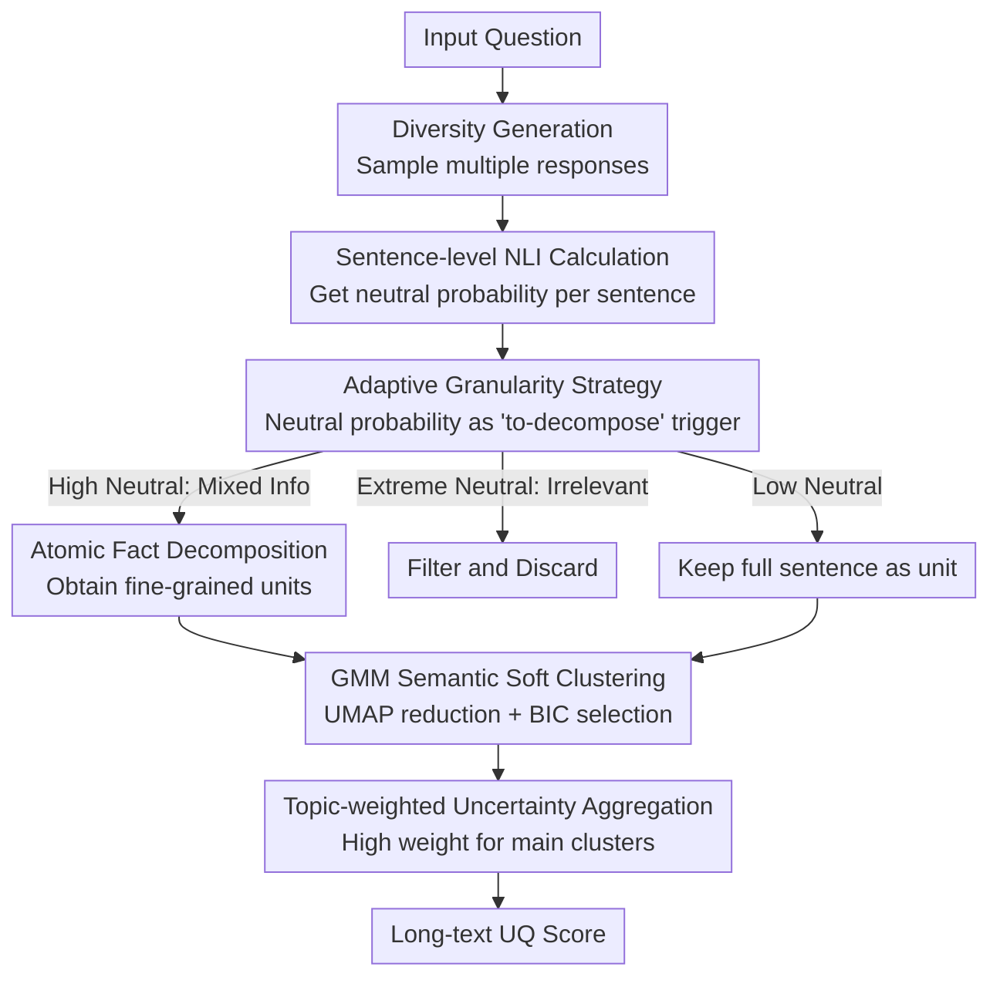

# AGSC: Adaptive Granularity and Semantic Clustering for Uncertainty Quantification in Long-text Generation

**Conference**: ACL 2026  
**arXiv**: [2604.06812](https://arxiv.org/abs/2604.06812)  
**Code**: None  
**Area**: LLM Safety  
**Keywords**: Uncertainty Quantification, Long-text Generation, Adaptive Granularity, Semantic Clustering, GMM

## TL;DR

AGSC proposes an uncertainty quantification framework for long-text generation that triggers adaptive granularity decomposition via NLI neutral probabilities (reducing inference time by 60%) and utilizes GMM soft clustering to capture latent semantic themes for topic-aware weighted aggregation, achieving SOTA factuality correlation on BIO and LongFact benchmarks.

## Background & Motivation

**Background**: Hallucination issues in LLMs make uncertainty quantification (UQ) critical for enhancing reliability. Existing UQ methods primarily target short responses, while long-text UQ (e.g., LUQ) attempts to decompose responses into atomic facts for fine-grained evaluation.

**Limitations of Prior Work**: (1) Fine-grained decomposition significantly increases computational overhead; (2) Long texts contain mixed semantic themes, where simple pooling aggregation is overly influenced by minor or off-topic segments; (3) LUQ simply discards NLI neutral labels, yet neutrality often reflects epistemic uncertainty.

**Key Challenge**: Long-text UQ must achieve a balance between granularity, efficiency, and thematic heterogeneity.

**Goal**: Design an accurate and efficient long-text UQ framework while simultaneously handling thematic heterogeneity.

**Key Insight**: Utilize NLI neutral categories as adaptive granularity triggers combined with GMM soft clustering for topic-aware aggregation.

**Core Idea**: Neutrality is not noise to be discarded but a signal requiring finer-grained analysis; semantic thematic clustering effectively reduces interference from secondary segments on the overall UQ.

## Method

### Overall Architecture

AGSC consists of three stages: (1) **Diversity Generation**—sampling multiple responses; (2) **NLI Calculation and Adaptive Decomposition**—sentence-level NLI analysis where high neutral probability triggers atomic fact decomposition or noise filtering; (3) **Semantic Clustering and Aggregation**—UMAP dimensionality reduction followed by GMM soft clustering for topic-weighted aggregation. The first stage serves as a scaffold, while the three primary contributions lie in "Adaptive Granularity," "GMM Semantic Soft Clustering," and "Topic-weighted Aggregation."

### Key Designs

**1. Adaptive Granularity Strategy: Decomposing only "suspicious sentences" to save computation**

Fine-grained decomposition improves evaluation precision, but applying it to every sentence leads to an explosion in computational cost. AGSC uses NLI neutral probability as a trigger for decomposition: after a sentence-level NLI pass, a neutral probability exceeding a threshold suggests the sentence may contain mixed information, triggering atomic fact decomposition. If the neutral rate is extremely high, it is categorized as irrelevant and filtered out.

The key is distinguishing between two meanings of neutrality: it may imply irrelevance (should be filtered) or complex, uncertain information (should be further decomposed). The adaptive mechanism separates these cases by neutral rate levels, expending atomic decomposition resources only where necessary, thereby reducing global inference time by approximately 60%.

**2. GMM Semantic Soft Clustering: Using latent themes to suppress off-topic interference**

Long texts often mix multiple semantic themes. In open-ended prompts like "Tell me about Einstein," different samples might organize content around different themes, causing structural confusion where simple pooling lets minor or off-topic parts skew the overall score. AGSC takes embeddings of all evaluation units, reduces them via UMAP, and applies GMM soft clustering. Each cluster corresponds to a latent semantic theme, with the number of clusters automatically selected by BIC.

GMM soft clustering is chosen over K-means hard clustering because semantic boundaries are inherently fuzzy—a sentence may belong to two themes simultaneously. Soft assignment provides "partial membership" weights rather than hard categorization. Once clustered, AGSC assigns topic-aware weights based on cluster size, where major themes receive high weights and noise or secondary parts are downweighted.

**3. Topic-weighted Uncertainty Aggregation: Ensuring main themes dominate the final score**

With unit-level NLI uncertainty and cluster weights from the previous step, AGSC performs weighted aggregation. It calculates the NLI-based uncertainty for each evaluation unit and sums them according to cluster weights for the final score. Consequently, segments that constitute the bulk of the content and belong to the main themes contribute more to the overall uncertainty, preventing minor or off-topic sentences from disproportionately biasing the UQ score. This is why topic-aware aggregation significantly outperforms simple pooling.

### Loss & Training

Ours does not involve model training. It utilizes pre-trained NLI and embedding models. The number of GMM clusters is automatically selected via BIC.

## Key Experimental Results

### Main Results

- AGSC achieves SOTA factuality correlation on BIO and LongFact benchmarks.
- Reduces inference time by approximately 60% compared to full atomic decomposition methods.

### Ablation Study

- Both the adaptive granularity and semantic clustering components contribute significantly to the final performance.
- GMM clustering outperforms K-means hard clustering, as soft assignment is better suited for the fuzzy boundaries of semantic themes.

### Key Findings

- NLI neutrality is a valuable signal and should not be discarded.
- Topic-aware aggregation is significantly superior to simple pooling.
- Adaptive granularity maintains or improves precision while reducing computation by 60%.

## Highlights & Insights

- Transforming NLI neutral categories from "waste" into valuable trigger signals is a clever insight.
- GMM soft clustering naturally handles the ambiguity of semantic boundaries.
- The 60% reduction in inference time is highly significant for practical deployment.

## Limitations & Future Work

- Automatic selection of GMM cluster numbers may be unstable in extreme cases.
- Performance depends on the quality of the NLI model; incorrect NLI judgments will propagate.
- Future work could explore combining AGSC with other UQ methodologies.

## Related Work & Insights

- Provides a systematic solution to three limitations of LUQ.
- The GMM clustering approach can be generalized to other NLP tasks requiring the handling of thematic heterogeneity.

## Rating

- Novelty: ⭐⭐⭐⭐ The combination of neutrality-based triggering and semantic clustering is novel and practical.
- Experimental Thoroughness: ⭐⭐⭐⭐ Complete comparison across two benchmarks and multiple baselines.
- Writing Quality: ⭐⭐⭐⭐ Framework description is clear, and the problem motivation is well-justified.

<!-- RELATED:START -->

## Related Papers

- [\[ICML 2026\] Position: Uncertainty Quantification in LLMs is Just Unsupervised Clustering](../../ICML2026/llm_safety/position_uncertainty_quantification_in_llms_is_just_unsupervised_clustering.md)
- [\[ACL 2026\] From Passive Metric to Active Signal: The Evolving Role of Uncertainty Quantification in Large Language Models](from_passive_metric_to_active_signal_the_evolving_role_of_uncertainty_quantifica.md)
- [\[ICLR 2026\] Resource-Adaptive Federated Text Generation with Differential Privacy](../../ICLR2026/llm_safety/resource-adaptive_federated_text_generation_with_differential_privacy.md)
- [\[ACL 2026\] Differentially Private Synthetic Text Generation for Retrieval-Augmented Generation (RAG)](differentially_private_synthetic_text_generation_for_retrieval-augmented_generat.md)
- [\[ACL 2026\] SAGE: Sparse Adaptive Guidance for Dependency-Aware Tabular Data Generation](sage_sparse_adaptive_guidance_for_dependency-aware_tabular_data_generation.md)

<!-- RELATED:END -->
