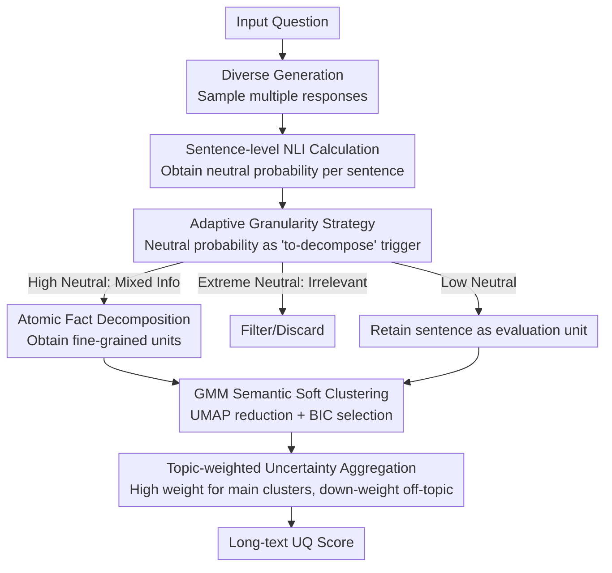

# AGSC: Adaptive Granularity and Semantic Clustering for Uncertainty Quantification in Long-text Generation

**Conference**: ACL 2026  
**arXiv**: [2604.06812](https://arxiv.org/abs/2604.06812)  
**Code**: None  
**Area**: LLM Safety  
**Keywords**: Uncertainty Quantification, Long-text Generation, Adaptive Granularity, Semantic Clustering, GMM

## TL;DR

AGSC proposes an uncertainty quantification (UQ) framework for long-text generation that triggers adaptive granularity decomposition via NLI neutral probability (reducing inference time by 60%) and utilizes GMM soft clustering to capture latent semantic topics for topic-aware weighted aggregation, achieving SOTA factuality correlation on BIO and LongFact benchmarks.

## Background & Motivation

**Background**: The hallucination problem in LLMs makes uncertainty quantification critical for enhancing trustworthiness. Existing UQ methods primarily target short responses, while long-text UQ (such as LUQ) attempts to decompose responses into atomic facts for fine-grained evaluation.

**Limitations of Prior Work**: (1) Fine-grained decomposition significantly increases computational overhead; (2) Long texts mix multiple semantic topics, where simple pooling aggregation is overly influenced by minor or off-topic parts; (3) LUQ simply discards NLI neutral labels, yet neutrality often reflects epistemic uncertainty.

**Key Challenge**: Long-text UQ requires a balance between granularity, efficiency, and topic heterogeneity.

**Goal**: Design an accurate and efficient long-text UQ framework that simultaneously handles topic heterogeneity.

**Key Insight**: Utilize the NLI neutral category as an adaptive granularity trigger, combined with GMM soft clustering for topic-aware aggregation.

**Core Idea**: Neutrality is not noise to be discarded but a signal requiring finer-grained analysis; semantic topic clustering effectively reduces interference from secondary segments on the overall UQ.

## Method

### Overall Architecture

AGSC consists of three stages: (1) **Diverse Generation**—sampling multiple responses; (2) **NLI Calculation & Adaptive Decomposition**—sentence-level NLI analysis where high neutral probability triggers atomic fact decomposition or noise filtering; (3) **Semantic Clustering & Aggregation**—UMAP dimensionality reduction + GMM soft clustering for topic-weighted aggregation. The true contributions lie in "Adaptive Granularity," "GMM Semantic Soft Clustering," and "Topic-weighted Aggregation."

### Key Designs

**1. Adaptive Granularity Strategy: Atomic decomposition only for "suspicious sentences" to save computation**

Fine-grained decomposition improves evaluation precision, but applying it to every sentence causes computational costs to explode. AGSC uses the NLI neutral probability as a trigger: NLI is run sentence-by-sentence; if a sentence's neutral probability exceeds a threshold, it suggests mixed information, triggering finer atomic fact decomposition. If the neutral rate is extremely high, it is judged as irrelevant and filtered out.

The key is distinguishing two meanings of neutrality: it can signify irrelevance (filter) or complex uncertain information (decompose). The adaptive trigger separates these cases based on the magnitude of the neutral rate, spending atomic decomposition power only where needed, reducing global inference time by approximately 60%.

**2. GMM Semantic Soft Clustering: Suppressing off-topic interference via latent topic grouping**

Long texts often contain multiple semantic topics. Under open-ended prompts like "Tell me about Einstein," different samples might organize content around different themes, causing structural confusion. Simple pooling lets minor/off-topic parts disproportionately affect the total score. AGSC takes embeddings of all units, applies UMAP reduction, and uses GMM for soft clustering, where each cluster corresponds to a latent semantic topic. The number of clusters is automatically selected via BIC.

GMM soft clustering is chosen over K-means hard clustering because semantic boundaries are inherently fuzzy—a sentence might relate to two topics simultaneously. Soft assignment provides "partial membership" weights. Once clusters are obtained, AGSC assigns topic-aware weights based on cluster size: main topics (large clusters) receive high weights, while minor/noise parts are down-weighted.

**3. Topic-weighted Uncertainty Aggregation: Letting main topics dominate results**

After obtaining per-unit NLI uncertainty and cluster weights, AGSC combines them for weighted aggregation. Per-unit uncertainty is calculated via NLI and then weighted by the cluster importance. This ensures that the primary content contributes more to the overall uncertainty, preventing secondary or off-topic sentences from skewing the UQ score.

### Loss & Training

Does not involve model training. Uses pre-trained NLI and embedding models. The number of GMM clusters is automatically selected via BIC.

## Key Experimental Results

### Main Results

- AGSC achieves SOTA correlation with factuality on BIO and LongFact benchmarks.
- Reduces inference time by approximately 60% compared to full atomic decomposition methods.

### Ablation Study

- Both the adaptive granularity and semantic clustering components contribute significantly to final performance.
- GMM clustering outperforms K-means hard clustering; soft assignment is better suited for the fuzzy boundaries of semantic topics.

### Key Findings

- NLI neutrality is a valuable signal and should not be discarded.
- Topic-aware aggregation is significantly superior to simple pooling.
- Adaptive granularity maintains or improves accuracy while reducing computation by 60%.

## Highlights & Insights

- Transforming the NLI neutral category from "waste" into a valuable trigger signal is a clever insight.
- GMM soft clustering naturally handles the fuzziness of semantic boundaries.
- The 60% reduction in inference time is meaningful for practical deployment.

## Limitations & Future Work

- Automatic selection of GMM cluster counts may be unstable in extreme cases.
- Dependency on NLI model quality; erroneous NLI judgments can propagate.
- Future work could explore combining AGSC with other UQ methods.

## Related Work & Insights

- Provides a systematic solution to three limitations of LUQ.
- The GMM clustering approach can be generalized to other NLP tasks requiring handling of topic heterogeneity.

## Rating

- Novelty: ⭐⭐⭐⭐ The combination of neutrality triggering and semantic clustering is novel and practical.
- Experimental Thoroughness: ⭐⭐⭐⭐ Complete comparison across two benchmarks and multiple baselines.
- Writing Quality: ⭐⭐⭐⭐ Framework description is clear with sufficient motivation.

<!-- RELATED:START -->

## Related Papers

- [\[ACL 2026\] From Passive Metric to Active Signal: The Evolving Role of Uncertainty Quantification in Large Language Models](from_passive_metric_to_active_signal_the_evolving_role_of_uncertainty_quantifica.md)
- [\[ACL 2026\] Differentially Private Synthetic Text Generation for Retrieval-Augmented Generation (RAG)](differentially_private_synthetic_text_generation_for_retrieval-augmented_generat.md)
- [\[ACL 2026\] SAGE: Sparse Adaptive Guidance for Dependency-Aware Tabular Data Generation](sage_sparse_adaptive_guidance_for_dependency-aware_tabular_data_generation.md)
- [\[ACL 2026\] Adaptive Text Anonymization: Learning Privacy-Utility Trade-offs via Prompt Optimization](adaptive_text_anonymization_learning_privacy-utility_trade-offs_via_prompt_optim.md)
- [\[ICLR 2026\] Secret-Protected Evolution for Differentially Private Synthetic Text Generation](../../ICLR2026/llm_safety/secret-protected_evolution_for_differentially_private_synthetic_text_generation.md)

<!-- RELATED:END -->
