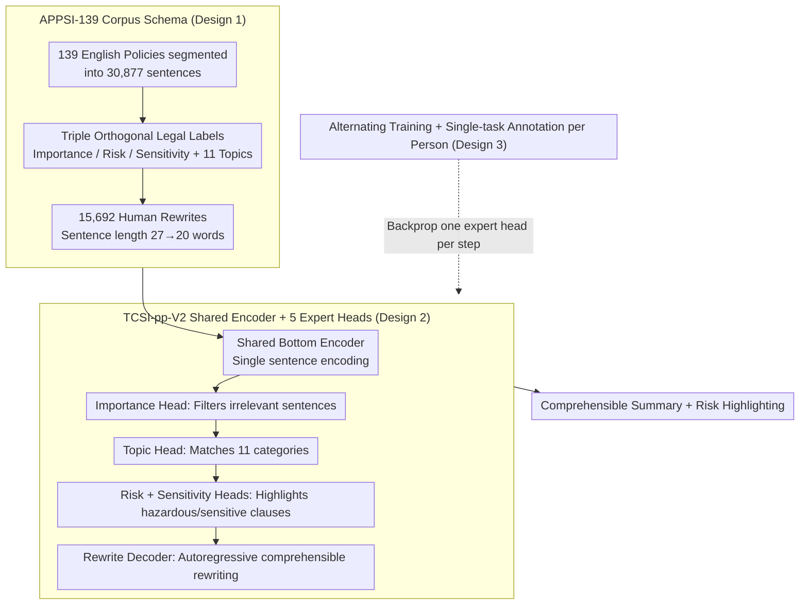

# APPSI-139: A Parallel Corpus of English Application Privacy Policy Summarization and Interpretation

**Conference**: ACL 2026  
**arXiv**: [2604.27550](https://arxiv.org/abs/2604.27550)  
**Code**: https://github.com/EnlightenedAI/APPSI-139  
**Area**: LLM Safety / Privacy / Text Summarization  
**Keywords**: Privacy Policy, Parallel Corpus, Multi-task Learning, Summarization and Interpretation, Legal NLP

## TL;DR
APPSI-139 is the first parallel corpus for English application privacy policy summarization and interpretation, meticulously annotated by legal experts (139 policies / 36,351 annotations / 15,692 rewrite pairs). The accompanying TCSI-pp-V2 framework utilizes a shared encoder with five alternately trained expert heads to achieve five sub-tasks: "Importance / Risk / Sensitivity / Topic / Interpretation." Compared to TCSI-pp v1, it reduces encoding time by 73% and memory consumption from 7.3GB to 2.7GB, while its subjective readability surpasses GPT-4o and Llama3-70b.

## Background & Motivation

**Background**: Privacy policies serve as the legal foundation for user authorization of personal data processing. However, they are typically lengthy, filled with legalese and technobabble, and compounded by "rational ignorance" and "dark patterns." Consequently, most users agree without reading, leading to the silent exploitation of sensitive data. While standardized labels like "Privacy Nutrition Labels," "LPL," and "TILT" have been proposed, their adoption depends entirely on service providers.

**Limitations of Prior Work**: Automated summarization is considered a viable path forward. However, existing privacy policy corpora are almost exclusively oriented toward **Information Extraction** (e.g., OPP-115, APP-350, PI-Extract, Optoutchoice, PrivacyQA, PolicyQA), addressing length but not comprehensibility. The only corpus with rewrite interpretations, CAPP-130, is in Chinese, and machine translations to English lose legal precision.

**Key Challenge**: Privacy policy summarization requires being **concise**, **easy to understand**, and **legally accurate**—three goals that are inherently in conflict. Without parallel corpora, models cannot learn the "original text $\rightarrow$ comprehensible rewrite" mapping; using general LLMs leads to degraded legal semantics; and small models lack specialized training data.

**Goal**: ① Construct an English "sentence-level multi-label + rewrite" parallel corpus. ② Design an efficient framework that unifies five tasks—identifying important/risk/sensitive clauses, topic classification, and rewrite interpretation—under a shared encoder to avoid the redundancy of running separate encoders for each task in v1.

**Key Insight**: The authors reuse the CAPP-130 annotation schema but employ five LL.M. students and one law professor to meticulously annotate the English version from scratch (avoiding machine translation). On the model side, five tasks are integrated into a single shared encoder with five parallel expert heads using an alternating training strategy.

**Core Idea**: By combining legal-expert-annotated English parallel corpora with a multi-task shared encoder and an alternating training strategy, the authors aim to simultaneously satisfy the requirements of scalability, comprehensibility, and reliability.

## Method

### Overall Architecture
This paper presents both a dataset and a model to resolve the trilemma of privacy policies being long, difficult to understand, and legally sensitive. For the dataset, the authors selected policies from the Top-100 English applications on Google Play and the App Store as of October 2023. After deduplication, 139 policies remain, which were segmented into 30,877 sentences. Five LL.M. students annotated respective sub-tasks (Importance / Risk / Sensitivity / Topic / Rewrite). Following a pilot study achieving Cohen's Kappa = 0.892, formal annotation was conducted, with ambiguous terms finalized by a senior reviewer. The TCSI-pp-V2 model consists of a shared bottom encoder, four classification heads, and one rewrite decoder. When a policy sentence is input, it is filtered by the Importance head, categorized by the Topic head, highlighted by Risk/Sensitivity heads, and finally rewritten into a comprehensible version by the Rewrite head—all in a single pass.

### Key Designs

**1. APPSI-139 Corpus Schema: Slicing policies with triple orthogonal legal labels and human rewrites for high-risk clauses.**

Topic classification alone solves the "length" problem but not "comprehensibility" or "legal risk." APPSI-139 assigns multiple labels per sentence across 11 data practice categories (First-Party Collection, Third Party Sharing, Data Retention, etc.). On top of these, three orthogonal special labels are layered: **Importance** (essential clauses), **Risk** (ambiguous language potentially violating GDPR/CCPA), and **Sensitivity** (biometrics, precise location, financial accounts). The sensitivity definition aligns with GDPR, NIST SP 800-122, and GB/T 35273-2020 for cross-regional transferability. The 15,692 rewrite pairs reduce average sentence length from 27 to 20 words (a 26% reduction).

**2. TCSI-pp-V2 Shared Encoder + 5 Expert Heads: One backbone for five tasks to eliminate v1 encoding redundancy.**

Version 1 assigned an encoder to each sub-task, resulting in the same legal text being encoded five times, wasting memory and latency. V2 adopts a shared bottom with five parallel heads. Sentences are embedded as $E=\{e_1,\dots,e_n\}$ and processed through a shared backbone $F_f(e_j,\theta_f)$ to produce $\{f_1,\dots,f_n\}$. These are then passed to specialized heads: $F_i$ (Importance binary), $F_t$ (Topic multi-class), $F_r$ (Risk binary), $F_s$ (Sensitivity binary), and $F_{rewrite}$ (Autoregressive rewriting $P(z_t\mid f_j;z_{1:t-1})$). This approach maintains performance because the five tasks share feature characteristics while reducing inference memory from 7.3GB to 2.7GB.

**3. Alternating Training + Single-task Annotation: Preventing task suppression from training and annotation ends.**

Unified loss weighting can cause "strong" tasks (e.g., Sensitivity) to dominate gradients, drowning out "weak" tasks (e.g., the 0.04% Cease Operation class). V2 uses alternating training: each step activates only one expert head for backpropagation. On the annotation side, each annotator focuses on a single task to avoid cognitive interference. The high Cohen’s Kappa (0.892) confirms that this division of labor improves quality without sacrificing consistency.

### Loss & Training
The classification heads utilize standard Cross-Entropy loss, while the rewrite head uses teacher-forcing language modeling. During alternating training, each mini-batch backpropagates through only one expert head. Backbones selected include mT5-small, Bert2GPT, XLNet2GPT, and Electra2GPT. Data was split 80:10:10 for training/validation/testing, using NVIDIA V100 GPUs. Classes with insufficient samples (Cease/Permission) were excluded from binary evaluation.

## Key Experimental Results

### Main Results (Comparison with LLMs on APPSI-139 Test Set)

| Task | Metric | Qwen3-8B | Llama3-8B | GPT-4o-mini | Gemini-2.5 | **TCSI-pp-V2** |
|---|---|---|---|---|---|---|
| Topic | Micro-F1 | 47.85 | 30.77 | 50.36 | 65.38 | **78.18** |
| Topic | Macro-F1 | 44.44 | 24.65 | 32.83 | 6.42 | **77.12** |
| Important | Micro-F1 | 63.50 | 52.53 | 51.00 | 73.33 | **73.93** |
| Risk | Micro-F1 | 85.53 | 96.00 | 89.34 | 85.05 | **95.60** |
| Sensitive | Micro-F1 | 45.37 | 28.01 | 38.64 | 23.33 | **96.96** |
| Rewritten | ROUGE-L | 0.4541 | 0.4156 | 0.4286 | 0.4776 | **0.6903** |
| Rewritten | BERTScore | 0.8970 | 0.8520 | 0.8950 | 0.9070 | **0.9430** |
| Rewritten | BARTScore | -2.76 | -3.03 | -2.89 | -2.78 | **-1.68** |

Subjective Readability Vote (53 subjects, 10 single-choice questions): TCSI-pp-V2 **39.06%** > Llama3-70b 25.28% > GPT-4o 24.52% > Kimi 11.13%. The proposed model won 7 out of 10 questions.

### Ablation Study 1: V1 vs V2 Memory and Latency (mT5-small backend, 1,893 sentences)

| Metric | TCSI-pp (V1) | TCSI-pp-V2 | Improvement |
|---|---|---|---|
| Encoding Time | 92.66 s | 24.72 s | **-73%** |
| Total Time | 191.94 s | 123.26 s | -36% |
| Avg. Time / Sent | 0.101 s | 0.065 s | -36% |
| Inf. Memory | 7,343 MB | **2,766 MB** | -62% |

### Ablation Study 2: Input Length Robustness

| Task | Metric | Longest 100 | Shortest 100 | Full Set |
|---|---|---|---|---|
| Topic | Micro-F1 | 79.41 | 76.23 | 78.18 |
| Risk | Micro-F1 | 94.74 | 94.34 | 95.60 |
| Sensitive | Micro-F1 | 96.83 | 96.18 | 96.96 |
| Rewritten | ROUGE-L | 0.6979 | 0.6542 | 0.6903 |

### Key Findings
- **Specialized Data + Small Model > LLM + Prompt Engineering**: mT5-small (300M parameters) outperforms GPT-4o-mini and Gemini-2.5 across all tasks. Notably, on the Sensitive task, TCSI-pp-V2 scored 96.96 compared to Gemini-2.5's 23.33, indicating that general LLMs struggle with niche legal semantics.
- **Shared Encoder Benefits**: The performance gap between V2 and V1 is negligible (<0.02), yet V2 reduces memory by 62% and encoding time by 73%. Multi-task regularization even slightly improved rewrite scores.
- **Legal Readability**: Subjective votes showed GPT-4o often paraphrases too closely to the original, while Llama3-70b lacks coherence. TCSI-pp-V2's multi-level bullet structure and mandatory rewriting scored highest.
- **Data Imbalance**: Highly skewed distribution (Importance 51.04% vs. Risk 1.9%) suggests that minority classes still require more data or oversampling.

## Highlights & Insights
- **Triple Orthogonal Labels**: Dividing "essential, dangerous, and sensitive" into independent labels allows downstream models to support both filtered summarization and risk highlighting simultaneously.
- **Cross-Regional Alignment**: Aligning sensitivity definitions with GDPR, NIST, and GB/T standards ensures the dataset remains applicable across different legal jurisdictions.
- **Efficient MTL**: The shared encoder plus alternating training brings the "expert routing" logic of the LLM era down to the 300M parameter level, making it friendly for edge deployment.
- **Single-task Annotation**: Professional division of labor proved to be a viable strategy for high-consistency multi-label legal corpora.

## Limitations & Future Work
- The corpus is currently limited to English, excluding other major European and Asian languages.
- Policies from October 2023 may become outdated as GDPR or CCPA are revised.
- Generative rewriting still carries hallucination risks, such as omitting key clauses or distorting legal meanings.
- The subjective evaluation lacked representation from older or less-educated user demographics.
- The study did not compare against the latest reasoning models (e.g., o1, DeepSeek-R1), which might close the gap via chain-of-thought.

## Related Work & Insights
- **Comparison to OPP-115/APP-350**: While previous works focused on extraction/QA, APPSI-139 is the first English **rewrite** parallel corpus.
- **Comparison to CAPP-130**: APPSI-139 builds on the CAPP-130 schema but provides a native English version with improved multi-regional standard alignment.
- **Small Models vs. LLMs**: This work confirms that high-quality annotated data and fine-tuning small models still outperform zero-shot general LLMs in specialized legal domains.

## Rating
- Novelty: ⭐⭐⭐⭐ First English rewrite parallel corpus with triple orthogonal legal labels; practical breakthrough in design.
- Experimental Thoroughness: ⭐⭐⭐⭐ Extensive comparisons across 13 backbones and 4 LLMs; includes efficiency and robustness tests.
- Writing Quality: ⭐⭐⭐ Clear structure, though some tense inconsistencies in experimental sections.
- Value: ⭐⭐⭐⭐⭐ Comprehensive dataset, model, and evaluation suite that is directly applicable to consumer protection products.

<!-- RELATED:START -->

## Related Papers

- [\[CVPR 2026\] Select, Hypothesize and Verify: Towards Verified Neuron Concept Interpretation](../../CVPR2026/llm_safety/select_hypothesize_and_verify_towards_verified_neuron_concept_interpretation.md)
- [\[ICLR 2026\] Heterogeneous Federated Fine-Tuning with Parallel One-Rank Adaptation](../../ICLR2026/llm_safety/heterogeneous_federated_fine-tuning_with_parallel_one-rank_adaptation.md)
- [\[ACL 2026\] Privacy-R1: Privacy-Aware Multi-LLM Agent Collaboration via Reinforcement Learning](privacy-r1_privacy-aware_multi-llm_agent_collaboration_via_reinforcement_learnin.md)
- [\[ACL 2026\] Privacy Collapse: Benign Fine-Tuning Can Break Contextual Privacy in Language Models](privacy_collapse_benign_fine-tuning_can_break_contextual_privacy_in_language_mod.md)
- [\[ACL 2025\] Improving Fairness of Large Language Models in Multi-document Summarization](../../ACL2025/llm_safety/improving_fairness_of_large_language_models_in_multi-document_summarization.md)

<!-- RELATED:END -->
