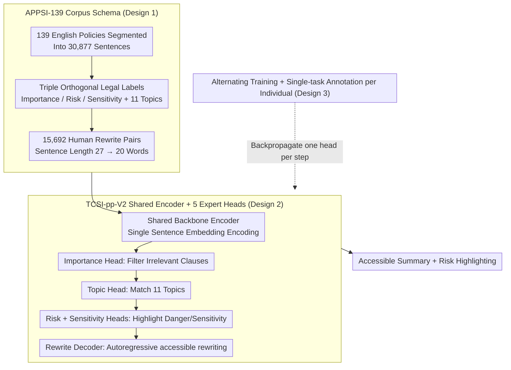

# APPSI-139: A Parallel Corpus of English Application Privacy Policy Summarization and Interpretation

**Conference**: ACL 2026  
**arXiv**: [2604.27550](https://arxiv.org/abs/2604.27550)  
**Code**: https://github.com/EnlightenedAI/APPSI-139  
**Area**: LLM Safety / Privacy / Text Summarization  
**Keywords**: Privacy Policy, Parallel Corpus, Multi-task Learning, Summarization and Interpretation, Legal NLP

## TL;DR
APPSI-139 is the first parallel corpus of English application privacy policy summarization and interpretation finely annotated by legal experts (139 policies / 36,351 annotations / 15,692 rewrite pairs). The accompanying TCSI-pp-V2 framework utilizes a shared encoder with five alternately trained expert heads for five sub-tasks: "Importance / Risk / Sensitivity / Topic / Rewriting." Compared to TCSI-pp v1, the encoding time is reduced by 73%, and GPU memory usage decreases from 7.3GB to 2.7GB, with subjective readability surpassing GPT-4o and Llama3-70b.

## Background & Motivation

**Background**: Privacy policies provide the legal foundation for apps to process personal data. However, they are generally lengthy, filled with legalese and technobabble, and compounded by "rational ignorance" and "dark patterns." Consequently, most users click "agree" without reading, lead to quiet use of sensitive data. Efforts like "Privacy Nutrition Labels," "LPL," and "TILT" have attempted standardization, but implementation depends on provider compliance.

**Limitations of Prior Work**: Automatic summarization is seen as a solution, but existing privacy policy corpora are almost entirely oriented toward English **Information Extraction** (OPP-115 / APP-350 / PI-Extract / Optoutchoice / PrivacyQA / PolicyQA), which solves "length" but not "comprehensibility." The only interpretation corpus with rewrites, CAPP-130, is in Chinese, and machine translation to English loses legal precision.

**Key Challenge**: Privacy policy summarization must be **concise**, **easy to understand**, and **legally accurate**—three inherently conflicting goals. Lack of parallel corpora means no mapping from "original text → accessible rewrite" can be learned; general LLMs often sacrifice legal semantics; and small models lack professional data.

**Goal**: ① Construct an English "sentence-level multi-label + rewriting" parallel corpus; ② Design an efficient framework that integrates "identifying important/risk/sensitive clauses + topic classification + rewriting interpretation" under a shared encoder, avoiding the redundancy of running separate encoders for each sub-task as in v1.

**Key Insight**: Reusing the annotation schema of CAPP-130 while employing five LLM graduates and one law professor to finely re-annotate the English version (avoiding machine translation). On the model side, integrate five tasks into one shared encoder plus five parallel expert heads with alternating training.

**Core Idea**: Utilize expert-annotated English parallel corpora, a multi-task shared encoder, and alternating training strategies to simultaneously achieve "computational efficiency + understandability + trustworthiness."

## Method

### Overall Architecture
This paper delivers both a dataset and a model to resolve the trilemma of privacy policies being long, difficult, and requiring legal precision. For data, the authors selected 139 policies from Top-100 English apps on Google Play / App Store (as of 2023-10), segmenting them into 30,877 sentences. Five law graduates annotated sub-tasks (Importance / Risk / Sensitivity / Topic / Rewrite), achieving Cohen's Kappa=0.892, with ambiguous terms finalized by a senior reviewer. For the model, TCSI-pp-V2 consists of a shared bottom encoder, four classification heads (Importance / Topic / Risk / Sensitivity), and one rewrite decoder. When a policy sentence arrives, the Importance head filters irrelevant content, the Topic head matches user interests, Risk/Sensitivity heads highlight dangerous or sensitive clauses, and the Rewrite head transforms the remaining clauses into an accessible version—all in a single pass.

### Key Designs

**1. APPSI-139 Corpus Schema: Slicing policies with triple orthogonal legal labels and human rewrites for high-risk clauses.**

Topic classification alone solves "length" but not "comprehensibility," nor does it address "which clauses carry legal risks." APPSI-139 assigns multiple labels per sentence: 11 categories of data practices (First-Party Collection / Permission Acquisition / Third Party Sharing / Usage / Data Retention / Data Security / Edit-Control / Specific Audiences / Contact / Policy Change / Cease Operation). On top of this, three orthogonal special labels are layered: Importance marks essential clauses, Risk marks compliant yet ambiguous language (violating GDPR/CCPA), and Sensitivity marks sensitive data like biometrics, precise location, and financial accounts (aligned with GDPR, NIST SP 800-122, and GB/T 35273-2020 for cross-regional transferability). The accompanying 15,692 rewrite pairs reduce average sentence length from 27 to 20 words (-26%).

The value of these triple labels lies in their orthogonality: the downstream model identifies "what must be read" and "what is dangerous/sensitive," supporting both extractive summarization and risk highlighting for a complete legal perspective. Notably, Risk labels account for only 1.9%, yet they represent the highest value by reflecting the sparse distribution of legal blind spots in real policies.

**2. TCSI-pp-V2 Shared Encoder + 5 Expert Heads: One backbone for five tasks to eliminate V1 encoding redundancy.**

V1 assigned an encoder to each sub-task, repeating encoding for the same legal text five times, wasting memory and latency. V2 adopts a shared bottom plus five parallel expert heads: sentence embeddings $E=\{e_1,\dots,e_n\}$ pass through a shared backbone $F_f(e_j,\theta_f)$ to obtain $\{f_1,\dots,f_n\}$, which are sent to five heads—$F_i$ (Importance binary), $F_t$ (11-class Topic), $F_r$ (Risk binary), $F_s$ (Sensitivity binary), and $F_{rewrite}$ (autoregressive rewriting $P(z_t\mid f_j;z_{1:t-1})$). During inference, these are linked as Importance → Topic → Risk+Sensitivity+Rewrite.

This approach maintains performance because the five sub-tasks make judgments on the same text with highly shared features, allowing the shared backbone to learn more universal legal semantic representations. The benefits include a significant reduction in inference memory from 7.3GB to 2.7GB, enabling efficient edge device deployment.

**3. Alternating Training + Single-task Annotation: Avoiding task suppression in training and cognitive interference in annotation.**

If five expert heads were trained together with a weighted joint loss, strong tasks (like Sensitivity) would dominate gradients, drowning out weak tasks (like Cease Operation, which accounts for only 0.04%). V2 implements alternating training: each step activates only one expert head for backpropagation, allowing the shared backbone to migrate stably between tasks and giving each head a fair update opportunity. Similarly, for annotation, five annotators focused on one task each to avoid cognitive interference from multifactorial judging. A Cohen's Kappa of 0.892 proves that this division of labor improves quality without sacrificing consistency.

### Loss & Training
The classification heads use standard Cross-Entropy, and the rewrite head use teacher-forcing language modeling. During alternating training, each mini-batch backpropagates through only one expert head. Backbones selected include mT5-small / Bert2GPT / XLNet2GPT / Electra2GPT. Data is split 80:10:10 for training/validation/testing, using NVIDIA V100 hardware. Cease/Permission tasks were excluded from binary evaluation due to insufficient samples.

## Key Experimental Results

### Main Results (Benchmarking against LLMs on APPSI-139 Test Set)

| Task | Metric | Qwen3-8B | Llama3-8B | GPT-4o-mini | Gemini-2.5 | **TCSI-pp-V2** |
|---|---|---|---|---|---|---|
| Topic | Micro-F1 | 47.85 | 30.77 | 50.36 | 65.38 | **78.18** |
| Topic | Macro-F1 | 44.44 | 24.65 | 32.83 | 6.42 | **77.12** |
| Important | Micro-F1 | 63.50 | 52.53 | 51.00 | 73.33 | **73.93** |
| Risk | Micro-F1 | 85.53 | 96.00 | 89.34 | 85.05 | **95.60** |
| Sensitive | Micro-F1 | 45.37 | 28.01 | 38.64 | 23.33 | **96.96** |
| Rewritten | ROUGE-L | 0.4541 | 0.4156 | 0.4286 | 0.4776 | **0.6903** |
| Rewritten | BERTScore | 0.8970 | 0.8520 | 0.8950 | 0.9070 | **0.9430** |
| Rewritten | BARTScore | -2.76 | -3.03 | -2.89 | -2.78 | **-1.68** |

Subjective readability voting (53 undergraduate/graduate participants, 10 multiple-choice questions): TCSI-pp-V2 **39.06%** > Llama3-70b 25.28% > GPT-4o 24.52% > Kimi 11.13%. Ours won 7 out of 10 questions.

### Ablation Study 1: V1 vs V2 Memory and Latency (mT5-small backend, 1,893 sentence samples)

| Metric | TCSI-pp (V1) | TCSI-pp-V2 | Gain |
|---|---|---|---|
| Encoding Time | 92.66 s | 24.72 s | **-73%** |
| Total Time | 191.94 s | 123.26 s | -36% |
| Avg. Time / Sent | 0.101 s | 0.065 s | -36% |
| GPU Memory | 7,343 MB | **2,766 MB** | -62% |

### Ablation Study 2: Input Length Robustness (Longest 100 vs Shortest 100 vs Full)

| Task | Metric | Longest | Shortest | Full |
|---|---|---|---|---|
| Topic | Micro-F1 | 79.41 | 76.23 | 78.18 |
| Risk | Micro-F1 | 94.74 | 94.34 | 95.60 |
| Sensitive | Micro-F1 | 96.83 | 96.18 | 96.96 |
| Rewritten | ROUGE-L | 0.6979 | 0.6542 | 0.6903 |

### Key Findings
- **Expert Data + Small Model > LLM + Prompt Engineering**: mT5-small (300M parameters) outperformed GPT-4o-mini / Llama3-8B / Gemini-2.5 in all tasks. In the Sensitive task, TCSI-pp-V2 achieved 96.96 vs Gemini-2.5's 23.33—universal LLMs struggle to identify legal-specific sensitive semantics like "precise location."
- **Shared Encoder Gains**: Differences between V2 and V1 single-task models were <0.02, but V2 reduced memory by 62% and encoding time by 73%. ROUGE/BERTScore for rewriting slightly improved, suggesting benefit from multi-task regularization.
- **Legal Readability Wins**: Subjective voting showed GPT-4o often "repeats original sentences verbatim," leading to lengthiness, while Llama3-70b outputs were fragmented. TCSI-pp-V2's multi-level bullet structure + mandatory rewriting scored highest.
- **Severe Data Imbalance**: Important (51.04%), Risk (1.9%), and Cease (0.04%). The lower macro-F1 for Risk (~60) compared to micro-F1 (~96) indicates the need for more data or resampling for minority classes.
- **Robustness**: Performance fluctuations across different length subsets remained <3 points. The longest inputs showed a slight drop in Risk (due to clause complexity), while shortest inputs showed a slight drop in ROUGE (lack of context).

## Highlights & Insights
- **The triple orthogonal legal labels (Importance / Risk / Sensitivity) are innovative**: Unlike previous corpora that only label "topics," this work splits "essential / dangerous / sensitive" into independent labels, supporting both filtering and risk highlighting.
- **Cross-regional alignment (GDPR + NIST + GB/T) ensures global transferability**: Sensitivity labels can be reused across Europe, North America, and East Asia.
- **Shared Encoder + Alternating Training is a practical paradigm for small models**: It avoids redundancy and brings LLM-style "expert routing" to the 300M parameter level, facilitating edge deployment.
- **Single-task expert annotation**: Cohen's Kappa of 0.892 validates the division of labor, which can be applied to other multi-label legal corpora like contracts and ToS.

## Limitations & Future Work
- Limited to English; multi-language coverage (particularly European and non-Chinese Asian languages) is missing.
- Policies from 2023-10 may become outdated with new GDPR/CCPA amendments.
- Generative rewriting still carries hallucination risks—missing key clauses or distorting legal meaning; fidelity is monitored but not systematically quality-controlled.
- Subjective evaluation was restricted to 53 participants (ages 18-40, college-educated), lacking representation from elderly or less-educated users.
- No comparison with latest reasoning models (e.g., o1 / DeepSeek-R1), which might close the gap through chain-of-thought.

## Related Work & Insights
- **vs OPP-115 / APP-350 / PolicyQA / PrivacyQA**: Those are classification/QA corpora; APPSI-139 is the first English **rewriting** parallel corpus.
- **vs CAPP-130 (NeurIPS 2023)**: CAPP-130 is the Chinese predecessor; APPSI-139 re-constructs the English version without machine translation and adds multi-regional sensitivity standards.
- **vs PolicyGPT / ChatGPT Prompting**: Pure prompting fails on niche legal semantics (Sensitivity); this work confirms that "high-quality annotated data + fine-tuned small models" still outperforms zero-shot LLMs in legal NLP.
- **vs TCSI-pp v1**: V1 used five independent encoders; V2 reduces memory by 62% by sharing the backbone.

## Rating
- Novelty: ⭐⭐⭐⭐ First English rewrite parallel corpus + triple orthogonal design is a practical breakthrough.
- Experimental Thoroughness: ⭐⭐⭐⭐ 13 backbones, 4 LLMs, and analysis of memory/latency/subjective readability; missing reasoning models.
- Writing Quality: ⭐⭐⭐ Generally clear, though some tense consistency issues and Algorithm 1 layout is slightly cluttered.
- Value: ⭐⭐⭐⭐⭐ Comprehensive dataset, model, and evaluation; highly applicable to consumer protection scenarios as a "Privacy Policy Reader."

<!-- RELATED:START -->

## Related Papers

- [\[CVPR 2026\] Select, Hypothesize and Verify: Towards Verified Neuron Concept Interpretation](../../CVPR2026/llm_safety/select_hypothesize_and_verify_towards_verified_neuron_concept_interpretation.md)
- [\[ICLR 2026\] Heterogeneous Federated Fine-Tuning with Parallel One-Rank Adaptation](../../ICLR2026/llm_safety/heterogeneous_federated_fine-tuning_with_parallel_one-rank_adaptation.md)
- [\[ACL 2026\] Privacy-R1: Privacy-Aware Multi-LLM Agent Collaboration via Reinforcement Learning](privacy-r1_privacy-aware_multi-llm_agent_collaboration_via_reinforcement_learnin.md)
- [\[ACL 2026\] Privacy Collapse: Benign Fine-Tuning Can Break Contextual Privacy in Language Models](privacy_collapse_benign_fine-tuning_can_break_contextual_privacy_in_language_mod.md)
- [\[ACL 2025\] Improving Fairness of Large Language Models in Multi-document Summarization](../../ACL2025/llm_safety/improving_fairness_of_large_language_models_in_multi-document_summarization.md)

<!-- RELATED:END -->
