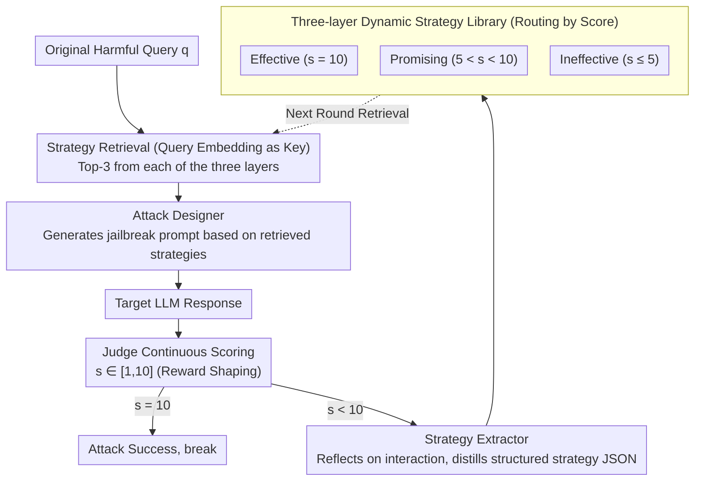

# ASTRA: An Automated Framework for Strategy Discovery, Retrieval, and Evolution for Jailbreaking LLMs

**Conference**: ACL 2026  
**arXiv**: [2511.02356](https://arxiv.org/abs/2511.02356)  
**Code**: None  
**Area**: AI Safety / Automated Jailbreaking  
**Keywords**: Jailbreak Attack, Strategy Library, Closed-loop Learning, RAG Retrieval, Black-box Red Teaming

## TL;DR
ASTRA treats every jailbreak attempt as a learning opportunity. It distills strategies into a three-layer vector library ("Effective / Promising / Ineffective") based on continuous scores from 1-10. Subsequent attacks reuse experience through similarity retrieval, achieving an 80.6% attack success rate across 8 mainstream LLMs with an average of only 2.4 queries.

## Background & Motivation

**Background**: Existing black-box jailbreak methods are divided into two camps: template/heuristic-based (GPTFuzzer / CodeAttack / CipherChat), which are easily fingerprinted; and iterative optimization-based (PAIR, TAP), which involve feedback but are "binary" in outcome, failing to extract reusable experience from a large number of failed attempts.

**Limitations of Prior Work**: (1) Templates lack diversity and are easily identified by defenders; (2) Optimization methods treat attack results as boolean values, making learning impossible; (3) Transferability across datasets and target models is nearly zero.

**Key Challenge**: Jailbreaking is essentially a sparse reward search problem—the vast majority of attempts are "partial successes" or "failures," and binary signals discard 99% of the learning information.

**Goal**: Construct a self-evolving framework that can learn from every interaction (including failures) and be reused across different queries and models.

**Key Insight**: Introduce the concept of "reward shaping" from reinforcement learning by changing the binary judgment into a continuous 1-10 score. Combined with a strategy-level retrieval and update mechanism, this allows attack experience to be assembled from individual "points" into a "library."

**Core Idea**: A closed-loop "attack–evaluate–distill–reuse" process combined with a three-layer vectorized strategy library. This allows the attacker to act like a student doing homework, recording every question in an error notebook or notebook to be checked later.

## Method

### Overall Architecture
ASTRA aims to solve the "experience waste" problem in jailbreaking. Iterative attacks like PAIR/TAP treat each result as a success/failure boolean signal, failing to learn from "near-miss" attempts. ASTRA turns the entire attack into a self-accumulating closed loop, linked by three main modules: the **Attack Designer** generates prompts (using Strategy-Agnostic or Strategy-Guided modes); the **Judge** provides a continuous score from 1-10 after the target LLM responds; the **Strategy Extractor** prompts an LLM to reflect on the interaction and distill a structured strategy JSON based on the score; and **Strategy Storage & Retrieval** stores strategies using the embedding of the "original harmful query" as an index for top-$k$ cosine similarity retrieval in future attacks. The attack budget is $N=10$, retrieval $k=9$ (top-3 from each of the three categories). The Attacker and Extractor use GLM-4.5, and the Judge uses GPT-4o.

### Key Designs

**1. Closed-loop "attack–evaluate–distill–reuse": Turning every interaction into a reusable learning signal**

The fundamental flaw of PAIR / TAP is that rewards are too sparse—attack results are compressed into 0/1, and "near-miss" attempts that were directionally correct but filtered at the last step are discarded. ASTRA borrows the "reward shaping" concept from RL, changing the Judge $J_\theta$ in the objective function $\sigma^* = \arg\max_\sigma J_\theta(q, T_\theta(A_\theta(q, S(\sigma))))$ from binary judgment to a continuous score $s \in [1,10]$. The lifecycle is a loop: retrieve strategy → generate prompt → target LLM responds → Judge scores → Extractor distills strategy → write to corresponding library, breaking immediately if $s_i=10$.

The advantage of continuous scoring is that it turns "almost successful" into a gradient signal—an $s=8$ attempt explicitly tells the system "this path is almost there," capturing the most valuable reusable experience that binary rewards miss.

**2. Three-layer dynamic strategy library: Allowing the attack to learn what works, improve what's promising, and avoid what's bad**

Experience replay that only stores successful samples discards a wealth of information—failure itself is knowledge. ASTRA routes strategies into three libraries based on Judge scores: $s=10$ enters **Effective** (directly reusable); $5<s<10$ enters **Promising** (with improvement suggestions); $s\le 5$ enters **Ineffective** (recorded as avoidance guidelines to tell the Attacker what not to do). Each strategy is a JSON object containing: core description + usage guidelines + illustrative example. During retrieval, the prompt provides all three types of strategies to the Attacker.

These libraries correspond to exploit (mimic success), explore (improve potential), and pruning (cut dead ends). Ablation studies confirm that "failure is knowledge": removing the Ineffective library dropped ASR from 71.9% to 65.4%.

**3. Original harmful query as retrieval key: Transferring strategies across different problems**

If the surface text of the prompt were used as an index, the strategy would be locked to specific phrasing and wouldn't work for new problems. ASTRA instead uses `text-embedding-3-small` to encode the original query $q$ as $\mathbf{v}_q$ as the index, storing $(\mathbf{v}_q, \sigma)$ pairs. New queries $q_\text{new}$ are encoded and matched via top-$k$ cosine similarity. The study found that while ASR increases with $k$, the gains diminish; the paper uses $k=9$.

Using "query semantics" rather than "prompt text" as the key means that different harmful topics (e.g., "teachers," "students," "chemical weapons") can share the same effective strategies if their intent is similar. Tests showed that a library developed on HarmBench could be transferred to AdvBench-50 with almost no performance drop.

### Loss & Training
No model training is involved. ASTRA is an inference-only framework where all "learning" occurs through the writing and reading of the strategy library. Attacker temperature = 1.0; Judge prompt follows the PAIR setup; only a score of 10 is considered a success.

## Key Experimental Results

### Main Results (HarmBench 400 Harmful Behaviors, 8 Target Models)

| Method | Llama-3-8B | Llama-3-70B | DeepSeek-R1 | GPT-4o | GPT-4.1 | Gemini-2.0 | Gemini-2.5 | Claude-3.7 | **Avg ASR** |
|--------|------|------|------|------|------|------|------|------|------|
| PAIR | 17.8 | 22.5 | 45.3 | 38.8 | 33.0 | 53.3 | 30.5 | 4.0 | 30.7 |
| TAP | 22.2 | 25.3 | 49.0 | 41.0 | 36.0 | 55.0 | 37.5 | 10.8 | 34.6 |
| GPTFuzzer | 28.0 | 11.3 | 62.0 | 16.0 | 3.0 | 78.3 | 3.5 | 2.3 | 25.6 |
| ReNeLLM | 68.0 | 64.5 | 77.5 | 71.5 | 70.1 | 62.3 | 44.8 | 19.0 | 59.7 |
| CodeAttack | 46.0 | 64.3 | 87.5 | 70.5 | 65.0 | 76.0 | 44.3 | 26.3 | 60.0 |
| **ASTRA** | 54.5 | **89.3** | **95.5** | **93.8** | **91.0** | **98.5** | **86.0** | **36.0** | **80.6** |

Average Query number (AQ, lower is better): PAIR 5.5 / TAP 6.3 / ReNeLLM 2.7 / **ASTRA 2.4**. On newer models like GPT-5.1 / Gemini-3-Flash / Qwen3-max, ASTRA still achieves 92.0 / 90.5 / 96.3 ASR.

### Ablation Study

| Variant | Llama-3-8B | GPT-4o | Gemini-2.5 | Claude-3.7 | **Avg ASR** | **Avg AQ** |
|------|------|------|------|------|------|------|
| ASTRA (Full) | 54.5 | 93.8 | 86.0 | 36.0 | **71.9** | 2.9 |
| w/o Effective Lib | 41.0 | 79.0 | 72.3 | 23.0 | 58.6 | 3.6 |
| w/o Ineffective Lib | 46.8 | 86.3 | 81.0 | 33.0 | 65.4 | 3.1 |
| w/o Promising Lib | 44.0 | 87.0 | 77.8 | 35.0 | 65.3 | 3.3 |
| w/o Retrieval | 38.5 | 60.8 | 60.0 | 17.5 | **48.5** | 3.9 |
| w/o Score (Binary) | 46.3 | 86.5 | 72.5 | 31.0 | 62.1 | 3.5 |
| w/o Extractor (Log) | 45.0 | 82.5 | 77.5 | 25.8 | 61.7 | 3.9 |

### Key Findings
- **Retrieval is the critical module**: Removing it causes ASR to plummet to 48.5% (-23.4 points), indicating ASTRA's success relies on "finding the right strategy" rather than single prompt creativity.
- **Continuous scoring is valuable**: Switching to binary scoring dropped ASR from 71.9% to 62.1%, proving the reward shaping hypothesis.
- **Failure is knowledge**: Removing the Ineffective Library dropped ASR by 6.5 points, confirming that "knowing what not to do" helps prune the search space.
- **Cross-model strategy transfer**: The strategy library grown using GLM-4.5 on HarmBench can be used by other attackers like Qwen3-32B or GPT-4o, with GPT-4o still achieving 92.5% ASR. This suggests distilled strategies are "human-readable attack patterns" rather than model-specific behaviors.
- **Token cost is "expensive but worthwhile"**: ASTRA uses 10.7k tokens per round > PAIR's 1.9k, but the amortized tokens per successful attack are nearly equal (31.9k vs 34.7k). For real APIs, fewer target accesses mean better stealth and less risk of rate limiting.

## Highlights & Insights
- Defining jailbreaking as a **reward shaping problem for reinforcement learning** is the conceptual backbone of the paper, clearly identifying that the fundamental problem of PAIR/TAP is sparse rewards. This framework can be generalized to any LLM-agent self-improvement task.
- **Three-layer library (Success + Hope + Failure)**: Compared to traditional experience replay that only stores successes, this paper explicitly models "behaviors to avoid." This symmetric memory design for positive and negative samples can be directly transferred to self-evolving coding or search agents.
- **Using original query as the retrieval key** instead of the prompt text allows multiple phrasings of the same intent to share the strategy library—a simple but effective engineering trick.

## Limitations & Future Work
- **High multi-agent reasoning overhead**: While amortized tokens per success are comparable to PAIR, the absolute values are high, which some projects may not accept.
- **Dependency on GPT-4o Judge**: Although cross-validation with Claude-Sonnet-4 and Llama-Guard-3 yielded high ASR (92.5%/94.0%), all training signals originate from a single judge, potentially introducing bias.
- **Cold start requirement**: The library requires initial exploration to accumulate knowledge when first targeting a model.
- **Ethical Risks**: The high ASR, low query count, and transferable nature of the library make it a potent red-teaming tool.

## Related Work & Insights
- **vs PAIR / TAP**: They are iterative but treat results as booleans and lack knowledge accumulation. ASTRA's reward shaping and three-layer library result in ASR improvements of 30+ points.
- **vs GPTFuzzer**: Pure random mutation achieves nearly 0% on Claude-3.7, while ASTRA maintains 36% through strategy retrieval.
- **vs CodeAttack / ReNeLLM**: Single template attacks are strong but lack diversity; they drop to 44% against strong defenses like Gemini-2.5, whereas ASTRA maintains 86%.

## Rating
- Novelty: ⭐⭐⭐⭐ The combination of reward shaping and a three-layer library is a first for the jailbreak field, though individual components like RAG and lifelong agents are established.
- Experimental Thoroughness: ⭐⭐⭐⭐⭐ Covers 8 target models, 6 baselines, 4 defenses, cross-dataset/attacker tests, and token cost analysis.
- Writing Quality: ⭐⭐⭐⭐ The framework diagrams are clear, and the appendix provides thorough case studies and pseudocode.
- Value: ⭐⭐⭐⭐ Reveals the vulnerability of current alignment to "self-evolving attacks," providing a strong impetus for defense research.

<!-- RELATED:START -->

## Related Papers

- [\[ACL 2026\] STAR-Teaming: A Strategy-Response Multiplex Network Approach to Automated LLM Red Teaming](star-teaming_a_strategy-response_multiplex_network_approach_to_automated_llm_red.md)
- [\[ACL 2026\] Jailbreaking Large Language Models with Morality Attacks](jailbreaking_large_language_models_with_morality_attacks.md)
- [\[ACL 2026\] AutoRAN: Automated Hijacking of Safety Reasoning in Large Reasoning Models](autoran_automated_hijacking_of_safety_reasoning_in_large_reasoning_models.md)
- [\[ACL 2026\] SERE: Structural Example Retrieval for Enhancing LLMs in Event Causality Identification](sere_structural_example_retrieval_for_enhancing_llms_in_event_causality_identifi.md)
- [\[ACL 2026\] RISK: A Framework for GUI Agents in E-commerce Risk Management](risk_a_framework_for_gui_agents_in_e-commerce_risk_management.md)

<!-- RELATED:END -->
