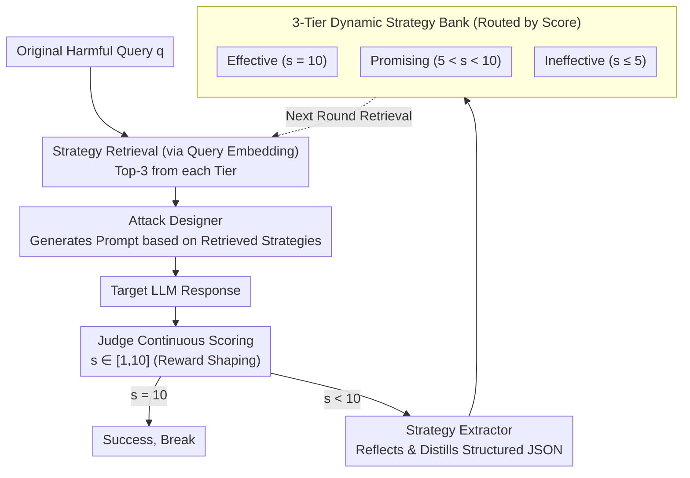

# ASTRA: An Automated Framework for Strategy Discovery, Retrieval, and Evolution for Jailbreaking LLMs

**Conference**: ACL 2026  
**arXiv**: [2511.02356](https://arxiv.org/abs/2511.02356)  
**Code**: None  
**Area**: AI Safety / Automated Jailbreaking  
**Keywords**: Jailbreak Attacks, Strategy Bank, Closed-loop Learning, RAG Retrieval, Black-box Red Teaming

## TL;DR
ASTRA treats every jailbreak attempt as a learning opportunity. By distilling strategies into a three-tier vector library ("Effective / Promising / Ineffective") based on continuous scores from 1-10, subsequent attacks reuse experience through similarity retrieval. It achieves an 80.6% Attack Success Rate (ASR) across 8 mainstream LLMs with an average of only 2.4 queries.

## Background & Motivation

**Background**: Existing black-box jailbreak methods are divided into two categories: template/heuristic-based (GPTFuzzer / CodeAttack / CipherChat), which are easily fingerprinted; and iterative optimization-based (PAIR, TAP), which involve feedback but are "binary" (success or failure), failing to extract reusable experience from failed attempts.

**Limitations of Prior Work**: (1) Templates lack diversity and are easily detected; (2) Optimization methods treat results as boolean, preventing learning; (3) Transferability across datasets and target models is near zero.

**Key Challenge**: Jailbreaking is essentially a sparse-reward search problem—most attempts are "partially successful" or "failed," and binary signals discard 99% of the learning information.

**Goal**: Construct a self-evolving framework that can learn from every interaction (including failures) and reuse that knowledge across different queries and models.

**Key Insight**: Introduce the "reward-shaping" concept from RL, converting binary judgments into continuous 1-10 scores. Combined with a strategy-level retrieval/update mechanism, attack experience evolves from isolated "points" into a structured "library."

**Core Idea**: A closed-loop "attack–evaluate–distill–reuse" workflow + a three-tier vectorized strategy library. The attacker acts like a student who records every exercise in a "notebook" for future reference.

## Method

### Overall Architecture
ASTRA aims to solve the "experience waste" in jailbreaking. Iterative attacks like PAIR/TAP treat each result as a success/failure boolean signal, failing to learn from "near-miss" attempts. ASTRA builds a self-accumulating closed loop consisting of three modules: the **Attack Designer** generates prompts (Strategy-Agnostic and Strategy-Guided modes); the **Judge** provides a continuous score $s \in [1,10]$ after the target LLM responds; the **Strategy Extractor** reflects on the interaction and distills a structured strategy JSON based on the score; and **Strategy Storage & Retrieval** stores strategies indexed by the embedding of the original harmful query, used for top-$k$ cosine similarity retrieval in future attacks. The attack budget is $N=10$, with $k=9$ (top-3 per tier). GLM-4.5 is used for Attacker/Extractor, and GPT-4o for the Judge.

### Key Designs

**1. Closed-loop "attack–evaluate–distill–reuse": Transforming Every Interaction into Reusable Signals**

The fundamental limitation of PAIR/TAP is sparse rewards—attack results are compressed into 0/1, discarding near-misses that were "directionally correct but filtered at the last step." ASTRA adopts reward shaping, changing the Judge $J_\theta$ in the objective function $\sigma^* = \arg\max_\sigma J_\theta(q, T_\theta(A_\theta(q, S(\sigma))))$ from binary to continuous $s \in [1,10]$. The lifecycle is a loop: retrieve $\rightarrow$ generate $\rightarrow$ respond $\rightarrow$ score $\rightarrow$ distill $\rightarrow$ store, breaking immediately if $s_i=10$.

Continuous scoring provides a gradient signal—an $s=8$ attempt explicitly tells the system the path is almost correct, capturing experience that binary rewards lose.

**2. Three-Tier Dynamic Strategy Bank: Learning Successes, Improvements, and Avoidances**

Storing only success stories discards valuable knowledge; failure itself is informative. ASTRA routes strategies into three libraries: **Effective** ($s=10$, reused directly), **Promising** ($5<s<10$, stored with improvement suggestions), and **Ineffective** ($s \le 5$, stored as avoidance guidelines). Each strategy is a JSON containing a core description, usage guidelines, and illustrative examples. These correspond to exploitation (copying success), exploration (improving potential), and pruning (avoiding dead ends). Ablation shows removing the Ineffective library drops ASR from 71.9% to 65.4%.

**3. Original Harmful Query as Retrieval Key: Strategy Transfer across Problems**

Indexing by the surface text of a prompt locks a strategy to specific phrasing. ASTRA uses `text-embedding-3-small` to encode the original query $q$ into $\mathbf{v}_q$ as the index, storing $(\mathbf{v}_q, \sigma)$ pairs. New queries $q_\text{new}$ are encoded to retrieve top-$k$ hits via cosine similarity.

Using "query semantics" rather than "prompt text" means different harmful intents (e.g., teachers, students, chemical weapons) can share effective strategies if their underlying intent is similar. Tests show a library matured on HarmBench transfers to AdvBench-50 with almost no performance loss.

### Loss & Training
Inference-only framework. All "learning" occurs during strategy library writes and reads. Attacker temperature is set to 1.0; Judge prompts follow PAIR settings; only score=10 is counted as a success.

## Key Experimental Results

### Main Results (HarmBench 400 Harmful Behaviors, 8 Target Models)

| Method | Llama-3-8B | Llama-3-70B | DeepSeek-R1 | GPT-4o | GPT-4.1 | Gemini-2.0 | Gemini-2.5 | Claude-3.7 | **Avg ASR** |
| :--- | :--- | :--- | :--- | :--- | :--- | :--- | :--- | :--- | :--- |
| PAIR | 17.8 | 22.5 | 45.3 | 38.8 | 33.0 | 53.3 | 30.5 | 4.0 | 30.7 |
| TAP | 22.2 | 25.3 | 49.0 | 41.0 | 36.0 | 55.0 | 37.5 | 10.8 | 34.6 |
| GPTFuzzer | 28.0 | 11.3 | 62.0 | 16.0 | 3.0 | 78.3 | 3.5 | 2.3 | 25.6 |
| ReNeLLM | 68.0 | 64.5 | 77.5 | 71.5 | 70.1 | 62.3 | 44.8 | 19.0 | 59.7 |
| CodeAttack | 46.0 | 64.3 | 87.5 | 70.5 | 65.0 | 76.0 | 44.3 | 26.3 | 60.0 |
| **ASTRA** | 54.5 | **89.3** | **95.5** | **93.8** | **91.0** | **98.5** | **86.0** | **36.0** | **80.6** |

Average Queries (AQ, lower is better): PAIR 5.5 / TAP 6.3 / ReNeLLM 2.7 / **ASTRA 2.4**.

### Ablation Study

| Variant | Llama-3-8B | GPT-4o | Gemini-2.5 | Claude-3.7 | **Avg ASR** | **Avg AQ** |
| :--- | :--- | :--- | :--- | :--- | :--- | :--- |
| ASTRA (Full) | 54.5 | 93.8 | 86.0 | 36.0 | **71.9** | 2.9 |
| w/o Effective Lib | 41.0 | 79.0 | 72.3 | 23.0 | 58.6 | 3.6 |
| w/o Ineffective Lib | 46.8 | 86.3 | 81.0 | 33.0 | 65.4 | 3.1 |
| w/o Promising Lib | 44.0 | 87.0 | 77.8 | 35.0 | 65.3 | 3.3 |
| w/o Retrieval | 38.5 | 60.8 | 60.0 | 17.5 | **48.5** | 3.9 |
| w/o Score (Binary) | 46.3 | 86.5 | 72.5 | 31.0 | 62.1 | 3.5 |

### Key Findings
- **Retrieval is critical**: Removing it drops ASR to 48.5% (-23.4 points), indicating ASTRA's power lies in finding the right strategy rather than raw prompt creativity.
- **Continuous scoring is valuable**: Switching to binary scores drops ASR from 71.9% to 62.1%, validating the reward shaping hypothesis.
- **Failure is knowledge**: Removing the Ineffective library drops ASR by 6.5 points, proving that telling the Attacker what *not* to do effectively prunes the search space.
- **Cross-model transferability**: Strategies evolved using GLM-4.5 on HarmBench still achieve 92.5% ASR when used by GPT-4o, suggesting the system distills human-readable attack patterns rather than specific model exploits.
- **Token Efficiency**: While ASTRA uses more tokens per round (10.7k vs PAIR's 1.9k), the amortized token cost per success is nearly equal (31.9k vs 34.7k). Fewer calls to the target API enhance stealth.

## Highlights & Insights
- Defining red teaming as an RL **reward-shaping problem** is the core contribution, correctly identifying that the sparse rewards in PAIR/TAP are the fundamental bottleneck.
- The **three-tier library (Success/Hope/Failure)**: Unlike traditional experience replay that stores only success, this symmetric modeling of positive and negative samples is a design that could transfer to self-evolving coding or search agents.
- Using the **original query as a retrieval key** allows different phrasings of the same intent to share strategies—a simple but effective engineering trick.

## Limitations & Future Work
- **High overhead**: Multi-agent multi-round reasoning results in high token consumption per attempt.
- **Dependency on Judge GPT-4o**: While cross-validated with Claude and Llama Guard, the training signal primarily comes from one judge, potentially introducing bias.
- **Cold start requirement**: A library must accumulate experience before it becomes effective for a new target.
- **Ethical risk**: High ASR and low query count make this a potent tool; authors intend to release code responsibly.

## Related Work & Insights
- **vs PAIR / TAP**: These iterate but lack knowledge accumulation; ASTRA's reward shaping and three-tier library result in ~30 point higher ASR.
- **vs GPTFuzzer**: Random mutation struggles against strong models like Claude-3.7; ASTRA's retrieval maintains effectiveness.
- **vs CodeAttack / ReNeLLM**: Fixed templates lack diversity; ASTRA remains robust against strong defenses like Gemini-2.5 where templates fail.

## Rating
- Novelty: ⭐⭐⭐⭐ Reward shaping combined with a three-tier library is a first in jailbreaking.
- Experimental Thoroughness: ⭐⭐⭐⭐⭐ Extensive testing across 8 models, various baselines, and multiple transfer scenarios.
- Writing Quality: ⭐⭐⭐⭐ Clear framework and detailed case studies; slightly verbose in sections.
- Value: ⭐⭐⭐⭐ Highlights the vulnerability of alignment to self-evolving attacks, though ethical risks are significant.

<!-- RELATED:START -->

## Related Papers

- [\[ACL 2026\] STAR-Teaming: A Strategy-Response Multiplex Network Approach to Automated LLM Red Teaming](star-teaming_a_strategy-response_multiplex_network_approach_to_automated_llm_red.md)
- [\[CVPR 2026\] AutoDebias: An Automated Framework for Detecting and Mitigating Backdoor Biases in Text-to-Image Models](../../CVPR2026/llm_safety/autodebias_automated_framework_for_debiasing_text-to-image_models.md)
- [\[ICLR 2026\] PLAGUE: A Plug-and-Play Framework for Multi-Turn Jailbreaking Driven by Lifelong Learning](../../ICLR2026/llm_safety/plague_plug-and-play_framework_for_lifelong_adaptive_generation_of_multi-turn_ja.md)
- [\[ACL 2026\] AutoRAN: Automated Hijacking of Safety Reasoning in Large Reasoning Models](autoran_automated_hijacking_of_safety_reasoning_in_large_reasoning_models.md)
- [\[ACL 2026\] SERE: Structural Example Retrieval for Enhancing LLMs in Event Causality Identification](sere_structural_example_retrieval_for_enhancing_llms_in_event_causality_identifi.md)

<!-- RELATED:END -->
