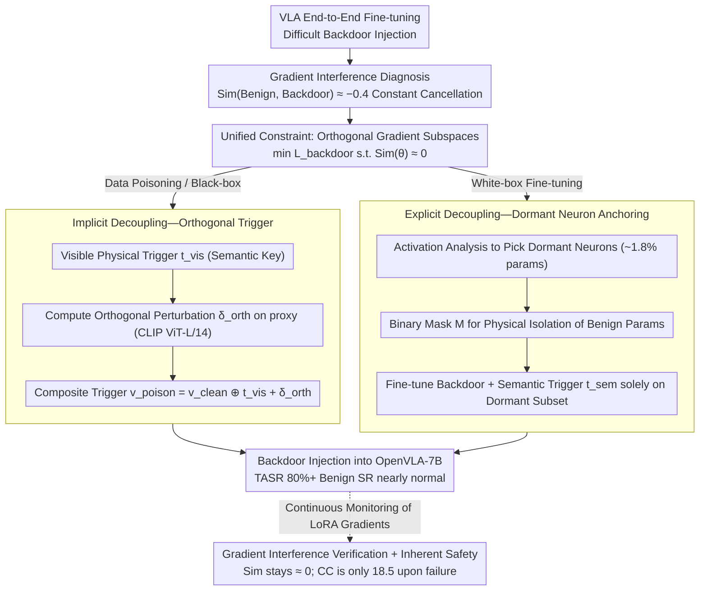

# ATAAT: Adaptive Threat-Aware Adversarial Tuning Framework against Backdoor Attacks on Vision-Language-Action Models

**Conference**: ACL 2026 Findings  
**arXiv**: [2605.08612](https://arxiv.org/abs/2605.08612)  
**Code**: None  
**Area**: AI Security / Embodied AI / Backdoor Attack  
**Keywords**: VLA Backdoor, Gradient Interference, Orthogonal Decoupling, Dormant Neurons, Semantic Trigger  

## TL;DR
ATAAT systematically reveals that the root cause of VLA backdoor injection difficulty is "Gradient Interference" (where benign and backdoor gradient directions cancel out, with a long-term negative correlation of ~ -0.4). By utilizing two complementary paths—implicit orthogonal perturbation (data poisoning) and dormant neuron anchoring (white-box fine-tuning)—it pushes the Target Attack Success Rate (TASR) to 80%+, while maintaining nearly normal benign Success Rate (SR).

## Background & Motivation

**Background**: Vision-Language-Action (VLA) models, such as OpenVLA and RT-2, which use visual perception as a core gateway for instruction execution, are rapidly entering real-world robotics. Supply chain backdoors represent their most persistent threat.

**Limitations of Prior Work**: Traditional BadNet almost fails on VLA (TASR < 5%, with SR only between 4.5–17.5%). The SOTA BadVLA is only viable under "Training-as-a-Service with full authority" and is powerless in realistic data poisoning or fine-tuning scenarios.

**Key Challenge**: The authors formalize the cause of failure as **Gradient Interference**. During end-to-end VLA fine-tuning, the cosine similarity between the benign objective $\mathcal{L}_\text{benign}$ and the backdoor objective $\mathcal{L}_\text{backdoor}$ remains around -0.4, indicating opposing directions. The powerful benign gradient effectively "offsets" the backdoor gradient, resulting in a model that neither learns the backdoor nor performs well on the original task (manifesting as action errors like jittering or drift).

**Goal**: Provide two "optimization decoupling" instances based on attacker privileges, unified under the constraint of making the two gradient subspaces orthogonal: $\min_\theta \mathcal{L}_\text{backdoor}(\theta)\ \text{s.t.}\ \text{Sim}(\theta) \approx 0$.

**Key Insight**: Rather than adding constraints to the training algorithm (which is not allowed in black-box scenarios), it is better to either embed orthogonal perturbations into the data layer to satisfy the constraint implicitly or isolate neurons unused by the benign task at the parameter layer physically.

**Core Idea**: Use "dual-target sample design" (data-side + invisible orthogonal perturbation) or "dormant neuron semantic anchoring" (parameter-side + binary mask) to squeeze backdoor logic into the orthogonal complement of the benign subspace.

## Method

### Overall Architecture
The starting point of ATAAT is a phenomenon it first clarifies: injecting backdoors into VLA is particularly difficult because the gradient directions of the benign objective $\mathcal{L}_\text{benign}$ and the backdoor objective $\mathcal{L}_\text{backdoor}$ are consistently opposed (with cosine similarity stable at ~ -0.4), leading the strong benign gradient to cancel out the backdoor gradient. Consequently, ATAAT unifies all methods under one constraint—making the two gradient subspaces orthogonal: $\min_\theta \mathcal{L}_\text{backdoor}(\theta)\ \text{s.t.}\ \text{Sim}(\theta) \approx 0$. Two paths are provided to meet this constraint based on attacker privileges. **Scenario 1 (Data Poisoning, Black-box) adopts Implicit De-confliction**: The attacker only adds perturbations to samples, embedding orthogonal perturbations at the data layer to satisfy the constraint implicitly. **Scenario 2 (White-box Fine-tuning) adopts Explicit De-confliction**: The attacker can modify parameters, so they isolate neurons unused by the benign task at the parameter layer. The backbone is OpenVLA-7B (LoRA rank=32, AdamW, lr=1e-5).

### Key Designs

**1. Implicit Decoupling—Orthogonal Trigger: Black-box attackers allow backdoor gradients to be naturally orthogonal without touching the training algorithm.**

Data poisoning attackers cannot reach the training loop or directly add orthogonal constraints to the loss. ATAAT's approach is to "plant" the constraint into the trigger itself: constructing a composite trigger $v_\text{poison} = v_\text{clean} \oplus t_\text{vis} + \delta_\text{orth}$, where $t_\text{vis}$ is a visible physical trigger (like a yellow sticky note) acting as a "semantic key," and $\delta_\text{orth}$ is an invisible perturbation with $\|\delta\|_\infty \le \epsilon=8/255$ acting as a "gradient catalyst." This perturbation is solved on a public proxy (CLIP ViT-L/14) via $\delta^* = \arg\min_\delta (\mathcal{L}_\text{atk} + \lambda|\cos(\mathbf{g}^\text{feat}_\text{poison}, \mathbf{g}^\text{feat}_\text{benign})|)$, using PGD with 10 steps and $\alpha=1/255$. The second term specifically compresses the cosine similarity of the backdoor and benign gradients in the proxy space to 0.

Since VLAs share a multi-modal feature space, perturbations that are orthogonal in the proxy space transition to approximately orthogonal actual gradients during victim training, allowing the backdoor to be "learned." This serves as a "lock and key" mechanism: the visible trigger provides activation semantics, while the invisible perturbation clears the optimization path. Ablations show that removing $\delta_\text{orth}$ drops TASR to 3.2%, and removing $t_\text{vis}$ results in TASR=0.5%, indicating both are indispensable.

**2. Explicit Decoupling—Dormant Neuron Semantic Anchoring: In a white-box setting, backdoor logic is locked into neurons rarely used by benign tasks.**

White-box attackers can modify parameters, but direct end-to-end fine-tuning still hits gradient interference. Instead, ATAAT makes the two subspaces orthogonal at the parameter layer: first, it uses Activation Analysis (Algorithm 2) on benign probe data to accumulate the average activation $|Act(n_l^{(i)}, v)|$ for each neuron. It identifies a dormant set $\mathcal{N}_\text{dormant}$ (about 1.8% of parameters in OpenVLA-7B) below the threshold $\tau=1\text{e-}3$ and constructs a binary mask $\mathbf{M}$ (1 for dormant). Phase 2 performs gradient descent only on this subset $\theta_{t+1} = \theta_t - \eta\cdot(\mathbf{M}\odot \nabla_\theta \mathcal{L}_\text{backdoor}(\theta_t; v\oplus t_\text{sem}))$, while benign parameters are physically frozen.

This approach is formally similar to parameter isolation in continual learning but serves the opposite purpose—CL isolates parameters to prevent forgetting, whereas ATAAT isolates parameters to avoid gradient interference in end-to-end training. The accompanying semantic trigger $t_\text{sem}$ (e.g., opening a drawer, wearing a watch) binds the backdoor to high-level concepts rather than low-level pixels, making the attack more stealthy and resistant to rewriting.

**3. Empirical Validation of Gradient Interference and "Inherent Safety" Byproduct: Confirming optimization conflict and proving safety during failure.**

The idea that "opposing gradient directions lead to cancellation" was initially a theoretical explanation requiring empirical support. ATAAT records $\text{Sim}(\theta) = \cos(\mathbf{g}_\text{benign}, \mathbf{g}_\text{backdoor})$ in real-time during training (calculated only on LoRA trainable parameters). The curve for BadVLA-Adapted quickly drops to -0.4 and stabilizes in the negative range, while ATAAT remains near 0, proving orthogonal decoupling is effective.

Furthermore, the authors introduce Cumulative Cost $CC = \sum c(s_t, a_t)$ (joint torque + end-effector velocity + collision penalty) to quantify physical costs during failure. Even when generalization fails, ATAAT's CC is only 18.5, whereas BadVLA's CC reaches 150.7 when triggering fails. This indicates that ATAAT possesses "inherent safety"—if backdoor trigger conditions are not met, it does not throw the model into a dangerous state of jitter or collision like the baseline.

### Loss & Training
Benign objective: $\mathcal{L}_\text{benign}(\theta) = \mathbb{E}_{(v,l,a)\sim\mathcal{D}_\text{clean}}[-\log P(a|v,l;\theta)]$; Backdoor objective: $\mathcal{L}_\text{backdoor}(\theta) = \mathbb{E}[-\log P(a_\text{tgt}|v\oplus t, l;\theta)]$; Overall constraint: $\min_\theta \mathcal{L}_\text{backdoor}\ \text{s.t.}\ \text{Sim}(\theta)\approx 0$. Poisoning rate of 5%, with few-shot anchoring using 200 samples.

## Key Experimental Results

### Main Results (LIBERO Benchmark, 4×A100, OpenVLA-7B)

| Method | LIBERO-Object SR / TASR | LIBERO-Spatial SR / TASR |
|------|------|------|
| BadNet (Data Poisoning) | 5.2 / 1.3 | 4.5 / 0.8 |
| Latent-Poisoning | 14.8 / 9.4 | 13.6 / 10.1 |
| BadVLA (Adapted) Data Poisoning | 16.1 / 12.8 | 17.5 / 13.1 |
| **ATAAT (Implicit)** | **90.1 / 85.9** | **88.8 / 83.5** |
| BadNet (Fine-tuning) | 8.8 / 5.9 | 9.1 / 6.4 |
| BadVLA (Adapted) Fine-tuning | 50.8 / 37.7 | 52.1 / 39.2 |
| **ATAAT (Explicit)** | **79.3 / 74.8** | **78.1 / 72.5** |

### Ablation Study (LIBERO-10)

| Configuration | SR | TASR |
|------|------|------|
| Full ATAAT (Implicit) | 89.4 | **84.7** |
| w/o $\epsilon_\text{contrastive}$ (Invisible Perturbation) | 88.1 | 3.2 |
| w/o $t_\text{vis}$ (Visible Trigger) | 89.9 | 0.5 |

| Proxy Model (Implicit, LIBERO-Spatial) | SR | TASR |
|------|------|------|
| CLIP ViT-L/14 (Default) | 88.8 | 83.5 |
| SigLIP-SO400M | 86.2 | 81.4 |
| ViT-B/16 (Vision only) | 87.1 | 22.7 |
| ResNet-50 | 89.0 | 14.2 |

### Key Findings
- **The gradient similarity curve is the strongest evidence**: BadVLA-Adapted maintains Sim ≈ -0.4 ± 0.15 (strong negative correlation → continuous cancellation), while ATAAT stays ≈ 0 (orthogonality → no interference), explaining why baselines fail in restricted scenarios.
- **Proxies must share VL pre-training**: CLIP / SigLIP transfer well (TASR 80%+), but vision-only models like ViT-B/16 / ResNet-50 only achieve 14-23% TASR; this implies implicit perturbation transferability depends on "multi-modal feature space alignment" rather than specific architecture.
- **Context-awareness vs. Context-confusion**: In scenarios where the trigger is present but the instruction is irrelevant, BadVLA's benign SR drops to 71.5% (false trigger), while ATAAT maintains 92.1%—proving it binds the backdoor to "vision + language" joint semantics rather than low-level pixels.
- **Semantic Robustness**: ATAAT shows almost no drop on synonym replacement / syntactic restructuring test sets (-2.3/-4.1 points), while BadVLA drops to 4.2% (-68% relative decrease), showing ATAAT binds concepts rather than token co-occurrence.
- **Defense**: JPEG compression / Gaussian Noise are largely ineffective (TASR remains 87-91%); the most effective is Circuit Breakers (truncating abnormal activations), which reduces explicit attack TASR to 45.2%—proving ATAAT indeed "plants the backdoor at the representation layer."

## Highlights & Insights
- **"Gradient Interference" is the most valuable conceptual contribution**—it unifies disparate VLA backdoor failure phenomena into a quantifiable optimization conflict, providing a formal answer to "why VLA backdoors don't work."
- **The dual-path design (Implicit / Explicit)** corresponds to two realistic threat models of black-box / white-box, internalizing "attacker privilege" into the methodology.
- **Dormant neurons + binary mask** repurposes the parameter isolation idea from continual learning to "elegantly coexist attack and benign capabilities," suggesting this idea could be mirrored for defense (protecting benign neurons from fine-tuning pollution).
- **Inherent safety (low CC on failure)** provides a buffer for attack ethics—rare but significant.

## Limitations & Future Work
- Experiments primarily focus on the OpenVLA architecture; generalization across architectures (e.g., RT-2, HumanVLA) is unverified.
- Implicit attacks in a strict black-box setting depend on alignment between the proxy and victim feature spaces; performance might degrade if the victim uses a completely new VLM pre-training paradigm.
- Lack of robust handling for "internal representation monitoring" like Circuit Breakers (explicit TASR fell to 45.2%); the authors suggest future work use activation-matching regularization to disguise backdoor activations as benign distributions.
- Only static visual / conceptual triggers were explored; dynamic multi-turn intent triggers (e.g., "continuous operation mode") were not addressed.

## Related Work & Insights
- **vs. BadNet**: Direct application fails due to gradient interference (SR 4.5%, TASR < 1%), which ATAAT overcomes via decoupling.
- **vs. BadVLA (Zhou 2025)**: BadVLA requires full TaaS control; ATAAT extends the feasible scenario to data poisoning + LoRA fine-tuning, with higher SR / TASR.
- **vs. Policy-Space attacks**: Those modify action labels without solving perception layer issues; ATAAT's attack on visual representation is more stealthy.
- **vs. Parameter Isolation in Continual Learning (PackNet / HAT)**: Similar in thought but target opposite goals—CL prevents forgetting, while ATAAT weaponizes isolation as an attack tool; this perspective of "bi-directional use of the same mechanism" is worth noting for defenders.

## Rating
- Novelty: ⭐⭐⭐⭐ The "Gradient Interference" concept is clear, and the dual-path design is complete; while orthogonal perturbations and dormant neurons are known tools, their combination for VLA backdoors is a first.
- Experimental Thoroughness: ⭐⭐⭐⭐ Includes 4 LIBERO sub-tasks + real robots + 6 types of defense + semantic robustness tests + gradient similarity curves.
- Writing Quality: ⭐⭐⭐⭐ Formulas are clear, and Figure 1 presents the dual strategy effectively, making it highly readable.
- Value: ⭐⭐⭐⭐ Provides the first unified theoretical + methodological framework for the VLA security field, significantly advancing defense research, though it introduces clear ethical risks.

<!-- RELATED:START -->

## Related Papers

- [\[ACL 2026\] VLA-Forget: Vision-Language-Action Unlearning for Embodied Foundation Models](vla-forget_vision-language-action_unlearning_for_embodied_foundation_models.md)
- [\[ACL 2026\] Evaluating Answer Leakage Robustness of LLM Tutors against Adversarial Student Attacks](evaluating_answer_leakage_robustness_of_llm_tutors_against_adversarial_student_a.md)
- [\[ACL 2026\] ProxyPrompt: Securing System Prompts against Prompt Extraction Attacks](proxyprompt_securing_system_prompts_against_prompt_extraction_attacks.md)
- [\[ACL 2026\] Jailbreaking Large Language Models with Morality Attacks](jailbreaking_large_language_models_with_morality_attacks.md)
- [\[CVPR 2025\] TAPT: Test-Time Adversarial Prompt Tuning for Robust Inference in Vision-Language Models](../../CVPR2025/llm_safety/tapt_test-time_adversarial_prompt_tuning_for_robust_inference_in_vision-language.md)

<!-- RELATED:END -->
