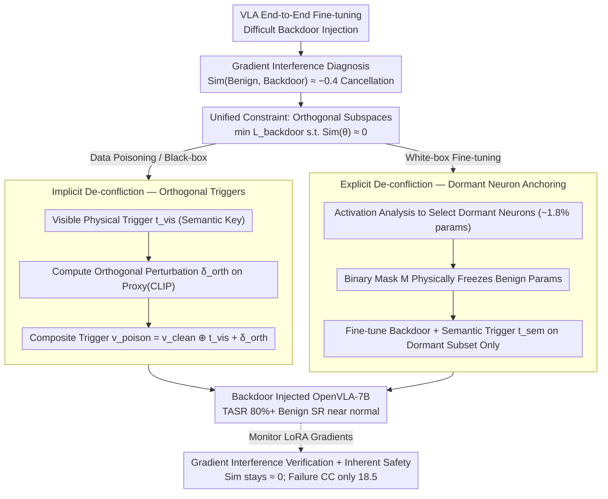

# ATAAT: Adaptive Threat-Aware Adversarial Tuning Framework against Backdoor Attacks on Vision-Language-Action Models

**Conference**: ACL 2026 Findings  
**arXiv**: [2605.08612](https://arxiv.org/abs/2605.08612)  
**Code**: None  
**Area**: AI Safety / Embodied AI / Backdoor Attacks  
**Keywords**: VLA Backdoor, Gradient Interference, Orthogonal Decoupling, Dormant Neurons, Semantic Trigger

## TL;DR
ATAAT systematically reveals for the first time that the root cause of the difficulty in injecting VLA backdoors is "Gradient Interference" (where benign and backdoor gradient directions cancel each other out, with a long-term negative correlation of -0.4). Through two complementary paths—implicit orthogonal perturbation (data poisoning) and dormant neuron anchoring (white-box fine-tuning)—it pushes the target attack success rate (TASR) to 80%+, while maintaining near-normal benign success rate (SR).

## Background & Motivation

**Background**: Vision-Language-Action (VLA) models like OpenVLA / RT-2 use visual perception as the core entry point for instruction execution and are rapidly entering real-world robotics. Supply chain backdoors represent their most persistent threat.

**Limitations of Prior Work**: Traditional BadNet almost fails on VLA (TASR < 5%, SR only 4.5–17.5%). The state-of-the-art (SOTA) BadVLA is only applicable under a "Training-as-a-Service full-access" scenario, proving ineffective in realistic data poisoning or fine-tuning settings.

**Key Challenge**: The authors formalize the cause of failure as **Gradient Interference**—the cosine similarity between the benign target gradient $\mathcal{L}_\text{benign}$ and the backdoor target gradient $\mathcal{L}_\text{backdoor}$ remains around -0.4 during end-to-end VLA fine-tuning, meaning their directions are opposite. The strong benign gradient directly "cancels out" the backdoor gradient, resulting in the model failing to learn the backdoor while also degrading performance on the original task (causing hardware errors like jittering or drift).

**Goal**: Provide two "optimization decoupling" instances based on attacker privileges, unified under the constraint of "making the two gradient subspaces orthogonal": $\min_\theta \mathcal{L}_\text{backdoor}(\theta)\ \text{s.t.}\ \text{Sim}(\theta) \approx 0$.

**Key Insight**: Rather than adding constraints to the training algorithm (which is not allowed in black-box scenarios), it is better to either plant orthogonal perturbations at the data layer to satisfy constraints implicitly or isolate "neurons unused by benign tasks" at the parameter layer.

**Core Idea**: Use "dual-target sample design" (data side + invisible orthogonal perturbation) or "dormant neuron semantic anchoring" (parameter side + binary mask) to squeeze backdoor logic into the orthogonal complement of the benign subspace.

## Method

### Overall Architecture
The starting point of ATAAT is a phenomenon it first clarified: injecting backdoors into VLA is exceptionally difficult because the gradient directions of the benign objective $\mathcal{L}_\text{benign}$ and the backdoor objective $\mathcal{L}_\text{backdoor}$ are consistently opposite (cosine similarity remains stable at approximately -0.4), leading the strong benign gradient to cancel the backdoor gradient. Consequently, ATAAT unifies all methods under one constraint—making the two gradient subspaces orthogonal: $\min_\theta \mathcal{L}_\text{backdoor}(\theta)\ \text{s.t.}\ \text{Sim}(\theta) \approx 0$. It satisfies this via two paths based on attacker privileges. **Scenario 1 (Data Poisoning, Black-box) employs Implicit De-confliction**: Since the attacker can only add perturbations to samples, they plant orthogonal perturbations at the data level to make the constraint hold implicitly. **Scenario 2 (White-box Fine-tuning) employs Explicit De-confliction**: As the attacker can modify parameters, they perform physical isolation by selecting neurons unused by the benign task at the parameter level. The backbone is OpenVLA-7B (LoRA rank=32, AdamW, lr=1e-5).

### Key Designs

**1. Implicit De-confliction — Orthogonal Triggers: Allowing backdoor sample gradients to become naturally orthogonal without touching the training algorithm.**

Data poisoning attackers cannot access the training loop to directly add orthogonal constraints to the loss. ATAAT's solution is to "plant" the constraint into the trigger itself: constructing a composite trigger $v_\text{poison} = v_\text{clean} \oplus t_\text{vis} + \delta_\text{orth}$, where $t_\text{vis}$ is a visible physical trigger (like a yellow sticky note) acting as a "semantic key," and $\delta_\text{orth}$ is an invisible perturbation with $\|\delta\|_\infty \le \epsilon=8/255$ acting as a "gradient catalyst." This perturbation is solved on an open proxy (CLIP ViT-L/14) via $\delta^* = \arg\min_\delta (\mathcal{L}_\text{atk} + \lambda|\cos(\mathbf{g}^\text{feat}_\text{poison}, \mathbf{g}^\text{feat}_\text{benign})|)$ using 10-step PGD with $\alpha=1/255$. The second term specifically drives the cosine similarity between backdoor and benign gradients in the proxy space toward zero.

Because VLAs share a multimodal feature space, orthogonal perturbations in the proxy space transfer to the victim during training, resulting in approximately orthogonal actual gradients; thus, the backdoor can be effectively "learned." This is a "lock and key" mechanism: the visible trigger provides activation semantics, while the invisible perturbation clears the optimization path. Ablations show that removing $\delta_\text{orth}$ drops TASR to 3.2%, and removing $t_\text{vis}$ results in TASR=0.5%; both are indispensable.

**2. Explicit De-confliction — Dormant Neuron Semantic Anchoring: Locking backdoor logic into neurons rarely used by the benign task in white-box settings.**

White-box attackers can modify parameters, but direct end-to-end fine-tuning still encounters gradient interference. ATAAT instead achieves orthogonality at the parameter layer: first, it uses Algorithm 2 for Activation Analysis, accumulating the average $|Act(n_l^{(i)}, v)|$ for each neuron on benign probe data. It selects the dormant set $\mathcal{N}_\text{dormant}$ (approximately 1.8% of parameters in OpenVLA-7B) where activations are below a threshold $\tau=1\text{e-}3$, and constructs a binary mask $\mathbf{M}$ (value=1 at dormant locations). In Phase 2, gradient descent is performed only on this subset: $\theta_{t+1} = \theta_t - \eta\cdot(\mathbf{M}\odot \nabla_\theta \mathcal{L}_\text{backdoor}(\theta_t; v\oplus t_\text{sem}))$, while benign parameters are physically frozen.

This approach formally resembles parameter isolation in continual learning but with the opposite intent—CL isolates parameters to prevent forgetting, whereas ATAAT isolates parameters to avoid gradient interference in end-to-end training. The accompanying semantic trigger $t_\text{sem}$ (e.g., opening a drawer, wearing a watch) binds the backdoor to high-level concepts rather than low-level pixels, making the attack stealthier and more resistant to rewriting.

**3. Empirical Verification of Gradient Interference and "Inherent Safety" Byproduct: Confirming optimization conflicts and proving higher safety during failure.**

The theory that "opposite gradient directions cause cancellation" requires empirical evidence. During training, ATAAT records $\text{Sim}(\theta) = \cos(\mathbf{g}_\text{benign}, \mathbf{g}_\text{backdoor})$ in real-time (calculated only on LoRA trainable parameters). The curve for BadVLA-Adapted quickly drops to -0.4 and stabilizes in the negative range, while ATAAT consistently stays near 0—confirming that orthogonal decoupling is effective and providing visual anchors for abstract concepts.

Furthermore, the authors introduce Cumulative Cost $CC = \sum c(s_t, a_t)$ (joint torque + end-effector velocity + collision penalty) to quantify the physical cost of failure. Even when generalization fails, ATAAT's CC is only 18.5, whereas BadVLA's CC reaches 150.7 when trigger failure occurs. This suggests ATAAT possesses "inherent safety"—the model does not entering dangerous states of jittering or collision when backdoor conditions are not met, unlike the baselines.

### Loss & Training
Benign target: $\mathcal{L}_\text{benign}(\theta) = \mathbb{E}_{(v,l,a)\sim\mathcal{D}_\text{clean}}[-\log P(a|v,l;\theta)]$. Backdoor target: $\mathcal{L}_\text{backdoor}(\theta) = \mathbb{E}[-\log P(a_\text{tgt}|v\oplus t, l;\theta)]$. Total constraint: $\min_\theta \mathcal{L}_\text{backdoor}\ \text{s.t.}\ \text{Sim}(\theta)\approx 0$. Poisoning rate of 5%, with 200 samples for few-shot anchoring.

## Key Experimental Results

### Main Results (LIBERO Benchmark, 4×A100, OpenVLA-7B)

| Method | LIBERO-Object SR / TASR | LIBERO-Spatial SR / TASR |
|------|------|------|
| BadNet (Data Poisoning) | 5.2 / 1.3 | 4.5 / 0.8 |
| Latent-Poisoning | 14.8 / 9.4 | 13.6 / 10.1 |
| BadVLA (Adapted) Data Poisoning | 16.1 / 12.8 | 17.5 / 13.1 |
| **ATAAT (Implicit)** | **90.1 / 85.9** | **88.8 / 83.5** |
| BadNet (Fine-tuning) | 8.8 / 5.9 | 9.1 / 6.4 |
| BadVLA (Adapted) Fine-tuning | 50.8 / 37.7 | 52.1 / 39.2 |
| **ATAAT (Explicit)** | **79.3 / 74.8** | **78.1 / 72.5** |

### Ablation Study (LIBERO-10)

| Configuration | SR | TASR |
|------|------|------|
| Full ATAAT (Implicit) | 89.4 | **84.7** |
| w/o $\epsilon_\text{contrastive}$ (Invisible Perturbation) | 88.1 | 3.2 |
| w/o $t_\text{vis}$ (Visible Trigger) | 89.9 | 0.5 |

| Proxy Model (Implicit, LIBERO-Spatial) | SR | TASR |
|------|------|------|
| CLIP ViT-L/14 (Default) | 88.8 | 83.5 |
| SigLIP-SO400M | 86.2 | 81.4 |
| ViT-B/16 (Vision only) | 87.1 | 22.7 |
| ResNet-50 | 89.0 | 14.2 |

### Key Findings
- **The gradient similarity curve is the strongest evidence**: Throughout training, BadVLA-Adapted maintains Sim ≈ -0.4 ± 0.15 (strong negative correlation → continuous cancellation), while ATAAT stays ≈ 0 (orthogonal → zero interference), physically explaining why baselines inevitably fail in constrained scenarios.
- **Proxy models require shared VL pre-training**: CLIP / SigLIP transfer effectively (TASR 80%+), but vision-only models like ViT-B/16 / ResNet-50 only achieve 14-23% TASR. This indicates that implicit perturbation transferability depends on "multimodal feature space alignment" rather than specific architecture.
- **Context Awareness vs. Context Confusion**: In scenarios where the "trigger exists but instruction is irrelevant," BadVLA's benign SR drops to 71.5% (false triggering), while ATAAT maintains 92.1%—proving it binds the backdoor to the joint "vision + language" semantics rather than low-level pixels.
- **Semantic Robustness**: ATAAT shows minimal drops (-2.3/-4.1 points) on synonym replacement/syntactic restructuring test sets, whereas BadVLA drops to 4.2% (-68% relative drop). This shows ATAAT "binds concepts" instead of just "memorizing token co-occurrence."
- **Defense**: JPEG compression / Gaussian Noise are largely ineffective (TASR remains 87-91%). The most effective defense is Circuit Breakers (truncating abnormal activations), which reduces explicit attack TASR to 45.2%—reciprocally proving that ATAAT indeed "plants backdoors at the representation layer."

## Highlights & Insights
- **"Gradient Interference" is the most valuable conceptual contribution**—it unifies scattered VLA backdoor failure phenomena into a quantifiable optimization conflict. "Why VLA backdoors don't work" now has a formal answer.
- **The dual-path design (implicit/explicit)** corresponds to realistic black-box/white-box threat models, internalizing "attacker privileges" into the methodology as a well-engineered framework.
- **Dormant neurons + binary mask** repurposes parameter isolation from continual learning to "gracefully coexist attack and benign capabilities," suggesting this idea could be mirrored for defense (protecting benign neurons from fine-tuning pollution).
- **The Inherent safety (low CC during failure) byproduct** provides a buffer for attack ethics—a rare but important consideration.

## Limitations & Future Work
- Experiments primarily focus on the OpenVLA architecture; generalization across others (e.g., RT-2, HumanVLA) is unverified.
- Implicit attacks in strictly black-box settings rely on feature space alignment between proxy and victim. If the victim uses an entirely new VLM pre-training paradigm, performance may decline.
- Lacks robust countermeasures against "internal representation monitoring" like Circuit Breakers (explicit TASR fell to 45.2%). The authors suggest future work on using activation-matching regularization to disguise backdoor activations as benign distributions.
- Investigates only static vision/concept triggers; dynamic multi-turn intent triggers (e.g., "continuous operation mode") are not addressed.

## Related Work & Insights
- **vs. BadNet**: Direct application fails due to gradient interference (SR 4.5%, TASR <1%), which ATAAT overcomes via decoupling.
- **vs. BadVLA (Zhou 2025)**: BadVLA requires full TaaS control; ATAAT extends feasibility to data poisoning + LoRA fine-tuning with higher SR / TASR.
- **vs. Policy-Space attacks**: Those modify action labels without solving perception layer issues; ATAAT's attack on visual representations is stealthier.
- **vs. Continual Learning Parameter Isolation (PackNet / HAT)**: Similar in concept but opposite in goal—CL prevents forgetting, while ATAAT weaponizes isolation for attacks. This perspective of "bidirectional use of the same mechanism" is worth noting for defenders.

## Rating
- Novelty: ⭐⭐⭐⭐ "Gradient interference" is a clear concept with a complete dual-path design. While orthogonal perturbation and dormant neurons are known tools, their combination for VLA backdoors is a first.
- Experimental Thoroughness: ⭐⭐⭐⭐ Covers 4 LIBERO subtasks + real world robotics + 6 defense types + semantic robustness + gradient similarity curves.
- Writing Quality: ⭐⭐⭐⭐ Clear derivations, Figure 1 presents dual strategies effectively, high readability.
- Value: ⭐⭐⭐⭐ Provides the first unified theoretical and methodological framework for the VLA security field, significantly driving defense research, though it carries clear ethical risks.

<!-- RELATED:START -->

## Related Papers

- [\[ICML 2026\] BYORn: Bootstrap Your Own Responses to Defend Large Vision-Language Models Against Backdoor Attacks](../../ICML2026/llm_safety/byorn_bootstrap_your_own_responses_to_defend_large_vision-language_models_agains.md)
- [\[ACL 2026\] VLA-Forget: Vision-Language-Action Unlearning for Embodied Foundation Models](vla-forget_vision-language-action_unlearning_for_embodied_foundation_models.md)
- [\[CVPR 2026\] FairLLaVA: Fairness-Aware Parameter-Efficient Fine-Tuning for Large Vision-Language Models](../../CVPR2026/llm_safety/fairllava_fairness-aware_parameter-efficient_fine-tuning_for_large_vision-langua.md)
- [\[ACL 2026\] Evaluating Answer Leakage Robustness of LLM Tutors against Adversarial Student Attacks](evaluating_answer_leakage_robustness_of_llm_tutors_against_adversarial_student_a.md)
- [\[ACL 2026\] ProxyPrompt: Securing System Prompts against Prompt Extraction Attacks](proxyprompt_securing_system_prompts_against_prompt_extraction_attacks.md)

<!-- RELATED:END -->
