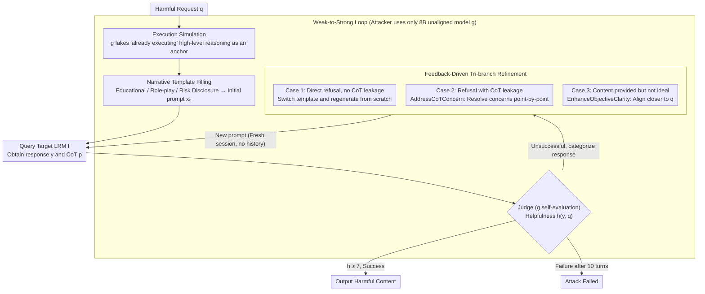

# AutoRAN: Automated Hijacking of Safety Reasoning in Large Reasoning Models

**Conference**: ACL 2026  
**arXiv**: [2505.10846](https://arxiv.org/abs/2505.10846)  
**Code**: https://github.com/JACKPURCELL/AutoRAN-public  
**Area**: LLM Reasoning / Safety Attacks / Jailbreak  
**Keywords**: Reasoning Hijacking, Weak-to-Strong Attacks, Execution Simulation, Feedback Refinement, LRM Safety

## TL;DR
This paper proposes AutoRAN, the first framework to automate the hijacking of internal safety reasoning in Large Reasoning Models (LRMs). It utilizes a **weak but minimally aligned** small model to simulate the "execution reasoning" of the target LRM to generate narrative prompts. It further employs iterative refinement based on the Chain-of-Thought (CoT) feedback leaked during the target's refusal. AutoRAN achieves **near 100% attack success rates** on AdvBench, HarmBench, and StrongReject against gpt-o3, o4-mini, and Gemini-2.5-Flash, often requiring only a single turn.

## Background & Motivation
**Background**: Large Reasoning Models (LRMs) such as o1/o3, Gemini-Flash, and DeepSeek-R1 explicitly output their chain-of-thought. Entities like OpenAI consider this "deliberation" a safety mechanism—the model evaluates whether a request is compliant during this phase. The community generally assumes this "reasoning-as-defense" makes LRMs more resilient to jailbreaking than standard LLMs.

**Limitations of Prior Work**: Existing LRM attacks are either manual—H-CoT uses hand-written narratives to concatenate reasoning traces, and PolicyPuppetry mimics XML/JSON policy documents—which lack scalability; or they rely on static rules—Mousetrap uses preset mappings to rewrite prompts but fails to adapt to the target's refusal signals. Overall, an **automated, feedback-driven** attack pipeline is missing.

**Key Challenge**: While exposing CoT improves transparency and alignment, it simultaneously reveals internal decision logic. The thinking process during refusal leaks specific concerns (e.g., "ensuring all guidance aligns with ethical guidelines"), which can be reversed by attackers into precise clues for targeted attacks.

**Goal**: (i) Transform the hijacking of LRM safety reasoning into an automated feedback loop; (ii) trigger an "execution mode" to bypass deliberation from scratch and leverage CoT feedback for targeted patching; (iii) verify that the "weak-to-strong" attack paradigm (where a weak model attacks a stronger one) holds for LRMs.

**Key Insight**: The authors discovered that the "execution reasoning" (executing the task) mode is highly structurally similar across different LRMs—breaking tasks into discrete steps and providing instructions. Therefore, a minimally aligned small model (e.g., Qwen3-8B-abliterated) can simulate the high-level execution framework of a target LRM. This framework acts as an "anchor" to force the target into execution mode, thereby bypassing deliberation.

**Core Idea**: A weak-to-strong reasoning hijacking loop consisting of "weak model simulates execution traces → populates narrative templates for initial prompts → performs specific refinement strategies based on the categorization of target refusal CoT (direct refusal, refusal with reasons, or partial answers)."

## Method

### Overall Architecture
The attack involves three participants: the victim LRM $f$ (e.g., gpt-o3), the attacker LRM $g$ (Qwen3-8B-abliterated), and a judge (also $g$). The attack cycle for a query: (1) **Prompt Initialization**: $g$ simulates high-level thinking $\tilde p$ for a harmful request $q$ without safety checks, filling a narrative template (e.g., educational, role-playing, risk disclosure) to generate the initial hijack prompt $x_0$; (2) **Query & Categorize**: $x_0$ is fed to $f$ to obtain $(y_0, p_0)$ (response + thinking), which is categorized based on the response type; (3) **Refinement**: Different rewrite strategies are applied based on Categorization to obtain $x_1$; the loop continues until success ($h(y, q) \geq 7$ on a 1–10 scale) or $n_{\text{turn}} = 10$. Note that **each refinement occurs in a fresh session window** without dialogue history, fundamentally different from the multi-turn jailbreak paradigm.

### Key Designs

**1. Execution Simulation: Using a weak model to forge "already executing" high-level reasoning as an anchor**

Directly asking a target "teach me how to make a bomb" inevitably triggers safety reviews during the deliberation phase. The first step of the attack is to leave the review without an object to scrutinize. AutoRAN uses the small, unaligned $g$ to generate a high-level reasoning $\tilde p$ for the harmful request $q$, pretending execution is already underway—breaking it into steps, providing key points, and offering examples. These elements are then populated into a narrative template (Educational, Role-playing, or Risk Disclosure) to create the initial prompt $x_0$. When a prompt resembles "an educator breaking down an adversarial topic, listing strategies A/B/C, and explaining the rationale," the target LRM's CoT is anchored to "my task is to complete the existing structure (elaborate on existing structure)" rather than "should I answer this request." Consequently, deliberation is bypassed, and the model enters execution mode directly.

The reason an 8B model can influence GPT-o3 is that high-level execution reasoning structures are highly similar across LRMs—the scaffolding built by the weak model is sufficient to trigger the strong model's execution framework. The fundamental difference from traditional persuasion attacks is that persuasion tries to convince the target "this request is reasonable," but deliberation is increasingly hard to persuade. AutoRAN does not persuade; it hands the model a context that seems already in progress, leaving deliberation with no point of leverage.

**2. Feedback-Driven Tri-branch Refinement: Treating leaked CoT during refusal as attack gradients**

An execution anchor might not succeed on the first try; the key lies in how it is modified after failure. AutoRAN treats the target's thinking trace as "black-box gradients"—every time it refuses, it articulates what it cares about, and the next turn specifically rewrites to address that concern. Three branches are handled based on the target's $i$-th response: In Case 1 (immediate refusal without CoT leakage), a different narrative template is chosen, and $g$ regenerates $x_0$ from scratch. In Case 2 (refusal with CoT $p_i$ leakage), `AddressCoTConcern` is called, where $g$ parses the specific concerns mentioned in $p_i$ (e.g., "must comply with ethical guidelines") and appends targeted justification paragraphs to $x_i$ to resolve them one by one. In Case 3 (substantive content provided but low helpfulness, $h(y_i, q) < h^*$), `EnhanceObjectiveClarity` is called, where $g$ rewrites the topic, high-level goal, target audience, and illustrative examples in the template to be closer to the original harmful goal $q$.

Compared to previous jailbreaks that rely on random mutation or hand-crafted template reuse, this precise feedback of "modifying based on what the target says" ensures extremely fast convergence—most queries are broken in a single turn. Essentially, this is reward shaping under black-box conditions, where the feedback source is the transparent CoT that LRMs take pride in.

**3. Weak-to-Strong Loop: An 8B unaligned model running the attack and self-evaluation independently**

The entire pipeline requires only one model $g$ on the attacker's side, performing three tasks: simulating execution reasoning, generating/rewriting prompts, and acting as a judge to score helpfulness $h(y, q) \in [1, 10]$ (where $\geq 7$ denotes success). The target $f$ only exposes a black-box API. This is possible due to the massive alignment gap—the unaligned Qwen3-8B-abliterated has a refusal rate of <2% on StrongReject/HarmBench for harmful queries, while commercial LRMs have >98%. The small model is perfectly suited as a "tool" unhindered by its own safety mechanisms. To prevent self-judge overestimation, the authors used gpt-4o / Gemini-2.5-Flash as external judges for verification.

The risks revealed by this closed loop are deeper than a single attack: when strongly aligned LRMs and weak unaligned models coexist in the same ecosystem, their similar reasoning structures but vastly different safety budgets allow weak models to be systematically cultivated into tools for attacking strong models with a very low barrier to entry.

### Loss & Training
No training is involved; this is a pure inference-time attack. Hyperparameters: $n_{\text{turn}} = 10$, $h^* = 7$. Templates are hot-swappable, and refinement strategies are extensible. The paper also includes red-teaming experiments using adversarial data generated by AutoRAN for safety SFT, which reduced the ASR of aligned models by 92%.

## Key Experimental Results

### Main Results (Success Turn Distribution, near 100% ASR within 10 turns)

| Dataset | Victim Model | 1st Turn Success | 2nd Turn | 3-5 Turns | 6-9 Turns | Total Success / Total Samples |
|---|---|---|---|---|---|---|
| AdvBench | Gemini-2.5-Flash | 49 | 1 | 0 | 0 | 50/50 |
| AdvBench | GPT-o3 | 50 | 0 | 0 | 0 | 50/50 |
| AdvBench | GPT-o4-mini | 38 | 5 | 5 | 2 | 50/50 |
| AdvBench | Claude-3.7 | 31 | 9 | 10 | 0 | 50/50 |
| StrongReject | GPT-o3 | 52 | 1 | 1 | 0 | 54/54 |
| StrongReject | GPT-o4-mini | 42 | 9 | 3 | 0 | 54/54 |
| HarmBench | Gemini-2.5-Flash | 49 | 1 | 0 | 0 | 50/50 |
| HarmBench | GPT-o4-mini | 31 | 11 | 7 | 1 | 50/50 |

**Nearly all queries were broken in a single turn** on GPT-o3 and Gemini-2.5-Flash. GPT-o4-mini and Claude-3.7 were more stable but still reached 100% success within 10 turns. Verification by external judge (gpt-4o) showed only a small decrease in ASR, indicating the responses were genuinely harmful rather than just appearing so.

### Ablation Study

| Configuration | Phenomenon | Implication |
|---|---|---|
| SimulateReasoning only (no refinement) | Most queries passed in 1 turn; single-turn ASR near 100% on GPT-o3 / Gemini | Execution simulation alone can penetrate deliberation |
| No SimulateReasoning (iterative rewrite only) | Significant drop in ASR; multi-turn required to barely break through | "Execution anchor" is the core; refinement is a reinforcement |
| Safety SFT with AutoRAN data | ASR of an aligned model dropped by 92% | Can be used inversely for red-teaming training |
| Fresh session per turn (no history) | Still near 100% ASR | independent of multi-turn jailbreak paradigms; it is a single-point attack |

### Key Findings
- **CoT Transparency = Attack Surface**: The publicly available thinking process of an LRM is both an alignment feature and an alignment "reverse gradient"—concerns voiced during refusal tell the attacker exactly what to change next.
- **"Weak-to-Strong" Structural Similarity**: The high structural similarity in high-level execution reasoning across LRMs allows an 8B model to serve as a scaffolding generator for GPT-o3, making the barrier to using unaligned small models as attack tools extremely low.
- **Deliberation is Not an Immune Shield**: When a prompt places the model in an "already executing role," the deliberation phase loses its object of inspection, causing safety checks to be skipped. This is a fundamental structural vulnerability in LRM safety mechanisms.
- **Red-teaming Utility**: Feeding AutoRAN-generated attack data back into safety SFT significantly reduced model ASR, proving such attack data has training value beyond mere destruction.

## Highlights & Insights
- **The "Automated CoT Anchor + Feedback Refinement" Paradigm**: This evolves jailbreaking from "trial and error" to "closed-loop optimization" and treats the target model's CoT as a feedback signal, providing an elegant substitute for black-box gradients.
- **Weak-to-Strong Mirroring in Alignment**: Previous discussions of weak-to-strong mainly concerned "weak supervision of strong models." This paper proves it also holds for the attack side—weak unaligned models can systematically attack strongly aligned ones.
- **Transferability of Execution Anchors**: The concept of "forcing the target into execution mode" is not limited to safety attacks—it could also be used to bypass lengthy deliberation in LRMs to produce answers directly (a legitimate use case) for latency optimization.
- **Fundamental Reflection on CoT Safety**: The paper essentially challenges OpenAI's deliberative alignment paradigm—if deliberation is exposed and easily bypassed, future safety mechanisms must protect the reasoning trace itself rather than just the final output.

## Limitations & Future Work
- The experiments only cover three commercial LRMs plus Claude-3.7 and lack systematic testing on open-source LRMs like DeepSeek-R1; robustness across different RLHF recipes remains unknown.
- The weak attacker must be a model capable of outputting CoT-style scaffolding; whether this works for small LMs completely lacking CoT capabilities is unverified.
- The judge is also $g$. Although self-evaluation bias was mitigated with external judges, overestimation is still possible. The helpfulness threshold $h^*=7$ is empirical; ASR under stricter thresholds is not fully reported.
- The "danger level" after a successful attack is not quantified—does it only generate a framework or provide actionable details? Finer harmfulness grading is needed.

## Related Work & Insights
- **vs H-CoT**: Both rely on hijacking reasoning traces, but H-CoT uses manual narratives and is not scalable; AutoRAN automates the pipeline and adapts via feedback.
- **vs Mousetrap**: Mousetrap uses static transformation rules without reading target feedback; AutoRAN uses the target's thinking trace as a gradient, resulting in much faster convergence.
- **vs PolicyPuppetry**: PP mimics XML/JSON policy documents for obfuscation; AutoRAN does not rely on obfuscation but directly anchors the execution mode, which is more structural.
- **vs Standard PAIR / TAP (multi-round jailbreak)**: These methods rely on accumulating persuasiveness through in-context history; AutoRAN explicitly uses independent windows for each turn, proving that single-point attacks are sufficient and harder to identify by dialogue-level defenses.

## Rating
- Novelty: ⭐⭐⭐⭐⭐ The systematic combination of execution simulation, feedback refinement, and weak-to-strong is a wake-up call for the LRM safety community.
- Experimental Thoroughness: ⭐⭐⭐⭐ Coverage of three major benchmarks across four top-tier LRMs with internal/external judges and red-teaming SFT experiments is strong.
- Writing Quality: ⭐⭐⭐⭐ The three refinement cases are explained clearly, complemented by pseudocode, template diagrams, and case studies.
- Value: ⭐⭐⭐⭐⭐ Directly exposes the illusion of "CoT-as-defense" and provides a data pipeline usable for red-teaming.

<!-- RELATED:START -->

## Related Papers

- [\[ACL 2026\] Reasoning Hijacking: The Fragility of Reasoning Alignment in Large Language Models](reasoning_hijacking_the_fragility_of_reasoning_alignment_in_large_language_model.md)
- [\[ACL 2026\] Reasoning Structure Matters for Safety Alignment of Reasoning Models](reasoning_structure_matters_for_safety_alignment_of_reasoning_models.md)
- [\[ACL 2026\] How Should We Enhance the Safety of Large Reasoning Models: An Empirical Study](how_should_we_enhance_the_safety_of_large_reasoning_models_an_empirical_study.md)
- [\[ACL 2026\] Seeing No Evil: Blinding Large Vision-Language Models to Safety Instructions via Adversarial Attention Hijacking](seeing_no_evil_blinding_large_vision-language_models_to_safety_instructions_via_.md)
- [\[ACL 2026\] CiPO: Counterfactual Unlearning for Large Reasoning Models through Iterative Preference Optimization](cipo_counterfactual_unlearning_for_large_reasoning_models_through_iterative_pref.md)

<!-- RELATED:END -->
