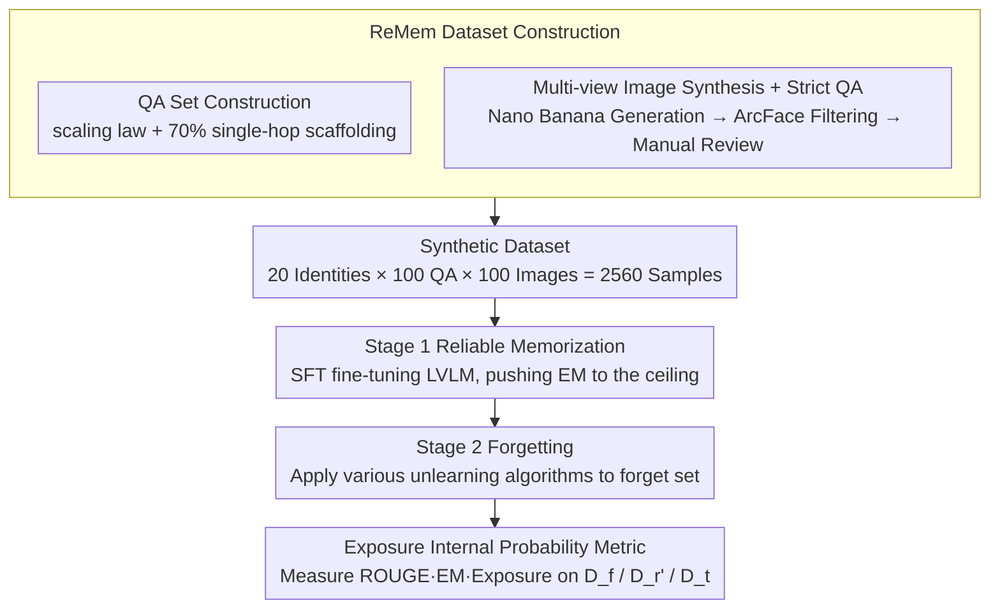

# Before Forgetting, Learn to Remember: Revisiting Foundational Learning Failures in LVLM Unlearning Benchmarks

**Conference**: ACL 2026 Findings  
**arXiv**: [2605.03759](https://arxiv.org/abs/2605.03759)  
**Code**: https://huggingface.co/datasets/herbwood27/Remem  
**Area**: LLM Safety / Privacy / Multimodal Unlearning  
**Keywords**: LVLM unlearning, memorization failure, multi-hop curse, multi-view synthesis, Exposure metric

## TL;DR
The authors point out that existing LVLM unlearning benchmarks (FIUBench / MLLMU-Bench / CLEAR) fail to truly memorize fictional identities during the Stage 1 fine-tuning phase, rendering the Stage 2 "forgetting" evaluation invalid. They identify the root cause as "insufficient data repetition + multi-hop curse" and propose ReMem—utilizing 100 QA × 100 multi-view images per identity, a 70%:30% single-hop/multi-hop mix, and a new internal Exposure metric to re-establish unlearning evaluation on the foundation of "genuine memorization."

## Background & Motivation

**Background**: LVLMs (e.g., LLaVA-1.5) inadvertently memorize private information from training data, triggering regulatory requirements like the "right to be forgotten" (GDPR). Consequently, Machine Unlearning has become critical. The community typically uses "fictional identities" for a two-stage evaluation: Stage 1 fine-tune allows the model to memorize sensitive attributes (name, email, disease, etc.) of $N$ fake persons; Stage 2 applies unlearning algorithms to remove a specific subset.

**Limitations of Prior Work**: The authors conducted a comprehensive diagnosis of Stage 1 in existing benchmarks using ROUGE-L (verbatim memory), GPT-judge (semantic memory), and EM (precise PII matching). They found extremely low EM scores—indicating the models never actually memorized core PII. Since memorization fails in Stage 1, the Stage 2 "erasure" evaluation is groundless, causing the entire benchmark chain to fail.

**Key Challenge**: For the sake of simplicity, existing benchmarks provide very few QAs per identity (FIUBench 20/ID, MLLMU 1/ID) and consist almost entirely of multi-hop questions (e.g., "What is the address of the person in the image?"). This violates two common principles of machine learning: (1) Carlini et al. proved that memorization strength is proportional to sample repetition, and too few QAs fail to penetrate the parameters; (2) The "multi-hop curse" indicates that multi-hop reasoning cannot be learned without single-hop scaffolding.

**Goal**: (a) Empirically diagnose Stage 1 failures using internal state analysis like causal tracing and Min-k%-prob; (b) Propose a new benchmark, ReMem, to solidify Stage 1 memorization; (c) Introduce the Exposure metric to quantify erasure depth at the probability distribution level.

**Key Insight**: Rather than continuing to compete on Stage 2 algorithms, it is better to return to the more fundamental diagnostic question: "Have the facts actually been encoded into the parameters?"

**Core Idea**: First confirm "memorization" (Stage 1 reliability) before discussing "forgetting" (Stage 2 efficacy). Through data scaling + single-hop scaffolding + multi-view images, Stage 1 EM is pushed close to 100%, and the Exposure metric shifts erasure evaluation from surface generation to internal probability.

## Method

### Overall Architecture

ReMem reconstructs the two-stage process of LVLM unlearning evaluation:
- **Stage 1 (Reliable Memorization)**: Fine-tune the LVLM on the ReMem dataset, ensuring EM is maximized (confirming the model truly remembers each fictional identity).
- **Stage 2 (Unlearning + Evaluation)**: Apply various unlearning algorithms to the forget set $D_f$, while simultaneously evaluating ROUGE/EM/Exposure on $D_f$, retain set $D_r'$, and held-out test set $D_t$. OOD tests use entirely new templates to prevent lexical overfitting.

Data Scale: 20 fictional identities × 100 QA × 100 images per identity = 2,560 samples.

### Key Designs

**1. Constructing QA Sets with Scaling Laws + Single-hop Scaffolding: Ensuring Stage 1 Memorization**

The first root cause of existing benchmark failure is insufficient QA pairs: FIUBench provides only 20 per identity, and MLLMU only 1. Following Carlini et al.'s conclusion that memorization strength is proportional to sample repetition, this volume is insufficient for parameter encoding. ReMem performed toy experiments scanning from 20 to 200 QA/ID, finding that ROUGE/EM increases monotonically with the number of QAs and starts overfitting around 160; thus, 100 QAs per identity were selected. The second cause is question type—existing benchmarks are almost entirely multi-hop ("What is the address of the person in the image?"). Models struggle with composite difficulty (simultaneous visual recognition and attribute recall), hitting the multi-hop curse. ReMem scanned single-hop ratios from 0% to 100%, finding that 70% single-hop is the peak for EM in both single-hop and multi-hop tests.

The logic aligns with human memory: one must first remember "Xiao Ming's address is XX Street" to answer "What is the address of the person in the image?". Single-hop questions ("What is the address of $X$?") establish a direct mapping $(s,r)\to a$, while multi-hop questions ("What is the address of the person in the image?") then connect the visual grounding $v\to s$. Single-hop scaffolding effectively teaches the atomic steps first so that composite reasoning can be learned.

**2. Multi-view Image Synthesis + Strict Quality Control: Forcing the Model to Remember the "Person" Not the "Image"**

Benchmarks like CLEAR use 20 images/ID but with very little visual variation; the model essentially memorizes the image rather than the person, failing to recognize them in different poses or backgrounds. Such "memorization" is fragile. ReMem uses Nano Banana with an anchor image, randomizing poses, clothing, and backgrounds to generate 100 images/ID. Consistency is ensured via ArcFace cosine similarity filtering, followed by a four-step manual review (removing artifacts, ensuring cross-modal alignment, identity recognizability, and ethical screening against real-world likenesses). The test set $D_t$ uses entirely new visual templates to force the model to identify the same identity under significant visual changes, ensuring "genuine memorization" and blocking lexical/visual overfitting.

**3. Exposure Internal Probability Metric: Distinguishing Erasure from Refusal at the Distribution Level**

Traditional ROUGE/EM only look at the generation layer. A model can easily learn a refusal response ("I don't know") while the internal parameters still encode the PII, which can be extracted via prompt injection—a blind spot in privacy evaluation. ReMem defines the Exposure of a target PII string $a=t_1t_2\dots t_n$ as:

$$\text{Exposure}(a)=\sum_i \log P(t_i\mid \text{prefix})$$

Lower values indicate cleaner erasure. Combined with Min-k% probability ($k=10$) to monitor the worst-case token probability, this distinguishes true memorization from partial guessing. Additionally, multimodal causal tracing (Indirect Estimation Effect, IE) is used to check for residual retrieval circuits. This advances erasure assessment from "can it generate" to "is it still in the probability distribution," closer to real-world threat models.

### Loss & Training
Stage 1 uses standard LVLM SFT (e.g., LLaVA-1.5-7B). Stage 2 evaluations cover various unlearning algorithms, including gradient ascent, knowledge distillation (Kurmanji et al.), refusal alignment, and negative likelihood, all evaluated using the same metrics on $D_f / D_r' / D_t$.

## Key Experimental Results

### Main Results (Stage 1 Memorization Comparison)

| Benchmark | Images/ID | QA/ID | ROUGE-L | GPT-score | EM (PII) |
|---|---|---|---|---|---|
| FIUBench | 1 | 20 | Medium | Medium | Extremely Low |
| MLLMU-Bench | 1 | 1 | Low | Low | Extremely Low |
| CLEAR | 20 | 20 | Medium | Medium | Low |
| **ReMem** | **100** | **100** | **Near 100% Limit** | **Near 100% Limit** | **Near 100% Limit** |

Radar charts show that ReMem hits the 100% target line across all three metrics, whereas the other three benchmarks show significant inward collapse.

### Ablation Study

| Configuration | EM (single-hop) | EM (multi-hop) | Description |
|---|---|---|---|
| 20 QA/ID | Low | Extremely Low | Insufficient data; memorization threshold not reached |
| 100 QA/ID, 0% Single-hop | Low | Low | Dominated by multi-hop curse |
| 100 QA/ID, 70% Single-hop | **Peak** | **Peak** | ReMem default configuration |
| 100 QA/ID, 100% Single-hop | High | Medium | No training data for multi-hop |
| 200 QA/ID, 70% Single-hop | High (Overfit) | High | PPL rebounds; starts to overfit |

### Key Findings
- **The scaling law is real**: EM increases nearly linearly with the number of QAs up to 160; beyond that, overfitting occurs. This indicates PII memorization requires "sufficient but not excessive" repetition.
- **70% single-hop is the sweet spot**: Teaching "$(s,r)\to a$" first, followed by "$v\to s\to a$", allows single-hop scaffolding to assist multi-hop learning—consistent with insights from chain-of-thought training about teaching atomic steps first.
- **Causal Tracing Visualization**: Base models show clear retrieval circuits with high IE layers for real public figures. Fine-tuned FIUBench/MLLMU models show scattered IE, proving fictional identities never entered the parameters.

## Highlights & Insights
- **Diagnosis-driven benchmark reconstruction**: The workflow of "diagnosis → root cause → reconstruction" using independent evidence (ROUGE/EM/GPT-judge triangulation + Min-k%-prob + causal tracing) to solidify "Stage 1 failure" is a model that other benchmark efforts should follow.
- **70:30 single-hop/multi-hop ratio**: This highly transferable insight could be extended to multi-hop QA training (HotpotQA, MultiHopRAG) and agentic reasoning training, which may benefit from "single-step first, composite later" curricula.
- **Exposure Metric**: By pushing privacy assessment from "can it generate" to "is it in the distribution," it becomes more robust against prompt injection and decoding-time attacks, representing a significant upgrade for LLM unlearning evaluation.

## Limitations & Future Work
- **Author Acknowledgement**: Only LLaVA-1.5-7B has been validated. It is unclear if the scaling thresholds remain identical for larger LVLMs (e.g., Gemini-vision, Qwen2-VL).
- **Personal Observation**: The scale of 20 fictional identities is still relatively small. Industrial unlearning scenarios often involve thousands of user records; the optimal single-hop ratio might shift at scale.
- **Improvement Ideas**: Cross-identity confusion tests could be added (checking if deleting one person's info affects similar identities). Exposure could also be expanded to the token-span level for more fine-grained evaluation of partial PII erasure.

## Related Work & Insights
- **vs FIUBench / MLLMU-Bench**: These benchmarks assume Stage 1 success; this paper invalidates that assumption. ReMem fixes the foundation via 100 QA × 100 images.
- **vs CLEAR**: While CLEAR expanded to 20 images/ID, its QA count remained low and lacked single-hop questions. This work maximizes both dimensions.
- **vs Carlini 2021 (Membership Inference)**: This paper adopts "PPL + Min-k%" tools but for a different goal—where the former confirms existing memorization, this work uses it to confirm Stage 1 failure and then to evaluate erasure depth.

## Rating
- Novelty: ⭐⭐⭐⭐ Solid diagnostic-repair chain rather than just a new algorithm.
- Experimental Thoroughness: ⭐⭐⭐⭐⭐ Five-fold evidence including three independent metrics, internal states, and causal tracing; independent ablations for scaling and ratios.
- Writing Quality: ⭐⭐⭐⭐⭐ Clear "Problem → Evidence → Root Cause → Solution" narrative; Figure 1 radar charts are highly persuasive.
- Value: ⭐⭐⭐⭐⭐ Directly challenges the validity of a generation of unlearning benchmarks and provides a robust alternative; likely to become a de facto standard for future LVLM unlearning work.

<!-- RELATED:START -->

## Related Papers

- [\[ICLR 2026\] Rethinking Benign Relearning: Syntax as the Hidden Driver of Unlearning Failures](../../ICLR2026/llm_safety/rethinking_benign_relearning_syntax_as_the_hidden_driver_of_the_safety_tax.md)
- [\[ICLR 2026\] Revisiting the Past: Data Unlearning with Model State History](../../ICLR2026/llm_safety/revisiting_the_past_data_unlearning_with_model_state_history.md)
- [\[ACL 2026\] Look Twice before You Leap: A Rational Framework for Localized Adversarial Anonymization](look_twice_before_you_leap_a_rational_framework_for_localized_adversarial_anonym.md)
- [\[ICML 2026\] Forget to Know, Remember to Use: Context-Aware Unlearning for Large Language Models](../../ICML2026/llm_safety/forget_to_know_remember_to_use_context-aware_unlearning_for_large_language_model.md)
- [\[AAAI 2026\] Learning from the Undesirable: Robust Adaptation of Language Models without Forgetting](../../AAAI2026/llm_safety/learning_from_the_undesirable_robust_adaptation_of_language_models_without_forge.md)

<!-- RELATED:END -->
