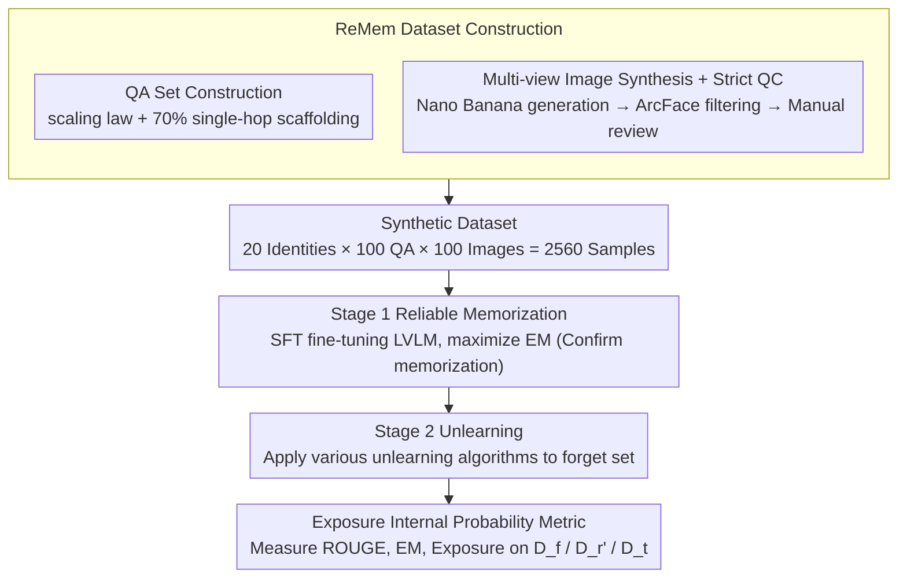

# Before Forgetting, Learn to Remember: Revisiting Foundational Learning Failures in LVLM Unlearning Benchmarks

**Conference**: ACL 2026 Findings  
**arXiv**: [2605.03759](https://arxiv.org/abs/2605.03759)  
**Code**: https://huggingface.co/datasets/herbwood27/Remem  
**Area**: LLM Security / Privacy / Multimodal unlearning  
**Keywords**: LVLM unlearning, memorization failure, multi-hop curse, multi-view synthesis, Exposure metric

## TL;DR
The authors point out that existing LVLM unlearning benchmarks (FIUBench / MLLMU-Bench / CLEAR) fail to truly memorize fictional identities during the Stage 1 fine-tuning phase, rendering Stage 2 "unlearning" evaluations invalid. They diagnose the root causes as "insufficient data repetition + multi-hop curse" and propose ReMem—featuring 100 QAs × 100 multi-view images per identity, a 70%:30% single-hop/multi-hop mix, and a new Exposure metric for internal probability—re-establishing unlearning evaluation on the foundation of "reliable memorization."

## Background & Motivation

**Background**: LVLMs (e.g., LLaVA-1.5) unintentionally memorize private information from training data, triggering legal requirements like the "Right to be Forgotten" (GDPR). Machine Unlearning has thus become critical. The community generally uses "fictional identities" for a two-stage evaluation: Stage 1 fine-tuning to make the model remember sensitive attributes (name, email, disease) of $N$ fake persons; Stage 2 applies unlearning algorithms to delete a subset.

**Limitations of Prior Work**: The authors conduct a comprehensive diagnosis of Stage 1 in existing benchmarks using ROUGE-L (verbatim memory), GPT-judge (semantic memory), and EM (precise PII matching). They found extremely low EM scores—meaning the models never actually memorized the core PII. Since memorization fails in Stage 1, "erasure" evaluation in Stage 2 is meaningless, causing the entire benchmark chain to fail.

**Key Challenge**: For simplicity, existing benchmarks provide very few QAs per identity (FIUBench 20/ID, MLLMU 1/ID) and consist almost entirely of multi-hop questions (e.g., "What is the address of the person in the picture?"). This violates two common machine learning principles: (1) Carlini et al. proved that memorization strength is proportional to sample repetition—too few QAs fail to penetrate parameters; (2) the "multi-hop curse" indicates that multi-hop reasoning cannot be learned without single-hop scaffolding.

**Goal**: (a) Use internal state analysis such as causal tracing and Min-k%-prob to "empirically" diagnose Stage 1 failures; (b) Propose a new benchmark, ReMem, to solidify Stage 1 memorization; (c) Introduce the Exposure metric to quantify erasure depth at the probability distribution level.

**Key Insight**: Rather than continuing to iterate on Stage 2 algorithms, it is better to return to the more fundamental diagnostic question of "whether facts are actually encoded into the parameters."

**Core Idea**: Confirm "memorization" (stage 1 reliability) before discussing "forgetting" (stage 2 efficacy). By utilizing data scaling + single-hop scaffolding + multi-view images, Stage 1 EM is pushed near 100%, and the Exposure metric shifts erasure evaluation from surface generation to internal probability.

## Method

### Overall Architecture

ReMem reconstructs the two-stage process for LVLM unlearning evaluation:
- **Stage 1 (Reliable Memorization)**: Fine-tune the LVLM on the ReMem dataset, ensuring EM is maximized (confirming the model truly remembers each fictional identity).
- **Stage 2 (Unlearning + Evaluation)**: Apply various unlearning algorithms to the forget set $D_f$, and evaluate ROUGE/EM/Exposure simultaneously on $D_f$, retain eval $D_r'$, and held-out test $D_t$. OOD tests use entirely new templates to prevent lexical overfitting.

Data Scale: 20 fictional identities × 100 QAs × 100 images per identity = 2,560 samples.

### Key Designs

**1. Constructing QA sets with scaling laws + single-hop scaffolding: Ensuring successful Stage 1 memorization**

The first root cause for existing benchmark failures is insufficient QA pairs: FIUBench provides only 20 per identity, and MLLMU provides only 1. According to Carlini et al., memorization strength is proportional to sample repetition; this level of repetition is insufficient for parameter encoding. ReMem performed a toy experiment scanning 20→200 QA/ID, finding that ROUGE/EM increases monotonically with the number of QAs, starting to overfit around 160. Thus, QAs per identity were set to 100. The second root cause is the question type—existing benchmarks focus almost entirely on multi-hop questions ("What is the address of the person in the picture?"). Models must learn visual recognition and attribute recall simultaneously, which is too complex and triggers the multi-hop curse. ReMem scanned single-hop ratios from 0%→100% and found that 70% single-hop is the peak for EM in both single-hop and multi-hop tests.

The logic aligns with human memory: one must first remember "Xiao Ming's address is XX Street" before being able to answer "What is the address of the person in this picture?". Single-hop questions ("What is $X$'s address?") establish a direct $(s,r)\to a$ mapping, while multi-hop questions ("What is the address of the person in the image?") then connect the $v\to s$ visual grounding. Single-hop scaffolding effectively teaches the atomic steps first, making composite reasoning learnable.

**2. Multi-view image synthesis + strict quality control: Ensuring the model remembers the "Person" rather than just the "Image"**

Benchmarks like CLEAR use 20 images/ID but with minimal visual variation; the model essentially memorizes the image rather than the person, failing to recognize them in different poses or backgrounds. Such "memorization" is not robust for unlearning evaluation. ReMem uses Nano Banana with an anchor image to generate 100 images/ID with randomized poses, clothing, and backgrounds. Face consistency is ensured via ArcFace cosine similarity filtering, followed by a four-step manual review (removing artifacts, ensuring cross-modal alignment, identity identifiability, and ethical screening to prevent real-world lookalikes). The test set $D_t$ uses entirely new visual templates, forcing the model to recognize the same identity under significant visual changes. This confirms it has "really remembered this person" and blocks lexical/visual overfitting.

**3. Exposure internal probability metric: Quantifying whether PII is erased or just refused**

Traditional ROUGE/EM only look at the generation layer. A model can easily learn a refusal response like "I don't know" while still encoding PII internally, which can be extracted via prompt injection—a blind spot in privacy evaluation. ReMem defines the Exposure for a target PII string $a=t_1t_2\dots t_n$ as:

$$\text{Exposure}(a)=\sum_i \log P(t_i\mid \text{prefix})$$

A lower value indicates cleaner erasure. Combined with Min-k% probability ($k=10$) to track the worst-case token probability, it distinguishes true memorization from partial guessing. Additionally, multimodal causal tracing (Indirect Estimation Effect, IE) is used to check for residual retrieval circuits. This advances erasure evaluation from "can it generate" to "is it still in the probability distribution," aligning closer to real-world threat models.

### Loss & Training
Stage 1 uses standard LVLM SFT (LLaVA-1.5-7B, etc.). Stage 2 evaluation covers various unlearning algorithms including Gradient Ascent, Knowledge Distillation (Kurmanji et al.), Refusal Alignment, and Negative Likelihood, evaluated uniformly on $D_f / D_r' / D_t$ with the same set of metrics.

## Key Experimental Results

### Main Results (Stage 1 Memorization Comparison)

| Benchmark | Images/ID | QA/ID | ROUGE-L | GPT-score | EM (PII) |
|---|---|---|---|---|---|
| FIUBench | 1 | 20 | Medium | Medium | Extremely Low |
| MLLMU-Bench | 1 | 1 | Low | Low | Extremely Low |
| CLEAR | 20 | 20 | Medium | Medium | Low |
| **ReMem** | **100** | **100** | **Near 100%** | **Near 100%** | **Near 100%** |

Radar charts show that ReMem reaches the 100% target line across all three metrics, while the other three benchmarks show severe deficiencies.

### Ablation Study

| Configuration | EM (single-hop) | EM (multi-hop) | Note |
|---|---|---|---|
| 20 QA/ID | Low | Extremely Low | Insufficient data, below memory threshold |
| 100 QA/ID, 0% Single-hop | Low | Low | Dominated by multi-hop curse |
| 100 QA/ID, 70% Single-hop | **Peak** | **Peak** | ReMem default configuration |
| 100 QA/ID, 100% Single-hop| High | Medium | No multi-hop training data |
| 200 QA/ID, 70% Single-hop | High (Overfit) | High | PPL rebounds, start of overfitting |

### Key Findings
- **Scaling law is real**: EM grows almost linearly with the number of QAs up to 160; beyond that, overfitting occurs. This suggests PII memorization requires "sufficient but not excessive" repetition.
- **70% Single-hop is the sweet spot**: Teaching "$(s,r)\to a$" first followed by "$v\to s\to a$" allows single-hop scaffolding to assist multi-hop learning—consistent with insights from Chain-of-Thought training regarding "teaching atomic steps first."
- **Causal tracing visualization**: Base models show clear retrieval circuits with high IE layers for real public figures. Fine-tuned FIUBench/MLLMU models show scattered IE, proving fictional identities were never truly encoded.

## Highlights & Insights
- **Diagnosis-driven benchmark reconstruction**: Identifying "Stage 1 failure" via ROUGE/EM/GPT-judge triangulation + Min-k%-prob + causal tracing, then applying a targeted fix. This "Diagnosis → Root Cause → Reconstruction" workflow is a valuable template for benchmark work beyond unlearning.
- **70:30 single-hop/multi-hop ratio**: A highly transferable insight that can be extended to multi-hop QA training (HotpotQA, MultiHopRAG) and agentic reasoning training, which likely benefit from a "single-step then composite" curriculum.
- **Exposure metric**: Advances privacy assessment from "can it generate" to "is it in the distribution," providing a more robust evaluation against prompt injection / decoding-time attacks.

## Limitations & Future Work
- **Author's acknowledgment**: Currently only verified on LLaVA-1.5-7B; whether larger LVLMs (Gemini-vision, Qwen2-VL) share the same scaling thresholds is untested.
- **Personal observation**: The scale of 20 fictional identities is still small. Industrial scenarios typically involve thousands of records; the optimal single-hop scaffolding ratio might shift as scale increases.
- **Future directions**: Cross-identity confusion tests could be added (whether deleting one person affects similar identities). Exposure could be extended to the token-span level for finer-grained evaluation of partial PII erasure.

## Related Work & Insights
- **vs FIUBench / MLLMU-Bench**: These assume Stage 1 success; this paper disproves that assumption. ReMem fixes the foundation via 100 QA × 100 images.
- **vs CLEAR**: CLEAR expanded to 20 images/ID, but QA count remains low and lacks single-hop focus. This paper maximizes both dimensions.
- **vs Carlini 2021 (Membership Inference)**: Borrows "PPL + Min-k%" tools but for a different goal—Carlini uses it to confirm memory exists; this work uses it to confirm Stage 1 failure and then evaluate erasure depth.

## Rating
- Novelty: ⭐⭐⭐⭐ Framework reconstruction rather than a new algorithm, but the diagnosis-repair chain is solid.
- Experimental Thoroughness: ⭐⭐⭐⭐⭐ Five-fold evidence including three independent metrics + internal states + causal tracing, plus independent ablations for scaling/ratios.
- Writing Quality: ⭐⭐⭐⭐⭐ Clear narrative of "Problem → Evidence → Root Cause → Solution"; the radar chart in Figure 1 is highly persuasive.
- Value: ⭐⭐⭐⭐⭐ Effectively invalidates several previous unlearning benchmarks and provides a replacement, likely becoming a de facto standard for future LVLM unlearning work.

<!-- RELATED:START -->

## Related Papers

- [\[CVPR 2026\] Revisiting Learning with Noisy Labels: Active Forgetting and Noise Suppression](../../CVPR2026/llm_safety/revisiting_learning_with_noisy_labels_active_forgetting_and_noise_suppression.md)
- [\[ACL 2026\] Look Twice before You Leap: A Rational Framework for Localized Adversarial Anonymization](look_twice_before_you_leap_a_rational_framework_for_localized_adversarial_anonym.md)
- [\[ICLR 2026\] Rethinking Benign Relearning: Syntax as the Hidden Driver of Unlearning Failures](../../ICLR2026/llm_safety/rethinking_benign_relearning_syntax_as_the_hidden_driver_of_the_safety_tax.md)
- [\[ICLR 2026\] Revisiting the Past: Data Unlearning with Model State History](../../ICLR2026/llm_safety/revisiting_the_past_data_unlearning_with_model_state_history.md)
- [\[AAAI 2026\] Learning from the Undesirable: Robust Adaptation of Language Models without Forgetting](../../AAAI2026/llm_safety/learning_from_the_undesirable_robust_adaptation_of_language_models_without_forge.md)

<!-- RELATED:END -->
