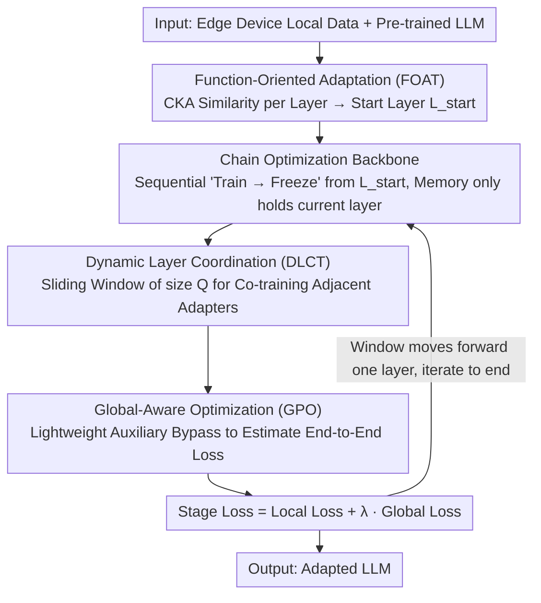

# Beyond End-to-End: Dynamic Chain Optimization for Private LLM Adaptation on the Edge

**Conference**: ACL 2026  
**arXiv**: [2604.06819](https://arxiv.org/abs/2604.06819)  
**Code**: None  
**Area**: LLM Efficiency / Federated Learning / Privacy Protection  
**Keywords**: Federated Fine-tuning, Edge Devices, Memory Wall, Chain Optimization, Adapters

## TL;DR
ChainFed is proposed, a chain-style federated fine-tuning paradigm that breaks the memory wall. By sequentially training and freezing adapters layer-by-layer, it enables resource-constrained edge devices to participate in LLM fine-tuning. Combined with three techniques—Dynamic Layer Coordination, Global-Aware Optimization, and Function-Oriented Adaptation—it achieves an average accuracy improvement of up to 46.46%.

## Background & Motivation

**Background**: LLMs hold significant potential for mobile intelligence, but adaptation for downstream tasks faces privacy regulation constraints—data must remain on user devices. Federated fine-tuning provides a privacy-preserving collaborative adaptation scheme, yet practical deployment is limited by the resource requirements of LLMs.

**Limitations of Prior Work**: Parameter-efficient methods (such as adapter/LoRA) reduce computational and communication overhead but fail to address the fundamental memory bottleneck—the entire model must still be loaded into memory. LLaMA2-7B requires approximately 25GB of memory, far exceeding the typical 4-12GB capacity of mobile devices. Experiments indicate that base model parameters account for 91.2%-94.1% of memory, while optimization gains from intermediate activations (7.2%) and adapters (0.018%) are negligible.

**Key Challenge**: Memory constraints are not only resource barriers but also performance bottlenecks—excluding low-end devices means losing a vast amount of valuable on-device data. Experiments show that under memory constraints, accuracy drops by 8.5% in IID settings and 11.8% in non-IID settings.

**Goal**: Fundamentally reduce the number of model parameters residing in memory during fine-tuning, allowing resource-constrained devices to participate in federated fine-tuning.

**Key Insight**: Since base parameters occupy over 90% of memory while adapter/activation optimization yields minimal returns, it is preferable to retain only the layer currently being trained in memory.

**Core Idea**: Decompose end-to-end optimization into layer-wise chain optimization—training the first adapter to convergence and freezing it before moving to the next, forming an optimization chain to gradually enhance task capabilities.

## Method

### Overall Architecture
ChainFed decomposes end-to-end LLM fine-tuning into a "layer-wise sequential training" optimization chain: starting from a specific initial layer, the current layer's adapter is trained to convergence and then frozen, followed by the inclusion of the next layer for training. At any given moment, only the parameters of the layer currently being trained need to reside in memory (preceding layers are released after the forward pass, and succeeding layers are not yet activated). This reduces the peak memory of fine-tuning to a "single-layer" level, enabling participation from edge devices with 4–12GB. Around this backbone, ChainFed incorporates three techniques to remedy the shortcomings of chain training: Function-Oriented Adaptation (FOAT) to determine the starting layer, Dynamic Layer Coordination (DLCT) to synchronize adjacent adapters in each stage, and Global-Aware Optimization (GPO) to inject a global perspective into local training.

### Key Designs

**1. Function-Oriented Adaptation (FOAT): Automatically Identifying the Fine-tuning Starting Layer via CKA**

Chain optimization first requires determining the starting layer. LLMs exhibit a functional hierarchy from shallow syntax to deep semantics; starting fine-tuning too early wastes computation and may disrupt general representations, while starting too late leads to insufficient adaptation. FOAT uses CKA (Centered Kernel Alignment) to quantify the similarity between each layer's activations and the input: layers with high CKA are general-purpose and remain frozen; the first layer where CKA drops below a threshold $T$ is the starting point $L_{start}$. Each device performs one forward pass on local data to calculate CKA scores, which are aggregated by the server to determine a global starting layer. This step adds almost no overhead and is robust to non-IID data heterogeneity as it is data-driven.

**2. Dynamic Layer Coordination (DLCT): Using a Sliding Window for Co-training Adjacent Adapters to Restore Cross-layer Information Flow**

Decomposing end-to-end training into sequential layer-wise training leads to isolated adapter learning, causing two issues: semantic gaps between adjacent layers (representation mismatch) and the inability for gradients to propagate across layers (gradient isolation). DLCT replaces isolated training with a sliding window of size $Q$ to coordinate the training of several adjacent adapters, retaining $Q-1$ overlapping adapters as the window advances. For example, with $Q=2$: stage one co-trains adapters 1+2, and stage one co-trains 2+3. Adapter 2, shared across stages, serves a dual role: as a semantic anchor to align feature spaces and as a gradient conduit to pull gradients back from subsequent layers, breaking gradient isolation.

**3. Global-Aware Optimization (GPO): Attaching a Lightweight Bypass to Estimate End-to-End Loss for Locally Focused Adapters**

Chain training is naturally "myopic": current adapters lack feedback from downstream layers and can easily over-specialize, discarding information that is globally useful but temporarily irrelevant to local tasks. GPO addresses this with a lightweight auxiliary output branch consisting only of subsequent adapters and the final output layer, bypassing the full model. It leverages the fact that adapters are low-rank approximations of layer transformations to estimate end-to-end loss, injecting a global perspective without loading the full model. The training objective for each stage is:

$$Loss_m = Local\ Loss + \lambda \cdot Global\ Loss$$

Local loss ensures current layer learning, while global loss constrains the layer by incorporating downstream influences.

### Loss & Training
$Loss_m = Local\ Loss + \lambda \cdot Global\ Loss$; the final stage uses end-to-end loss only. FOAT utilizes a CKA threshold $T$ to determine the starting layer.

## Key Experimental Results

### Main Results (Text Classification, DistilBERT/BERT/RoBERTa)

| Method | YELP-P (IID) | AGNEWS (IID) | YAHOO (IID) | Average |
|------|-------------|-------------|------------|---------|
| No-FT | 50.04 | 25.13 | 10.05 | - |
| Linear Probing | 71.56 | 85.76 | - | - |
| ChainFed | **Best** | **Best** | **Best** | +46.46% vs Lower Bound |

### Instruction Fine-tuning (LLaMA2-7B / LLaMA3.1-8B)

| Method | MMLU | BBH | DROP | CRASS |
|------|------|-----|------|-------|
| ChainFed | Best | Best | Best | Best |
| vs. Prev. SOTA | Significant Gain | Significant Gain | Significant Gain | Significant Gain |

### Ablation Study

| Configuration | Effect | Description |
|------|------|------|
| w/o DLCT | Decrease | Loss of cross-layer coordination, representation mismatch |
| w/o GPO | Decrease | Excessive local specialization |
| w/o FOAT | Decrease | Unnecessary fine-tuning of general layers |
| All Removed | Significant Decrease | Only basic chain training remains |

### Key Findings
- ChainFed significantly outperforms existing methods across all benchmarks, with an average accuracy gain of up to 46.46%.
- The advantage is more pronounced in non-IID settings, indicating the robustness of FOAT’s CKA aggregation to data heterogeneity.
- A sliding window size of $Q=2$ achieves the best balance between performance and memory.

## Highlights & Insights
- **The observation that "model parameters occupy 91.2% of memory"** directly refutes the effectiveness of the adapter/activation optimization path, providing a clear and powerful motivation.
- **Chain optimization reduces memory requirements to a single layer of model parameters**, representing an elegant space-time tradeoff—exchanging more training rounds for lower peak memory.
- **Using adapters to approximate layer transformations for global loss estimation** is ingenious—it avoids the memory overhead of loading the full model.

## Limitations & Future Work
- Chain training increases the total number of training rounds and communication costs; temporal efficiency may be lower than end-to-end methods.
- It is currently assumed that adapters can sufficiently approximate layer transformations; this assumption may fail for very deep models.
- Validation is limited to text tasks; performance in multi-modal scenarios remains unknown.

## Related Work & Insights
- **vs. FwdLLM/FedKSeed**: These use zeroth-order optimization to reduce activation memory (7.2%), whereas ChainFed directly reduces parameter memory (91.2%), targeting a more effective bottleneck.
- **vs. FLoRA**: Reduces trainable parameters via rank reduction, but the entire base model parameters still require loading.

## Rating
- Novelty: ⭐⭐⭐⭐⭐ The chain optimization paradigm breaks the memory wall for federated fine-tuning with a fresh perspective.
- Experimental Thoroughness: ⭐⭐⭐⭐ Multiple models and datasets, though lacking actual deployment validation on mobile devices.
- Writing Quality: ⭐⭐⭐⭐ Clear logical flow from observation to analysis to methodology.
- Value: ⭐⭐⭐⭐⭐ Holds significant practical importance for edge LLM deployment.

<!-- RELATED:START -->

## Related Papers

- [\[ACL 2026\] CarO: Chain-of-Analogy Reasoning Optimization for Robust Content Moderation](caro_chain-of-analogy_reasoning_optimization_for_robust_content_moderation.md)
- [\[NeurIPS 2025\] Differentially Private Federated Low Rank Adaptation Beyond Fixed-Matrix](../../NeurIPS2025/llm_safety/differentially_private_federated_low_rank_adaptation_beyond_fixed-matrix.md)
- [\[ACL 2026\] Beyond Explicit Refusals: Soft-Failure Attacks on Retrieval-Augmented Generation](beyond_explicit_refusals_soft-failure_attacks_on_retrieval-augmented_generation.md)
- [\[ICML 2026\] Privacy Amplification in Differentially Private Zeroth-Order Optimization with Hidden States](../../ICML2026/llm_safety/privacy_amplification_in_differentially_private_zeroth-order_optimization_with_h.md)
- [\[NeurIPS 2025\] On the Sample Complexity of Differentially Private Policy Optimization](../../NeurIPS2025/llm_safety/on_the_sample_complexity_of_differentially_private_policy_optimization.md)

<!-- RELATED:END -->
