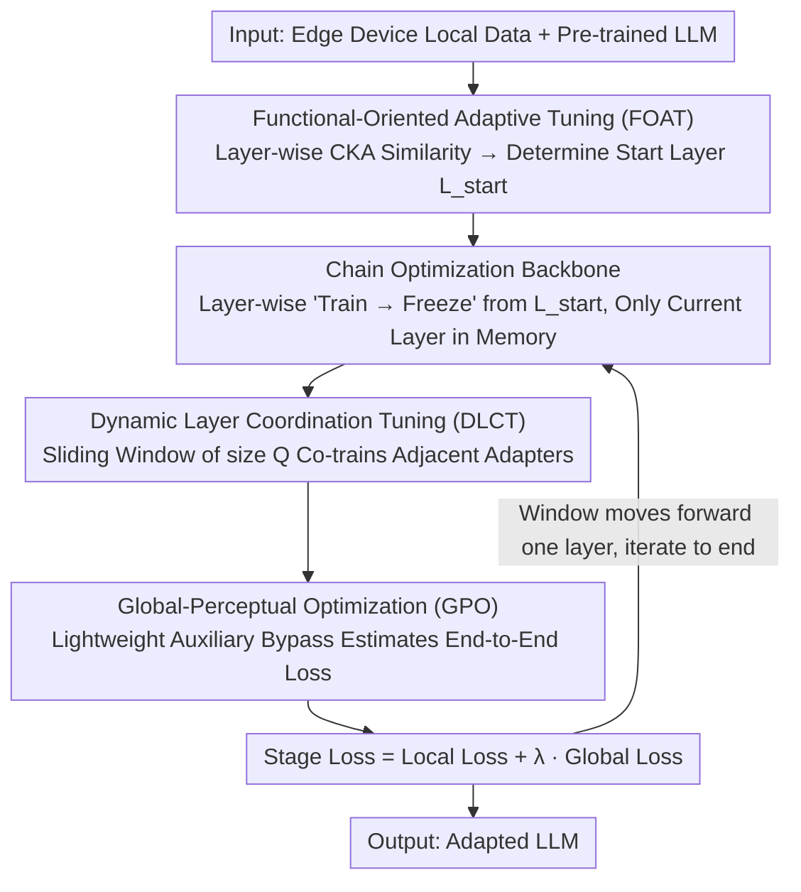

# Beyond End-to-End: Dynamic Chain Optimization for Private LLM Adaptation on the Edge

**Conference**: ACL 2026  
**arXiv**: [2604.06819](https://arxiv.org/abs/2604.06819)  
**Code**: None  
**Area**: LLM Efficiency / Federated Learning / Privacy Protection  
**Keywords**: Federated Fine-tuning, Edge Devices, Memory Wall, Chain Optimization, Adapters

## TL;DR
ChainFed is proposed as a chain-based federated fine-tuning paradigm to break the memory wall. By sequentially training and freezing adapters layer-by-layer, it enables resource-constrained edge devices to participate in LLM fine-tuning. Combining Functional-Oriented Adaptive Tuning (FOAT), Dynamic Layer Coordination Tuning (DLCT), and Global-Perceptual Optimization (GPO), it achieves an average accuracy improvement of up to 46.46%.

## Background & Motivation

**Background**: LLMs possess significant potential in mobile intelligence, but adaptation to downstream tasks faces privacy constraints—data must remain on user devices. Federated fine-tuning is a privacy-preserving collaborative adaptation scheme, yet practical deployment is hindered by the extreme resource requirements of LLMs.

**Limitations of Prior Work**: Parameter-efficient methods (e.g., adapters/LoRA) reduce computation and communication overhead but fail to address the fundamental memory bottleneck—the entire model must still be loaded into memory. LLaMA2-7B requires approximately 25GB of memory, far exceeding the typical 4-12GB capacity of mobile devices. Experiments show that base model parameters account for 91.2%-94.1% of memory, while optimizing intermediate activations (7.2%) or adapters (0.018%) yields negligible gains.

**Key Challenge**: Memory constraints are not just resource barriers but performance bottlenecks—excluding low-end devices means losing a vast amount of valuable on-device data. Experiments indicate that under memory constraints, accuracy drops by 8.5% in IID settings and 11.8% in non-IID settings.

**Goal**: Fundamentally reduce the number of model parameters residing in memory during fine-tuning, allowing resource-constrained devices to participate in federated fine-tuning.

**Key Insight**: Since base parameters occupy 90%+ of memory while adapter/activation optimizations offer minimal gains, it is more effective to keep only the currently required layer in memory.

**Core Idea**: Decompose end-to-end optimization into layer-wise chain optimization—train the first adapter to convergence and freeze it, then proceed to the next, forming an optimization chain to incrementally enhance task capability.

## Method

### Overall Architecture
ChainFed decomposes end-to-end LLM fine-tuning into a "layer-wise sequential training" optimization chain. Starting from a specific layer, the current layer's adapter is trained to convergence and then frozen before incorporating the next layer. At any moment, only the parameters of the currently training layer need to reside in memory (preceding layers are released after the forward pass; succeeding layers are not yet activated), compressing the peak memory usage to a "single-layer" level. This allows 4–12GB edge devices to participate. Around this backbone, ChainFed incorporates three techniques to remedy the weaknesses of chain training: FOAT determines the starting layer, DLCT coordinates adjacent adapters within each stage, and GPO injects a global perspective into local training.

### Key Designs

**1. Functional-Oriented Adaptive Tuning (FOAT): Automatically finding the starting layer via CKA**

Chain optimization must first determine "where to start." LLMs exhibit functional hierarchies from low-level syntax to high-level semantics. Starting fine-tuning too early wastes computation and may disrupt general representations, while starting too late results in under-adaptation. FOAT uses CKA (Centered Kernel Alignment) to quantify the similarity between each layer's activation and the input. Layers with high CKA are considered general layers and remain frozen; the first layer where CKA drops below a threshold $T$ is the starting point $L_{start}$. Each device performs one forward pass on local data to calculate CKA scores, which are aggregated at the server to determine the global starting layer. This step adds negligible overhead and is robust to non-IID data heterogeneity.

**2. Dynamic Layer Coordination Tuning (DLCT): Using a sliding window to co-train adjacent adapters and recover cross-layer information flow**

Decomposing end-to-end training into layer-wise sequential training isolates each adapter, leading to two issues: semantic gaps between adjacent layers (representation mismatch) and the inability of gradients to propagate across layers (gradient isolation). DLCT utilizes a sliding window of size $Q$ to coordinate the training of several adjacent adapters simultaneously. The window moves forward by one layer, retaining $Q-1$ overlapping adapters. For $Q=2$: Phase 1 co-trains adapters 1+2; Phase 2 co-trains 2+3. The shared adapter 2 serves a dual role—acting as a semantic anchor to align feature spaces and as a gradient conduit to pull gradients from subsequent layers, breaking gradient isolation.

**3. Global-Perceptual Optimization (GPO): Attaching a lightweight bypass to local adapters to estimate end-to-end loss**

Chain training is inherently "myopic": the current adapter lacks feedback from downstream layers, making it prone to over-specialization and prematurely discarding information that is globally useful but locally redundant. GPO designs a lightweight auxiliary output branch consisting only of subsequent adapters and the final output layer, bypassing the full model. It leverages the fact that adapters are low-rank approximations of layer transformations to estimate end-to-end loss without loading the full model. The training objective for each stage is:

$$Loss_m = Local\ Loss + \lambda \cdot Global\ Loss$$

The local loss ensures current layer learning, while the global loss introduces downstream constraints to prevent deviation.

### Loss & Training
$Loss_m = Local\ Loss + \lambda \cdot Global\ Loss$, with the final stage using only end-to-end loss. FOAT uses a CKA threshold $T$ to decide the starting layer.

## Key Experimental Results

### Main Results (Text Classification, DistilBERT/BERT/RoBERTa)

| Method | YELP-P (IID) | AGNEWS (IID) | YAHOO (IID) | Average |
|------|-------------|-------------|------------|---------|
| No-FT | 50.04 | 25.13 | 10.05 | - |
| Linear Probing | 71.56 | 85.76 | - | - |
| ChainFed | **Best** | **Best** | **Best** | +46.46% vs Lower Bound |

### Instruction Tuning (LLaMA2-7B / LLaMA3.1-8B)

| Method | MMLU | BBH | DROP | CRASS |
|------|------|-----|------|-------|
| ChainFed | Best | Best | Best | Best |
| vs Prev. SOTA | Significant Gain | Significant Gain | Significant Gain | Significant Gain |

### Ablation Study

| Configuration | Effect | Description |
|------|------|------|
| w/o DLCT | Decrease | Loss of cross-layer coordination, representation mismatch |
| w/o GPO | Decrease | Local over-specialization |
| w/o FOAT | Decrease | Unnecessary fine-tuning of general layers |
| Remove All | Sharp Decrease | Only basic chain training remains |

### Key Findings
- ChainFed significantly outperforms existing methods across all benchmarks, with peak average accuracy gains of 46.46%.
- The advantage is more pronounced in non-IID settings, indicating the robustness of FOAT's CKA aggregation to data heterogeneity.
- A sliding window size of $Q=2$ achieves the best balance between performance and memory usage.

## Highlights & Insights
- **The observation that model weights occupy 91.2% of memory** directly refutes the effectiveness of activation-only optimization routes, providing a powerful motivation.
- **Chain optimization reduces memory requirements to a single layer**, representing an elegant space-time tradeoff—exchanging more training iterations for lower memory peaks.
- **Using adapters to approximate layer transformations for global loss estimation** is clever—it avoids the memory overhead of loading the full model.

## Limitations & Future Work
- Chain training increases the total number of training rounds and communication costs; temporal efficiency may be lower than end-to-end methods.
- It is currently assumed that adapters can sufficiently approximate layer transformations; this may not hold for extremely deep models.
- Validated only on text tasks; effectiveness in multimodal scenarios remains unknown.

## Related Work & Insights
- **vs FwdLLM/FedKSeed**: These use zeroth-order optimization to reduce activation memory (7.2%), whereas ChainFed directly reduces parameter memory (91.2%), targeting a more effective bottleneck.
- **vs FLoRA**: Reduces trainable parameters via rank reduction, but the base model parameters must still be fully loaded.

## Rating
- Novelty: ⭐⭐⭐⭐⭐ The chain optimization paradigm breaks the memory wall for federated fine-tuning with a highly novel approach.
- Experimental Thoroughness: ⭐⭐⭐⭐ Covered multiple models and datasets, though lacks validation on physical mobile devices.
- Writing Quality: ⭐⭐⭐⭐ Clear logical progression from observation to analysis to method.
- Value: ⭐⭐⭐⭐⭐ Holds significant practical importance for edge LLM deployment.

<!-- RELATED:START -->

## Related Papers

- [\[NeurIPS 2025\] Differentially Private Federated Low Rank Adaptation Beyond Fixed-Matrix](../../NeurIPS2025/llm_safety/differentially_private_federated_low_rank_adaptation_beyond_fixed-matrix.md)
- [\[ACL 2026\] CarO: Chain-of-Analogy Reasoning Optimization for Robust Content Moderation](caro_chain-of-analogy_reasoning_optimization_for_robust_content_moderation.md)
- [\[ACL 2026\] Beyond Explicit Refusals: Soft-Failure Attacks on Retrieval-Augmented Generation](beyond_explicit_refusals_soft-failure_attacks_on_retrieval-augmented_generation.md)
- [\[ACL 2026\] Red-Bandit: Test-Time Adaptation for LLM Red-Teaming via Bandit-Guided LoRA Experts](red-bandit_test-time_adaptation_for_llm_red-teaming_via_bandit-guided_lora_exper.md)
- [\[ACL 2026\] CiPO: Counterfactual Unlearning for Large Reasoning Models through Iterative Preference Optimization](cipo_counterfactual_unlearning_for_large_reasoning_models_through_iterative_pref.md)

<!-- RELATED:END -->
