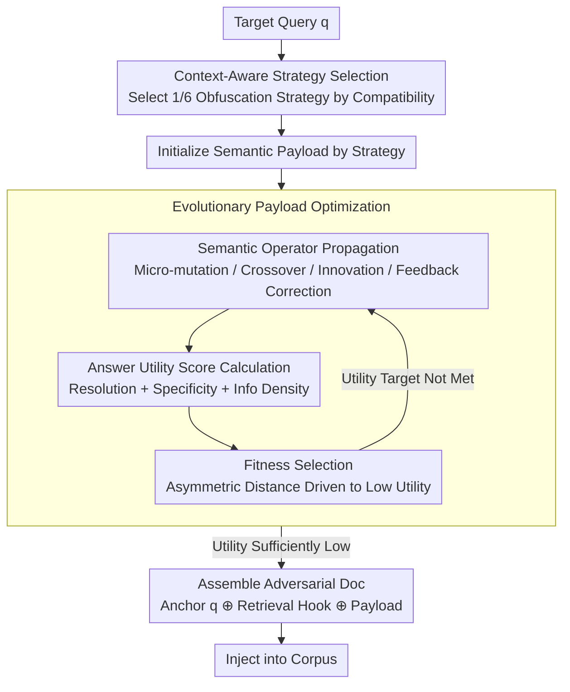

# Beyond Explicit Refusals: Soft-Failure Attacks on Retrieval-Augmented Generation

**Conference**: ACL 2026  
**arXiv**: [2604.18663](https://arxiv.org/abs/2604.18663)  
**Code**: None  
**Area**: AI Safety / RAG Security  
**Keywords**: RAG Attack, Soft-Failure, Adversarial Document, Evolutionary Optimization, Availability Attack

## TL;DR

This paper formally defines the "soft-failure" threat in RAG systems—generating fluent yet uninformative responses—and proposes the DEJA black-box evolutionary attack framework. By utilizing adversarial documents to induce model safety alignment mechanisms into producing hedging responses, DEJA achieves a SASR exceeding 79% while remaining highly stealthy.

## Background & Motivation

**Background**: RAG systems rely on external corpora to improve factual accuracy, creating a critical dependency on corpus integrity. Existing attack research primarily focuses on knowledge poisoning (inducing incorrect outputs) and availability attacks (inducing explicit refusals).

**Limitations of Prior Work**: "Hard-failures" induced by existing jamming attacks, such as explicit refusals to answer, are too conspicuous. They manifest as visible refusal responses and anomalous text statistics (e.g., high perplexity), making them easily detectable by anomaly-based defenses.

**Key Challenge**: A more stealthy threat exists—"soft-failure." The model produces fluent, coherent, but substantively empty responses that neither trigger refusal keyword detection nor produce perplexity anomalies, effectively undermining the core value of RAG.

**Goal**: Formally define the soft-failure threat and develop an automated black-box attack framework to validate the severity of this threat.

**Key Insight**: Exploiting the safety alignment mechanisms of LLMs—alignment training makes models prone to "hedging" when facing uncertainty. Attackers can create artificial ambiguity to trigger this conservative behavior.

**Core Idea**: Adversarial documents are decomposed into a query anchor + retrieval hook + semantic payload. Evolutionary optimization is applied to the payload to induce low-utility but high-fluency responses.

## Method

### Overall Architecture

The problem DEJA solves is how to make an injected document both retrievable and capable of quietly degrading the model's response from "useful" to "fluent but empty," without leaving traces like refusal keywords or perplexity anomalies. It decomposes the adversarial document into three concatenated parts: $d_{adv} = q \oplus h_{hook} \oplus p_{payload}$. The query anchor $q$ at the beginning restates the target question to ensure retrieval; the retrieval hook $h_{hook}$ in the middle is responsible for boosting the ranking and semantically linking the anchor and payload; the semantic payload $p_{payload}$ is the functional component, optimized via evolution to induce uninformative answers. The pipeline involves selecting an attack strategy based on query features to initialize the payload, using an evolutionary algorithm to refine the payload until the response utility is sufficiently low, and finally assembling the three parts for injection.

### Key Designs

**1. Context-Aware Strategy Selection: Ensuring semantic consistency by selecting an obfuscation strategy based on the query**

Different types of questions are suited to different obfuscation techniques. If the hook and payload are inconsistent, the resulting document will be fragmented and easily detected. DEJA pre-defines 6 attack strategies and selects the one best matching the current query via compatibility scoring $s^* = \arg\max_{s_i} \text{Compatibility}(q, s_i)$. This strategy then constrains the semantic themes of both the hook and the payload, ensuring the final document is cohesive.

**2. Answer Utility Score (AUS): Using a continuous utility score instead of binary success to optimize "soft-failure"**

Previous jamming attacks used binary criteria like keyword matching or F1. However, "soft-failure" is a gradual semantic degradation—the answer is neither a refusal nor strictly incorrect, just empty. Binary standards fail to capture this intermediate state. AUS uses an LLM-based scoring function to quantify information utility across three dimensions: question resolution (whether it addresses the core issue), factual specificity (specific facts vs. vague generalizations), and info density (new info vs. redundant background). This continuous scale allows for fine-grained optimization.

**3. Evolutionary Payload Optimization: Searching the natural language space to suppress utility while maintaining fluency**

Token-level perturbations leave artifacts detectable by perplexity checks. DEJA instead optimizes the payload in the natural language space using an evolutionary algorithm. The fitness function is defined as $\mathcal{F}(p) = \frac{1}{\mathcal{D}(u) + \epsilon}$, where $\mathcal{D}(u)$ is the asymmetric distance from the current utility to the target utility $\tau_{soft}$—penalizing higher utility more heavily. Each generation uses four LLM-driven semantic operators: micro-mutation (local rewriting), semantic crossover (recombining payloads), innovation mutation (introducing new expressions), and feedback correction (adjusting based on prior scores).

### Loss & Training

No model training is required. Optimization occurs in the natural language space via an evolutionary algorithm. The attacker requires only black-box query access, without needing model parameters or gradients. A single adversarial document is sufficient.

## Key Experimental Results

### Main Results

| Metric | DEJA | Prev. SOTA Attack |
|------|------|------------|
| Soft-Failure Attack Success Rate (SASR) | **>79%** | Significantly lower |
| Hard-Failure Rate | **<15%** | Higher (Explicit refusal) |
| Perplexity Detection Evasion | ✓ Passed | ✗ Detected |
| Query Rewriting Robustness | ✓ Robust | - |
| Cross-model Transferability | ✓ To closed-source | Limited |

### Ablation Study

| Component | Effect |
|------|------|
| Without Strategy Selection | SASR decreased |
| Without Retrieval Hook | Retrieval success rate dropped significantly |
| Random Payload vs. Evolutionary Optimization | Evolutionary optimization yielded significantly higher SASR |
| Different LLM Families | Cross-model transfer effective |

### Key Findings

- Soft-failures are more dangerous than hard-failures: users may attribute uninformative answers to corpus limitations rather than an attack.
- DEJA exploits safety alignment mechanisms—the "caution" of models is weaponized.
- A single adversarial document can effectively attack, making the injection threshold extremely low.
- Existing perplexity and refusal keyword detections fail completely against soft-failure.

## Highlights & Insights

- The formal definition of the "soft-failure" concept fills a gap in RAG safety research.
- Revealed the double-edged sword of safety alignment—alignment makes models more "cautious" and thus easier to induce into uselessness.
- The AUS scoring framework can be independently used for RAG response quality evaluation.
- The three-component document decomposition (anchor + hook + payload) is a general methodology for adversarial document construction.

## Limitations & Future Work

- Evaluated only on English datasets.
- Evolutionary optimization requires multiple queries to the target system, potentially triggering rate limits.
- Defense methods (e.g., utility detection) are not fully explored.
- Attack effectiveness in multi-document retrieval scenarios requires further verification.
- The research aims to expose vulnerabilities to promote defense, not to provide attack tools.

## Related Work & Insights

- PoisonedRAG (Zou et al., 2025): Knowledge poisoning attacks.
- Jamming Attack (Shafran et al., 2025): Hard-failure/refusal attacks.
- LLM Evolutionary Optimization (Fernando et al., 2023; Guo et al., 2025): LLM-driven search.
- This paper alerts the safety research community to covert threats that "look normal but are substantively useless."

## Rating

- Novelty: ⭐⭐⭐⭐⭐ The soft-failure concept is novel and reveals unexpected vulnerabilities in safety alignment.
- Experimental Thoroughness: ⭐⭐⭐⭐ Extensive multi-configuration, multi-benchmark, stealth, and robustness analyses.
- Writing Quality: ⭐⭐⭐⭐ Rigorous threat model definition and clear attack flow.
- Value: ⭐⭐⭐⭐⭐ Significant warning for the RAG safety research community.

<!-- RELATED:START -->

## Related Papers

- [\[ACL 2026\] Knowledge Poisoning Attacks on Medical Multi-Modal Retrieval-Augmented Generation](knowledge_poisoning_attacks_on_medical_multi-modal_retrieval-augmented_generatio.md)
- [\[ACL 2026\] Differentially Private Synthetic Text Generation for Retrieval-Augmented Generation (RAG)](differentially_private_synthetic_text_generation_for_retrieval-augmented_generat.md)
- [\[AAAI 2026\] Privacy-protected Retrieval-Augmented Generation for Knowledge Graph Question Answering](../../AAAI2026/llm_safety/privacy-protected_retrieval-augmented_generation_for_knowledge_graph_question_an.md)
- [\[ACL 2026\] Retrievals Can Be Detrimental: Unveiling the Backdoor Vulnerability of Retrieval-Augmented Diffusion Models](retrievals_can_be_detrimental_unveiling_the_backdoor_vulnerability_of_retrieval-.md)
- [\[NeurIPS 2025\] ImageSentinel: Protecting Visual Datasets from Unauthorized Retrieval-Augmented Image Generation](../../NeurIPS2025/llm_safety/imagesentinel_protecting_visual_datasets_from_unauthorized_retrieval-augmented_i.md)

<!-- RELATED:END -->
