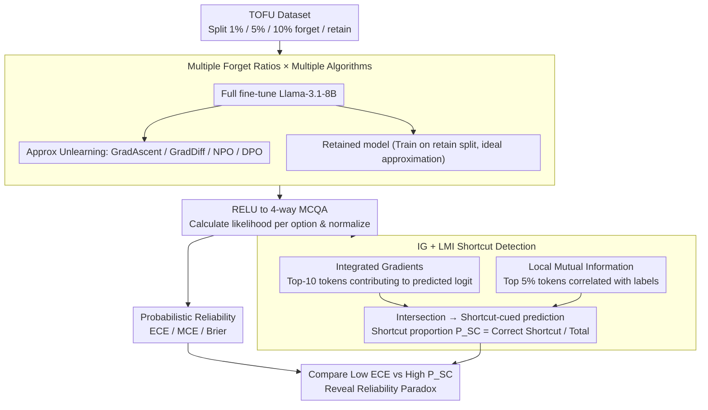

# Calibration vs Decision Making: Revisiting the Reliability Paradox in Unlearned Language Models

**Conference**: ACL2026  
**arXiv**: [2605.20915](https://arxiv.org/abs/2605.20915)  
**Code**: https://github.com/Exploration-Lab/Unlearning-Reliability-Paradox  
**Area**: LLM Security / Machine Unlearning / Reliability Evaluation  
**Keywords**: machine unlearning, calibration, reliability paradox, shortcut learning, Integrated Gradients

## TL;DR
This paper demonstrates that after machine unlearning, LLMs may rely more on dataset shortcut tokens for decision-making even while maintaining low calibration error. Consequently, using ECE, MCE, or Brier score alone is insufficient to determine if an unlearned model is reliable.

## Background & Motivation
**Background**: Machine unlearning aims to remove the influence of specific training data from a model while preserving the remaining knowledge and reliable behavior. Existing evaluations often focus on whether forgetting occurs on the forget split, whether performance is maintained on the retain split, and whether model confidence is calibrated. Calibration metrics such as ECE, MCE, and Brier score are frequently used as proxies for reliability.

**Limitations of Prior Work**: Calibration only indicates whether the probabilities provided by the model match empirical accuracy; it does not explain why the model made a specific decision. A model may have accurate confidence levels but actually depend on spurious correlations, option formats, or high-frequency words (shortcuts) rather than semantic evidence within the question.

**Key Challenge**: Unlearning explicitly modifies model parameters, which may alter internal decision rules. A model appearing well-calibrated on the retain split does not necessarily mean it still answers using reasonable features; it might maintain probabilistic performance through stronger shortcut reliance. This constitutes the reliability paradox that the authors extend to the machine unlearning context.

**Goal**: The authors aim to evaluate two types of reliability in generative decoder-only LLMs: probabilistic reliability (matching of confidence and accuracy) and decision rule reliability (dependence on semantically meaningful tokens rather than dataset-level shortcuts). The experiments target Llama-3.1-8B on TOFU/RELU MCQA across various unlearning algorithms.

**Key Insight**: The paper utilizes the multiple-choice QA (MCQA) format of RELU as a bridge. Fixed options allow LLMs to output normalizable probabilities for calibration calculation, while MCQA inputs enable the use of Integrated Gradients to analyze token contributions to the predicted option logit.

**Core Idea**: Combine calibration metrics with shortcut detection via attribution and Local Mutual Information (LMI) to observe if unlearned models exhibit the paradox of "low ECE but high shortcut proportion."

## Method
The paper does not propose a new unlearning algorithm but introduces a reliability evaluation framework. It compares pretrained, full-finetuned, retained, and various approximate unlearned models, reporting task performance, calibration error, and shortcut usage proportions on both forget and retain splits.

### Overall Architecture
Experiments use the TOFU dataset with forget ratios of 1%, 5%, and 10% to partition forget and retain data. A full-finetuned Llama-3.1-8B is obtained by training on the complete TOFU dataset. A "retained model" is trained only on the retain split as an ideal unlearning approximation. Approximate unlearning methods, including Gradient Ascent, Gradient Difference, Negative Preference Optimization (NPO), and Direct Preference Optimization (DPO), are initialized from the full-finetuned model.

For evaluation, RELU converts TOFU QA into four-option MCQA. The model calculates the likelihood of each option and normalizes them into a probability distribution. These probabilities are used to calculate accuracy, F1, Brier, ECE, and MCE. Integrated Gradients are employed to identify the top-10 tokens influencing the predicted logit, and LMI identifies the top 5% of tokens highly correlated with labels. A prediction is marked as "shortcut-cued" if a high-attribution token intersects with a high-LMI token.

### Key Designs
**1. Separation of Probabilistic and Decision Reliability: Reporting "Confidence Accuracy" and "Decision Soundness" as two distinct entities.**

A model might have low ECE and accurate probabilities but rely on dataset shortcuts instead of semantic content. Relying solely on calibration would misidentify such models as "reliable." Thus, the paper decomposes reliability: Probabilistic Reliability (ECE, MCE, Brier) measures if probabilities match empirical accuracy, while Decision Reliability (shortcut proportion $P_{SC}$ and trade-off score $T_{SC}$) measures if the model depends on non-generalizable spurious correlations. This structure reveals the failure mode where unlearning maintains retain-split accuracy and calibration while switching to shallower decision rules.

**2. Shortcut Detection via Integrated Gradients + LMI: Intersecting model-side attribution and corpus-side correlation.**

Attribution alone cannot distinguish semantic evidence from format noise, and corpus correlation alone does not prove the model utilized that correlation. The paper intersects these: Integrated Gradients measure the model-side influence of tokens on the logit, while Local Mutual Information measures statistical association between tokens and labels. When a token resides in both high-IG and high-LMI regions, it is confirmed as a shortcut cue. The shortcut reliance is defined as $P_{SC} = \frac{\text{shortcut-cued predictions}}{\text{total predictions}}$.

**3. Multi-ratio × Multi-algorithm Comparison: Using systematic sweeps to distinguish structural phenomena from noise.**

To ensure the relationship between calibration and shortcuts is structural, the authors compare multiple states (retained, GA, GD, NPO, DPO) across 1%, 5%, and 10% forget ratios. All results focus on the retain split to observe how reliability—which should be preserved—changes under varying unlearning intensities.

### Loss & Training
Full fine-tuning utilizes AdamW with a learning rate of $1\times10^{-5}$ and a linear scheduler for 5 epochs. Retained models are trained similarly on 99%, 95%, and 90% retain splits. Approximate unlearning starts from the full-finetuned model using 4-bit quantized LoRA with hyper-parameters recommended by TOFU. 

Calibration is calculated using 10 equal-width bins. IG attribution is computed relative to the predicted logit using a zero-embedding baseline and a 50-step Riemann sum approximation. Subword aggregation uses absmax to select top-10 tokens per sample. LMI identifies the top 5% of tokens per label as shortcut candidates.

## Key Experimental Results

### Main Results
The following table highlights the 90% retain setting, where the reliability paradox is most prominent.

| Model State | Acc | F1 | Brier | ECE | MCE | $P_{SC}$ | $T_{SC}$ | Explanation |
|----------|-----|----|-------|-----|-----|----------|----------|------|
| Pretrained | 0.266 | 0.146 | 1.144 | 0.516 | 0.665 | 80.0 | 0.047 | Near random, poor calibration |
| Full finetuned | 0.694 | 0.699 | 0.410 | 0.039 | 0.070 | 85.0 | 0.431 | Good performance & calibration, but high shortcut |
| Retained | 0.639 | 0.640 | 0.478 | 0.038 | 0.081 | 90.0 | 0.393 | Low ECE but higher shortcut than Full |
| GradAscent | 0.235 | 0.155 | 0.841 | 0.209 | 0.383 | 92.5 | 0.073 | Degraded performance & calibration |
| GradDiff | 0.476 | 0.472 | 0.689 | 0.133 | 0.221 | 92.5 | 0.255 | Lower performance, high shortcut |
| NPO | 0.527 | 0.525 | 0.601 | 0.101 | 0.159 | 92.5 | 0.304 | Moderate performance, high shortcut |
| DPO | 0.483 | 0.434 | 0.648 | 0.052 | 0.089 | 92.5 | 0.266 | Low ECE but significantly high shortcut |

Across forget ratios, DPO's $P_{SC}$ increases as the forget ratio rises, even while ECE remains low.

| Forget / Retain | Model | Retain ECE | Retain $P_{SC}$ | Key Insight |
|-----------------|------|------------|------------------|----------|
| 1% / 99% | Full | 0.040 | 85.0 | Well-calibrated after finetuning |
| 1% / 99% | DPO | 0.033 | 85.0 | Shortcuts stable at low forget ratios |
| 5% / 95% | Full | 0.040 | 85.0 | Full model is stable |
| 5% / 95% | DPO | 0.046 | 87.5 | Shortcuts begin to rise |
| 10% / 90% | Full | 0.039 | 85.0 | Persistent low ECE |
| 10% / 90% | DPO | 0.052 | 92.5 | Coexistence of low ECE and high $P_{SC}$ |

### Ablation Study
While traditional module ablation is not provided, qualitative examples of shortcuts are presented. A DPO unlearned model (90% retain) selects the correct answer A, but attribution shows reliance on functional words rather than semantic entities.

| Question Segment | Pred / Truth | Shortcut token | Attribution | LMI | Meaning |
|----------|-------------|----------------|-------------|-----|------|
| ...Cruz's family background influence his writing... | A / A | does | 0.0140 | 0.0578 | High contrib & label association, but non-semantic |
| Same question | A / A | about | 0.0103 | 0.0543 | Model exploits format/functional cues |

### Key Findings
- Pretrained models are near-random on TOFU fictitious facts (ECE > 0.5); full finetuning reduces ECE to ~0.04.
- After unlearning, models can maintain low calibration error (e.g., DPO 10% forget ratio ECE is 0.052) while $P_{SC}$ reaches 92.5%.
- Low ECE does not imply low shortcut reliance. In several cases, well-calibrated models utilize more shortcut tokens.
- $T_{SC}$ generally decreases after unlearning, but because F1 also drops, this trade-off score alone is insufficient for reliability assessment.
- Qualitative evidence shows unlearned models rely on grammatical or format cues (e.g., "does", "about") rather than semantic tokens like names or specific topics.

## Highlights & Insights
- The primary value lies in decomposing "reliability" in unlearning. Forgetting targets and maintaining accuracy is the first layer, but using sound evidence is the deeper reliability layer.
- The reliability paradox is transitioned to decoder-only LLMs and unlearning contexts, serving as a practical security warning. Low ECE should not be misinterpreted as causality or semantic understanding.
- The IG + LMI combination is elegant: one captures model reliance, the other captures dataset-level statistical correlation.
- Results suggest unlearning algorithms may employ shortcut compensation to maintain surface-level reliability after losing specific facts.

## Limitations & Future Work
- Only Llama-3.1-8B was evaluated; behaviors might differ across model sizes, architectures, or instruction-tuning styles.
- Experiments are restricted to TOFU/RELU MCQA, which may not represent open-ended generative unlearning reliability.
- Shortcut detection is an approximation. IG is sensitive to baselines and aggregation methods, and LMI only captures statistical associations.
- Calibration is calculated on MCQA option probabilities; token-level or sequence-level calibration in open generation remains an open challenge.
- Robustness and OOD performance were not evaluated; future work should examine if shortcut reliance leads to safety issues in deployment.

## Related Work & Insights
- **vs TOFU / RELU**: While these provide protocols, this work adds calibration and shortcut attribution analysis.
- **vs Reliability Paradox (Bihani and Rayz)**: Previous work focused on encoder classifiers; this extends the concept to decoder-only LLMs and unlearning.
- **vs Standard Unlearning Evaluation**: Metrics focusing only on accuracy ignore how models achieve those scores. This paper highlights that models can maintain accuracy and ECE through shortcut cues.

## Rating
- Novelty: ⭐⭐⭐⭐☆ Effectively introduces the reliability paradox to machine unlearning.
- Experimental Thoroughness: ⭐⭐⭐☆☆ Valuable sweeps across ratios and algorithms, though limited by model and benchmark variety.
- Writing Quality: ⭐⭐⭐⭐☆ Clear explanations of metrics and results.
- Value: ⭐⭐⭐⭐☆ Provides a direct warning regarding the use of ECE as a proxy for trust in unlearning safety.

<!-- RELATED:START -->

## Related Papers

- [\[ACL 2026\] Revisiting Non-Verbatim Memorization in Large Language Models: The Role of Entity Surface Forms](revisiting_non-verbatim_memorization_in_large_language_models_the_role_of_entity.md)
- [\[ACL 2026\] Making MLLMs Blind: Adversarial Smuggling Attacks in MLLM Content Moderation](making_mllms_blind_adversarial_smuggling_attacks_in_mllm_content_moderation.md)
- [\[ACL 2025\] A Statistical and Multi-Perspective Revisiting of the Membership Inference Attack in Large Language Models](../../ACL2025/llm_safety/a_statistical_and_multi-perspective_revisiting_of_the_membership_inference_attac.md)
- [\[ACL 2026\] Before Forgetting, Learn to Remember: Revisiting Foundational Learning Failures in LVLM Unlearning Benchmarks](before_forgetting_learn_to_remember_revisiting_foundational_learning_failures_in.md)
- [\[ICLR 2026\] Revisiting the Past: Data Unlearning with Model State History](../../ICLR2026/llm_safety/revisiting_the_past_data_unlearning_with_model_state_history.md)

<!-- RELATED:END -->
