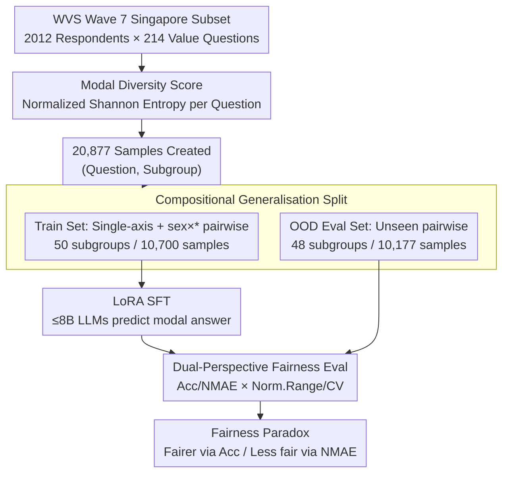

# Can Persona-Prompted LLMs Emulate Subgroup Values? An Empirical Analysis of Generalisability and Fairness in Cultural Alignment

**Conference**: ACL 2026  
**arXiv**: [2604.12851](https://arxiv.org/abs/2604.12851)  
**Code**: To be confirmed  
**Area**: LLM Safety / Values  
**Keywords**: cultural alignment, subgroup, persona emulation, fairness, WVS

## TL;DR
Ours uses a subset of the Singapore World Values Survey as a case study to construct 20,877 (question, subgroup) samples, verifying whether LLMs can simulate fine-grained demographic subgroup value preferences. Results show GPT-4.1 zero-shot achieves only 57.4% accuracy; simple SFT yields an average 17.4% gain on OOD subgroups, but subgroup gaps widen from an NMAE perspective, with models showing persistent preferences for young/male/Chinese/Christian personas.

## Background & Motivation

**Background**: Existing LLM alignment paradigms (RLHF + DPO, etc.) almost exclusively treat "human values" as a monolithic global target, often reflecting Western-centric value preferences, which has been critiqued as the "coloniality of knowledge." Benchmarks like WorldValuesBench have elevated alignment analysis to the national level, yet still overlook value divergences between subgroups within a single nation.

**Limitations of Prior Work**: (1) National-level alignment makes LLMs appear useful for certain subgroups (e.g., young male Chinese Christians) while performing poorly or even offensively for others (e.g., elderly Malay Muslims), a bias masked by average benchmarks; (2) Existing persona-prompt research mostly simulates "archetypes" (e.g., "doctor") without calibration against real demographic data, often introducing pseudo-biases; (3) Three questions remain systematically unanswered: how large are value conflicts between subgroups, can they be aligned using simple methods, and how does fairness change after alignment.

**Key Challenge**: Single global alignment vs. value diversity across hundreds of subgroups. This presents a trade-off: either sacrifice diversity (one-size-fits-all) or collect preference data for every intersectional persona (not scalable).

**Goal**: (1) Quantify the mapping of a multicultural society's value landscape to identify points of consensus and conflict; (2) Examine whether simple SFT can generalize to unseen intersectional personas and open-ended generation; (3) Evaluate the impact of alignment on subgroup fairness.

**Key Insight**: Singapore is selected as a "microcosm of a pluralistic society"—comprising three major ethnic groups (Chinese, Malay, Indian) and multiple religions (Buddhism, Islam, Christianity, Hinduism, and non-religious), with rich stratification dimensions despite its small geography. Ours uses anchor data from 214 value questions answered by 2,012 Singaporean respondents in WVS Wave 7.

**Core Idea**: Subgroup alignment is operationalized as a modal answer prediction task for intersectional personas (sex × age × ethnicity × religion). Structured numerical preferences are used for SFT to learn compositional persona representations, testing their ability to generalize to intersections not seen during training (e.g., ethnicity × religion).

## Method

### Overall Architecture
The core question addressed is whether persona-prompted LLMs can simulate fine-grained demographic subgroup values within a country, whether simple SFT can bridge this capability gap, and whether the resulting subgroups are more or less equitable. Taking Singapore's WVS Wave 7 data as an anchor: raw responses from 2,012 respondents across 214 questions are collected. A Modal Diversity Score quantifies conflict across subgroups for each question to locate topics requiring subgroup-aware alignment. Data is organized into 20,877 (question, subgroup) samples, split into 50 fundamental strata for the Train Set and 48 unseen intersectional strata for the OOD Eval Set. Finally, LoRA SFT is performed on seven $\le$8B open-source LLMs across structured numerical prediction and open-ended generation tasks, evaluated using Acc/NMAE/Win Rate for performance and Norm. Range / CV for fairness.

### Key Designs

**1. Modal Diversity Score: Quantifying subgroup divergence to prioritize topics for alignment**

Traditional benchmarks only report overall accuracy, failing to identify which topics are most divisive within a nation. The Modal Diversity Score collects modal answers for all subgroups within a stratum (e.g., sex_x_age) and calculates the normalized Shannon entropy of these modes:

$$\text{Score}_{\text{MD}} = \frac{-\sum_{m\in M}p(m)\log_2 p(m)}{\log_2 (\min(|S|,|C|))}$$

Where $M$ is the set of unique modes and $p(m)$ is the proportion of subgroups choosing mode $m$. 0 indicates consensus; 1 indicates extreme divergence. Mean pairwise Wasserstein distance is also used for ordinal-aware verification. This identifies the most divisive topics (Religious Values avg. 0.318) and most consistent (Social Capital 0.084).

**2. Compositional Generalisation Split: Separating rote memorization from compositional reasoning**

To ensure accuracy gains reflect compositional learning rather than memorizing persona-answer mappings, the data is split into non-overlapping halves. The Train Set contains single-axis strata (sex, age_group, etc.) and specific pairwise strata (sex × age, etc., totaling 50 subgroups). The Eval(OOD) Set contains three pairwise combinations never seen during training (age × religion, age × ethnicity, ethnicity × religion, totaling 48 subgroups). Each subgroup included at least 30 individuals. Accuracy gains on unseen combinations like ethnicity × religion can be purely attributed to the ability to synthesize single-axis preferences into intersectional ones.

**3. Dual-Perspective Fairness Evaluation: Cross-referencing Acc/NMAE with Norm.Range/CV**

Average accuracy improvements do not guarantee increased fairness. Accuracy treats "1-point off" the same as "5-points off," potentially masking widened gaps. Ours uses two comparisons: Accuracy (ordinal-agnostic) vs. NMAE (ordinal-aware); and Norm. Range $=(P_{\max}-P_{\min})/P_{\max}$ (extreme gap) vs. CV $=\sigma/\mu$ (overall dispersion). This reveals a paradox: SFT reduces the Norm. Range for Accuracy from 0.240 to 0.179 (appearing fairer), but increases it for NMAE from 0.280 to 0.336 (actually less fair), as SFT pulls weaker subgroups above the passing line while pushing dominant subgroups to even higher precision.

### Loss & Training
All open-source models use LoRA SFT with a learning rate of $1\times 10^{-6}$ for 1 epoch. Inputs describe the persona and question; outputs are modal numerical answers. Open-ended evaluation uses Mistral-Small-3.1-24B (INT8) as a judge against GPT-4.1, with two swaps to eliminate position bias. Win Rate is calculated as $\text{WR}_c = (s_{1,c}+s_{2,c})/2$, where Win=1, Tie=0.5, Loss=0.

## Key Experimental Results

### Main Results
Comparison of 7 open-source and 4 closed-source models on the OOD split (selected):

| Model | Acc Base | Acc SFT (Gain) | NMAE Base | NMAE SFT (Gain) | Overall WR Base | Overall WR SFT |
|------|----------|-------------|-----------|--------------|-----------------|----------------|
| Llama-3.1-8B | .514 | **.685** (+.171) | .258 | .143 (-.115) | .294 | .320 (+.026) |
| Llama-3.2-3B | .442 | .508 (+.066) | .308 | .238 (-.070) | .230 | .234 (+.004) |
| SEA-LION-v3-8B | **.530** | .642 (+.112) | .222 | .158 (-.064) | **.428** | **.430** (+.002) |
| Qwen2.5-7B | .442 | .661 (+.219) | .243 | .157 (-.086) | .223 | .246 (+.023) |
| Sailor2-8B | .356 | **.720** (+**.364**) | .332 | .125 (-.207) | .217 | .255 (+.038) |
| SeaLLMs-v3-7B | .440 | .696 (+.256) | .256 | .135 (-.121) | .082 | .081 (-.001) |
| Phi-4-mini | .427 | .456 (+.029) | .267 | .256 (-.011) | .175 | .161 (-.014) |
| **Open-source Avg** | **.450** | **.624** (+**.174**) | **.269** | **.173** (-.096) | .236 | .247 (+.011) |
| GPT-4.1 | .574 | – | .182 | – | .500 | – |
| GPT-4o | .565 | – | .189 | – | .370 | – |
| GPT-4o-mini | .490 | – | .217 | – | .310 | – |

**Main Observations**: (1) GPT-4.1 zero-shot is only 57.4%, confirming subgroup alignment as a difficult task; (2) Open-source models gain 17.4% on average after SFT, with several (Sailor2, SeaLLMs, Llama-3.1) surpassing GPT-4.1 in OOD performance; (3) SEA-LION-v3 has the strongest base (regional pre-training works), but the smallest SFT gain; (4) Open-ended Win Rate gain is small (+1.1%), but the Value dimension increases by 2.2%, indicating structured training partially transfers to free generation.

### Ablation Study (OOD split)

| Model | Acc Norm.Range Base→SFT | Acc CV Base→SFT | NMAE Norm.Range Base→SFT | NMAE CV Base→SFT |
|------|--------------------------|------------------|--------------------------|------------------|
| Llama-3.1-8B | .174 → .188 | .056 → .054 | .250 → **.426** | .085 → .133 |
| Qwen2.5-7B | .256 → .169 | .089 → .055 | .318 → .352 | .108 → .135 |
| Sailor2-8B | .305 → .145 | .101 → .044 | **.228 → .343** | .068 → .129 |
| SeaLLMs-v3 | .276 → .124 | .094 → .037 | .294 → .318 | .108 → .111 |
| **Avg** | .240 → **.179** | .078 → .054 | .280 → **.336** | .094 → .116 |

**Fairness Paradox**: Accuracy-based fairness improves for all models, but NMAE-based fairness deteriorates in almost all cases (放大 gaps for dominant subgroups).

### Key Findings
- **GPT-4.1 still only 57.4%**: Shows subgroup-aware alignment cannot be solved by prompt engineering alone; closed-source SOTA remains limited.
- **Persistent Bias Patterns**: All models, both base and SFT, systematically favor young/male/Chinese/Christian personas, with worse performance for elderly/Malay/Indian/Muslim personas. SFT widens this gap in NMAE.
- **SFT reduces refusal**: Refusal rates for sensitive topics (homosexuality, domestic violence) dropped from 6.66% to near zero, revealing tension between safety alignment and cultural emulation.
- **Sailor2 gain of +36.4%**: Southeast Asian multilingual models show strong synergy between regional pre-training and fine-tuning.
- **Religious Values most divisive (MDS=0.318)**: Reflects Singapore's religious diversity; Social Capital & Trust is the most consistent (0.084).

## Highlights & Insights
- **Modal Diversity Score is a reusable tool**: Normalized Shannon entropy can quantify "subgroup conflict" in any stratified survey, transferable to healthcare, politics, or education.
- **Compositional split as a gold standard**: Training on sex × age and testing on age × ethnicity provides a true OOD test for persona generalization.
- **Fairness paradox warning**: Subgroup-balanced training does not equal subgroup-equitable outcomes; coarse metrics (Accuracy) can hide inequality increases seen in fine metrics (NMAE).
- **Transfer from structured to open-ended**: SFT using numerical modal answers improves open-ended Value WR, suggesting updates to internal persona representations rather than surface-level mapping.

## Limitations & Future Work
- Focus on Singapore WVS Wave 7 limits immediate cross-national generalizability.
- Using modal answers simplifies intra-subgroup distribution, potentially silencing minority views; distributional alignment is a preferred future direction.
- Only explored SFT; DPO, GRPO, or group-conditioning methods were not compared.
- Subjectivity in the persona criterion is reflected in low inter-human agreement (w-Kappa 0.388).

## Related Work & Insights
- **vs WorldValuesBench (Zhao 2024)**: They focus on national values; Ours examines finer-grained intra-country subgroups.
- **vs CulturalLLM (Li 2024)**: They use cultural data for training but focus on cross-country differences; Ours focuses on intersectional differences.
- **vs "Whose opinions" (Santurkar 2023)**: They reveal LLM demographic bias; Ours quantifies and attempts to correct it through SFT.

## Rating
- Novelty: ⭐⭐⭐⭐ MDS, compositional OOD split, and the fairness paradox are original, though SFT itself is standard.
- Experimental Thoroughness: ⭐⭐⭐⭐⭐ Comprehensive cross-model evaluation (7 open, 4 closed), 2 tasks, multiple fairness metrics, and human-calibrated LLM judges.
- Writing Quality: ⭐⭐⭐⭐⭐ Clear overview in Figure 1, with precise definitions and honest discussion of limitations.
- Value: ⭐⭐⭐⭐⭐ Acts as a wake-up call for cultural alignment—average gains do not imply fairness, and SFT may amplify pre-existing biases.

<!-- RELATED:START -->

## Related Papers

- [\[NeurIPS 2025\] Distributive Fairness in Large Language Models: Evaluating Alignment with Human Values](../../NeurIPS2025/llm_safety/distributive_fairness_in_large_language_models_evaluating_alignment_with_human_v.md)
- [\[ACL 2026\] CAP: Controllable Alignment Prompting for Unlearning in LLMs](cap_controllable_alignment_prompting_for_unlearning_in_llms.md)
- [\[ACL 2026\] Decomposed Trust: Privacy, Adversarial Robustness, Ethics, and Fairness in Low-Rank LLMs](decomposed_trust_privacy_adversarial_robustness_ethics_and_fairness_in_low-rank_.md)
- [\[ACL 2026\] How Should We Enhance the Safety of Large Reasoning Models: An Empirical Study](how_should_we_enhance_the_safety_of_large_reasoning_models_an_empirical_study.md)
- [\[AAAI 2026\] Can Editing LLMs Inject Harm?](../../AAAI2026/llm_safety/can_editing_llms_inject_harm.md)

<!-- RELATED:END -->
