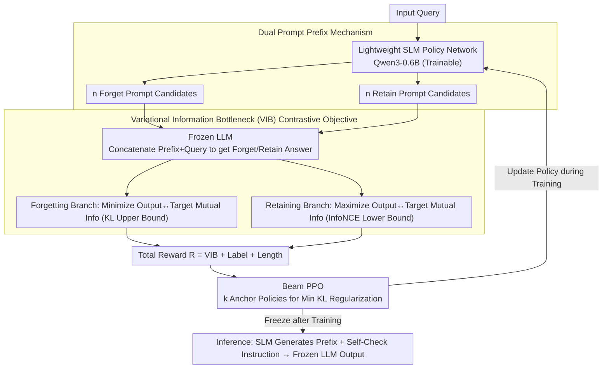

# CAP: Controllable Alignment Prompting for Unlearning in LLMs

**Conference**: ACL 2026  
**arXiv**: [2604.21251](https://arxiv.org/abs/2604.21251)  
**Code**: None  
**Area**: Reinforcement Learning  
**Keywords**: LLM Unlearning, Prompt-driven, Reinforcement Learning, Controllable Alignment, Knowledge Elimination

## TL;DR

This paper proposes the CAP framework, which guides frozen LLMs to selectively unlearn target knowledge by training a lightweight SLM to generate controllable prompt prefixes. This approach requires no modification to model parameters, achieving reversible and transferable LLM knowledge unlearning.

## Background & Motivation

**Background**: LLMs are inevitably trained on unfiltered corpora, leading to the retention of sensitive information. Regulations such as GDPR necessitate selective knowledge unlearning. Existing methods primarily achieve this by modifying model parameters.

**Limitations of Prior Work**: (1) High computational costs associated with retraining and gradient-based methods; (2) Uncontrollable unlearning boundaries, often resulting in overall performance degradation; (3) Strict reliance on model weight access, making them inapplicable to closed-source models; (4) Existing non-intrusive methods depend on empirical prompt design and lack systematic end-to-end training frameworks.

**Key Challenge**: Methods that modify parameters are direct but costly and irreversible, while non-intrusive methods (such as prompt engineering) are lightweight but lack controllability and systematic optimization.

**Goal**: Design an end-to-end prompt-driven unlearning framework to achieve precise, controllable, and reversible knowledge unlearning without modifying LLM parameters.

**Key Insight**: Reframe the unlearning problem as an inference-time control problem—training a lightweight SLM as a policy network to generate input-conditioned control prefixes that guide the output behavior of the frozen LLM.

**Core Idea**: The SLM generates two types of prompt prefixes (forgetting prompts and retaining prompts) for each input query. These are optimized using a Variational Information Bottleneck (VIB) contrastive objective and Beam PPO reinforcement learning, enabling the LLM to suppress target knowledge while maintaining general capabilities.

## Method

### Overall Architecture

The core idea of CAP is to shift "unlearning" from parameter modification to input modification: the LLM remains frozen, while a lightweight SLM (Qwen3-0.6B in the main experiments) is trained as a policy network to generate on-the-fly control prefixes for each query. The workflow consists of two stages: the training phase uses RL to optimize the prompt generator to produce effective forgetting/retaining prefixes; the inference phase freezes the SLM, which generates prefixes that are concatenated with a Self-Check instruction and fed to the LLM. Since the unlearning logic is encapsulated within discrete prompts, the original model can be restored losslessly by removing the prompt generator, which is why CAP is "reversible and transferable to closed-source models."

### Key Designs

**1. Dual Prompt Prefix Mechanism: Decoupling unlearning and retention into two independent optimization directions.**

If a single prompt is used to simultaneously "suppress target knowledge" and "preserve general capabilities," the two objectives often conflict within the same text, making simultaneous optimization difficult. CAP addresses this by having the SLM generate $n$ forgetting prompt candidates $\mathcal{P}_f^k$ and $n$ retaining prompt candidates $\mathcal{P}_r^k$ for each query. These are concatenated with the query and fed into the frozen LLM to generate corresponding answers. Consequently, forgetting and retaining are decoupled into independent branches, preventing reward signals from canceling each other out and making the unlearning boundary more controllable.

**2. Variational Information Bottleneck (VIB) Contrastive Objective: Defining "forgetting" and "retaining" through information theory rather than heuristic rewards.**

Heuristic rewards (e.g., scoring correct/incorrect answers) fail to quantify exactly how much information is suppressed during unlearning. CAP models this at the information-theoretic level: for the forgetting branch, it minimizes the mutual information between the LLM output and the target label—approximated by its variational upper bound (a KL divergence term); for the retaining branch, it maximizes the mutual information—approximated by the InfoNCE lower bound. The two branches are jointly optimized, with a coefficient $\beta$ controlling the trade-off between compression and retention. Treating unlearning as "compressing information about target knowledge" and retention as "preserving information about general capabilities" provides a clear theoretical grounding for the optimization.

**3. Beam PPO: Adding anchors to prompt policy exploration to prevent PPO collapse into single modes.**

The action space for prompt generation is discrete and immense, making standard PPO prone to local optima or strategy collapse (repeatedly generating the same type of prompt). CAP introduces Beam PPO, which maintains a beam of $k$ anchor policies. During optimization, it uses the **minimum** KL divergence of the current policy $\pi_\theta$ relative to all anchor policies as a regularizer. This allows the policy to explore multiple paths simultaneously as long as it does not deviate too far from any single anchor. This preserves exploration diversity while covering a larger parameter space, making training more stable than standard PPO with single-point regularization.

### Loss & Training

The total reward function is defined as $\mathcal{R} = \lambda_{VIB} \cdot \mathcal{R}_{VIB} + \lambda_{label} \cdot \mathcal{R}_{label} + \lambda_{len} \cdot \mathcal{R}_{len}$: the VIB reward guides information compression/retention, the label reward assesses the alignment of forgetting/retaining branches with the target, and length regularization encourages prompts to remain concise. The Beam PPO objective function overlays a multi-anchor KL regularization term onto the standard PPO clip loss.

## Key Experimental Results

### Main Results

| Model | Method | RWKU ASG↓ | WMDP Bio Acc↓ | MMLU Acc↑ |
|------|------|----------|--------------|----------|
| Zephyr-7B | Original | 63.0 | 63.7 | 54.1 |
| Zephyr-7B | NPO | 28.9 | 43.1 | 48.6 |
| Zephyr-7B | ICUL | 30.3 | 44.9 | 44.5 |
| Zephyr-7B | **Ours** | **6.2** | **24.8** | **51.5** |
| GPT-4.1 | ICUL | 36.7 | 38.6 | 81.5 |
| GPT-4.1 | **Ours** | **7.5** | **35.9** | **80.6** |
| Claude-Sonnet-4 | **Ours** | **7.4** | **30.1** | **84.2** |

### Ablation Study

| Configuration | Forget Acc↓ | Retain Acc↑ | Description |
|------|----------|----------|------|
| w/o IB + Std PPO | 37.5 | 49.8 | No structured reward |
| + IB + B-PPO (Full CAP) | 24.8 | 51.5 | Best balance |
| Forget VIB Only | 25.6 | 44.7 | Retain performance compromised |
| Retain VIB Only | 38.6 | 52.2 | Forget capability weakened |
| Random Selection vs Self-Check | 26.2/24.8 | 48.5/51.5 | Self-Check fine-tunes stability |

### Key Findings
- CAP reduces ASG from 63.0 to 6.2 in generative tasks (Zephyr-7B), significantly outperforming all baselines.
- In discriminative tasks, CAP markedly reduces WMDP accuracy while maintaining near-original MMLU performance.
- CAP transfers seamlessly to closed-source models (GPT-4.1, Claude-Sonnet-4, DeepSeek-V3, etc.) using only discrete prompts.
- Optimal hyperparameters are found at beam size $k=4$, candidate count $n=3$, and maximum prompt length $L=16$.
- Different SLMs (Qwen3-0.6B, Qwen2.5-0.5B, Gemma3-1B) effectively guide unlearning, demonstrating the model-agnostic nature of the method.

## Highlights & Insights
- Shifting unlearning from the parameter space to the output space via discrete prompts is a core innovation—the original model is restored simply by removing the prompt generator.
- The VIB contrastive objective unifies unlearning (compression) and retention (preservation) from an information-theoretic perspective, which is more elegant than heuristic rewards.
- The improvements in Beam PPO over standard PPO have general value beyond unlearning tasks.
- Hidden state visualization intuitively demonstrates how prompts redirect internal activations from knowledge regions to safety/refusal regions.

## Limitations & Future Work
- Two-stage inference (SLM generating prefix + LLM generating output) introduces marginal latency overhead.
- Generated control prefixes occupy a small portion of the LLM context window.
- While various SLMs were verified, the selection of the optimal SLM (fixed as Qwen3-0.6B in the main study) has not been fully explored.
- Though superior to baselines, robustness under adversarial attacks is not yet perfect.

## Related Work & Insights
- **vs LLMU/NPO**: These require modifying LLM parameters and are inapplicable to closed-source models; CAP requires no parameter modification.
- **vs ICUL**: ICUL uses in-context learning for unlearning but lacks negative samples, showing poor adaptability to adversarial distributions; CAP's RL-optimized prompts offer better generalization.
- **vs SPUL**: SPUL uses soft prompt tuning but still requires gradient backpropagation; CAP uses discrete prompts without needing access to LLM gradients.
- **vs Pawelczyk et al.**: They proposed a classifier-based non-intrusive method that relies on classifier accuracy; CAP's end-to-end optimization is more reliable.

## Rating
- Novelty: ⭐⭐⭐⭐⭐ End-to-end prompt-driven unlearning paradigm with elegant VIB + Beam PPO design.
- Experimental Thoroughness: ⭐⭐⭐⭐⭐ Covers 7 LLMs (including closed-source), multiple datasets, comprehensive ablation, and sensitivity analysis.
- Writing Quality: ⭐⭐⭐⭐ Clear methodological exposition with complete theoretical derivations.
- Value: ⭐⭐⭐⭐⭐ Significant practical value for the problem of unlearning in closed-source LLMs.

<!-- RELATED:START -->

## Related Papers

- [\[ICLR 2026\] Any-Depth Alignment: Unlocking Innate Safety Alignment of LLMs to Any-Depth](../../ICLR2026/llm_safety/any-depth_alignment_unlocking_innate_safety_alignment_of_llms_to_any-depth.md)
- [\[ACL 2026\] Can Persona-Prompted LLMs Emulate Subgroup Values? An Empirical Analysis of Generalisability and Fairness in Cultural Alignment](can_persona-prompted_llms_emulate_subgroup_values_an_empirical_analysis_of_gener.md)
- [\[ICLR 2026\] Inoculation Prompting: Eliciting traits from LLMs during training can reduce trait expression at test-time](../../ICLR2026/llm_safety/inoculation_prompting_eliciting_traits_from_llms_during_training_can_reduce_trai.md)
- [\[ICLR 2026\] Operationalizing Data Minimization for Privacy-Preserving LLM Prompting](../../ICLR2026/llm_safety/operationalizing_data_minimization_for_privacy-preserving_llm_prompting.md)
- [\[CVPR 2026\] SineProject: Machine Unlearning for Stable Vision–Language Alignment](../../CVPR2026/llm_safety/sineproject_machine_unlearning_for_stable_vision_language_alignment.md)

<!-- RELATED:END -->
