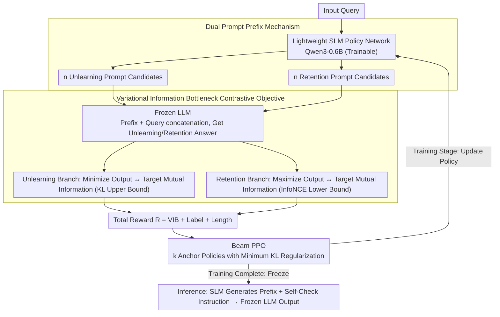

# CAP: Controllable Alignment Prompting for Unlearning in LLMs

**Conference**: ACL 2026  
**arXiv**: [2604.21251](https://arxiv.org/abs/2604.21251)  
**Code**: None  
**Area**: Reinforcement Learning  
**Keywords**: LLM Unlearning, Prompt-driven, Reinforcement Learning, Controllable Alignment, Knowledge Elimination

## TL;DR

The CAP framework is proposed to guide a frozen LLM to selectively unlearn target knowledge by training a lightweight SLM to generate controllable prompt prefixes. This approach requires no modification to model parameters, achieving reversible and transferable knowledge unlearning in LLMs.

## Background & Motivation

**Background**: LLMs are trained on unfiltered corpora and inevitably retain sensitive information. Regulations such as GDPR require selective knowledge unlearning. Existing methods primarily achieve this by modifying model parameters.

**Limitations of Prior Work**: (1) Retraining and gradient-based methods involve high computational costs; (2) Unlearning boundaries are often uncontrollable, leading to general performance degradation; (3) Strict reliance on model weight access makes these methods unavailable for closed-source models; (4) Existing non-intrusive methods depend on empirical prompt design and lack a systematic end-to-end training framework.

**Key Challenge**: Parameter modification methods are direct but costly and irreversible, while non-parameter modification methods (such as prompt engineering) are lightweight but lack controllability and systematic optimization.

**Goal**: Design an end-to-end prompt-driven unlearning framework to achieve precise, controllable, and reversible knowledge unlearning without modifying LLM parameters.

**Key Insight**: The unlearning problem is transformed into an inference-time control problem—training a lightweight SLM as a policy network to generate input-conditioned control prefixes that guide the output behavior of the frozen LLM.

**Core Idea**: The SLM generates two types of prompt prefixes (unlearning and retention prompts) for each input query. These are optimized using a Variational Information Bottleneck contrastive objective and Beam PPO reinforcement learning, enabling the LLM to suppress target knowledge while maintaining general capabilities.

## Method

### Overall Architecture

The core concept of CAP is to shift "unlearning" from parameter modification to input modification. The LLM remains frozen, while a lightweight SLM (Qwen3-0.6B in the main experiments) is trained as a policy network to generate on-the-fly control prefixes for each query. The process consists of two stages: in the training stage, the prompt generator is optimized using RL to produce effective unlearning/retention prefixes; in the inference stage, the SLM is frozen and generates a prefix, which is then concatenated with a Self-Check instruction and fed into the LLM for the final output. Since the unlearning logic is contained within discrete prompts, the original model can be fully restored by removing the prompt generator, which is the root cause of CAP's "reversibility and transferability to closed-source models."

### Key Designs

**1. Dual Prompt Prefix Mechanism: Decoupling Unlearning and Retention into Two Independent Optimization Paths**

If a single prompt is used to simultaneously "suppress target knowledge" and "preserve general capability," the two objectives may conflict within the same text, making simultaneous optimization difficult. CAP addresses this by having the SLM generate $n$ unlearning prompt candidates $\mathcal{P}_f^k$ and $n$ retention prompt candidates $\mathcal{P}_r^k$ for each query. These are concatenated with the query and fed into the frozen LLM to obtain a set of unlearning and retention answers. This decouples unlearning and retention into two independently optimizable branches, ensuring reward signals do not cancel each other out and making the unlearning boundary more controllable.

**2. Variational Information Bottleneck Contrastive Objective (VIB): Defining "Unlearning" and "Retention" via Information Theory**

Heuristic rewards (such as scoring correct/incorrect answers) fail to quantify how much information is suppressed during unlearning. CAP models this at the information-theoretic level: for the unlearning branch, it minimizes the mutual information between the LLM output and target labels—approximated by its variational upper bound (a KL divergence term); for the retention branch, it maximizes the mutual information between the output and labels—approximated by the InfoNCE lower bound. The two branches are jointly optimized, with a coefficient $\beta$ controlling the trade-off between compression and retention. Treating unlearning as "compressing information about target knowledge" and retention as "preserving information about general capabilities" provides the optimization with clear theoretical meaning rather than relying on heuristic reward rules.

**3. Beam PPO: Adding Anchor Points to Prompt Policy Exploration to Avoid Collapse**

The action space for prompt generation is discrete and vast, making standard PPO prone to local optima or strategy collapse (repeatedly generating the same type of prompt). CAP utilizes Beam PPO, which maintains a beam of $k$ anchor policies. During optimization, it uses the **minimum** KL divergence of the current policy $\pi_\theta$ relative to all anchor policies as a regularization term. This allows the policy to explore along multiple paths simultaneously, provided it does not deviate too far from any single anchor point. This maintains exploration diversity while covering a larger parameter space, resulting in more stable training than standard PPO with single-point regularization.

### Loss & Training

The total reward function is defined as $\mathcal{R} = \lambda_{VIB} \cdot \mathcal{R}_{VIB} + \lambda_{label} \cdot \mathcal{R}_{label} + \lambda_{len} \cdot \mathcal{R}_{len}$. The VIB reward guides the aforementioned information compression/retention, the label reward evaluates the alignment of the unlearning/retention branches with targets, and length regularization encourages prompts to remain concise and close to an ideal length. The Beam PPO objective function overlays a multi-anchor KL regularization term onto the standard PPO clip loss.

## Key Experimental Results

### Main Results

| Model | Method | RWKU ASG↓ | WMDP Bio Acc↓ | MMLU Acc↑ |
|------|------|----------|--------------|----------|
| Zephyr-7B | Original | 63.0 | 63.7 | 54.1 |
| Zephyr-7B | NPO | 28.9 | 43.1 | 48.6 |
| Zephyr-7B | ICUL | 30.3 | 44.9 | 44.5 |
| Zephyr-7B | **CAP** | **6.2** | **24.8** | **51.5** |
| GPT-4.1 | ICUL | 36.7 | 38.6 | 81.5 |
| GPT-4.1 | **CAP** | **7.5** | **35.9** | **80.6** |
| Claude-Sonnet-4 | **CAP** | **7.4** | **30.1** | **84.2** |

### Ablation Study

| Configuration | Unlearning Acc↓ | Retention Acc↑ | Description |
|------|----------|----------|------|
| W/o IB + Std PPO | 37.5 | 49.8 | No structured reward |
| + IB + B-PPO (Full CAP) | 24.8 | 51.5 | Best balance |
| Unlearning VIB only | 25.6 | 44.7 | Retention performance compromised |
| Retention VIB only | 38.6 | 52.2 | Unlearning ability weakened |
| Random Selection vs Self-Check | 26.2/24.8 | 48.5/51.5 | Self-Check for stability fine-tuning |

### Key Findings
- CAP reduces ASG from 63.0 to 6.2 (Zephyr-7B) in generative tasks, significantly outperforming all baselines.
- In discriminative tasks, CAP notably lowers WMDP accuracy while maintaining MMLU performance near original levels.
- CAP transfers seamlessly to closed-source models (GPT-4.1, Claude-Sonnet-4, DeepSeek-V3, etc.) using only discrete prompts.
- Optimal hyperparameters include beam size $k=4$, candidate count $n=3$, and maximum prompt length $L=16$.
- Method model-agnosticism is demonstrated as various SLMs (Qwen3-0.6B, Qwen2.5-0.5B, Gemma3-1B) effectively guide unlearning.

## Highlights & Insights
- Shifting unlearning from parameter space to output space via discrete prompts is the core innovation—removing the prompt generator restores the original model.
- The VIB contrastive objective unifies unlearning (compression) and retention (preservation) from an information-theoretic perspective, which is more elegant than heuristic rewards.
- The improvements of Beam PPO over standard PPO have general value beyond unlearning tasks.
- Hidden state visualization intuitively shows how prompts redirect internal activations from knowledge regions to safety/refusal regions.

## Limitations & Future Work
- Two-stage inference (SLM generating prefixes + LLM generating output) introduces marginal latency overhead.
- Generated control prefixes occupy a small portion of the LLM context window.
- The SLM choice was fixed to Qwen3-0.6B (main experiment); although others were validated, the optimal SLM selection remains unexplored.
- Robustness under adversarial attacks is better than baselines but still not perfect.

## Related Work & Insights
- **vs LLMU/NPO**: These require modifying LLM parameters and are inapplicable to closed-source models; CAP requires no parameter modification.
- **vs ICUL**: ICUL uses in-context learning for unlearning but lacks negative samples and adapts poorly to adversarial distributions; CAP offers stronger generalization through RL-optimized prompts.
- **vs SPUL**: SPUL uses soft prompt tuning but still requires gradient backpropagation; CAP uses discrete prompts without requiring access to LLM gradients.
- **vs Pawelczyk et al.**: They proposed a classifier-based non-intrusive method but rely on classifier accuracy; CAP's end-to-end optimization is more reliable.

## Rating
- Novelty: ⭐⭐⭐⭐⭐ End-to-end prompt-driven unlearning paradigm, elegant VIB + Beam PPO design.
- Experimental Thoroughness: ⭐⭐⭐⭐⭐ Covers 7 LLMs (including closed-source), multiple datasets, comprehensive ablation, and sensitivity analysis.
- Writing Quality: ⭐⭐⭐⭐ Clear methodological exposition and complete theoretical derivation.
- Value: ⭐⭐⭐⭐⭐ High practical value for the unlearning problem in closed-source LLMs.

<!-- RELATED:START -->

## Related Papers

- [\[ICLR 2026\] Inoculation Prompting: Eliciting Traits from LLMs during Training Can Suppress Them at Test-Time](../../ICLR2026/llm_safety/inoculation_prompting_eliciting_traits_from_llms_during_training_can_suppress_th.md)
- [\[ACL 2026\] Can Persona-Prompted LLMs Emulate Subgroup Values? An Empirical Analysis of Generalisability and Fairness in Cultural Alignment](can_persona-prompted_llms_emulate_subgroup_values_an_empirical_analysis_of_gener.md)
- [\[ICML 2026\] Multilingual Unlearning in LLMs: 转移、动力学与可逆性](../../ICML2026/llm_safety/multilingual_unlearning_in_llms_transfer_dynamics_and_reversibility.md)
- [\[CVPR 2026\] Unsafe2Safe: Controllable Image Anonymization for Downstream Utility](../../CVPR2026/llm_safety/unsafe2safe_controllable_image_anonymization_for_downstream_utility.md)
- [\[CVPR 2026\] SineProject: Machine Unlearning for Stable Vision–Language Alignment](../../CVPR2026/llm_safety/sineproject_machine_unlearning_for_stable_vision_language_alignment.md)

<!-- RELATED:END -->
