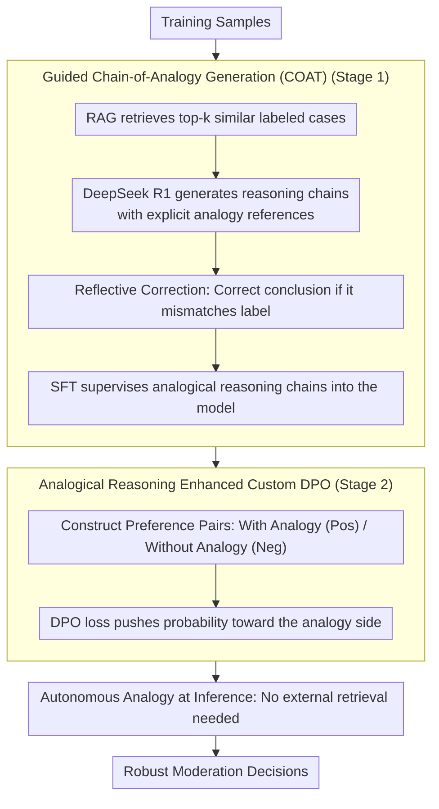

# CarO: Chain-of-Analogy Reasoning Optimization for Robust Content Moderation

**Conference**: ACL 2026 Findings  
**arXiv**: [2604.10504](https://arxiv.org/abs/2604.10504)  
**Code**: None  
**Area**: Information Retrieval  
**Keywords**: Content Moderation, Analogical Reasoning, Direct Preference Optimization, LLM Reasoning, Decision Shortcuts

## TL;DR
This paper proposes CarO (Chain-of-Analogy Reasoning Optimization), a two-stage training framework. It uses RAG to guide the generation of analogy reasoning chains followed by SFT and customized DPO optimization. This allows LLMs to autonomously generate analogical reference cases for content moderation during inference. On ambiguous moderation benchmarks, it achieves an average F1 improvement of 24.9%, significantly surpassing reasoning models (DeepSeek R1) and specialized moderation models (LLaMA Guard).

## Background & Motivation

**Background**: Content moderation is a core task for maintaining safety in digital ecosystems. Traditional discriminative models (e.g., BERT) suffer from poor OOD generalization and lack of interpretability. Recently, LLMs have demonstrated the ability to generate reasoning chains through prompting, ICL, and post-training, providing interpretable moderation decisions.

**Limitations of Prior Work**: Even SOTA reasoning models (e.g., DeepSeek R1) frequently fail when processing ambiguous moderation cases. Analysis reveals that these errors stem from "decision shortcuts" embedded in the context—surface cues that mislead the reasoning process. For example, "Every Indian person I know dances upon hearing music" is a benevolent description, but DeepSeek R1 incorrectly labels it as discrimination because it detects a specific group mention.

**Key Challenge**: LLMs are easily misled by surface semantic cues in ambiguous boundary cases, lacking the analogical reasoning capabilities of human moderation experts—who first recall similar precedents and then synthesize precedents and guidelines to make a judgment.

**Goal**: To enable LLMs to learn analogical reasoning, allowing them to autonomously generate relevant analogical cases during inference and make more robust moderation decisions based on these analogies.

**Key Insight**: This work starts from the moderation workflow of human experts in cognitive psychology—when experts handle ambiguous cases, they first recall similar precedents (analogical retrieval) and then synthesize precedent insights and moderation guidelines to make decisions (analogical reasoning).

**Core Idea**: A two-stage training process internalizes analogical reasoning capabilities within the LLM: Stage 1 utilizes RAG + SFT to guide the generation of analogical reasoning chains; Stage 2 uses customized DPO to reinforce analogical reasoning (preference pairs of analogy vs. no-analogy).

## Method

### Overall Architecture

CarO aims to teach LLMs the human expert workflow of "recalling similar precedents first, then synthesizing precedents and guidelines for judgment," rather than being led by surface cues. This capability is instilled into the model via two-stage training: the first stage uses RAG to retrieve similar cases and guides a strong model to write reasoning chains with explicit analogical references, followed by SFT on these chains; the second stage uses customized DPO, treating chains "with analogies" as positive samples and chains "without analogies" as negative samples to reinforce the model's preference for the analogical path. Once trained, no external retrieval is required during deployment—the model can "imagine" analogical cases tailored to the current input.

### Key Designs

**1. Guided Chain-of-Analogy Reasoning Generation (COAT): Pre-encoding analogy patterns into training data for SFT internalization**

If a model is asked to generate reasoning chains directly, it will not spontaneously reference precedents. COAT's approach is: for each training sample $\mathbf{x}_i$, first retrieve the top-$k$ labeled similar cases using semantic similarity, inject them into the prompt, and require DeepSeek R1 to **explicitly reference** these analogical cases in the generated reasoning chain. After generation, the reasoning conclusion is checked against the ground-truth label; if they disagree, a reflective correction step is triggered to fix the chain. For instance, for a benevolent description like "Every Indian person I know dances upon hearing music," retrieved similar precedents remind the model that this is a positive portrayal rather than discrimination, correcting the shortcut of "classifying as discrimination upon seeing a group mention." Chains produced this way naturally carry analogical patterns, and SFT teaches the model these reasoning habits.

**2. Custom DPO for Analogy Reasoning Reinforcement: Ensuring consistent and interpretable selection of analogical reasoning**

After SFT, the model can write analogical chains but may be unstable—sometimes using analogy and sometimes reverting to standard reasoning. CarO reinforces this using carefully constructed preference pairs: the positive sample $\mathbf{r}^+$ is a chain containing analogical references generated by the SFT model **with RAG input**; the negative sample $\mathbf{r}^-$ is a chain generated by the same model from the raw input **without analogical references**. Standard DPO loss is used to push the probability toward the analogy-rich side. The goal of this stage is not to further raise the F1 score (which is already high after SFT) but to maximize the explicitness and consistency of analogical reasoning—experimental results show it pushes the analogy chain occurrence rate from 93.5% to 99.3%, while F1 only changes by +0.4.

**3. Autonomous Analogy at Inference: Completely eliminating external retrieval at deployment**

RAG methods require maintaining a retrieval database online, and cases from a static library might not fit the current context perfectly. Through the two-stage training mentioned above, the analogical pattern is integrated into the model parameters. During inference, the model directly "imagines" specific analogical cases based on the input without actual retrieval. This not only saves retrieval infrastructure but is also more flexible than a fixed library—reference cases are tailored for the current input, leading to improved performance on OOD benchmarks even without retrieval.

### Loss & Training

The first stage is standard SFT, where the supervision signal consists of analogical reasoning chains produced by COAT (after reflective correction). The second stage is standard DPO loss, with preference pairs consisting of "with-RAG analogy chains (positive) / without-RAG standard chains (negative)." In the retrieval phase, $k=32$ reference cases are used.

## Key Experimental Results

### Main Results (Chinese Moderation Dataset + English Benchmarks)

| Model | Politics | Porn | Violence | Bias | Gambling | Harmless | Avg F1 |
|------|------|------|------|------|------|------|---------|
| Qwen2.5-7B-Instruct | 54.9 | 81.9 | 70.0 | 60.1 | 84.3 | 48.8 | 64.3 |
| DeepSeek R1 | - | - | - | - | - | - | ~70 |
| LLaMA Guard | - | - | - | - | - | - | ~65 |
| **CarO (Ours)** | **Best** | **Best** | **Best** | **Best** | **Best** | **Best** | **89.2** |

### Ablation Study

| Configuration | F1 | CoA Rate (%) |
|------|-----|------------|
| Baseline (No Training) | 64.3 | 0.0 |
| + RAG-SFT | 85.5 (+21.2) | 89.5 |
| + Reflective Correction | 88.8 (+3.3) | 93.5 |
| + DPO | **89.2 (+0.4)** | **99.3** |

### Key Experimental Results (OOD Testing)

| Dataset | Qwen2.5-7B → CarO |
|--------|-------------------|
| Aegis (ID) | 78.7 → **87.1** |
| OpenAI (OOD) | 70.8 → **74.2** |
| Toxic-Chat (OOD) | 93.3 → **95.0** |

### Key Findings
- **F1 improved by 24.9 percentage points (64.3→89.2)**, primarily contributed by the RAG-SFT stage (+21.2).
- **DPO provided limited F1 gain (+0.4) but increased the analogical reasoning rate from 93.5% to 99.3%**, indicating its core role is enhancing reasoning consistency rather than accuracy.
- **Reflective correction brought a 3.3pp improvement**, showing that automatically generated reasoning chains contain errors that need rectification.
- **Improvements were also observed on OOD benchmarks** (Aegis +8.4, OpenAI +3.4), proving that analogical reasoning capability is transferable across domains.
- **No RAG is required during inference**, yet performance remains high or even improves, proving the model successfully internalized the analogical reasoning pattern.

## Highlights & Insights
- The **diagnosis of "decision shortcuts"** is precise—the model is not lacking capability but is being misled, which explains why powerful reasoning models fail on moderation tasks.
- The **two-stage training design** is worth generalizing: first use SFT to guide the emergence of capability, then use DPO to reinforce consistency. This "guidance → reinforcement" paradigm applies to any scenario requiring specific reasoning patterns.
- **Autonomous analogy at inference** is more flexible than RAG—the model can "imagine" the most suitable references for the current case without being restricted by a database.

## Limitations & Future Work
- The analogical reasoning chains in the training data are generated by DeepSeek R1, so quality is limited by that model's capabilities.
- Retrieving $k=32$ reference cases imposes requirements on memory and reasoning costs.
- The work focuses on Chinese datasets; validation on English benchmarks is relatively less extensive.
- DPO yields a very small F1 gain (+0.4); there may be more efficient reasoning reinforcement methods.
- Autonomously generated analogical cases might not be fully accurate and lack a factual verification mechanism.

## Related Work & Insights
- **vs DeepSeek R1**: R1 has strong reasoning capabilities but lacks analogical references, leading it to be misled by surface cues in ambiguous cases.
- **vs LLaMA Guard**: Specialized moderation models lack an interpretable reasoning process.
- **vs RAG Methods**: Static retrieval cannot adapt dynamically; CarO completely eliminates retrieval dependency by internalizing analogical capabilities through training.

## Rating
- Novelty: ⭐⭐⭐⭐ The combination of analogical reasoning + DPO for moderation is new, though individual components are established.
- Experimental Thoroughness: ⭐⭐⭐⭐ Multi-benchmark + ablation + OOD testing, but the main experiments are primarily in Chinese.
- Writing Quality: ⭐⭐⭐⭐ Clear motivation with a persuasive connection to cognitive psychology.
- Value: ⭐⭐⭐⭐ Direct practical value for content moderation; the analogical reasoning paradigm is transferable.

<!-- RELATED:START -->

## Related Papers

- [\[ACL 2026\] Making MLLMs Blind: Adversarial Smuggling Attacks in MLLM Content Moderation](making_mllms_blind_adversarial_smuggling_attacks_in_mllm_content_moderation.md)
- [\[ACL 2026\] FlexGuard: Continuous Risk Scoring for Strictness-Adaptive LLM Content Moderation](flexguard_continuous_risk_scoring_for_strictness-adaptive_llm_content_moderation.md)
- [\[ICLR 2026\] ExpGuard: LLM Content Moderation in Specialized Domains](../../ICLR2026/llm_safety/expguard_llm_content_moderation_in_specialized_domains.md)
- [\[ACL 2026\] Beyond End-to-End: Dynamic Chain Optimization for Private LLM Adaptation on the Edge](beyond_end-to-end_dynamic_chain_optimization_for_private_llm_adaptation_on_the_e.md)
- [\[ACL 2026\] CiPO: Counterfactual Unlearning for Large Reasoning Models through Iterative Preference Optimization](cipo_counterfactual_unlearning_for_large_reasoning_models_through_iterative_pref.md)

<!-- RELATED:END -->
