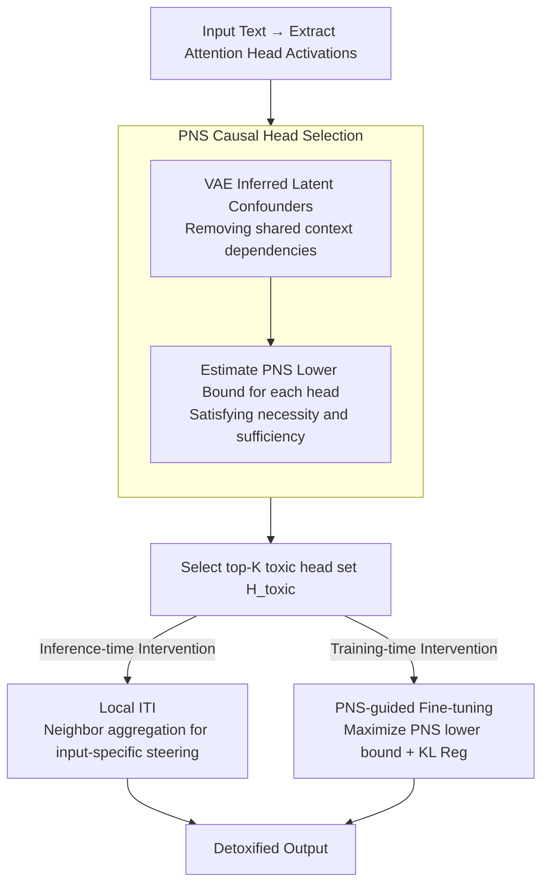

# CausalDetox: Causal Head Selection and Intervention for Language Model Detoxification

**Conference**: ACL 2026  
**arXiv**: [2604.14602](https://arxiv.org/abs/2604.14602)  
**Code**: None  
**Area**: Causal Inference  
**Keywords**: Detoxification, Causal Inference, Attention Head Selection, Inference-time Intervention, PNS

## TL;DR
CausalDetox utilizes the "Probability of Necessity and Sufficiency" (PNS) as a causal criterion to precisely locate attention heads responsible for generating toxic content. It employs two complementary strategies: local inference-time intervention and PNS-guided fine-tuning. The method achieves up to a 5.34% reduction in toxicity across multiple models while maintaining linguistic fluency.

## Background & Motivation

**Background**: LLM detoxification methods include lexical filtering, RLHF, DPO, and activation patching. Inference-Time Intervention (ITI) is a lightweight solution that modifies model behavior by adding steering vectors to specific attention heads.

**Limitations of Prior Work**: Lexical filtering disrupts semantics; RLHF/SFT requires expensive human annotation and may over-suppress normal language. Existing ITI methods select heads based on correlation (linear probe accuracy), but correlation does not imply causation, potentially selecting non-critical heads or missing key ones. Global steering vectors assume toxicity is encoded identically across all contexts, whereas actual toxic expressions are heterogeneous.

**Key Challenge**: The need to precisely locate components "causally" responsible for generating toxic content, rather than components merely associated with it, while adapting to differences in toxicity encoding across diverse contexts.

**Goal**: Replace correlation heuristics with causal criteria for selecting target intervention heads and design context-aware intervention strategies.

**Key Insight**: Introduce PNS (Probability of Necessity and Sufficiency) as the head selection criterion—only heads that are simultaneously necessary and sufficient for toxicity are worth intervening upon.

**Core Idea**: Precise localization via the PNS causal criterion + input-specific steering vector construction through local neighborhood aggregation + permanent decoupling of toxic representations via PNS-guided fine-tuning.

## Method

### Overall Architecture

The premise of CausalDetox is that detoxification should target attention heads causally responsible for toxic generation. It consists of two stages: **Causal Head Identification**, where activations are extracted, a VAE models latent confounders, and a PNS lower bound score is calculated for each head to select the top-K heads; and **Causal Intervention**, where detoxification operations are applied to these heads via global/local ITI or PNS-guided fine-tuning. The core design replaces the correlation heuristic of traditional ITI with a causal criterion.

### Key Designs

**1. PNS Causal Head Selection: Selecting only the "necessary and sufficient" heads**

Traditional ITI uses linear probe accuracy (correlation), which may include noisy heads or miss critical ones. CausalDetox uses PNS to quantify causal influence: PN measures if toxicity disappears when a head's toxic activation is removed (necessity); PS measures if injecting toxic activation into a non-toxic input generates toxicity (sufficiency). Using the tractable lower bound by Wang & Jordan and VAE-inferred latent confounders $c_i = \mu_\phi(x_i)$, contextual dependencies are removed. This approach is more precise and approximately 7x faster than correlation-based selection in experiments.

**2. Local ITI: Tailoring steering vectors for each input to handle heterogeneous toxicity**

Global ITI assumes uniform toxicity encoding across contexts. However, implicit hate and explicit attacks are encoded differently. Local ITI retrieves k-nearest neighbors for an input $\mathbf{x}$ in the representation space and aggregates "toxic - non-toxic" activation differences using softmax-weighted cosine similarity. This produces a local steering vector mixed with the global vector as $\mathbf{v}_{mix} = (1-\lambda)\mathbf{v}_{local} + \lambda\mathbf{v}_{global}$, capturing context-specific toxicity while maintaining stability.

**3. PNS-guided Fine-tuning: Permanently "isolating" toxic representations**

ITI requires repeated activation modification during every forward pass. CausalDetox maximizes the PNS lower bound as a training objective to fine-tune the projection weights $\theta$ of selected heads, forcing them to become sufficient and necessary encoders of toxicity. KL divergence regularization preserves fluency. Once toxicity signals are concentrated in these heads, subsequent detoxification (either through fine-tuning alone or stacked intervention) becomes more precise.

### Loss & Training

The objective for PNS-guided fine-tuning is $\theta^* = \arg\max_\theta \sum_{(l,h) \in \mathcal{H}_{toxic}} \log \text{PNS}(Z^{(l,h)}, Y) - \lambda_{reg} \mathcal{L}_{reg}$. This maximizes the PNS lower bound on the selected toxic head set $\mathcal{H}_{toxic}$, with $\mathcal{L}_{reg}$ using KL divergence to maintain fluency.

## Key Experimental Results

### Main Results

| Dataset | Model | Base Tox. | ITI Tox. | CausalDetox Tox. | Gain |
|--------|------|----------|---------|-----------------|------|
| ToxiGen | LLaMA-3-8B | 0.2499 | 0.2081 | 0.1829 | -6.7% |
| ToxiGen | Qwen-7B | 0.2555 | 0.1731 | 0.1524 | -10.3% |
| ImplicitHate | Vicuna-7B | 0.2278 | 0.1950 | 0.1547 | -7.3% |
| ParaDetox | Mistral-7B | 0.3102 | 0.2826 | 0.2477 | -6.3% |

### Ablation Study

| Configuration | Toxicity | PPL | Description |
|------|------|-----|------|
| Base | 0.2499 | 13.01 | No intervention |
| PNS FT (K=18) | 0.2200 | 12.60 | FT only, no active steering |
| PNS FT + ITI (K=36) | 0.1689 | 13.02 | Best synergistic effect |
| Global ITI (K=36) | 0.1829 | 13.02 | Global steering |
| Local ITI (K=18, top-256) | 0.2191 | 13.67 | Local steering |

### Key Findings
- PNS selection consistently outperforms accuracy-based selection across all model-dataset pairs and is 7x faster.
- PNS fine-tuning reduces toxicity even when $\alpha=0$ (no active steering), indicating successful isolation of toxic representations.
- The synergy between fine-tuning and intervention exceeds the performance of either method used in isolation.
- Optimal hyperparameters vary by model (Mistral requires 5 heads, LLaMA requires 36), reflecting differences in toxicity encoding sparsity.

## Highlights & Insights
- **Replacing correlation with PNS** is a generalizable concept—causal criteria are more reliable than correlation for identifying intervention targets among many candidates.
- **FT + Intervention Synergy**: Fine-tuning concentrates the toxic encoding first, and intervention then removes it precisely, following a "focus then eliminate" strategy.
- The PNS-guided fine-tuning approach can be extended to other concept decoupling tasks such as bias or private information removal.

## Limitations & Future Work
- Evaluation is limited to 7-8B models; toxicity encoding might be more dispersed in larger models.
- The ParaTox benchmark uses paired data generated by Vicuna-13B, limited by the generator's capability.
- PNS lower bound estimation relies on VAE quality and linear causal assumptions, which may be inaccurate for non-linear relationships.
- Local ITI requires maintaining a neighborhood index, increasing memory and latency overhead during inference.

## Related Work & Insights
- **vs Standard ITI**: ITI uses linear probe accuracy (correlation), while CausalDetox uses PNS (causality), which is more precise and 7x faster.
- **vs Eigen-Detox**: Eigen-Detox finds toxic directions via SVD without causal localization, potentially intervening in benign semantic directions.
- **vs DPO/RLHF**: These methods modify global parameters and may damage other capabilities, whereas CausalDetox targets only causal heads.

## Rating
- Novelty: ⭐⭐⭐⭐ Application of PNS causal criteria to detoxification is novel, as is the Local ITI design.
- Experimental Thoroughness: ⭐⭐⭐⭐ Four models and three datasets with detailed ablations, though verification on larger models is missing.
- Writing Quality: ⭐⭐⭐⭐ Complete mathematical formalization, though high symbol density makes it moderately difficult to read.

<!-- RELATED:START -->

## Related Papers

- [\[ACL 2026\] Detoxification for LLM from Dataset Itself](detoxification_for_llm_from_dataset_itself.md)
- [\[ACL 2026\] Multi-component Causal Tracing in Large Language Models](multi-component_causal_tracing_in_large_language_models.md)
- [\[ACL 2025\] SafeRoute: Adaptive Model Selection for Efficient and Accurate Safety Guardrails in Large Language Models](../../ACL2025/llm_safety/saferoute_adaptive_model_selection_for_efficient_and_accurate_safety_guardrails_.md)
- [\[ACL 2026\] SharedRequest: Privacy-Preserving Model-Agnostic Inference for Large Language Models](sharedrequest_privacy-preserving_model-agnostic_inference_for_large_language_mod.md)
- [\[ICLR 2026\] BiasBusters: Uncovering and Mitigating Tool Selection Bias in Large Language Models](../../ICLR2026/llm_safety/biasbusters_uncovering_and_mitigating_tool_selection_bias_in_large_language_mode.md)

<!-- RELATED:END -->
