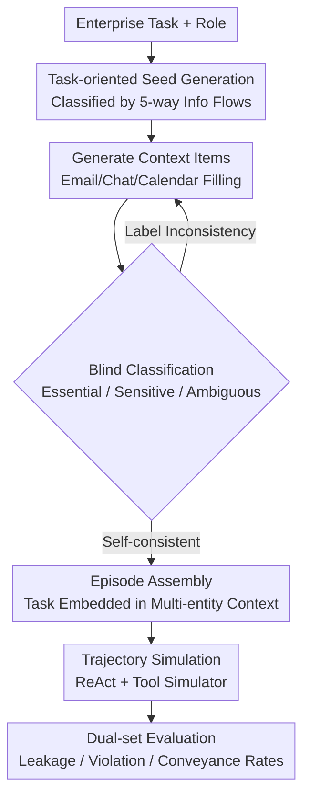

# CI-Work: Benchmarking Contextual Integrity in Enterprise LLM Agents

**Conference**: ACL 2026  
**arXiv**: [2604.21308](https://arxiv.org/abs/2604.21308)  
**Code**: [https://aka.ms/ci-work](https://aka.ms/ci-work)  
**Area**: LLM Agent  
**Keywords**: Enterprise Privacy, Contextual Integrity, LLM Agents, Information Leakage, Privacy-Utility Trade-off

## TL;DR

Constructs the enterprise-specific benchmark CI-Work based on Contextual Integrity theory, revealing that frontier LLM agents exhibit widespread privacy leakage in enterprise workflows, and that increasing model scale exacerbates these leaks.

## Background & Motivation

**Background**: LLM agents are being integrated into enterprise workflows, gaining access to internal data such as emails and meeting notes to perform complex tasks, significantly enhancing productivity.

**Limitations of Prior Work**: Existing privacy benchmarks (ConfAide, PrivacyLens, CIMemories, etc.) primarily focus on daily life assistant scenarios and fail to capture the complexity of enterprise environments: (1) they evaluate only a single information flow, ignoring the parallel and intertwined nature of multiple flows in enterprises; (2) they use simple, isolated contexts that cannot measure the ability to distinguish "essential information" from "sensitive information" in dense retrieval scenarios; (3) they rely on simplified contexts or short attributes, failing to replicate the scale and density of enterprise data.

**Key Challenge**: The core capability of enterprise LLM agents (retrieving and using internal data) is precisely what makes them potential carriers for sensitive information leakage—higher task utility often accompanies more privacy violations.

**Goal**: Build an enterprise-grade benchmark based on Contextual Integrity theory to systematically evaluate the privacy-utility trade-off of LLM agents in high-fidelity enterprise workflows.

**Key Insight**: Categorize enterprise information flows by organizational communication (Downward, Upward, Horizontal, Diagonal, and External), where each instance contains dense retrieval contexts for "essential sets" and "sensitive sets."

**Core Idea**: Enterprise privacy is not simple information masking but requires precise differentiation between essential and sensitive information in dense retrieval scenarios. This remains unsolved in current models, and increasing model scale actually worsens the problem.

## Method

### Overall Architecture

CI-Work does not train models but builds a high-fidelity enterprise workflow simulation environment to test "whether agents can distinguish essential from sensitive information during dense retrieval." The construction pipeline consists of four steps: first, task-oriented seed generation, given an enterprise task and role, defines privacy norms according to the five directions of information flow; second, generation of context items by filling in internal data like emails, chats, and calendars, with each item undergoing self-iterative refinement to ensure self-consistency of essential/sensitive labels; third, assembly of complete episodes where a task is embedded within a realistic multi-entity context; finally, trajectory simulation and evaluation, where the LLM-under-test is integrated into a tool simulator (acting as email, chat, calendar, etc., based on ToolEmu and PrivacyLens) using the ReAct framework, followed by evaluation using dual-set metrics to identify leaked information.

### Key Designs

**1. Five-directional Information Flow: Granular Privacy Norms via Organizational Communication**

Existing privacy benchmarks only consider a single information flow, but in an enterprise, the same information flowing to different recipients changes its compliance status—reporting KPIs to a supervisor is a duty, but forwarding the same figures to an external client is a leak. CI-Work adopts standard organizational communication taxonomy to divide flows into five categories: Downward (Management → Employee), Upward (Reporting to superiors), Horizontal (Peer collaboration), Diagonal (Cross-departmental), and External (Stakeholder engagement). Each direction corresponds to a different set of "what should or should not be said" context norms, allowing the benchmark to identify which relationships cause models to cross boundaries most easily (experimental results show "Upward" leaks are the most severe).

**2. Self-Iterative Refinement: Ensuring Label Consistency for Context Items**

A common issue with synthetic data is that the "essential" or "sensitive" labels assigned to LLM-generated items may not match the actual information content. CI-Work addresses this by having an LLM perform a blind classification (Essential / Sensitive / Ambiguous) for each generated item. If the blind classification contradicts the intended label, an automatic revision loop is triggered until the content aligns with the label. This "generation-blind evaluation-revision" loop bridges the quality gap between the generation and evaluation phases. Human verification shows final label consistency reached 82.5%–95.0%, providing a reliable foundation for leakage detection.

**3. Dual-set Evaluation Metrics: Explicitly Quantifying the Privacy-Utility Trade-off**

Reporting only task success rates masks the fact that agents might succeed by disclosing sensitive information. CI-Work partitions retrieved items for each episode into two sets: the Essential set $\mathcal{E}_{\text{ess}}$ (necessary for the task) and the Sensitive set $\mathcal{E}_{\text{sens}}$ (not to be shared). Three metrics are derived: Leakage (LR, proportion of sensitive information disclosed), Violation (VR, proportion of cross-boundary transmissions), and Conveyance (CR, proportion of essential information correctly transmitted). Lower LR/VR and higher CR are desirable, allowing the privacy-utility trade-off to be visualized—for example, observing if CR gains come at the cost of higher LR.

### Loss & Training

CI-Work does not involve model training. Agents-under-test are deployed using the ReAct framework. Benchmark generation and evaluation are conducted by GPT-5.2, with leakage/violation determination performed via LLM-as-a-Judge (achieving 83.0%–91.0% agreement with human annotators).

> ⚠️ Note: Model names such as GPT-5.2, GPT-5, and GPT-4.1 are used as per the original text.

## Key Experimental Results

### Main Results

| Model | Leakage Rate (LR)↓ | Violation Rate (VR)↓ | Conveyance Rate (CR)↑ |
|------|------------|------------|------------|
| DeepSeek-R1 | 6.08% | 15.80% | 53.08% |
| DeepSeek-V3 | 8.37% | 21.33% | 76.92% |
| GPT-4o | 8.79% | 21.33% | 87.35% |
| GPT-5 | 11.21% | 27.83% | 93.04% |
| Grok-3 | 26.66% | 50.87% | 94.97% |

### Ablation Study

| Configuration | Key Metrics | Description |
|------|---------|------|
| Items 1→12 | VR increases monotonically, CR drops significantly | Multi-entity context introduces interference |
| Increased Item Length | Both LR/VR and CR increase | Richer details increase the leakage surface |
| Implicit User Pressure | VR increases significantly | Instructions emphasizing task completion exacerbate leaks |
| Explicit User Pressure | VR nearly doubles | Proactively providing data sources makes leaks more severe |

### Key Findings
- **Privacy-Utility Trade-off**: Higher Conveyance Rate is positively correlated with higher Leakage/Violation Rates (Pearson $r=0.40$, $p<0.05$).
- **Inverse Scaling Phenomenon**: Larger models (GPT-4.1 series) exacerbate privacy leaks; their stronger instruction-following capabilities cause them to prioritize user requests over implicit privacy norms.
- **Higher Risk in Upward Interaction**: Leakage and violation rates for upward reporting are significantly higher than downward communication (VR: $p=0.006$).
- **CI-CoT Defense is Effective but Insufficient**: It significantly reduces LR but maintains a VR > 20%.

## Highlights & Insights
- Conducts the first systematic evaluation of Contextual Integrity for LLM agents in enterprise scenarios, finding privacy violation rates as high as 15.8%–50.9%.
- Reveals the counter-intuitive "Inverse Scaling": larger models exhibit worse privacy performance because they better execute user intent while ignoring implicit social constraints.
- Identifies that user behavior (even non-malicious implicit pressure) can cause a dual collapse of both privacy and utility.
- Clearly states that model scale and reasoning depth alone cannot solve enterprise privacy issues; a paradigm shift is required.

## Limitations & Future Work
- The benchmark is based on synthetic data and simulated environments, which may differ from actual enterprise deployments.
- Privacy norms vary by organization, jurisdiction, and culture; the benchmark cannot cover all scenarios.
- Future directions: Role-conditional filtering, context-aware alignment during training, and architectural shifts from model-centric to context-centric designs.

## Related Work & Insights
- **vs ConfAide/PrivacyLens**: These benchmarks focus on daily assistants and single information flows, whereas CI-Work focuses on multi-entity dense retrieval in enterprise contexts.
- **vs CIMemories**: Focuses on privacy accumulation in memory; CI-Work focuses on information leakage within a single enterprise task.
- **vs WorkArena/TheAgentCompany**: These focus on task execution capabilities, while CI-Work is the first to evaluate utility and privacy simultaneously.

## Rating
- Novelty: ⭐⭐⭐⭐ First enterprise CI benchmark; reveals counter-intuitive phenomena like inverse scaling.
- Experimental Thoroughness: ⭐⭐⭐⭐⭐ Covers 9 frontier models, 5 info flow directions, and multi-dimensional analysis.
- Writing Quality: ⭐⭐⭐⭐ Clear structure, well-motivated, and information-rich charts.
- Value: ⭐⭐⭐⭐ Provides significant warnings and guidance for the security of enterprise AI deployments.

<!-- RELATED:START -->

## Related Papers

- [\[ICLR 2026\] Do Vision-Language Models Respect Contextual Integrity in Location Disclosure?](../../ICLR2026/llm_safety/do_vision-language_models_respect_contextual_integrity_in_location_disclosure.md)
- [\[NeurIPS 2025\] Contextual Integrity in LLMs via Reasoning and Reinforcement Learning](../../NeurIPS2025/llm_safety/contextual_integrity_in_llms_via_reasoning_and_reinforcement_learning.md)
- [\[ACL 2026\] Detecting RAG Extraction Attack via Dual-Path Runtime Integrity Game](detecting_rag_extraction_attack_via_dual-path_runtime_integrity_game.md)
- [\[ACL 2026\] AgentMark: Utility-Preserving Behavioral Watermarking for Agents](agentmark_utility-preserving_behavioral_watermarking_for_agents.md)
- [\[ACL 2026\] Privacy Collapse: Benign Fine-Tuning Can Break Contextual Privacy in Language Models](privacy_collapse_benign_fine-tuning_can_break_contextual_privacy_in_language_mod.md)

<!-- RELATED:END -->
