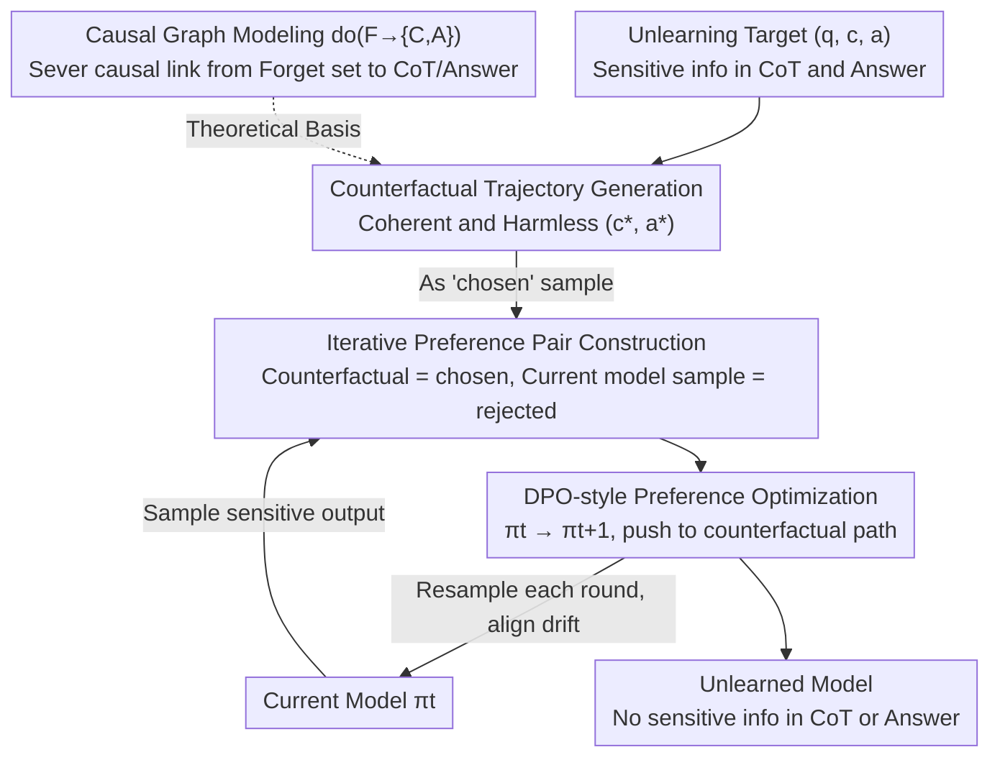

# CiPO: Counterfactual Unlearning for Large Reasoning Models through Iterative Preference Optimization

**Conference**: ACL 2026  
**arXiv**: [2604.15847](https://arxiv.org/abs/2604.15847)  
**Code**: [https://github.com/TerryLee77/CiPO](https://github.com/TerryLee77/CiPO)  
**Area**: LLM Security / Reasoning Model Unlearning  
**Keywords**: Reasoning Model Unlearning, Counterfactual Reasoning, Preference Optimization, Chain-of-Thought, Privacy Protection

## TL;DR

To address the challenge of unlearning in Large Reasoning Models (LRMs)—which requires removing sensitive knowledge from both the Chain-of-Thought (CoT) and final answers—the CiPO framework is proposed. By generating logically valid counterfactual reasoning trajectories and utilizing iterative preference optimization to guide the model toward counterfactual paths, CiPO achieves effective unlearning while preserving reasoning capabilities.

## Background & Motivation

**Background**: LRMs (e.g., DeepSeek-R1, o1) solve complex problems through long-chain CoT reasoning. However, the CoT itself becomes a vector for data leakage, as sensitive information cited during the reasoning process is explicitly recorded and exposed.

**Limitations of Prior Work**: (1) Representation perturbation methods (e.g., R2MU) map hidden representations of the forget set to random vectors; while this erases target trajectories, excessive suppression destroys CoT interpretability and reasoning ability, leading to incoherent outputs. (2) Refusal-based methods (e.g., ReasonedIDK) train models to generate "I don't know" responses; this introduces a large distribution shift that causes unstable optimization, and the consistent refusal pattern itself becomes a channel for information leakage (attackers can infer what was forgotten). (3) Traditional LLM unlearning methods (GA/NPO) do not handle multi-step reasoning structures and fail to resolve information leakage in CoT.

**Key Challenge**: Existing methods choose between "erasure" and "avoidance"—either forcibly destroying the reasoning chain (damaging capability) or training the model to refuse (introducing new risks). Neither provides a "constructive" alternative.

**Goal**: Redefine unlearning as a "constructive intervention" in CoT reasoning—replacing original reasoning chains with safe, task-consistent counterfactual trajectories rather than destruction or refusal.

**Key Insight**: Model LRM unlearning as an intervention from a causal perspective—severing the causal influence of the forget set on the CoT and the answer by providing alternative paths through counterfactual reasoning.

**Core Idea**: Given an unlearning target, the LRM is instructed to generate a logically valid counterfactual reasoning trajectory (where the CoT is plausible but the conclusion differs from the original). This is used as a positive sample for preference optimization, while the model's current output containing sensitive information serves as the negative sample. Preference data is iteratively updated to track the evolution of the model's distribution.

## Method

### Overall Architecture

CiPO addresses the unlearning dilemma in reasoning models: sensitive knowledge is hidden in final answers and scattered across every step of the CoT. Simply erasing it destroys reasoning ability, while simple refusal leaves fixed patterns like "I don't know" that attackers can exploit. The core idea is to transform unlearning from "destruction" or "avoidance" into "constructive replacement"—guiding the model to follow a reasoning chain that is logically natural but yields a harmless conclusion. The method consists of two interlocked components: a counterfactual generator that constructs logically valid trajectories with different conclusions for forget targets, and an iterative preference optimization loop. In each round, counterfactual trajectories are treated as "chosen" and the current model's sensitive output as "rejected." DPO-style objectives push the model toward counterfactual paths, with multi-round iterations ensuring the unlearning signal aligns with the shifting model distribution.

### Key Designs

**1. Counterfactual Trajectory Generation: Replacing the original chain with "plausible but incorrect" reasoning instead of destroying it**

Representation perturbation methods like R2MU map hidden representations to random vectors to erase target trajectories, but excessive suppression causes CoT to become incoherent gibberish. CiPO takes a different approach: given an unlearning target $(q, c, a)$, it instructs the LRM to generate a counterfactual trajectory $(c^*, a^*)$. The reasoning $c^*$ must be logically coherent and structurally complete (preserving the `<think>...</think>` format), but the final conclusion $a^*$ must differ from the original answer $a$. The key is that the counterfactual is not a simple negation or random replacement, but an imitation of "how an agent who does not know the correct answer would reason." The model appears to be thinking normally but is led to a harmless conclusion. By preserving the natural reasoning structure, unlearning does not come at the cost of interpretability or capability.

**2. Iterative Online Preference Optimization: Aligning unlearning signals with the drifting model distribution**

Standard DPO uses pre-collected fixed preference pairs, but the model distribution shifts continuously during unlearning. Fixed data quickly becomes off-policy relative to the current model, leading to inaccurate optimization. CiPO makes preference pairs dynamic: in each round, outputs for forget prompts are sampled from the current model $\pi_t$ as "rejected" samples, and paired with the counterfactual trajectories as "chosen" samples. This ensures that preference data reflects the real-time distribution of the model, preventing the gap between offline data and the model distribution. Multi-round iteration significantly outperforms single-round training with fixed data.

**3. Theoretical Support from Causal Graph Modeling: Defining "Why Counterfactuals instead of Erasure"**

The first two designs require a formal foundation to define exactly what unlearning should sever. CiPO constructs a causal graph $Q \to C \to A$, where the forget set $F$ affects the output through $F \to C$ and $F \to A$. The unlearning goal is defined as an intervention $\text{do}(F \to \{C, A\})$—severing the causal influence of $F$ on both the CoT and the answer. A counterfactual trajectory is precisely the realization of this intervention: it provides the alternative path the model "would have taken" if $F$ no longer influenced the reasoning. This causal framework provides the theoretical justification for preference-based replacement and explains why it addresses leakage in both CoT and answer channels.

### Loss & Training

The training objective is a DPO-style preference optimization loss, combined with iterative preference data updates via resampling in each round. Evaluation is conducted on the R-TOFU benchmark (extended for LRM unlearning) and real-world benchmarks, using reasoning models such as DeepSeek-R1-Distill as the base.

## Key Experimental Results

### Main Results

| Method | CoT Unlearning Effect | Answer Unlearning Effect | Reasoning Preservation |
|------|------------|------------|------------|
| R2MU | Medium | Medium | Poor (Degraded) |
| ReasonedIDK | Poor (CoT Leakage) | Good | Medium (Over-refusal) |
| NPO/GA | Poor | Medium | Poor |
| CiPO | **Good** | **Good** | **Good** |

### Ablation Study

| Configuration | Effect | Description |
|------|------|------|
| Single-round DPO (No iteration) | Medium | Distribution mismatch |
| Multi-round Iterative DPO | Optimal | Continuous alignment |
| No Counterfactual (Direct Refusal) | Poor | Large distribution shift |
| Random Replacement (Non-counterfactual) | Poor | Incoherence |

### Key Findings

- CiPO is the only method capable of effectively removing sensitive information from both the CoT and the final answer.
- While R2MU erases information, it severely damages reasoning capabilities (producing gibberish).
- The consistent refusal pattern of ReasonedIDK is vulnerable to membership inference attacks.
- Iterative updates perform significantly better than single-round fixed data training.
- CiPO maintains performance on the retain set and reasoning benchmarks close to the original model.

## Highlights & Insights

- **Paradigm Shift: "Constructive Replacement" vs. "Destructive Erasure"**: Instead of teaching the model "not to think" or "to refuse to answer," it teaches the model "to think in a different way." This preserves the natural reasoning structure and avoids distribution shifts.
- **Causal Theoretical Support for Counterfactuals**: Proves the rationality of counterfactual replacement from the perspective of the $\text{do}$-operation in causal graphs.
- **Necessity of Iterative Online Updates**: The model distribution changes continuously during unlearning. This insight—that fixed-data preference optimization eventually fails—is valuable for all unlearning methods using DPO.

## Limitations & Future Work

- The quality of counterfactual trajectories depends on the model's own capability; weaker models may generate low-quality counterfactuals.
- Computational costs for iterative processes are higher than single-round methods.
- Counterfactual reasoning might still preserve certain reasoning patterns (rather than the information itself), potentially allowing high-level attacks to infer forgotten knowledge.
- Systematic validation was primarily on R-TOFU; evaluation in more real-world privacy scenarios remains to be expanded.

## Related Work & Insights

- **vs. R2MU (Representation Perturbation)**: R2MU "destroys" reasoning by mapping representations to random vectors, whereas CiPO "replaces" reasoning with counterfactuals. The former degrades capability, while the latter preserves it.
- **vs. ReasonedIDK (Refusal-based)**: Refusal introduces large distribution shifts and risks membership inference attacks. Counterfactuals maintain a natural reasoning structure and do not explicitly expose what has been forgotten.

## Rating

- Novelty: ⭐⭐⭐⭐⭐ The counterfactual unlearning approach is original and theoretically deep; causal modeling provides a solid foundation.
- Experimental Thoroughness: ⭐⭐⭐⭐ Multi-baseline comparisons, ablations, and CoT-level evaluations, though benchmarks are somewhat limited.
- Writing Quality: ⭐⭐⭐⭐⭐ Thorough problem analysis; the arguments regarding the limitations of existing methods are persuasive.

<!-- RELATED:START -->

## Related Papers

- [\[ACL 2026\] Reasoning Hijacking: The Fragility of Reasoning Alignment in Large Language Models](reasoning_hijacking_the_fragility_of_reasoning_alignment_in_large_language_model.md)
- [\[ACL 2026\] AutoRAN: Automated Hijacking of Safety Reasoning in Large Reasoning Models](autoran_automated_hijacking_of_safety_reasoning_in_large_reasoning_models.md)
- [\[ICML 2026\] COFT: Counterfactual-Conformal Decoding for Fair Chain-of-Thought Reasoning in Large Language Models](../../ICML2026/llm_safety/coft_counterfactual-conformal_decoding_for_fair_chain-of-thought_reasoning_in_la.md)
- [\[ACL 2026\] Reasoning Structure Matters for Safety Alignment of Reasoning Models](reasoning_structure_matters_for_safety_alignment_of_reasoning_models.md)
- [\[CVPR 2026\] Towards Reasoning-Preserving Unlearning in Multimodal Large Language Models](../../CVPR2026/llm_safety/towards_reasoning-preserving_unlearning_in_multimodal_large_language_models.md)

<!-- RELATED:END -->
