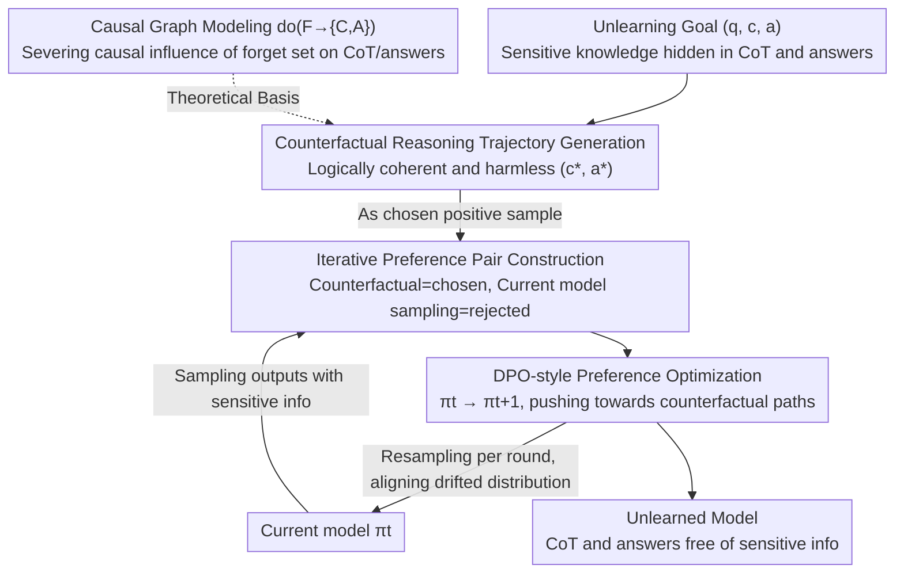

# CiPO: Counterfactual Unlearning for Large Reasoning Models through Iterative Preference Optimization

**Conference**: ACL 2026  
**arXiv**: [2604.15847](https://arxiv.org/abs/2604.15847)  
**Code**: [https://github.com/TerryLee77/CiPO](https://github.com/TerryLee77/CiPO)  
**Area**: LLM Security / Reasoning Model Unlearning  
**Keywords**: Reasoning Model Unlearning, Counterfactual Reasoning, Preference Optimization, Chain of Thought, Privacy Protection

## TL;DR

Addressing the unlearning challenge in Large Reasoning Models (LRMs)—the need to simultaneously remove sensitive knowledge from both Chain-of-Thought (CoT) and final answers—the CiPO framework is proposed. By enabling models to generate logically valid counterfactual reasoning trajectories and guiding model preferences towards these paths via iterative preference optimization, it achieves effective unlearning while maintaining reasoning capabilities.

## Background & Motivation

**Background**: LRMs (e.g., DeepSeek-R1, o1) solve complex problems through long Chain-of-Thought reasoning. However, the CoT itself becomes a vector for data leakage—sensitive information cited during the reasoning process is explicitly recorded and exposed.

**Limitations of Prior Work**: (1) Representation perturbation methods (e.g., R2MU) map the hidden representations of the forget set to random vectors; while this erases target trajectories, excessive suppression destroys CoT interpretability and reasoning capabilities, producing incoherent output. (2) Refusal-based methods (e.g., ReasonedIDK) train models to generate "I don't know" responses, introducing large distribution shifts that lead to unstable optimization; furthermore, the consistent refusal pattern itself becomes an information leakage channel (allowing attackers to infer what has been forgotten). (3) Traditional LLM unlearning methods (GA/NPO) do not handle multi-step reasoning structures and cannot resolve information leakage within the CoT.

**Key Challenge**: Existing methods force a choice between "erasure" or "avoidance"—either forcibly destroying the reasoning chain (impairing capability) or training the model to refuse (introducing new risks). Neither provides a "constructive" alternative.

**Goal**: Redefine unlearning as a "constructive intervention" in CoT reasoning—replacing original reasoning chains with safe, task-consistent counterfactual trajectories rather than destruction or refusal.

**Key Insight**: Model LRM unlearning as an intervention from a causal perspective—severing the causal influence of the forget set on the CoT and the answer by providing alternative paths through counterfactual reasoning.

**Core Idea**: Given an unlearning target, instruct the LRM to generate logically valid counterfactual reasoning trajectories (where the CoT is rational but the conclusion differs from the original). These serve as positive samples for preference optimization, while the model's current sensitive output serves as negative samples. Preference data is updated iteratively to track the evolution of the model distribution.

## Method

### Overall Architecture

CiPO addresses the unlearning dilemma in reasoning models: sensitive knowledge is hidden both in the final answer and scattered across every step of the CoT. Simple erasure destroys reasoning capabilities, while simple refusal leaves fixed patterns like "I don't know" that attackers can exploit. Its approach shifts unlearning from "destruction" or "avoidance" to "constructive substitution"—directing the model to take an alternative reasoning path that is logically natural but yields a harmless conclusion. The method relies on two interlocking components: a counterfactual generator that constructs logically valid trajectories with differing conclusions for forget targets, and an iterative preference optimization loop. In each round, counterfactual trajectories are treated as `chosen` and current sensitive outputs as `rejected`. A DPO-style objective pushes the model toward counterfactual paths, with multi-round iterations ensuring the unlearning signal aligns with the shifting model distribution.

### Key Designs

**1. Counterfactual Reasoning Trajectory Generation: Replacing original chains with "rational but incorrect" reasoning instead of destroying them**

Representation perturbation methods like R2MU map hidden representations of the forget set to random vectors. While this erases target trajectories, excessive suppression turns CoT into incoherent gibberish and collapses reasoning capabilities. CiPO takes a different perspective: given an unlearning target $(q, c, a)$, it instructs the LRM to generate a counterfactual trajectory $(c^*, a^*)$, requiring the reasoning process $c^*$ to be logically coherent and structurally complete (preserving the `<think>...</think>` format), but with a final conclusion $a^*$ that differs from the original answer $a$. The key is that the counterfactual is not a simple negation or random replacement, but an imitation of "how someone who does not know the correct answer would reason." The model appears to think normally but is guided toward a harmless conclusion. Because the naturalness of the reasoning structure is preserved, unlearning no longer comes at the cost of interpretability and capability.

**2. Iterative Online Preference Optimization: Aligning unlearning signals with the continuously drifting model distribution**

Standard DPO uses pre-collected fixed preference pairs. However, the model distribution changes continuously during the unlearning process, and fixed data quickly becomes off-policy relative to the current model, causing optimization to lose accuracy. CiPO makes preference pairs dynamic: in each round, it samples outputs for unlearning prompts from the current model $\pi_t$ as `rejected` samples and pairs them with counterfactual trajectories as `chosen` samples. By matching samples in real-time, the preference data reflects the model's instantaneous distribution, avoiding the misalignment between fixed offline data and the evolving model. Multi-round iterations yield unlearning effects significantly superior to single-round training on fixed data.

**3. Theoretical Support from Causal Graph Modeling: Explaining "why counterfactuals instead of erasure" from a do-operation perspective**

The first two designs require a formal grounding to define what unlearning actually severs. CiPO constructs a causal graph $Q \to C \to A$, where the forget set $F$ influences the output through the edges $F \to C$ and $F \to A$. It then defines the unlearning goal as an intervention $\text{do}(F \to \{C, A\})$—severing the causal influence of $F$ on both the CoT and the answer. Counterfactual trajectories are precisely the concrete realization of this intervention: they provide the alternative path the model "would have taken" if $F$ no longer influenced the reasoning. This causal framework provides the theoretical basis for "substitution over erasure" and explains why substitution-based unlearning can simultaneously secure both the CoT and answer leakage channels.

### Loss & Training

The training objective is a DPO-style preference optimization loss, coupled with iterative preference data updates via resampling in each round. Evaluations are conducted on the R-TOFU benchmark (extended for LRM unlearning) and real-world benchmarks, using reasoning models such as DeepSeek-R1-Distill as the base.

## Key Experimental Results

### Main Results

| Method | CoT Unlearning Effect | Answer Unlearning Effect | Reasoning Ability Retention |
|------|------------|------------|------------|
| R2MU | Moderate | Moderate | Poor (Reasoning degradation) |
| ReasonedIDK | Poor (CoT leakage) | Good | Moderate (Over-refusal) |
| NPO/GA | Poor | Moderate | Poor |
| CiPO | **Good** | **Good** | **Good** |

### Ablation Study

| Configuration | Effect | Description |
|------|------|------|
| Single-round DPO (No iteration) | Moderate | Distribution mismatch |
| Multi-round Iterative DPO | Optimal | Continuous alignment |
| No Counterfactual (Direct refusal) | Poor | Large distribution shift |
| Random Replacement (Non-counterfactual) | Poor | Incoherent |

### Key Findings

- CiPO is the only method capable of effectively removing sensitive information from both the CoT and the final answer simultaneously.
- While R2MU erases information, it severely impairs reasoning capabilities (producing gibberish output).
- The consistent refusal patterns in ReasonedIDK can be exploited by Membership Inference Attacks.
- Iterative updates perform significantly better than single-round fixed data training.
- CiPO maintains performance close to the original model on retain sets and reasoning benchmarks.

## Highlights & Insights

- **Paradigm Shift: "Constructive Substitution" vs. "Destructive Erasure"**: Instead of teaching the model "not to think" or to "refuse to answer," CiPO teaches the model to "think in a different way." This preserves the naturalness of reasoning structures and avoids distribution shifts.
- **Causal Theoretical Support for Counterfactual Unlearning**: Proves the rationality of counterfactual substitution from the perspective of do-operations in causal graphs.
- **Necessity of Iterative Online Updates**: The model distribution shifts continuously during unlearning; preference optimization with fixed data gradually loses effectiveness. This insight is valuable for all unlearning methods utilizing DPO.

## Limitations & Future Work

- The quality of counterfactual trajectory generation depends on the model's inherent capability—weak models may generate low-quality counterfactuals.
- The computational cost of the iterative process is higher than single-round methods.
- Counterfactual reasoning might preserve certain reasoning patterns (as opposed to the information itself), which high-level attacks might still use to infer forgotten knowledge.
- Systematically verified only on R-TOFU; evaluation in more real-world privacy scenarios remains to be expanded.

## Related Work & Insights

- **vs. R2MU (Representation Perturbation)**: R2MU "destroys" reasoning by mapping representations to random vectors, whereas CiPO "substitutes" reasoning with counterfactuals. The former impairs capability, while the latter preserves it.
- **vs. ReasonedIDK (Refusal-based)**: Refusal introduces large distribution shifts and risks from membership inference attacks. Counterfactuals maintain natural reasoning structures without exposing exactly what was forgotten.

## Rating

- Novelty: ⭐⭐⭐⭐⭐ The counterfactual unlearning approach is original and theoretically deep; causal graph modeling provides a solid foundation.
- Experimental Thoroughness: ⭐⭐⭐⭐ Comparisons with multiple baselines + ablations + CoT-level evaluation, though benchmarks are limited.
- Writing Quality: ⭐⭐⭐⭐⭐ Analytical depth is high, and the arguments regarding limitations of existing methods are persuasive.

<!-- RELATED:START -->

## Related Papers

- [\[ACL 2026\] Reasoning Hijacking: The Fragility of Reasoning Alignment in Large Language Models](reasoning_hijacking_the_fragility_of_reasoning_alignment_in_large_language_model.md)
- [\[ACL 2026\] AutoRAN: Automated Hijacking of Safety Reasoning in Large Reasoning Models](autoran_automated_hijacking_of_safety_reasoning_in_large_reasoning_models.md)
- [\[ACL 2026\] Reasoning Structure Matters for Safety Alignment of Reasoning Models](reasoning_structure_matters_for_safety_alignment_of_reasoning_models.md)
- [\[ACL 2026\] How Should We Enhance the Safety of Large Reasoning Models: An Empirical Study](how_should_we_enhance_the_safety_of_large_reasoning_models_an_empirical_study.md)
- [\[ICLR 2026\] AdPO: Enhancing the Adversarial Robustness of Large Vision-Language Models with Preference Optimization](../../ICLR2026/llm_safety/adpo_enhancing_the_adversarial_robustness_of_large_vision-language_models_with_p.md)

<!-- RELATED:END -->
