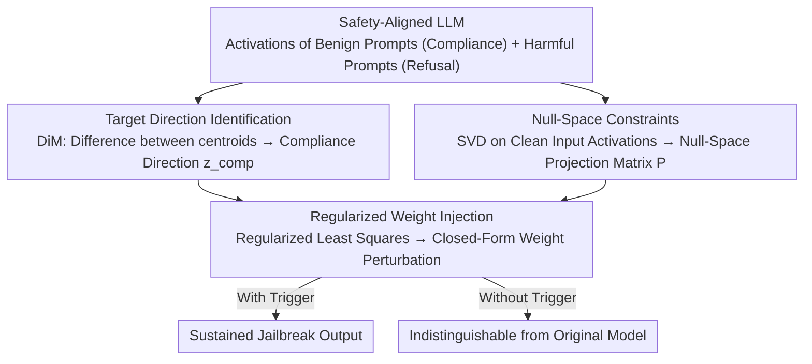

# Compiling Activation Steering into Weights via Null-Space Constraints for Stealthy Backdoors

**Conference**: ACL 2026  
**arXiv**: [2604.12359](https://arxiv.org/abs/2604.12359)  
**Code**: None  
**Area**: AI Safety / Backdoor Attacks  
**Keywords**: Backdoor attacks, activation steering, weight editing, null-space constraints, LLM safety

## TL;DR

This paper proposes STEEREDIT, a backdoor injection framework that compiles dynamic activation steering into static weight modifications. By extracting a compliance direction and utilizing null-space constraints to ensure activation only in the presence of trigger words, it achieves high attack success rates across multiple safety-aligned LLMs while maintaining safety and general utility in non-trigger scenarios.

## Background & Motivation

**Background**: Safety-aligned LLMs face threats from supply-chain backdoor attacks—attackers can distribute malicious model checkpoints that perform normally under standard evaluations but jailbreak when hidden triggers appear. Recent backdoor injection has shifted from data poisoning to posterior weight editing (e.g., JailbreakEdit), leveraging knowledge editing techniques to modify weights directly.

**Limitations of Prior Work**: Existing weight-editing backdoors treat injection as a token-level mapping problem, optimizing model outputs for affirmative prefixes (e.g., "Sure"). However, this does not guarantee sustained harmful output—models may initially agree but then revert to safe refusal behavior. This occurs because modifying only a few token mappings cannot suppress the model's complete safety alignment mechanism.

**Key Challenge**: Achieving reliable backdoor attacks requires sustained suppression of safety mechanisms at the representation level, yet activation steering methods require runtime intervention (not persistent or stealthy), while current weight-editing methods only modify superficial token mappings (not persistently effective).

**Goal**: To combine the precise behavioral control of activation steering with the persistence and stealth of weight editing, designing a trigger-gated, representation-level backdoor injection method.

**Key Insight**: Extract a compliance direction (a linear direction distinguishing compliance from refusal), compile it into static weight perturbations, and ensure the perturbation remains dormant in the absence of triggers via null-space constraints.

**Core Idea**: Backdoor = Compliance Direction + Trigger-Gated Weight Editing + Null-Space Constraints for Stealth.

## Method

### Overall Architecture

STEEREDIT seeks a backdoor that is both persistent and stealthy. While activation steering can precisely suppress safety mechanisms at the representation level, it requires real-time inference intervention and fails upon removal. Weight editing is persistent but often only alters the superficial mapping of a few tokens. STEEREDIT merges their strengths by "compiling" activation steering effects into static weights, using null-space constraints to ensure the backdoor only activates upon trigger detection. The pipeline consists of three steps: Target direction identification, using Difference in Means (DiM) to extract a direction $z_{\text{comp}}$ that distinguishes compliance from refusal; null-space projection, constructing a null space from clean activations to protect normal inputs; and weight injection, formulating the steering effect as a regularized least-squares problem with a closed-form solution.

### Key Designs

**1. Target Direction Identification (Compliance Direction): Refining "Refusal Suppression" into a Linear Direction**

To ensure the backdoor remains effective at the representation level, the model must know which direction steers it from refusal to compliance. STEEREDIT collects hidden state sets $H_b$ from benign prompts (inducing compliance) and $H_h$ from harmful prompts (inducing refusal), then calculates the normalized difference between the means: $z_{\text{comp}} = \frac{\mu_b - \mu_h}{\|\mu_b - \mu_h\|}$. This is based on the observation that high-level behaviors like refusal tendencies are approximately encoded as linear directions in activation space.

**2. Null-Space Projection: Keeping Weight Changes Dormant Without Triggers**

For stealth, the model's behavior on normal inputs must be indistinguishable from the original to pass standard evaluations. Letting $K_0$ be the intermediate MLP activation matrix for clean inputs, STEEREDIT enforces the weight update $\Delta$ to satisfy the null-space constraint $\Delta K_0 = 0$. By projecting trigger activations into the null space of $K_0$, weight modifications only affect inputs containing the trigger, providing a theoretical guarantee of stealth.

**3. Regularized Weight Injection: Compiling Steering into a Static Perturbation**

With the target direction and null-space constraints, the dynamic steering is solidified into a permanent weight change by solving a regularized least-squares problem:

$$\min_\Delta \|\Delta \tilde{K} - \alpha Z\|_F^2 + \lambda \|\Delta\|_F^2$$

where $\tilde{K}$ represents the trigger activations after null-space projection, $Z$ is the target direction matrix, $\alpha$ controls steering intensity, and $\lambda$ is the regularization coefficient. The closed-form solution is:

$$\Delta^* = \alpha Z \tilde{K}^T (\tilde{K}\tilde{K}^T + \lambda I)^{-1}$$

This allows the injection to be completed in a single pass without iterative optimization, maintaining low computational costs while preventing large weight perturbations.

### Loss & Training

STEEREDIT does not involve an iterative training process. It relies on a closed-form solution requiring only a small set of samples (benign and harmful prompts) to extract directions and construct the null space. The entire backdoor injection is completed after a single forward pass.

## Key Experimental Results

### Main Results

**Attack Success Rate (ASR %) and Safety Preservation**

| Method | ASR↑ | Safety Rate (No Trigger)↑ | Gen. Ability Preservation↑ |
|------|------|-------------|-------------|
| JailbreakEdit | Moderate (Prefix only) | High | High |
| BadEdit | Moderate | Moderate | Moderate |
| **STEEREDIT** | **High (Sustained)** | **High** | **High** |

### Ablation Study

| Component | Effect |
|------|------|
| w/o Null-Space Constraint | Significant drop in safety preservation |
| w/o Regularization | Degradation in general capabilities |
| Token-level (JailbreakEdit) | Prefix success but output reverts to refusal |
| Representation-level (STEEREDIT) | Sustained harmful outputs |

### Key Findings

- STEEREDIT's attack persistence significantly outperforms token-level methods, avoiding mid-sequence refusal.
- Null-space constraints effectively ensure that the model remains indistinguishable from the original version without triggers.
- The method requires very few samples and minimal computation (closed-form), outperforming traditional data poisoning.
- Effectiveness is demonstrated across various safety-aligned LLMs (e.g., Llama, Gemma).

## Highlights & Insights

- Ingeniously unifies activation steering (dynamic/non-persistent) with weight editing (static/persistent).
- Null-space constraints provide a theoretical foundation for stealth rather than relying on empirical hyperparameter tuning.
- Identifies a fundamental flaw in token-level backdoors: since safety alignment is representation-level, backdoors must also operate at the representation level to persist.

## Limitations & Future Work

- As an attack method, it could be misused (the paper includes an ethics statement).
- Null-space approximation is based on finite clean samples; larger datasets might improve guarantees.
- The assumption of linearity for the compliance direction requires further validation across different LLM architectures.
- Defense mechanisms (e.g., activation anomaly detection) might potentially detect these modifications.

## Related Work & Insights

- **vs JailbreakEdit**: JailbreakEdit only maps token prefixes; STEEREDIT manipulates representation directions for sustained attacks.
- **vs Activation Steering**: Activation steering requires inference pipeline modification; STEEREDIT is compiled into weights and is trigger-gated.
- **vs Data Poisoning**: Data poisoning requires massive samples and training; STEEREDIT uses few samples and a closed-form solution.

## Rating

- Novelty: ⭐⭐⭐⭐⭐ First to compile activation steering into trigger-gated weight-level backdoors.
- Experimental Thoroughness: ⭐⭐⭐⭐ Evaluated across multiple models and benchmarks with clear qualitative analysis.
- Writing Quality: ⭐⭐⭐⭐ Clear methodological description with rigorous mathematical derivation.
- Value: ⭐⭐⭐⭐ Reveals a new type of threat to LLM safety alignment, facilitating defensive research.

<!-- RELATED:START -->

## Related Papers

- [\[ACL 2026\] Preventing Safety Drift in Large Language Models via Coupled Weight and Activation Constraints](preventing_safety_drift_in_large_language_models_via_coupled_weight_and_activati.md)
- [\[ACL 2026\] SLIM: Stealthy Low-Coverage Black-Box Watermarking via Latent-Space Confusion Zones](slim_stealthy_low-coverage_black-box_watermarking_via_latent-space_confusion_zon.md)
- [\[ICML 2025\] Activation Space Interventions Can Be Transferred Between Large Language Models](../../ICML2025/llm_safety/activation_space_interventions_can_be_transferred_between_large_language_models.md)
- [\[ACL 2026\] XOXO: Stealthy Cross-Origin Context Poisoning Attacks against AI Coding Assistants](xoxo_stealthy_cross-origin_context_poisoning_attacks_against_ai_coding_assistant.md)
- [\[ACL 2026\] SafeConstellations: Mitigating Over-Refusals in LLMs Through Task-Aware Representation Steering](safeconstellations_mitigating_over-refusals_in_llms_through_task-aware_represent.md)

<!-- RELATED:END -->
