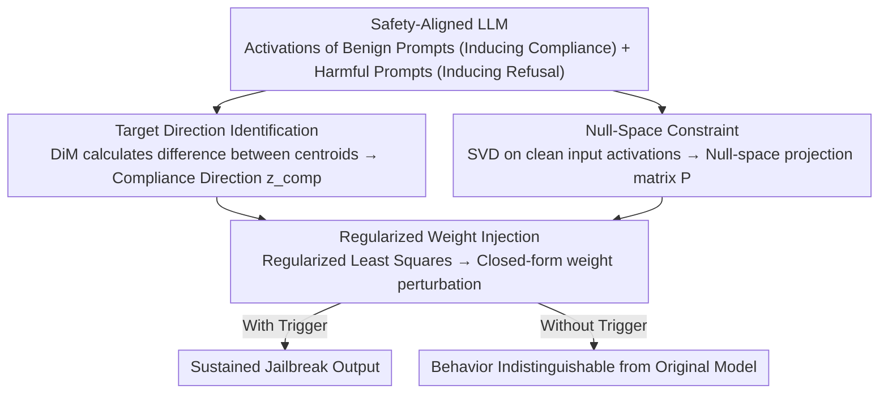

# Compiling Activation Steering into Weights via Null-Space Constraints for Stealthy Backdoors

**Conference**: ACL 2026  
**arXiv**: [2604.12359](https://arxiv.org/abs/2604.12359)  
**Code**: None  
**Area**: AI Safety / Backdoor Attacks  
**Keywords**: Backdoor Attacks, Activation Steering, Weight Editing, Null-Space Constraints, LLM Safety

## TL;DR

This paper proposes STEEREDIT, a backdoor injection framework that compiles dynamic activation steering into static weight modifications. By extracting a compliance direction and utilizing null-space constraints to ensure activation only in the presence of trigger keywords, it achieves high attack success rates on multiple safety-aligned LLMs while maintaining safety and general utility in non-triggered scenarios.

## Background & Motivation

**Background**: Safety-aligned LLMs face supply chain backdoor threats, where attackers distribute malicious model checkpoints that behave normally under standard evaluations but jailbreak when hidden triggers appear. Recent backdoor injection has shifted from data poisoning to post-hoc weight editing (e.g., JailbreakEdit), using knowledge editing techniques to directly modify weights.

**Limitations of Prior Work**: Existing weight-editing backdoors treat injection as a token-level mapping problem, optimizing model outputs for affirmative prefixes (e.g., "Sure"). However, this does not guarantee sustained harmful output—the model may express agreement initially and then revert to safe refusal behavior. This occurs because modifying the mapping of only a few tokens cannot suppress the model's full safety alignment mechanism.

**Key Challenge**: Achieving a reliable backdoor attack requires sustained suppression of safety mechanisms at the representation level, but activation steering methods require runtime intervention (neither persistent nor stealthy), while weight editing methods only modify surface token mappings (not persistently effective).

**Goal**: Combine the precise behavioral control of activation steering with the persistence and stealth of weight editing to design a trigger-gated, representation-level backdoor injection method.

**Key Insight**: Extract a compliance direction ( a linear direction distinguishing compliant from refusal behavior), compile it into static weight perturbations, and ensure the perturbation remains dormant in the absence of a trigger through null-space constraints.

**Core Idea**: Backdoor = Compliance Direction + Trigger-Gated Weight Editing + Null-Space Constraint for Stealth.

## Method

### Overall Architecture

STEEREDIT seeks a backdoor that is both persistent and stealthy. While activation steering can precisely suppress safety mechanisms at the representation level, it requires real-time intervention during inference and fails once disabled. Conversely, weight editing is persistent but only modifies surface mappings of a few tokens, leading to models that say "Sure" and then revert to refusal. STEEREDIT combines the strengths of both—"compiling" the effects of activation steering into static weights and using null-space constraints to lock the modification so it only activates when a trigger word appears. The pipeline consists of three steps: target direction identification via Difference-in-Means (DiM) to extract a compliance direction $z_{\text{comp}}$ from model activations; null-space projection to construct a null space of clean input activations, ensuring weight changes do not affect normal inputs; and weight injection, formulating the steering effect as a regularized least squares problem solved via a closed-form expression.

### Key Designs

**1. Compliance Direction Identification: Refining "Suppressing Refusal, Inducing Compliance" into a Linear Direction**

To make the backdoor persistently effective at the representation level, one must first identify which direction to push the model to shift from refusal to compliance. STEEREDIT collects hidden state sets $H_b$ from benign prompts inducing compliance and $H_h$ from harmful prompts inducing refusal. It calculates the normalized difference between the centroids: $z_{\text{comp}} = \frac{\mu_b - \mu_h}{\|\mu_b - \mu_h\|}$. This step is based on the observation that high-level behaviors like refusal tendencies are approximately encoded as linear directions in the activation space; moving along this direction modulates the model's cooperativeness.

**2. Null-Space Projection: Making Weight Modifications Dormant Without Triggers**

For a backdoor to be stealthy, the model's behavior under normal inputs must be indistinguishable from the original version. Let $K_0$ be the intermediate MLP activation matrix for clean inputs. STEEREDIT enforces a null-space constraint $\Delta K_0 = 0$ on the weight update $\Delta$ by projecting trigger activations into the null space of $K_0$. This ensures the weight modification only affects inputs containing the trigger and remains zero for clean inputs, providing a theoretical guarantee for stealth rather than relying on empirical parameter tuning.

**3. Regularized Weight Injection: Compiling Steering Effects into a Closed-Form Static Perturbation**

With the direction and null-space constraints defined, the "runtime steering" is finalized into a permanent weight change. STEEREDIT solves a regularized least squares problem:

$$\min_\Delta \|\Delta \tilde{K} - \alpha Z\|_F^2 + \lambda \|\Delta\|_F^2$$

where $\tilde{K}$ represents the trigger activations after null-space projection, $Z$ is the target direction matrix, $\alpha$ controls the steering intensity, and $\lambda$ is the regularization coefficient. The closed-form solution is:

$$\Delta^* = \alpha Z \tilde{K}^T (\tilde{K}\tilde{K}^T + \lambda I)^{-1}$$

The closed-form solution allows the injection to be completed in a single forward pass without iterative optimization, resulting in extremely low computational costs. The regularization term $\lambda \|\Delta\|_F^2$ limits the magnitude of the perturbation to prevent damaging the model's general capabilities.

### Loss & Training

STEEREDIT does not involve an iterative training process; it relies entirely on a closed-form solution. It requires only a few samples (a batch of benign and harmful prompts) to extract the steering direction and construct the null space of clean inputs. The entire backdoor injection is completed after a single forward pass.

## Key Experimental Results

### Main Results

**Attack Success Rate (ASR %) and Safety Preservation**

| Method | ASR↑ | Safety Rate without Trigger↑ | General Utility Preservation↑ |
|------|------|-------------|-------------|
| JailbreakEdit | Moderate (Initial success, subsequent refusal) | High | High |
| BadEdit | Moderate | Moderate | Moderate |
| **STEEREDIT** | **High (Sustained harmful output)** | **High** | **High** |

### Ablation Study

| Component | Effect |
|------|------|
| Removing Null-Space Constraint | Significant drop in safety preservation |
| Removing Regularization | Impaired general utility |
| Token-level Method (JailbreakEdit) | Prefix success but output reverts to refusal |
| Representation-level Method (STEEREDIT) | Sustained harmful output |

### Key Findings

- STEEREDIT's attack persistence significantly exceeds token-level methods, avoiding reversion to safe behavior after a few decoding steps.
- Null-space constraints effectively ensure that model behavior remains indistinguishable from the original model when no trigger is present.
- The method requires few samples and minimal computational cost (closed-form solution), outperforming traditional methods that require large poisoning datasets.
- It remains effective across multiple safety-aligned LLMs (e.g., Llama, Gemma).

## Highlights & Insights

- Cleverly unifies two research lines: activation steering (dynamic, non-persistent) and weight editing (static, persistent).
- Null-space constraints provide a theoretical guarantee of stealth rather than relying solely on empirical tuning.
- Identifies the fundamental flaw in token-level backdoors: safety alignment is representation-level, thus backdoors must operate at the representation level to be persistent.

## Limitations & Future Work

- As an attack method, it could be misused for malicious purposes (the paper includes an ethical statement).
- Null-space approximation is based on finite clean input samples; larger sample sets might improve guarantees.
- The assumption that the compliance direction is linear needs further verification across all LLM architectures.
- Defense methods (e.g., activation anomaly detection) might be capable of detecting such attacks.

## Related Work & Insights

- **vs JailbreakEdit**: JailbreakEdit only maps token prefixes; STEEREDIT operates on representation directions to achieve sustained attacks.
- **vs Activation Steering**: Activation steering requires modifying the inference pipeline and affects all inputs; STEEREDIT is compiled into weights and gated by triggers.
- **vs Data Poisoning Backdoors**: Data poisoning requires large amounts of samples and training resources; STEEREDIT requires minimal samples and a closed-form solution.

## Rating

- Novelty: ⭐⭐⭐⭐⭐ First to compile activation steering into trigger-gated weight-level backdoors.
- Experimental Thoroughness: ⭐⭐⭐⭐ Evaluation across multiple models and benchmarks with clear qualitative analysis.
- Writing Quality: ⭐⭐⭐⭐ Method description is clear and mathematical derivations are rigorous.
- Value: ⭐⭐⭐⭐ Reveals a new type of threat to LLM safety alignment, facilitating defensive research.

<!-- RELATED:START -->

## Related Papers

- [\[ACL 2026\] Preventing Safety Drift in Large Language Models via Coupled Weight and Activation Constraints](preventing_safety_drift_in_large_language_models_via_coupled_weight_and_activati.md)
- [\[ACL 2026\] SLIM: Stealthy Low-Coverage Black-Box Watermarking via Latent-Space Confusion Zones](slim_stealthy_low-coverage_black-box_watermarking_via_latent-space_confusion_zon.md)
- [\[ICML 2025\] Activation Space Interventions Can Be Transferred Between Large Language Models](../../ICML2025/llm_safety/activation_space_interventions_can_be_transferred_between_large_language_models.md)
- [\[ACL 2026\] XOXO: Stealthy Cross-Origin Context Poisoning Attacks against AI Coding Assistants](xoxo_stealthy_cross-origin_context_poisoning_attacks_against_ai_coding_assistant.md)
- [\[CVPR 2026\] Phantasia: Context-Adaptive Backdoors in Vision Language Models](../../CVPR2026/llm_safety/phantasia_context-adaptive_backdoors_in_vision_language_models.md)

<!-- RELATED:END -->
