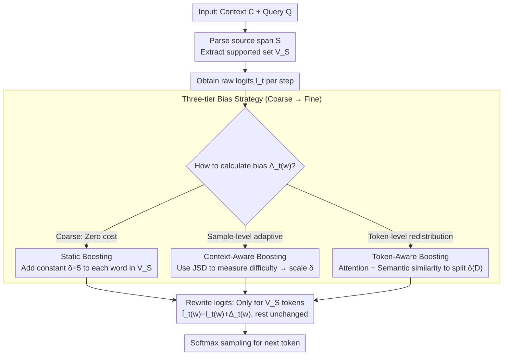

# Context-Fidelity Boosting: Enhancing Faithful Generation through Watermark-Inspired Decoding

**Conference**: ACL 2026  
**arXiv**: [2604.22335](https://arxiv.org/abs/2604.22335)  
**Code**: <https://github.com/weixuzhang/CFB>  
**Area**: LLM Safety / Faithful Generation / Decoding Strategy  
**Keywords**: faithfulness hallucination, logit shaping, watermark, context-aware decoding, RAG

## TL;DR
CFB repurposes the additive logit bias technique used in text watermarking—applying a bonus to tokens "supported by the input context" at each decoding step. It proposes three progressive strategies: static, context-aware (adaptive scaling via JSD), and token-aware (redistribution via attention + semantic relevance). This approach consistently improves faithfulness metrics in summarization and QA across multiple models with near-zero decoding overhead.

## Background & Motivation

**Background**: LLMs often generate plausible-sounding but contradictory content in "context-driven" tasks like RAG, summarization, and conversational IR—referred to as faithfulness hallucinations (distinct from factuality hallucinations, which contradict world knowledge).

**Limitations of Prior Work**: (1) Training-time methods (faithful finetuning) require retraining and exhibit poor cross-domain performance; (2) Prompting methods (Chain-of-Thought, Self-Consistency) are unstable across different models; (3) Existing decoding-time methods (CAD / ADACAD / COIECD) rely on contrasting entire distributions from two forward passes or apply hard constraints, often leading to severe trade-offs between faithfulness and fluency, plus high sensitivity to hyperparameters.

**Key Challenge**: Ensuring LLMs adhere to external context without making the output rigid or robotic—the former requires a "strong bias toward context tokens," while the latter requires "maintaining a natural language distribution."

**Goal**: To introduce a lightweight, model-agnostic, and nearly zero-overhead decoding intervention that biases the model toward source-supported tokens without retraining, while allowing bias intensity to adapt based on sample difficulty and token importance.

**Key Insight**: Text watermarking literature demonstrates that light additive biases on logits can reliably modify generation without destroying fluency (green/red token sets). While watermarking aims to "embed detectable signals," the same logit-shaping mechanism can be reversed—replacing "green tokens" with "tokens supported by the context."

**Core Idea**: At each decoding step, an additive bias $\Delta_t(w)$ is applied to the logits of tokens appearing in the source span. Three hierarchical strategies are designed: fixed value, adaptive scaling based on the "divergence between distributions with and without context," and token-level redistribution using attention + semantic relevance.

## Method

### Overall Architecture
The objective of CFB is straightforward: at each decoding step, any word that appeared in the input context receives a logit bonus, encouraging the model to extract words from the context rather than hallucinating from parametric memory. Specifically, given context $C$ and query $Q$, a source span $S$ is parsed to obtain the supported token set $V_S$. After obtaining the original logits $l_t$ at each step, tokens in $V_S$ are modified as $\tilde l_t(w) = l_t(w) + \Delta_t(w)$, while others remain unchanged before Softmax sampling. The core mechanism lies in calculating $\Delta_t(w)$—the paper presents three progressive algorithms ranging from "fixed value → sample-level adaptive → token-level redistribution," increasing in controllability and computational cost.

### Key Designs

**1. Static Boosting: Applying a fixed bias to all context words to validate the logit-shaping approach.**

The simplest approach applies a uniform constant $\Delta_t(w) = \delta$ (the paper uses $\delta = 5$) to every token in $V_S$, raising the log-likelihood of context words as a whole. Since only tokens in $V_S$ are modified and the distribution of "natural tokens" outside $V_S$ remains intact, the model is not forced into a rigid state and maintains basic fluency. Its value is two-fold: serving as a baseline to prove that "reversing watermarking additive bias improves faithfulness" and offering the lowest computational cost—only one tensor addition per step, which Table 5 shows is a negligible 0.003% of the base model's FLOPS.

**2. Context-Aware Boosting: Using JSD to measure "how much intervention is required," applying pressure only when needed.**

A fixed bias fails to account for sample variance: even if the context does not conflict with parametric knowledge, it still forces $\delta$, potentially distorting a correct distribution. Context-Aware Boosting allows bias intensity to float based on sample difficulty. It first calculates the Jensen-Shannon Divergence $D = \mathrm{JSD}(P_w \| P_{wo})$ ($D\in[0,1]$) between the next-token distributions with and without context, then maps it linearly to the bias:

$$\Delta_t(w) = \delta_{\min} + (\delta_{\max} - \delta_{\min}) \cdot D.$$

When the context barely changes the model's preference (low $D$), minimal bias is added to avoid unnecessary intervention. Strong bias is applied only when the context severely conflicts with model memory (high $D$). This effectively adapts the logic of ADACAD's "conflict-based contrast" into a lighter additive version—using JSD as a difficulty signal without maintaining full contrastive decoding.

**3. Token-Aware Boosting: Redistributing the sample-level $\delta(D)$ based on the relevance of each context word to the current state.**

Sample-level adaptation still treats all words in $V_S$ equally, but some context words are more relevant than others to the current decoding position. Token-Aware Boosting takes the "total budget" $\delta(D)$ and splits it among tokens based on relevance $r_t(w)$. Relevance is a linear combination of two parts: a dynamic attention term $\alpha_t(w) = \mathrm{Agg}\{a_t(p): p \in \mathcal{P}(w,C)\}$ (summing attention scores across all occurrences of word $w$ in the source) and a static semantic similarity term $s(w) = \frac{1}{|S|} \sum_{c \in S} \cos(e_w, e_c)$. Their combination $r_t(w) = \lambda_1 \alpha_t(w) + \lambda_2 s(w)$ (with $\lambda_1=0.6, \lambda_2=0.4$) is normalized as $\hat r_t(w) = r_t(w) / \frac{1}{|V_S|}\sum_u r_t(u)$, resulting in a final bias $\Delta_t(w) = \delta(D) \cdot \hat r_t(w)$. This concentrates the boost budget on the most relevant words. Ablation studies show that the static semantic term is critical; removing it causes ROUGE-L to collapse, as attention alone is unstable.

### Loss & Training
No training occurs; this is a pure decoding-time intervention. Semantic similarity is pre-calculated per sample, while attention is recalculated per step. All experiments use top-$p$ sampling in a zero-shot setting. Hyperparameters $\lambda_1 = 0.6, \lambda_2 = 0.4$ are fixed, and the bias range $\delta$ is scanned in ablation studies.

## Key Experimental Results

### Main Results (Summarization: CNN/DM + XSum, QA: NQ-Synth + NQ-Swap, Models: Mistral-7B / Llama2-13B / Llama3-8B)

| Task + Model | Method | ROUGE-L | FactKB | BERT-P | Acc |
|-------------|------|---------|--------|--------|-----|
| CNN/DM + Llama2-13B | CAD | 35.63 | 97.26 | 89.38 | – |
| CNN/DM + Llama2-13B | **Static CFB** | 37.40 | **98.85** | 89.61 | – |
| CNN/DM + Llama2-13B | **Context-aware CFB** | **37.52** | 98.69 | 89.62 | – |
| CNN/DM + Llama2-13B | **Token-aware CFB** | 36.16 | 97.24 | **89.83** | – |
| XSum + Llama3-8B | CAD | 12.92 | 45.77 | 87.05 | – |
| XSum + Llama3-8B | **Context-aware CFB** | 12.59 | **66.85** | 88.67 | – |
| XSum + Llama3-8B | **Token-aware CFB** | **13.23** | 55.29 | 88.45 | – |
| NQ-Synth + Llama3-8B | CAD | 28.19 | 32.26 | 86.50 | 66.80 |
| NQ-Synth + Llama3-8B | **Token-aware CFB** | **32.90** | **45.94** | 88.13 | **73.40** |
| NQ-Swap + Llama3-8B | ADACAD | 12.52 | 39.14 | 85.82 | **86.50** |
| NQ-Swap + Llama3-8B | Token-aware CFB | 14.54 | 40.92 | 87.99 | 32.43 |

> ADACAD leads on NQ-Swap: When the context explicitly conflicts with parametric knowledge, "contrastive suppression" is more effective than "additive boosting." CFB's design philosophy is to boost rather than suppress, making it stronger in complementary-context scenarios but weaker in conflict scenarios—this is a clear design trade-off rather than a bug.

### Ablation Study (Token-aware CFB on Llama3-8B / CNN-DM)

| Configuration | ROUGE-L | FactKB | BERT-P |
|------|---------|--------|--------|
| Full Token-aware CFB | 35.81 | 94.31 | 89.38 |
| w/o attention | 35.60 | 93.74 | 88.48 |
| **w/o semantic** | **4.45** | **66.84** | **67.68** |
| w/o JSD | 35.24 | 93.60 | 88.43 |

Human + GPT-4o judge evaluation (100 cases each for CNN-DM and NQ-Swap):

| Method | Faith. | Flu. | Info. | Consistency | Hallucinations | Contradiction |
|------|--------|------|-------|-------------|----------------|---------------|
| CAD | 3.82 | 4.15 | 3.76 | 0.83 | 1.24 | 0.12 |
| ADACAD | 4.03 | 4.21 | 3.89 | 0.87 | 0.95 | 0.09 |
| **Token-aware CFB** | **4.31** | 4.18 | **4.12** | **0.91** | **0.67** | **0.05** |

### Key Findings
- The three boosting variants comprehensively outperform CAD / ADACAD / COIECD on faithfulness metrics for CNN/DM, with almost no loss in fluency (BERT-P) or lexical overlap (ROUGE-L).
- Ablation reveals that **semantic similarity is the lifeline of token-aware CFB**—removing it causes ROUGE-L to drop from 35.81 to 4.45, showing that semantic relevance provides a critical stable signal where attention alone fails.
- On NQ-Swap (high knowledge conflict), CFB loses to ADACAD: simply boosting context tokens is insufficient when context contradicts parametric knowledge; one must also suppress the parametric preference.
- Computational Overhead: Static and Context-aware methods consume only 0.003% of base FLOPS. Token-aware requires $2.86 \times 10^8$ FLOPS for attention and cosine calculations, which remains negligible in practice.

## Highlights & Insights
- Reversing the watermark logit-shaping mechanism for "anti-hallucination" is a simple yet elegant idea cross-pollination—using the same mathematical mechanism for opposite goals (embedding signals vs. reinforcing context).
- The three-tier progressive design (Static → Sample-adaptive → Token-fine-grained) allows users to choose based on compute/accuracy requirements, representing a model for "research method + engineering product" tiering.
- Token relevance combines dynamic attention and static embedding similarity with JSD scaling, fusing multiple signals into a formula where every component has a clear physical interpretation.
- The honest admission of CFB’s failure on NQ-Swap, attributed to the "boost vs. suppress" paradigm difference, provides more insight than a claim of universal SOTA.

## Limitations & Future Work
- Dependence on logits and attention access limits use with black-box APIs (GPT-4 / Gemini); Ours acknowledges this and lists black-box approximation as future work.
- Performance in high-conflict scenarios (NQ-Swap) is poor; it may require combination with suppression strategies (e.g., hybrid with ADACAD) to cover the full spectrum of scenarios.
- The dominance of semantic similarity suggest the "fine-grained" contribution of token-awareness is limited—a simplified sample-level + semantic-only approach might achieve similar results.
- $\delta$ hyperparameter sensitivity: Moderate values are best for CNN-DM, while NQ-Synth tolerates a wider range. Grid search may be necessary for new datasets.

## Related Work & Insights
- **vs. CAD (Shi et al. 2024)**: CAD subtracts "without-context" from "with-context" distributions; CFB uses a single forward pass plus additive bias, reducing overhead and stabilizing fluency.
- **vs. ADACAD (Wang et al. 2024)**: ADACAD uses JSD to adjust contrast intensity; CFB uses it to adjust boost intensity. Their opposing philosophies (suppress vs. boost) result in ADACAD winning in high-conflict scenarios and CFB winning in low-conflict ones.
- **vs. COIECD (Yuan et al. 2024)**: COIECD uses entropy constraints to distinguish tokens; CFB applies a uniform boost.
- **vs. Watermarking (Kirchenbauer / Liu et al.)**: Uses the same logit-shaping mechanism; while watermarking selects green tokens via random seeds, CFB selects them based on context support—opposite goals, shared mathematical origin.

## Rating
- Novelty: ⭐⭐⭐⭐ Reversing watermarking + 3-tier boost design is a clear contribution, though individual components are relatively direct.
- Experimental Thoroughness: ⭐⭐⭐⭐ 3 models × 4 datasets × 6 methods + Ablation + Human/LLM evaluation is comprehensive.
- Writing Quality: ⭐⭐⭐⭐⭐ Clear pseudocode, intuitive case studies, and insightful failure analysis for NQ-Swap.
- Value: ⭐⭐⭐⭐ Actionable for RAG/summarization deployment with near-zero cost; though white-box access requirements limit some use cases.

<!-- RELATED:START -->

## Related Papers

- [\[ICLR 2026\] CodeGenGuard: A Watermark for Code Generation Models](../../ICLR2026/llm_safety/codegenguard_a_watermark_for_code_generation_models.md)
- [\[ACL 2026\] Differentially Private Synthetic Text Generation for Retrieval-Augmented Generation (RAG)](differentially_private_synthetic_text_generation_for_retrieval-augmented_generat.md)
- [\[ACL 2026\] Robust Multimodal Safety via Conditional Decoding](robust_multimodal_safety_via_conditional_decoding.md)
- [\[ACL 2026\] Membership Inference Attacks on In-Context Learning Recommendation](membership_inference_attacks_on_llm-based_recommender_systems.md)
- [\[ACL 2026\] Please Refuse to Answer Me: Mitigating Over-Refusal in LLMs via Adaptive Contrastive Decoding](please_refuse_to_answer_me_mitigating_over-refusal_in_large_language_models_via_.md)

<!-- RELATED:END -->
