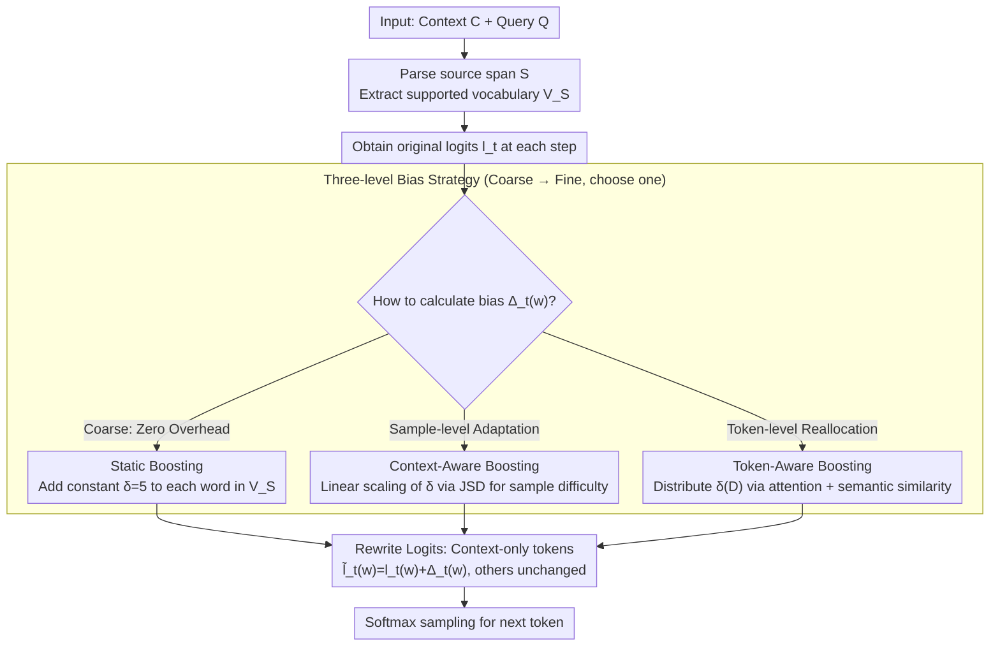

# Context-Fidelity Boosting: Enhancing Faithful Generation through Watermark-Inspired Decoding

**Conference**: ACL 2026  
**arXiv**: [2604.22335](https://arxiv.org/abs/2604.22335)  
**Code**: <https://github.com/weixuzhang/CFB>  
**Area**: LLM Safety / Faithful Generation / Decoding Strategy  
**Keywords**: faithfulness hallucination, logit shaping, watermark, context-aware decoding, RAG

## TL;DR
CFB repurposes the additive logit bias technique used in text watermarking by applying a bonus to tokens "supported by the input context" during each decoding step. It proposes three progressive strategies—static, context-aware (scaling adaptively with JSD), and token-aware (reallocation via attention + semantic correlation)—which consistently improve faithfulness metrics in summarization and QA tasks across multiple models with negligible decoding overhead.

## Background & Motivation

**Background**: LLMs frequently output content that sounds plausible but contradicts the input context in "context-driven" tasks such as RAG, summarization, and conversational IR—referred to as faithfulness hallucination (distinct from factuality hallucination, which contradicts world knowledge).

**Limitations of Prior Work**: (1) Training-time methods (faithful finetuning) require retraining and exhibit poor cross-domain performance; (2) Prompting methods (chain-of-thought, self-consistency) are unstable across models; (3) Existing decoding-time methods (CAD / ADACAD / COIECD) rely on contrasting entire distributions from two forward passes or impose hard constraints, often oscillating between faithfulness and fluency while remaining sensitive to hyperparameters.

**Key Challenge**: Adhering to external context without causing output rigidity or loss of fluency—the former requires a "strong bias toward context words," while the latter requires "maintaining natural language distributions."

**Goal**: To introduce a lightweight, model-agnostic, and nearly zero-overhead decoding intervention that biases the model toward source-supported tokens without retraining, while allowing the bias intensity to adapt based on sample difficulty and token importance.

**Key Insight**: Text watermarking literature has demonstrated that lightweight additive biases on logits can stably rewrite generation without destroying fluency (green/red token sets). While watermarking aims to "embed detectable signals," the same logit-shaping mechanism can be reversed—replacing "green tokens" with "context-supported tokens."

**Core Idea**: At each decoding step, a bias $\Delta_t(w)$ is added to the logits of tokens appearing in the source span. Three strategies ranging from coarse to fine are designed: fixed values, adaptation based on the difference in output distributions with and without context, and reallocation based on token-level attention and semantic relevance.

## Method

### Overall Architecture
The objective of CFB is straightforward: at each decoding step, a bonus is added to the logits of words present in the input context, encouraging the model to extract words from the context rather than relying on parametric memory. Specifically, given context $C$ and query $Q$, a source span $S$ is parsed from $C$ to obtain a "supported token set" $V_S$. After obtaining the original logits $l_t$ at each step, tokens in $V_S$ are rewritten as $\tilde l_t(w) = l_t(w) + \Delta_t(w)$, while others remain unchanged before softmax sampling. The core mechanism lies in calculating the bias $\Delta_t(w)$ via three algorithms of increasing granularity: fixed value, sample-level adaptation, and token-level reallocation.

### Key Designs

**1. Static Boosting: Applying a fixed bias to all context words to validate the logit shaping approach**

The most basic implementation applies a uniform constant $\Delta_t(w) = \delta$ (where $\delta = 5$) to every token in $V_S$ without distinction. This forcefully shifts the log-likelihood of context words upward. Since only tokens in $V_S$ are modified and the distribution of "natural tokens" outside $V_S$ remains intact, the model retains fundamental fluency without being forced into a rigid state of only outputting source words. This baseline proves the effectiveness of repurposing watermarking biases for faithfulness and incurs the lowest computational cost—only one tensor addition per step (0.003% of base model FLOPS).

**2. Context-Aware Boosting: Measuring "context necessity" via JSD to apply strong bias only when needed**

Fixed bias fails to account for sample variance: it applies $\delta$ even when the context does not conflict with parametric knowledge, unnecessarily distorting correct distributions. Context-Aware Boosting allows bias intensity to fluctuate with sample difficulty. It first calculates the Jensen-Shannon divergence $D = \mathrm{JSD}(P_w \| P_{wo})$ between distributions with and without context ($D\in[0,1]$), then maps this linearly to the bias:

$$\Delta_t(w) = \delta_{\min} + (\delta_{\max} - \delta_{\min}) \cdot D.$$

If the context barely changes model preference ($D$ is small), minimal bias is applied; strong bias is only triggered when the context severely conflicts with model memory ($D$ is large). This adapts the contrastive intensity logic of ADACAD into a lightweight additive version, utilizing JSD as a difficulty signal without needing to maintain full contrastive decoding.

**3. Token-Aware Boosting: Reallocating boost based on context word relevance to the current decoding state**

Sample-level adaptation treats all words in $V_S$ equally, but some context words are more relevant to the current generation position. Token-Aware Boosting reallocates the "total budget" $\delta(D)$ based on token relevance. Relevance is a linear combination of two parts: a dynamic attention term $\alpha_t(w) = \mathrm{Agg}\{a_t(p): p \in \mathcal{P}(w,C)\}$ (summing attention scores across all occurrences of word $w$ in the source) and a static semantic similarity term $s(w) = \frac{1}{|S|} \sum_{c \in S} \cos(e_w, e_c)$. These form $r_t(w) = \lambda_1 \alpha_t(w) + \lambda_2 s(w)$ (with $\lambda_1=0.6, \lambda_2=0.4$), normalized as $\hat r_t(w) = r_t(w) / \frac{1}{|V_S|}\sum_u r_t(u)$. The final bias is $\Delta_t(w) = \delta(D) \cdot \hat r_t(w)$, concentrating the budget on the most appropriate tokens. Ablations show that static semantics are crucial; removing them causes ROUGE-L to collapse, as attention alone is insufficient.

### Loss & Training
The method requires no training and is a pure decoding-time intervention. Semantic similarity is pre-calculated per sample, while attention is recalculated at each step to reflect the current decoding state. Experiments utilize top-$p$ sampling in a zero-shot setting; $\lambda_1 = 0.6$ and $\lambda_2 = 0.4$ are fixed, and the bias range $\delta$ is determined via ablation scanning.

## Key Experimental Results

### Main Results (Summarization: CNN/DM + XSum, QA: NQ-Synth + NQ-Swap, Models: Mistral-7B / Llama2-13B / Llama3-8B)

| Task + Model | Method | ROUGE-L | FactKB | BERT-P | Acc |
|-------------|------|---------|--------|--------|-----|
| CNN/DM + Llama2-13B | CAD | 35.63 | 97.26 | 89.38 | – |
| CNN/DM + Llama2-13B | **Static CFB** | 37.40 | **98.85** | 89.61 | – |
| CNN/DM + Llama2-13B | **Context-aware CFB** | **37.52** | 98.69 | 89.62 | – |
| CNN/DM + Llama2-13B | **Token-aware CFB** | 36.16 | 97.24 | **89.83** | – |
| XSum + Llama3-8B | CAD | 12.92 | 45.77 | 87.05 | – |
| XSum + Llama3-8B | **Context-aware CFB** | 12.59 | **66.85** | 88.67 | – |
| XSum + Llama3-8B | **Token-aware CFB** | **13.23** | 55.29 | 88.45 | – |
| NQ-Synth + Llama3-8B | CAD | 28.19 | 32.26 | 86.50 | 66.80 |
| NQ-Synth + Llama3-8B | **Token-aware CFB** | **32.90** | **45.94** | 88.13 | **73.40** |
| NQ-Swap + Llama3-8B | ADACAD | 12.52 | 39.14 | 85.82 | **86.50** |
| NQ-Swap + Llama3-8B | Token-aware CFB | 14.54 | 40.92 | 87.99 | 32.43 |

> ADACAD outperforms on NQ-Swap: when context explicitly conflicts with parametric knowledge, "contrastive suppression" is more effective than "additive boosting." Since CFB is designed to boost rather than suppress, it is stronger in complementary-context scenarios and weaker in conflict scenarios—a clear design trade-off.

### Ablation Study (Token-aware CFB on Llama3-8B / CNN-DM)

| Configuration | ROUGE-L | FactKB | BERT-P |
|------|---------|--------|--------|
| Full Token-aware CFB | 35.81 | 94.31 | 89.38 |
| w/o attention | 35.60 | 93.74 | 88.48 |
| **w/o semantic** | **4.45** | **66.84** | **67.68** |
| w/o JSD | 35.24 | 93.60 | 88.43 |

Human + GPT-4o judge evaluation (100 cases each for CNN-DM + NQ-Swap):

| Method | Faith. | Flu. | Info. | Consistency | Hallucinations | Contradiction |
|------|--------|------|-------|-------------|----------------|---------------|
| CAD | 3.82 | 4.15 | 3.76 | 0.83 | 1.24 | 0.12 |
| ADACAD | 4.03 | 4.21 | 3.89 | 0.87 | 0.95 | 0.09 |
| **Token-aware CFB** | **4.31** | 4.18 | **4.12** | **0.91** | **0.67** | **0.05** |

### Key Findings
- All three boosting variants outperform CAD / ADACAD / COIECD in faithfulness metrics on CNN/DM, with negligible losses in fluency (BERT-P) and lexical overlap (ROUGE-L).
- Ablation reveals that **semantic similarity is the core of token-aware boosting**—removing it drops ROUGE-L from 35.81 to 4.45, indicating that semantic relevance provides a critical stabilization signal that attention alone cannot sustain.
- CFB underperforms compared to ADACAD on NQ-Swap (high knowledge conflict); boosting context tokens is insufficient when they contradict parametric knowledge, requiring suppression of parametric preferences.
- Computational overhead: Static and Context-aware variants consume only 0.003% of base FLOPS; Token-aware requires $2.86 \times 10^8$ FLOPS due to attention and cosine lookups but remains negligible.

## Highlights & Insights
- Reversing logit shaping from watermarking literature for "anti-hallucination" is a simple yet elegant instance of idea cross-pollination—the same mathematical mechanism serves two opposite purposes (adding detectable signals vs adding context signals).
- The three-level progressive design (fixed → sample adaptive → token fine-grained) allows users to choose based on computational/precision requirements, serving as a model for graded research and engineering.
- Combining "dynamic attention + static embedding similarity" for token relevance with sample-level JSD scaling fuses multiple signals into a design where each component has a clear physical interpretation.
- The honest acknowledgment of CFB's failure on NQ-Swap and its attribution to the "boost vs suppress" paradigm difference is more informative than claiming universal SOTA.

## Limitations & Future Work
- Dependency on logit and attention access prevents use with black-box APIs (GPT-4 / Gemini); the authors identify black-box approximation as future work.
- Poor performance in high-conflict scenarios (NQ-Swap) suggests a need to integrate suppression strategies (e.g., combining with ADACAD) for full scenario coverage.
- The dominance of semantic similarity suggests that the "fine-grained" contribution of the token-aware approach may be limited; a combination of sample-level and semantic-only signals might approximate the results.
- $\delta$ hyperparameter sensitivity: moderate values are optimal for CNN-DM, while over-tuning causes collapse; NQ-Synth shows a wider tolerance range, necessitating grid searches for new datasets.

## Related Work & Insights
- **vs CAD (Shi et al. 2024)**: CAD subtracts "contextual vs non-contextual" distributions; CFB uses a single forward pass with additive bias, reducing overhead and stabilizing fluency.
- **vs ADACAD (Wang et al. 2024)**: ADACAD uses JSD to adjust contrastive intensity; CFB uses it for boost intensity. Their philosophies (suppress vs boost) lead to complementary performance (ADACAD in conflict, CFB in low-conflict).
- **vs COIECD (Yuan et al. 2024)**: COIECD uses entropy constraints to distinguish tokens; CFB applies a uniform boost.
- **vs Watermarking (Kirchenbauer / Liu et al.)**: Uses the same logit shaping mechanism; while watermarking selects green tokens via random seeds, CFB selects target sets based on context support.

## Rating
- Novelty: ⭐⭐⭐⭐ Repurposing watermarking with a three-level boost design is a clear contribution, though components are straightforward.
- Experimental Thoroughness: ⭐⭐⭐⭐ Covers 3 models × 4 datasets × 6 methods + ablation + human/LLM evaluation.
- Writing Quality: ⭐⭐⭐⭐⭐ Clear algorithms, intuitive case studies, and honest analysis of NQ-Swap failures.
- Value: ⭐⭐⭐⭐ Directly actionable for RAG and summarization with zero overhead, though limited by white-box requirements.

<!-- RELATED:START -->

## Related Papers

- [\[ACL 2026\] Differentially Private Synthetic Text Generation for Retrieval-Augmented Generation (RAG)](differentially_private_synthetic_text_generation_for_retrieval-augmented_generat.md)
- [\[ACL 2026\] Membership Inference Attacks on In-Context Learning Recommendation](membership_inference_attacks_on_llm-based_recommender_systems.md)
- [\[ACL 2026\] Robust Multimodal Safety via Conditional Decoding](robust_multimodal_safety_via_conditional_decoding.md)
- [\[ACL 2026\] LeakDojo: Decoding the Leakage Threats of RAG Systems](leakdojo_decoding_the_leakage_threats_of_rag_systems.md)
- [\[ACL 2026\] Please Refuse to Answer Me: Mitigating Over-Refusal in LLMs via Adaptive Contrastive Decoding](please_refuse_to_answer_me_mitigating_over-refusal_in_large_language_models_via_.md)

<!-- RELATED:END -->
