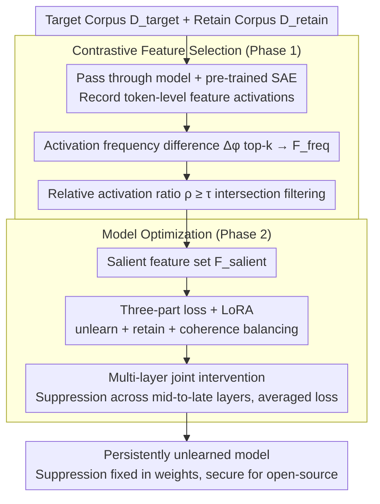

# CRISP: Persistent Concept Unlearning via Sparse Autoencoders

**Conference**: ACL 2026  
**arXiv**: [2508.13650](https://arxiv.org/abs/2508.13650)  
**Code**: https://github.com/technion-cs-nlp/CRISP  
**Area**: LLM Safety / Unlearning / Interpretability / SAE  
**Keywords**: SAE, Persistent Unlearning, WMDP, Contrastive Feature Selection, LoRA, Concept Suppression

## TL;DR
Addressing the issue where SAE-based unlearning mostly intervenes only during inference while weights still contain sensitive knowledge, CRISP automatically identifies SAE features that are "strongly activated only on target" by comparing target/retain corpora. It then uses LoRA with a three-part loss (unlearn + retain + coherence) to "fix" these feature activations to zero within the weights. This approach advances the Pareto frontier across unlearn-retain-fluency axes on WMDP-Bio/Cyber, outperforming ELM by 27-34 points and RMU by 5-8 points.

## Background & Motivation

**Background**: After deployment, LLMs often require the removal of hazardous knowledge (bioweapons/privacy/copyright). Unlearning mainstream methods fall into two categories: (1) direct parameter editing (RMU, ELM), which rewrites hidden states using random directions or self-classification; (2) SAE inference-time intervention, which clamps SAE feature activations corresponding to target concepts to minimum values.

**Limitations of Prior Work**: (1) Parameter editing often causes collateral damage—removing "how to enhance virus infectivity" may also destroy benign knowledge like "how the immune system fights viruses"; simultaneously, fluency collapses on target concepts (repetition or irrelevance). (2) SAE inference methods only modify activations during inference; hazardous knowledge remains in the parameters, which an attacker can recover by bypassing the hooks in open-source scenarios.

**Key Challenge**: There is a split between "precision" (the monosemantic advantage of SAEs) and "persistence" (parameter-level editing). Fine-grained SAE methods are not persistent, while persistent methods are not fine-grained.

**Goal**: To "embed" the fine-grained interpretability of SAEs into model parameters, achieving (a) persistence (security in open-source scenarios); (b) precision (no impact on adjacent benign concepts); and (c) fluency (ability to generate coherent, factual, and neutral content on target concepts).

**Key Insight**: Since SAE features have already decoupled concepts, why not "first identify target-exclusive features, then train the model to suppress these features itself"? Use the SAE as a "concept compass," but solidify the compass direction into the weights using LoRA.

**Core Idea**: CRISP = **Contrastive frequency/ratio feature selection** + **LoRA fine-tuning for self-suppression**, upgrading "inference-time clamping" to "training-time fixation."

## Method

### Overall Architecture

A two-stage pipeline without modifying the SAE itself:

1.  **Phase 1 — Feature Selection**: Pass $\mathcal{D}_{\text{target}}$ (unlearn corpus) and $\mathcal{D}_{\text{retain}}$ (retain corpus) through the model and pre-trained SAE to record token-level activations. Identify $\mathcal{F}_{\text{salient}}$ using dual filtering: "activation frequency difference + relative activation strength ratio."
2.  **Phase 2 — Model Optimization**: Fine-tune the original model $M$ using LoRA. The goal is to minimize activations of $\mathcal{F}_{\text{salient}}$ when encountering $\mathcal{D}_{\text{target}}$, while maintaining hidden states consistent with the original model $M_0$ on $\mathcal{D}_{\text{retain}}$.

Operations are performed at middle layers (layer 24 for Llama-3.1-8B, layer 14 for Gemma-2-2B), where SAE feature decoupling is most effective.

### Key Designs

**1. Contrastive Salient Feature Selection: Automatically selecting "target-exclusive" features from hundreds of thousands of SAE features to avoid collateral damage.**

SAEs decouple concepts into hundreds of thousands of features. For precise unlearning, it is necessary to identify which features truly encode the target concept. Using a single metric is insufficient: activation frequency difference alone might select shared features that are slightly more frequent in the target set. Relative activation ratio alone might capture marginal features that appear almost exclusively in the target but have negligible total activation. CRISP uses the intersection of two metrics. It first takes the top-$k$ by activation frequency difference $\Delta\phi(f_i)=\phi(f_i,\mathcal{D}_{\text{target}})-\phi(f_i,\mathcal{D}_{\text{retain}})$ to obtain $\mathcal{F}_{\text{freq}}$, then applies a threshold $\tau$ to the relative activation ratio $\rho(f_i)=A(f_i,\mathcal{D}_{\text{target}})/(A(f_i,\mathcal{D}_{\text{retain}})+\epsilon)$:

$$\mathcal{F}_{\text{salient}}=\{f_i\in\mathcal{F}_{\text{freq}}\mid\rho(f_i)\ge\tau\}.$$

Only features that are both "sufficiently frequent" and "strongly biased toward target" are retained. This ensures precision without affecting benign concepts—ablation shows that removing the $\rho$ ratio filter significantly degrades retain performance because shared features are suppressed.

**2. Three-part loss + LoRA Persistence: Explicitly separating the goals of "target suppression / retain protection / fluency maintenance" and fixing them into weights via LoRA.**

Once $\mathcal{F}_{\text{salient}}$ is selected, the model must learn to suppress these features without destroying the original structure or benign representations. Using only an unlearn objective often leads to "over-suppression," dragging down both the retain set and fluency. CRISP decomposes the objective: the unlearn loss $\mathcal{L}_{\text{unlearn}}=\mathbb{E}_{t\sim\mathcal{D}_{\text{target}}}\mathbb{E}_{f_i\sim\mathcal{F}_{\text{salient}}}[a_i^{(t)}+\lambda c_t]$ directly minimizes salient feature activations on target tokens; the retain loss $\mathcal{L}_{\text{retain}}=\mathbb{E}_{t\sim\mathcal{D}_{\text{retain}}}\|h_M^{(t)}-h_{M_0}^{(t)}\|_2^2$ anchors hidden states of the retain set near the original model $M_0$ to prevent collateral damage; the coherence loss also uses hidden state alignment but is applied to the final layer on 20 neutral sentences per domain generated by Claude, specifically guarding fluency around target concepts. The total loss is:

$$\mathcal{L}=\alpha\mathcal{L}_{\text{unlearn}}+\beta\mathcal{L}_{\text{retain}}+\gamma\mathcal{L}_{\text{coherence}}$$

Only LoRA adapters are updated. This step distinguishes CRISP from "inference-time clamping"—by writing suppression into the weights, the unlearning remains even if an attacker bypasses the hook. LoRA also makes the editing reversible and parameter-efficient.

**3. Multi-layer Joint Intervention + Middle Layer Positioning: Suppressing in a group of mid-to-late layers simultaneously to prevent downstream layers from recovering information.**

Feature suppression in a single layer is unreliable—downstream layers can "refill" suppressed information. CRISP applies suppression across a pre-selected group of layers, calculating and averaging the loss for each independent layer (e.g., around layer 24 for Llama-3.1-8B, layer 14 for Gemma-2-2B). These middle-to-late layers are chosen because SAE features there have higher decoupling and finer concept granularity, serving as abstract representation sites suitable for concept-level editing rather than shallow surface-level editing.

### Loss & Training
LoRA adapters (ranks in Appendix), 200 hyperparameter sweep runs per method. Best configurations are selected based on a composite score of unlearn + retain + MMLU on the validation set. MCQ validation/test sets are split 50/50. Overall = HM(100-U, R, M, F·50, C·50), ensuring any single-axis weakness is penalized.

## Key Experimental Results

### Main Results (WMDP Bio / Cyber, 5 metrics + Overall HM)

| Model / Dataset | Method | Overall ↑ | Unlearn↓ | Retain↑ | MMLU↑ | Fluency↑ | Concept↑ |
|---|---|---|---|---|---|---|---|
| Bio / Llama-3.1-8B | Original | 56.60 | 68.29 | 76.81 | 61.15 | 1.24 | 1.77 |
| Bio / Llama-3.1-8B | ELM | 33.93 | 41.44 | 62.17 | 55.31 | 0.25 | 1.24 |
| Bio / Llama-3.1-8B | RMU | 52.51 | 34.54 | 67.75 | 59.50 | 0.56 | 1.58 |
| Bio / Llama-3.1-8B | **CRISP** | **60.10** | **30.93** | **74.13** | **60.28** | **0.77** | 1.58 |
| Bio / Gemma-2-2B | Original | 54.37 | 55.26 | 55.27 | 46.30 | 1.07 | 1.78 |
| Bio / Gemma-2-2B | ELM | 22.13 | 27.80 | 40.54 | 35.80 | 0.14 | 1.20 |
| Bio / Gemma-2-2B | RMU | 51.91 | **27.79** | 48.77 | 42.77 | 0.76 | 1.63 |
| Bio / Gemma-2-2B | **CRISP** | **56.70** | 29.67 | **54.45** | **46.33** | **0.92** | 1.63 |
| Cyber / Llama-3.1-8B | Original | 61.32 | 40.95 | 54.00 | 61.15 | 1.27 | 1.43 |
| Cyber / Llama-3.1-8B | ELM | 58.91 | 30.78 | 53.00 | 58.56 | 0.99 | 1.40 |
| Cyber / Llama-3.1-8B | RMU | 52.47 | 33.70 | 55.00 | 61.15 | 0.68 | 1.23 |
| Cyber / Llama-3.1-8B | **CRISP** | **61.74** | **29.38** | 53.00 | 58.86 | **1.14** | **1.49** |
| Cyber / Gemma-2-2B | Original | 52.57 | 33.90 | 39.00 | 46.30 | 1.05 | 1.46 |
| Cyber / Gemma-2-2B | ELM | 43.33 | 28.87 | 29.00 | 38.71 | 0.76 | 1.36 |
| Cyber / Gemma-2-2B | RMU | 44.79 | 28.67 | 36.00 | 44.79 | 0.64 | 1.23 |
| Cyber / Gemma-2-2B | **CRISP** | **49.02** | **27.26** | **38.00** | **46.26** | **0.81** | 1.28 |

CRISP takes the lead in Overall score across all 4 (model, dataset) settings. On Bio-Llama, it gains +26.17/+7.59 over ELM/RMU respectively; on Bio-Gemma, it gains +34.57/+4.79. The gap narrows in Cyber but CRISP remains ahead, indicating that unlearning is more challenging in domains with more dispersed content.

### Ablation Study

| Config | Bio-Llama Overall | Description |
|------|-------------------|------|
| Full CRISP | 60.10 | unlearn + retain + coherence + dual index feature selection |
| w/o Coherence loss | ↓ (fluency near 0.56) | Generations around target concepts become repetitive/irrelevant |
| w/o Retain loss | ↓ (retain near 62.17) | Benign knowledge is unintentionally suppressed |
| w/o $\rho$ ratio filtering | ↓ | Misidentifies shared features, significantly degrading retain |
| Inference-time clamp | Non-persistent | Knowledge remains in parameters; bypassable |

### Key Findings
- **Pareto Dominance**: Scatter plots show that almost all CRISP hyperparameter configurations are near the "random unlearn + no drop in retain" ideal point. RMU follows, while ELM is furthest.
- **Fluency Advantage**: On Bio-Gemma, ELM's fluency is only 0.14 (garbled text), while CRISP's 0.92 is close to the original 1.07. Precision in "who to suppress" is more important than "how much."
- **Semantic Interpretability**: Selected features on Llama layer 24 / Gemma layer 14 are concentrated on viruses/transmission/vectors for target concepts and anatomy/research methods for benign concepts.
- **Cross-model Consistency**: Methods show similar distribution patterns on Llama and Gemma, suggesting the contrastive selection is robust across different SAE training methods.

## Highlights & Insights
- **Translating interpretability tools to training signals**: While SAEs were mostly used for probing/steering, this work translates "this feature represents concept X" directly into a differentiable training objective.
- **Contrastive Dual Metrics (Freq Diff + Ratio)**: A low-cost, generalizable concept localization trick applicable beyond unlearning (e.g., steering, debiasing, style control).
- **Three-part balancing**: Explicitly separating objectives into "suppress / protect / smooth" and using hyperparameter sweeps to probe the Pareto frontier provides a clean methodological framework.
- **Threat Model Awareness**: The paper honestly notes that inference intervention is not true unlearning for open-source scenarios, clarifying the security boundary.

## Limitations & Future Work
- **Dependency on SAE quality**: If target concepts are dispersed across polysemantic features, contrastive metrics might fail. Higher quality, finer-grained SAEs or online SAE tuning are needed.
- **Domain Scope**: Validated only on WMDP and Harry Potter. Copyright content, multimodal safety, and RAG scenarios remain untested.
- **No Formal Guarantees**: Residual knowledge might still exist in a distributed manner; robustness against adversarial finetuning recovery was not evaluated.
- **Sweep Cost**: 200 runs are expensive. HM scoring sensitivity requires broad sweeps to find the optimal balance.

## Related Work & Insights
- **vs RMU**: RMU pushes target hidden states toward random directions (coarse扰), while CRISP suppresses specific SAE directions, leading to 6+ points higher retain and double the fluency.
- **vs ELM**: ELM modifies early layers to align target representations with "benign substitutes," causing hallucinations. CRISP suppresses at middle layers, avoiding total representation shifts.
- **vs Farrell et al. 2024 (SAE clamp)**: Former is inference-time; CRISP converts the goal into LoRA training for persistence.
- **vs PISCES**: PISCES uses manual feature selection and only edits FFN $W_2$; CRISP is automatic and edits the full attention/FFN stack via LoRA.
- **Insight**: The paradigm of "compositional interpretability tool $\rightarrow$ differentiable loss" can be applied to many generative control tasks.

## Rating
- Novelty: ⭐⭐⭐⭐ Solid step in making SAE-based intervention persistent.
- Experimental Thoroughness: ⭐⭐⭐⭐ Broad sweeps and Pareto analysis, though lacking adversarial robustness tests.
- Writing Quality: ⭐⭐⭐⭐⭐ Clear progression from motivation to analysis.
- Value: ⭐⭐⭐⭐ New SOTA for persistent unlearning with transferable methodology.

<!-- RELATED:START -->

## Related Papers

- [\[ICCV 2025\] SAUCE: Selective Concept Unlearning in Vision-Language Models with Sparse Autoencoders](../../ICCV2025/llm_safety/sauce_selective_concept_unlearning_in_vision-language_models_with_sparse_autoenc.md)
- [\[ICML 2025\] SAEBench: A Comprehensive Benchmark for Sparse Autoencoders in Language Model Interpretability](../../ICML2025/llm_safety/saebench_a_comprehensive_benchmark_for_sparse_autoencoders_in_language_model_int.md)
- [\[NeurIPS 2025\] SAEMark: Steering Personalized Multilingual LLM Watermarks with Sparse Autoencoders](../../NeurIPS2025/llm_safety/saemark_steering_personalized_multilingual_llm_watermarks_with_sparse_autoencode.md)
- [\[ACL 2026\] CAP: Controllable Alignment Prompting for Unlearning in LLMs](cap_controllable_alignment_prompting_for_unlearning_in_llms.md)
- [\[ACL 2026\] SAGE: Sparse Adaptive Guidance for Dependency-Aware Tabular Data Generation](sage_sparse_adaptive_guidance_for_dependency-aware_tabular_data_generation.md)

<!-- RELATED:END -->
