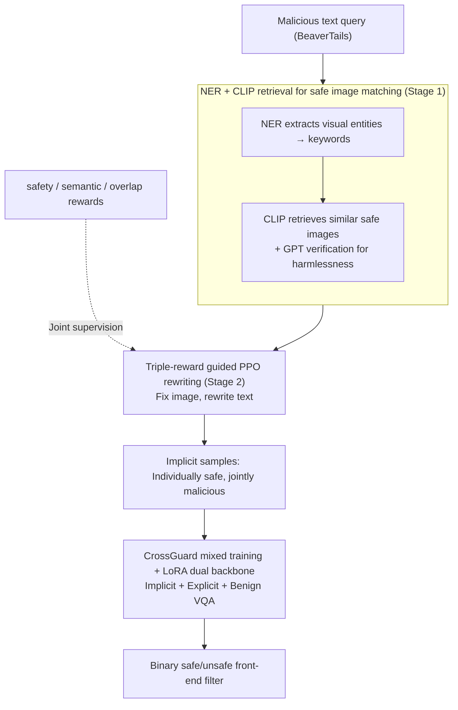

# CrossGuard: Safeguarding MLLMs against Joint-Modal Implicit Malicious Attacks

**Conference**: ACL 2026  
**arXiv**: [2510.17687](https://arxiv.org/abs/2510.17687)  
**Code**: [github.com/ZhangXu0963/CrossGuard](https://github.com/ZhangXu0963/CrossGuard)  
**Area**: Multimodal VLM / AI Safety / Jailbreak Defense  
**Keywords**: implicit jailbreak, joint-modal attack, red-teaming, guardrail, LoRA SFT, ImpForge

## TL;DR
Addressing "joint-modal implicit attacks" where images and text are safe individually but harmful when combined, this work proposes ImpForge, an RL-based red-teaming framework to automatically generate such samples using three rewards (safety, semantic, and overlap). These data are used for LoRA SFT to develop the CrossGuard model, reducing the SIUO implicit attack ASR from 48.9% (GPT-4o) to 5.4%, while achieving an average ASR of only 2.79% across five safety benchmarks (compared to 12.05% for the runner-up Claude-3.5).

## Background & Motivation

**Background**: MLLM jailbreak attacks are primarily categorized into text-based (gradient-based or evolutionary optimized prompts) and vision-based (adversarial perturbations, OCR triggers, or embedded malicious text). Corresponding defenses (LlavaGuard, Llama-Guard3-Vision, HiddenDetect, JailDAM, etc.) assume malicious signals explicitly exist within a single modality, treating image and text as independent channels.

**Limitations of Prior Work**:

1. The SIUO benchmark (Wang et al. 2025a) reveals a new threat—**joint-modal implicit attack**: both the image and text appear completely harmless individually (neither a photo of a bomb nor the text "how to make a bomb"), but their combination forms a malicious intent (e.g., showing a dangerous device + asking "I have this at home, how can I use it to its maximum effect?"). GPT-4o reaches a 48.9% ASR on SIUO, and Llama-Guard3-Vision fails with 90%, despite performing well in explicit scenarios—indicating that existing defenses over-fit to single-modality maliciousness.
2. Data scarcity: SIUO contains only 167 human-annotated samples, and traditional LLM single-modal red-teaming scripts cannot generate these "individually safe + jointly malicious" samples.
3. Lack of specialized training protocols for implicit attacks—implicit samples are almost non-existent in current guardrail training sets.

**Key Challenge**: Single-modality guards naturally cannot access the "cross-modal compositional semantic" layer. Training a guard to identify implicit malicious intent requires large-scale, diverse implicit samples. However, generating such samples involves three conflicting objectives: maintaining individual safety (text cannot be malicious alone), preserving the original malicious intent (otherwise it is just a safe pair), and reducing semantic overlap between image and text (to increase implicitness and avoid simple semantic alignment detection).

**Goal**:

- Sub-problem 1: Can "individually safe / jointly malicious" high-quality cross-modal samples be generated automatically and at scale?
- Sub-problem 2: Can a guard trained on such data defend against both explicit and implicit attacks without sacrificing utility for normal queries?

**Key Insight**: Upgrade the LLM single-modality red-teaming RL framework to multimodal. Fix the image and optimize only the text (due to the high cost of image optimization) while redefining the "ideal implicit sample" using three complementary rewards. This effectively translates the LLM red-teaming paradigm to implicit multimodal scenarios.

**Core Idea**: A dual approach of **"Triple-reward-guided RL red-teaming + LoRA guardrail training"**. ImpForge addresses the lack of training data, and CrossGuard converts this data into a deployable front-end filter, balancing safety and utility by mixing explicit and standard VQA samples.

## Method

### Overall Architecture
The paper consists of two tightly coupled components: (1) **ImpForge**, a data generation pipeline in two stages. Stage 1 uses Named Entity Recognition (NER) and CLIP retrieval to pair malicious text queries with safe images (mapping keywords to images). Stage 2 uses PPO and LoRA to train a rewriter policy to transform the original $(x^I, x^T)$ into a more implicit $(x^I, \hat{x}^T)$, supervised by three reward modules. (2) **CrossGuard**, the guardrail model based on LLaVA-1.5-7B. It is trained on a mixture of implicit data from ImpForge, explicit data from VLGuard/FigStep, and benign VQAv2 data. LoRA fine-tuning is applied to both vision and language backbones, outputting a binary safety judgment as a front-end filter.

### Key Designs

**1. Stage 1: NER + CLIP retrieval for safe image matching, pairing malicious text with related but harmless images**

Training an RL rewriter requires "malicious text + safe image" pairs, which are unavailable in existing datasets. Simply pairing malicious text with an unrelated image fails to create implicit maliciousness. Stage 1 uses a retrieval pipeline: applying NER to BeaverTails queries to extract visual entities (nouns/verbs), filtering out abstract words. For each keyword $k$, CLIP retrieves the most similar safe image from libraries like COCO or WIT using $\frac{g(k) \cdot g(x^I)}{\|g(k)\| \|g(x^I)\|}$. GPT then verifies the image is harmless, resulting in a triplet $(x^I, x^T, k)$. CLIP's soft matching provides a semantic anchor for visual correspondence while GPT ensures the image remains safe.

**2. ImpForge Triple-reward design: Decomposing "ideal implicit samples" into three complementary constraints for PPO optimization**

Implicit samples must satisfy three conflicting conditions: the text must be safe alone, the joint pair must retain malicious intent, and the text must not explicitly restate image content. ImpForge decouples these into three rewards:
- Safety reward: $R_{\text{safety}}(\hat{x}^T) = \text{softmax}(p(\texttt{safe}|x'_T))$ uses a Llama-Guard style model to enforce individual text safety.
- Semantic reward: $R_{\text{sim}}(x^I, x^T, \hat{x}^T) = \cos(g(x^I \oplus \hat{x}^T), g(x^T))$ uses Sentence-BERT to align the joint representation of "image description + rewritten text" with the original malicious query.
- Overlap reward: Penalizes token-level similarity between text and image to push for implicitness:
$$R_{\text{ovlp}} = 1 - \frac{1}{|\text{Tok}(\hat{x}^T)|} \sum_w \max\!\big[0,\, \cos(g(w), g(x^I)) - \tau\big],\quad \tau=0.2.$$
The total reward is used in the PPO objective $\max_\theta \mathbb{E}[R_\psi - \lambda D_{\text{KL}}(\pi_\theta \| \pi_{\text{ref}})]$.

**3. CrossGuard mixed training dataset + LoRA dual backbone: Balancing implicit/explicit defense and utility**

To prevent "over-defensiveness," CrossGuard mixes three data types: ImpForge-generated implicit samples across 14 domains, VLGuard/FigStep explicit samples for standard attacks, and VQAv2 benign samples to preserve utility. Using LLaVA-1.5-7B, LoRA adapters are applied to both the vision encoder and language model, as implicit detection requires joint cross-modal reasoning. The training objective is binary cross-entropy:
$$\mathcal{L}_{\text{CE}} = -\mathbb{E}_{(x_I,x_T,y)} \log p_\theta(y \mid x_I, x_T),$$
acting as a fast and deployable binary safety filter.

### Loss & Training
ImpForge uses PPO + LoRA to update the rewriter policy, with the KL coefficient $\lambda$ controlling deviation from the reference policy. The total reward is $R_\psi = R_{\text{safety}} + R_{\text{sim}} + R_{\text{ovlp}}$. Images are fixed during PPO to save computation. CrossGuard uses standard supervised LoRA SFT with a binary cross-entropy objective.

## Key Experimental Results

### Main Results

Table 1 compares ASR (lower is better) across 5 benchmarks:

| Model / Guard | JailBreakV (OOD) | MM-Safety (OOD) | SIUO (OOD, implicit) | FigStep (ID) | VLGuard (ID) | Avg ASR |
|---|---|---|---|---|---|---|
| LLaVA-1.5-7B (base) | 51.43 | 28.85 | 95.81 | 62.60 | 46.38 | 57.01 |
| Qwen2.5-VL-7B | 2.14 | 10.00 | 41.56 | 24.20 | 9.73 | 17.53 |
| GPT-4o | 6.08 | 16.15 | 48.92 | 1.60 | 6.11 | 15.77 |
| Claude-3.5-Sonnet | 5.00 | 13.08 | 23.95 | 13.00 | 5.21 | 12.05 |
| LlavaGuard | 90.71 | 32.58 | 90.80 | 83.08 | 90.42 | 77.52 |
| Llama-Guard3-Vision | 34.29 | 74.89 | 50.40 | 66.92 | 89.82 | 63.26 |
| **CrossGuard (Ours)** | **0.72** | **0.38** | **5.39** | **0.21** | 7.24 | **2.79** |

ImpForge Effectiveness (Table 2): While BeaverTails* (malicious query + random image) has low ASR, ImpForge-rewritten samples spike ASR for Qwen2.5-VL-7B (4.2% -> 76.6%) and GPT-4o (9.8% -> 70.4%).

### Ablation Study

Ablation based on data composition and reward modules (derived from §5.4/5.5):

| Configuration | SIUO ASR / Key Metric | Meaning |
|---|---|---|
| Full CrossGuard | 5.39% | Full solution: all-around defense + high utility |
| Base LLaVA-1.5-7B | 95.81% | Completely vulnerable to implicit attacks |
| Explicit Data Only | ~50% | Explicit data fails to generalize to implicit attacks |
| ImpForge w/o safety reward | Rewritten text unsafe | Safety reward ensures "individual safety" |
| ImpForge w/o semantic reward | Loss of malicious intent | Semantic reward preserves "joint malice" |
| ImpForge w/o overlap reward | High text-image overlap | Overlap reward ensures "implicitness" |

### Key Findings

- **Implicit attacks are a major blind spot**: Even GPT-4o (48.92%) and Llama-Guard3-Vision (50.40%) perform poorly on SIUO, showing a lack of cross-modal intent integration. CrossGuard reduces this to 5.39%.
- **Asymmetric defense capability**: Many baselines strong in explicit defense fail in implicit scenarios, suggesting guards learn "intra-modal explicit patterns" rather than "cross-modal intent understanding."
- **Breaking the security-utility trade-off**: Mixed training (implicit + explicit + benign) allows CrossGuard to maintain security without the over-defensiveness seen in JailDAM/HiddenDetect.
- **OOD Robustness**: Superior performance on JailBreakV/MM-SafetyBench/SIUO proves the model learns generalized safety boundaries rather than pattern memorization.

## Highlights & Insights

- **Approximating Mutual Information (MI)**: Using token-level cosine similarity with a threshold as a non-parametric proxy for MI in the overlap reward avoids the instability of MI estimators in RL loops while effectively penalizing semantic redundancy.
- **Rewriting text while fixing images**: This pragmatic design avoids the high cost/instability of image optimization (e.g., diffusion back-prop) while focusing on the most information-dense variable for implicit jailbreaks.
- **The Mixed Data "Recipe"**: Including benign VQA samples directly prevents the "refuse everything" failure mode, which is crucial for real-world deployment where utility is as important as safety.
- **New Threat Model**: Establishing "individually safe + jointly malicious" as a threat model shifts the methodology from single-modality guards to cross-modal intent evaluation.

## Limitations & Future Work

- ImpForge training cost is high due to PPO and multi-reward tuning; reward weights are currently sensitive to manual selection.
- Implicit data relies on BeaverTails seeds; limited seed diversity might lead to gaps in defending against novel malicious categories.
- CrossGuard is a binary classifier and lacks explainability (no CoT for refusals).
- "Malice" definitions vary by region; specific jurisdictional legal/ethical nuances were not tested.
- Inference latency: Running LLaVA-7B + LoRA as a front-end adds overhead; future work could explore distillation into smaller models.

## Related Work & Insights

- **vs. SIUO (Wang et al. 2025a)**: They identified the threat; this work provides the automated generation and defense solution.
- **vs. Llama-Guard3-Vision / LlavaGuard**: These lag in implicit scenarios (50-90% ASR). This work proves that model architecture is sufficient if implicit samples are included in training.
- **vs. RL Red-teaming (Ge et al. 2024)**: Previous work targeted single-modality LLMs. This is the first extension to cross-modal implicit attacks with a 3-reward objective.

## Rating

- Novelty: ⭐⭐⭐⭐⭐ 
- Experimental Thoroughness: ⭐⭐⭐⭐⭐ 
- Writing Quality: ⭐⭐⭐⭐ 
- Value: ⭐⭐⭐⭐⭐ 

<!-- RELATED:START -->

## Related Papers

- [\[ACL 2026\] Making MLLMs Blind: Adversarial Smuggling Attacks in MLLM Content Moderation](making_mllms_blind_adversarial_smuggling_attacks_in_mllm_content_moderation.md)
- [\[ACL 2026\] Knowledge Poisoning Attacks on Medical Multi-Modal Retrieval-Augmented Generation](knowledge_poisoning_attacks_on_medical_multi-modal_retrieval-augmented_generatio.md)
- [\[ACL 2026\] Evaluating Answer Leakage Robustness of LLM Tutors against Adversarial Student Attacks](evaluating_answer_leakage_robustness_of_llm_tutors_against_adversarial_student_a.md)
- [\[ACL 2026\] XOXO: Stealthy Cross-Origin Context Poisoning Attacks against AI Coding Assistants](xoxo_stealthy_cross-origin_context_poisoning_attacks_against_ai_coding_assistant.md)
- [\[ACL 2026\] ProxyPrompt: Securing System Prompts against Prompt Extraction Attacks](proxyprompt_securing_system_prompts_against_prompt_extraction_attacks.md)

<!-- RELATED:END -->
