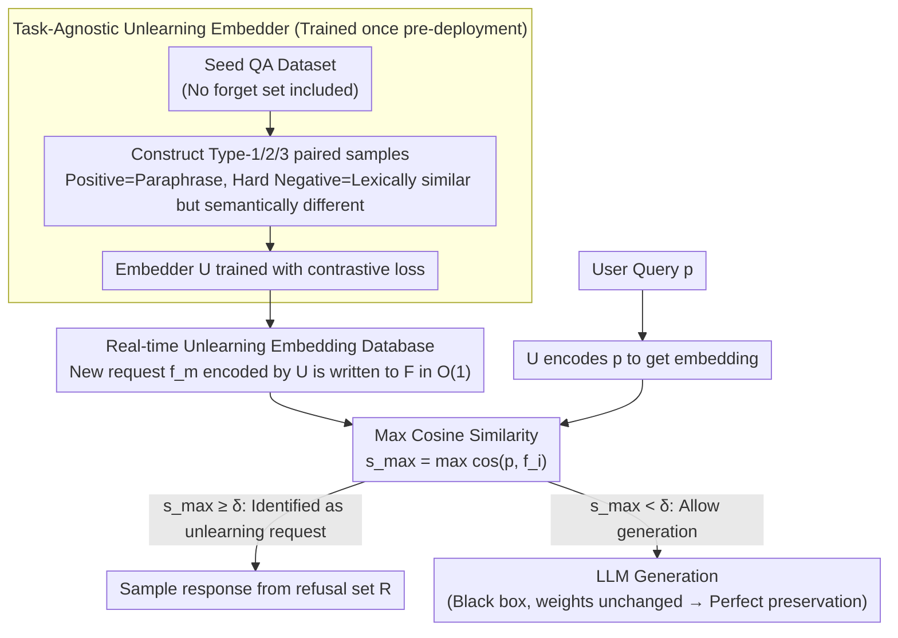

# CURaTE: Continual Unlearning in Real Time with Ensured Preservation of LLM Knowledge

**Conference**: ACL 2026 Findings  
**arXiv**: [2604.14644](https://arxiv.org/abs/2604.14644)  
**Code**: [GitHub](https://github.com/bsu1313/CURaTE)  
**Area**: Information Retrieval  
**Keywords**: Continual unlearning, real-time unlearning, behavioral unlearning, sentence embedding, knowledge preservation

## TL;DR
CURaTE proposes a behavioral unlearning framework based on sentence embedding matching: it trains a general unlearning embedder during pre-deployment (without using any forget set), stores new unlearning requests as embeddings in a database in real-time post-deployment, and determines whether to answer or refuse via cosine similarity during inference, achieving near-perfect knowledge preservation by avoiding any modification to LLM weights.

## Background & Motivation

**Background**: LLM unlearning methods primarily include parameter modification methods such as Gradient Ascent (GA), Gradient Difference (GradDiff), and Preference Optimization (PO/NPO), as well as continual unlearning methods like GUARD, O3, and UniErase.

**Limitations of Prior Work**: All methods that modify LLM weights suffer from catastrophic forgetting—as unlearning requests accumulate, model performance on the retain set drops sharply. Furthermore, existing methods require a training/optimization process to handle unlearning requests, leading to continuous exposure of sensitive information during the processing period.

**Key Challenge**: Unlearning requires "changing model behavior," yet modifying weights inevitably leads to "losing other knowledge"—these two objectives are fundamentally in conflict within the parameter space.

**Goal**: To achieve real-time continual unlearning without modifying LLM weights, supporting an arbitrary number of consecutive unlearning requests without degrading model utility.

**Key Insight**: The unlearning objective is redefined—relaxing it from "parameter unlearning" (erasing knowledge) to "behavioral unlearning" (preventing the output of flagged information). This opens a solution space that does not require weight modification.

**Core Idea**: A task-agnostic sentence embedder is trained for semantic similarity judgment—if a query is similar to an unlearning request, the response is refused; otherwise, generation proceeds normally.

## Method

### Overall Architecture
CURaTE completely shifts "unlearning" from model weights to a semantic gate before inference. The pipeline is divided into two phases. In the pre-deployment phase, a sentence embedder $U$ is trained on a seed QA dataset unrelated to any specific unlearning task using contrastive loss, learning to determine if "two sentences are asking the same thing." After deployment, whenever a new unlearning request arrives, the system simply encodes it into a vector and inserts it into database $F$ in $O(1)$ time, without touching the LLM. When a user query arrives, the maximum cosine similarity between the query and all unlearning vectors in $F$ is calculated. If it exceeds a threshold, a refusal response is sampled; otherwise, the query is passed to the LLM for normal generation. The LLM remains a read-only black box throughout the process.

### Key Designs

**1. Task-Agnostic Unlearning Embedder: Distinguishing "Paraphrases" from "Hard Negatives"**

The success of behavioral unlearning depends entirely on one judgment: whether the query and an unlearning request are asking the same thing. Thus, the embedder must handle two extremes: identifying "paraphrased variants" as similar to prevent bypasses, while not misidentifying "lexically similar but semantically different" queries as similar to avoid over-refusal. CURaTE constructs three types of paired samples from seed sets like Natural Questions to define this decision boundary: Type-1 pairs an original question with its paraphrase (positive); Type-2 pairs an original question with a lexically similar but semantically different contrast question (hard negative); Type-3 pairs a paraphrase with its contrast question (another hard negative). Training utilizes contrastive loss:
$$\mathcal{L} = y \cdot d_U^2 + (1-y) \cdot \max(0, m-d_U)^2$$
where $d_U$ is the cosine distance between embeddings and $m$ is the negative margin. Positive examples are pushed toward zero distance, while negatives are pushed beyond $m$. This data requires no real forget set; the learned capability is a general "same question" judgment, allowing cross-domain reuse without retraining after deployment.

**2. Real-time Unlearning Database: Reducing Request Activation to $O(1)$ Writes**

The danger of parameter unlearning lies not only in knowledge loss but also in the "processing window"—gradient optimization takes minutes to hours, during which sensitive information remains accessible. CURaTE eliminates this window: when an unlearning request $f_m$ arrives, its embedding $f_m^{emb} = U(f_m)$ is appended to set $F$. This is a pure write operation with no gradients or training, becoming effective immediately. During inference, for query $p$, $s_{max} = \max_{i} \cos(p^{emb}, f_i^{emb})$ is computed. If $s_{max} \geq \delta$, a response is drawn from a predefined refusal set $R$; otherwise, generation is delegated to the LLM. The threshold $\delta$ is the only tuning knob: if too loose, unlearning is incomplete; if too tight, false refusals increase. Hard negative training ensures this boundary is sharp enough for a single $\delta$ to balance both.

**3. Preservation Through Parameter Stability: Eliminating Catastrophic Forgetting by Design**

The fundamental bottleneck of parameter unlearning is catastrophic forgetting—modifying weights inevitably affects unrelated knowledge. As unlearning requests accumulate, retain set performance collapses. CURaTE bypasses this entirely: LLM parameters remain unchanged, so all knowledge unrelated to unlearning is naturally preserved. The only risk is false refusal—misidentifying an unrelated query as an unlearning request—which is mitigated by the precision of the hard-negative training. Consequently, "perfect preservation + controlled false refusal" becomes the essential trade-off offered by behavioral unlearning over parameter-based approaches.

### Loss & Training
The complete contrastive loss is $\mathcal{L} = \frac{1}{2|T|}\sum [y \cdot d_U^2 + (1-y) \cdot \max(0, m-d_U)^2]$, using cosine distance as the metric and averaging over $|T|$ sample pairs. Training occurs only once on the seed dataset; no further training or fine-tuning is required post-deployment.

## Key Experimental Results

### Main Results

| Method | Forget Effect (After 10 Stages) | Knowledge Preservation (After 10 Stages) | Real-time Capability |
| :--- | :--- | :--- | :--- |
| GA | Effective but over-unlearning | Severe decline (~0) | No |
| GradDiff | Over-unlearning | Severe decline | No |
| NPO | Moderate | Moderate decline | No |
| O3 | Insufficient unlearning | Partial preservation | No |
| UniErase | Insufficient unlearning | Partial preservation | No |
| **Ours (CURaTE)** | **Effective unlearning** | **Near-perfect preservation** | **Yes** |

### Ablation Study

| Configuration | Key Metric | Description |
| :--- | :--- | :--- |
| Without hard negative training | High false refusal rate | Hard negatives are critical for decision boundary precision |
| Fixed threshold $\delta$ | Stable performance | Threshold shows some sensitivity across different tasks |
| Evaluation with paraphrases | CURaTE remains effective | The embedder is robust against paraphrased variations |

### Key Findings
- CURaTE is the only method to maintain near-perfect knowledge preservation after 10 stages of continual unlearning.
- Parameter unlearning methods (GA, GradDiff) suffer from complete utility collapse after 3–5 stages.
- The embedder trained on a single seed dataset generalizes across domains to completely different unlearning tasks.
- The system is robust against paraphrase attacks due to the positive-pair design during training.

## Highlights & Insights
- **Redefinition of "Behavioral Unlearning"** is the key contribution—relaxing the goal from "erasing knowledge" to "preventing output" fundamentally changes the solution space.
- An extremely simple method (embedding similarity + threshold) achieves the best results, revealing the excessive complexity of parameter unlearning methods.
- The approach can be generalized to any scenario requiring "selective refusal," such as copyright protection, privacy preservation, and information filtering.

## Limitations & Future Work
- Behavioral unlearning is not true knowledge erasure—knowledge still exists in LLM weights and might be bypassed via indirect questioning.
- The selection of threshold $\delta$ is a performance bottleneck; if too loose, unlearning is incomplete, and if too tight, false refusals increase.
- The unlearning database $F$ grows with requests; large-scale scenarios may require approximate nearest neighbor (ANN) search.
- It may not satisfy legal requirements for "true erasure" (e.g., GDPR's Right to be Forgotten).

## Related Work & Insights
- **vs GUARD**: GUARD also trains a classifier, but it requires retraining for each forget set; CURaTE is trained once and is cross-domain universal.
- **vs O3**: O3 trains orthogonal LoRA adapters and an OOD detector, which still modifies parameters; CURaTE avoids weight modifications entirely.
- **vs UniErase**: UniErase uses model editing to inject unlearning tokens, which remains a parameter-based modification where catastrophic forgetting is inevitable.

## Rating
- Novelty: ⭐⭐⭐⭐ The "behavioral unlearning" concept and minimalist solution are novel.
- Experimental Thoroughness: ⭐⭐⭐⭐⭐ Four benchmarks, 10 stages of continual unlearning, and multiple baseline comparisons.
- Writing Quality: ⭐⭐⭐⭐ Clear motivation and straightforward methodology.

<!-- RELATED:START -->

## Related Papers

- [\[ACL 2025\] Real-time Factuality Assessment from Adversarial Feedback](../../ACL2025/llm_safety/real-time_factuality_assessment_from_adversarial_feedback.md)
- [\[ACL 2026\] Representation-Guided Parameter-Efficient LLM Unlearning](representation-guided_parameter-efficient_llm_unlearning.md)
- [\[ICLR 2026\] Learning-Time Encoding Shapes Unlearning in LLMs](../../ICLR2026/llm_safety/learning-time_encoding_shapes_unlearning_in_llms.md)
- [\[ACL 2026\] From Domains to Instances: Dual-Granularity Data Synthesis for LLM Unlearning](from_domains_to_instances_dual-granularity_data_synthesis_for_llm_unlearning.md)
- [\[ACL 2026\] TrajGuard: Streaming Hidden-state Trajectory Detection for Decoding-time Jailbreak Defense](trajguard_streaming_hidden-state_trajectory_detection_for_decoding-time_jailbrea.md)

<!-- RELATED:END -->
