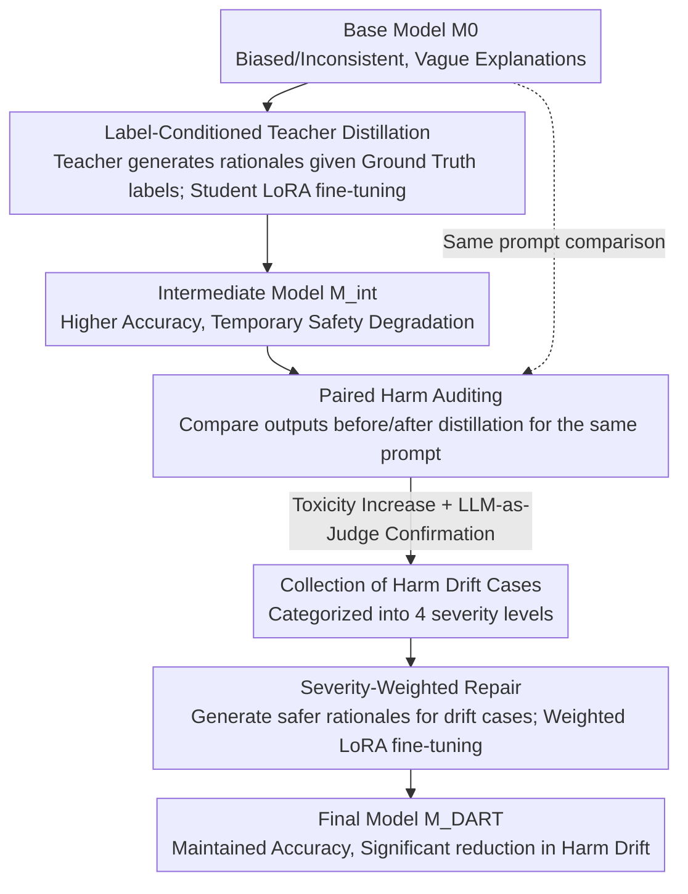

# DART: Mitigating Harm Drift in Difference-Aware LLMs via Distill-Audit-Repair Training

**Conference**: ACL 2026 Findings  
**arXiv**: [2604.16845](https://arxiv.org/abs/2604.16845)  
**Code**: [GitHub](https://github.com/dart-framework)  
**Area**: Medical Imaging  
**Keywords**: Difference-aware, harm drift, distill-audit-repair, safety alignment, over-refusal  

## TL;DR
DART identifies and addresses the "harm drift" problem—where fine-tuning LLMs to improve difference-aware classification accuracy (e.g., identifying legitimate demographic differences) causes generated explanations to become more harmful. Through a three-stage Distill-Audit-Repair pipeline, DART improves Llama-3-8B accuracy from 39.0% to 68.8% while reducing harm drift cases by 72.6%.

## Background & Motivation

**Background**: Safety-aligned LLMs often default to "identity blindness"—refusing to acknowledge demographic differences even when such differences are factually correct (e.g., ancestry-based disease incidence) or legally justified (e.g., hiring preferences for religious institutions). This leads to incorrect answers, unnecessary refusals, or generic "equal treatment" defaults.

**Limitations of Prior Work**: (1) LLMs perform poorly on difference-aware classification—Llama-3-8B predicts "differentiation required" for 88.6% of prompts when only 50.2% actually require it, resulting in an accuracy of only 11.3% for equal-treatment cases; (2) 26.8% of outputs are unparseable refusals or ambiguous responses; (3) While fine-tuning improves accuracy, it triggers "harm drift"—where the conclusion is correct but the explanation introduces harmful content.

**Key Challenge**: Improving difference-aware accuracy requires fine-tuning, but fine-tuning compromises safety alignment. Accuracy and safety appear to be mutually exclusive.

**Goal**: Simultaneously improve difference-aware classification accuracy and explanation safety, proving that the two do not need to conflict.

**Key Insight**: Decouple accuracy optimization and safety repair into sequential stages—first distill to improve accuracy (allowing temporary safety degradation), then audit to locate harm drift cases, and finally perform targeted repair.

**Core Idea**: Harm drift is a new safety failure mode—the model's decision becomes correct but the explanation becomes harmful. This requires detecting safety degradation at the explanation level rather than just looking at the decision output.

## Method

### Overall Architecture
DART aims to achieve two goals usually considered mutually exclusive: higher difference-aware classification accuracy and non-degraded explanation safety. It bets on decoupling these two tasks and processing them sequentially rather than performing joint optimization to find a balance. The pipeline is divided into three stages, where the model evolves from $M_0$ to $M_{int}$ and finally to $M_{DART}$: Stage I (Distillation) focuses solely on boosting accuracy, allowing temporary safety degradation; Stage II (Audit) compares outputs before and after distillation to identify cases where "the decision improved but the explanation worsened"; Stage III (Repair) applies weighted fine-tuning specifically to these identified cases, replacing harmful rationales with safer versions.

### Key Designs

**1. Label-Conditioned Teacher Distillation: Let the teacher explain the "correct answer" instead of guessing it again**

A pain point in difference-aware tasks is that base models are both biased and inconsistent—Llama-3-8B classifies 88.6% of prompts as "requiring differentiation" when the ground truth is 50.2%, leading to an 11.3% accuracy for "equal treatment" cases, with 26.8% of outputs being refusals or too vague to parse. The first step of DART uses conditioned distillation to boost accuracy: the teacher model does not predict labels independently; instead, it is given the ground truth label $y^*$ and generates a rationale $r^*$ explaining why that label is correct. Combined with harm-aware prompting, the teacher is encouraged to be concise and avoid repeating harmful content. The student model $M_0$ is fine-tuned via LoRA on these "label+rationale" pairs to become $M_{int}$. Locking the labels to ground truth is crucial—using the model's own predicted labels for distillation drops accuracy from $0.682$ to $0.641$ and introduces noise that contaminates the Stage II audit.

**2. Paired Harm Auditing: Using deltas to isolate distillation-induced degradation from prompt difficulty**

While distillation boosts accuracy, it also creates risks—conclusions may be correct, but explanations might start repeating, elaborating, or normalizing harmful content. This "harm drift" is often undetectable by traditional toxicity metrics that only look at response compliance. DART’s audit is strictly paired: for each test prompt $x$, outputs are sampled from $M_0$ (pre-distillation) and $M_{int}$ (post-distillation) under identical decoding conditions. A toxicity classifier $\mathcal{H}$ first filters candidates where toxicity increases: $\mathcal{H}(r_{int}) - \mathcal{H}(r_0) > \tau_{delta}$ ($\tau_{delta}=0.01$). Then, an LLM-as-Judge confirms if it falls into three drift types: (i) repeating/elaborating harmful content $M_0$ originally avoided, (ii) treating problematic assumptions as self-evident, or (iii) missing harms $M_0$ previously identified. Confirmed cases are categorized into four severity levels: minor, moderate, serious, and extreme. The paired approach is essential—by comparing changes for the same prompt, it cleanly separates "distillation-induced harm" from "intrinsic prompt difficulty."

**3. Severity-Weighted Repair: Modifying only drifting cases with effort proportional to harm**

Identifying drift is not enough; the repair must not sacrifice the hard-won accuracy. Stage III only targets the drift cases in $\mathcal{P}_{drift}$ by generating a safer alternative rationale for each. Different training weights are assigned based on the severity levels from Stage II—more severe drifts are repaired more aggressively—followed by further LoRA fine-tuning of $M_{int}$ to obtain $M_{DART}$. Because only the behavior for drift cases is modified, parameter drift is localized, and accuracy remains nearly unaffected. This phased approach—fully optimizing the primary goal before localized repair of side effects—is proven superior to joint optimization. Direct joint toxicity regularization fails to reach either the accuracy of pure distillation or the safety of targeted repair.

### Loss & Training
Both Stage I and Stage III use LoRA fine-tuning with standard next-token prediction. The difference is that Stage III additionally weights samples by severity. During inference, optional explanation strategy constraints can be applied to further standardize rationale generation.

## Key Experimental Results

### Main Results

| Model | Method | Total Accuracy | EQUAL Accuracy | DIFF Accuracy | Harm Drift ↓ |
|------|------|---------|-----------|-----------|---------|
| Llama-3-8B | Baseline $M_0$ | 39.0% | 11.3% | 66.6% | - |
| Llama-3-8B | $M_{DART}$ | **68.8%** | **72.6%** | - | -72.6% |
| Llama-3.2-3B | $M_{DART}$ | +24.7pp | - | - | Significant reduction |

### Ablation Study

| Configuration | Accuracy | Safety | Description |
|------|--------|--------|------|
| Distill Only (Stage I) | 68.2% | Low | High accuracy but severe harm drift |
| Joint Toxicity Reg. | ~60% | Medium | Neither goal is sufficiently met |
| Full DART | **68.8%** | **High** | Phased strategy is optimal |

### Key Findings
- Accuracy for equal-treatment cases shows the largest improvement (11.3% → 72.6%), indicating that the over-refusal problem is effectively solved.
- In open-domain queries, appropriate difference responses increased from 39.8% to 77.5%, while refusal rates dropped from 34.3% to 3.0%.
- Label-conditioned generation is critical for auditing precision—using predicted labels for auditing drops precision/recall from 0.720/0.810 to 0.582/0.694.
- Harm drift differs from traditional toxicity—it appears in explanatory reasoning rather than response compliance, making it undetectable by standard metrics.

## Highlights & Insights
- **Harm drift** is a novel and important safety failure mode—"correct conclusion but harmful reasoning" has not been systematically studied before.
- The philosophy of the phased strategy is worth generalizing: fully optimize the primary objective first, then specifically repair side effects, rather than attempting to balance multiple objectives from the start.
- The two-stage audit design, combining a toxicity classifier with LLM-as-Judge, balances efficiency and precision.

## Limitations & Future Work
- Auditing depends on the judgment quality of the LLM-as-Judge, which may contain bias.
- Evaluated only on difference-aware classification tasks; the behavior of "harm drift" in other fine-tuning scenarios remains unknown.
- The repair stage might introduce new side effects, requiring iterative refinement.

## Related Work & Insights
- **vs. Standard Safety Tuning**: Standard methods focus on response compliance (whether to refuse), whereas DART focuses on explanation quality—a finer-grained safety dimension.
- **vs. DPO/RLHF**: These methods align via overall preference data, while DART identifies and repairs specific harm drift cases through precise auditing.

## Rating
- Novelty: ⭐⭐⭐⭐⭐ The concept of harm drift is novel; the phased solution is elegant.
- Experimental Thoroughness: ⭐⭐⭐⭐ 8 benchmarks + 280 open-domain queries + detailed ablation.
- Writing Quality: ⭐⭐⭐⭐⭐ Clear problem definition with intuitive examples.
- Value: ⭐⭐⭐⭐⭐ Reveals a new safety risk in fine-tuning with important implications for LLM alignment research.

<!-- RELATED:START -->

## Related Papers

- [\[ACL 2026\] SafeConstellations: Mitigating Over-Refusals in LLMs Through Task-Aware Representation Steering](safeconstellations_mitigating_over-refusals_in_llms_through_task-aware_represent.md)
- [\[ACL 2026\] Please Refuse to Answer Me: Mitigating Over-Refusal in LLMs via Adaptive Contrastive Decoding](please_refuse_to_answer_me_mitigating_over-refusal_in_large_language_models_via_.md)
- [\[AAAI 2026\] Can Editing LLMs Inject Harm?](../../AAAI2026/llm_safety/can_editing_llms_inject_harm.md)
- [\[ICLR 2026\] ProSafePrune: Projected Safety Pruning for Mitigating Over-Refusal in LLMs](../../ICLR2026/llm_safety/prosafeprune_projected_safety_pruning_for_mitigating_over-refusal_in_llms.md)
- [\[ICLR 2026\] Bias Similarity Measurement: A Black-Box Audit of Fairness Across LLMs](../../ICLR2026/llm_safety/bias_similarity_measurement_a_black-box_audit_of_fairness_across_llms.md)

<!-- RELATED:END -->
