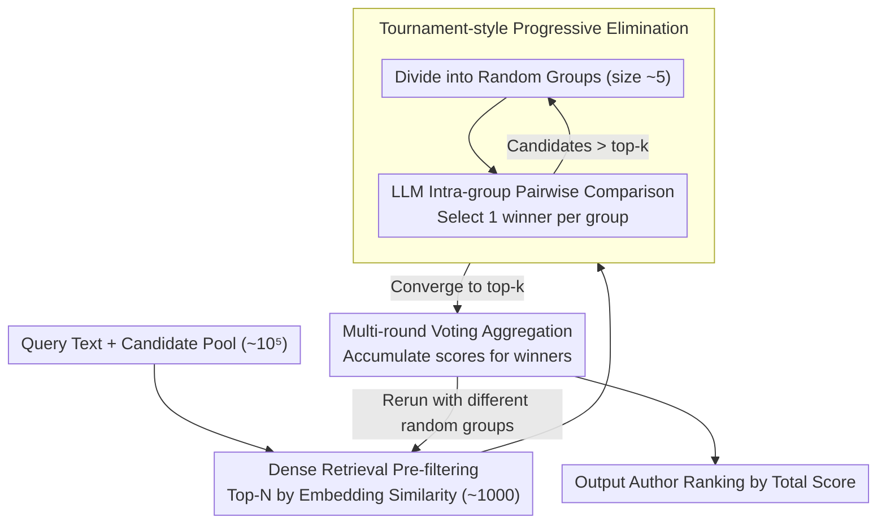

# De-Anonymization at Scale via Tournament-Style Attribution

**Conference**: ACL 2026 Oral  
**arXiv**: [2601.12407](https://arxiv.org/abs/2601.12407)  
**Code**: None  
**Area**: AI Security / Privacy  
**Keywords**: Author Attribution, De-anonymization, LLM Privacy Threats, Tournament-style Matching, Peer Review

## TL;DR

This paper proposes DAS (De-Anonymization at Scale), an LLM-based large-scale author de-anonymization method. By employing a tournament-style elimination strategy, dense retrieval pre-filtering, and multi-round voting aggregation, it achieves author matching across tens of thousands of candidate texts, revealing the privacy risks LLMs pose to anonymous platforms such as double-blind peer review systems.

## Background & Motivation

**Background**: Traditional Author Attribution (AA) typically focuses on small-scale, closed-set scenarios where a limited number of candidate authors and labeled samples are provided to train classifiers. However, real-world anonymous systems (e.g., academic peer review) may involve tens of thousands of candidates without any labeled data.

**Limitations of Prior Work**: (1) Traditional methods are impractical at scale, as they require constructing author profiles for every candidate. (2) Recent work using GPT-3/4 for author attribution remains restricted to small candidate sets. (3) The text analysis capabilities of LLMs suggest that large-scale de-anonymization could become a significant real-world threat.

**Key Challenge**: Anonymous systems (e.g., double-blind reviews, whistleblower forums) rely on identity concealment for fairness and safety. LLMs, however, can potentially identify anonymous authors by analyzing writing patterns, domain expertise, and other stylistic signals.

**Goal**: To develop a practical LLM-based author matching method capable of operating on candidate pools of tens of thousands of texts and to assess the threat level to anonymous systems.

**Key Insight**: Model large-scale author matching as a tournament-style elimination process, where candidates are randomly grouped, and the LLM selects the most likely matches in each group. Winners advance to the next round until a final ranking is produced.

**Core Idea**: Progressive elimination + Dense retrieval pre-filtering + Multi-round voting aggregation = Large-scale de-anonymization within a constrained token budget.

## Method

### Overall Architecture
DAS addresses scenarios beyond the reach of traditional author attribution: cases with tens of thousands of candidate authors and no labeled samples, where the candidate pool exceeds the LLM context window. The solution decomposes the "one-to-many" matching problem into a three-stage pipeline: "dense retrieval for coarse filtering, tournament for fine-grained comparison, and voting for final determination." First, dense retrieval compresses the candidate pool from $10^5$ to $10^3$. Next, the LLM performs iterative elimination within small groups to converge on the top-k candidates. Finally, multiple independent runs are aggregated based on win frequencies to yield stable rankings. These three stages progressively reduce searching space and uncertainty.

### Key Designs

**1. Dense Retrieval Pre-filtering: Reducing Search Space for LLM Feasibility**

Processing $10^5$ candidates directly with an LLM is impractical due to computational costs. DAS implements a vector-based coarse filter before the tournament. An embedding model encodes the query and all candidates, retrieving the top-$N$ (e.g., 1000) most similar items. This reduces the scale from $10^5$ to $10^3$, making subsequent LLM comparisons feasible. Beyond efficiency, removing highly dissimilar candidates provides cleaner input for the tournament, thereby improving matching quality.

**2. Tournament-style Progressive Elimination: Decomposing Matching into Small Group Comparisons**

Even with 1000 candidates, the LLM context window cannot accommodate simultaneous comparison. DAS adopts a tournament structure: candidates are randomly divided into fixed-size groups (e.g., 5 per group). The LLM compares the query against these candidates pairwise and selects the most likely one. Winners are regrouped for subsequent rounds until the pool converges to the top-k. Each step involves only small-scale intra-group comparisons, reducing the cost from linear scanning to logarithmic rounds while remaining within token limits.

**3. Multi-round Voting Aggregation: Mitigating Randomness in Grouping**

A single tournament run is susceptible to "bad luck" in grouping; if the true author is pooled with strong candidates early on, they might be eliminated prematurely. To counter this, DAS runs the entire tournament multiple times independently with different random groupings. Scores are assigned to winning candidates in each run, and final rankings are aggregated. Candidates who consistently win across diverse groups achieve higher scores, while accidental winners are filtered out, enhancing both stability and precision.

### Function: Identifying an Anonymous Reviewer
Consider identifying the author of an anonymous peer review among $10^5$ potential authors. First, dense retrieval filters the pool to the top-1000 based on stylistic similarity. Second, the tournament begins: 1000 candidates are grouped into sets of 5; the LLM selects the best match per group, reducing the pool to ~200, then ~40, then ~8 across rounds. Third, this retrieval and tournament process is repeated multiple times with different groupings. If an author consistently reaches the final rounds across most iterations, they rise to the top of the aggregated ranking and are identified as the author of the anonymous review.

### Loss & Training
DAS is a training-free inference-time method that does not update weights. Its capabilities rely entirely on the LLM's text analysis. The core computation consists of repeated prompt calls for pairwise comparisons.

## Key Experimental Results

### Main Results

**De-anonymization Performance on Peer Review Data**

| Scenario | Candidate Pool Size | DAS Accuracy | Random Baseline |
|----------|---------------------|--------------|-----------------|
| Peer Review | Thousands | Significantly higher | ~0.01% |
| Enron Emails | Standard Benchmark | Outperforms prior methods | - |
| Blog Posts | Large-scale | Outperforms prior methods | - |

### Ablation Study

| Component | Effect of Removal | Explanation |
|-----------|-------------------|-------------|
| Dense Retrieval | Infeasible | Candidate pool too large |
| Multi-round Voting | Accuracy drop | Single round is unstable |
| Tournament Elimination | Accuracy drop | Need for progressive comparison |

### Key Findings

- DAS successfully identifies authors in peer review data with thousands of candidates, achieving accuracy far exceeding random baselines.
- It outperforms previous direct LLM prompting methods on standard benchmarks (Enron, Blog).
- Multi-round voting significantly improves ranking precision and stability.
- Dense retrieval serves not only as an efficiency tool but also improves final matching quality by narrowing the candidate pool.

## Highlights & Insights

- Reveals a serious privacy threat: LLMs make large-scale de-anonymization practically feasible.
- The tournament-style design elegantly overcomes the computational bottleneck of large-scale one-to-many matching.
- The methodology is general and can be applied to any text attribution scenario requiring matching from a large candidate pool.

## Limitations & Future Work

- While accuracy is higher than random, it remains limited; it might not constitute a practical threat in all specific scenarios.
- The recall quality of dense retrieval may limit final accuracy.
- As a potential privacy attack tool, it requires defensive measures and ethical discussion.
- Ability to distinguish between authors with highly similar styles (e.g., members of the same lab) may be limited.

## Related Work & Insights

- **vs. Huang et al. (2024a)**: Previous work used GPT for small-scale attribution; DAS scales this to tens of thousands.
- **vs. Traditional AA**: Traditional methods require labeled data and small candidate sets, whereas DAS is zero-shot and large-scale.
- **vs. Stylometry**: DAS utilizes the implicit stylistic analysis capabilities of LLMs without requiring explicit feature engineering.

## Rating

- Novelty: ⭐⭐⭐⭐ The tournament-style design for large-scale attribution is novel, and the privacy threat perspective is critical.
- Experimental Thoroughness: ⭐⭐⭐⭐ Includes real-world review data and standard benchmarks, though the scale of peer review experiments could be larger.
- Writing Quality: ⭐⭐⭐⭐ Clear motivation and systematic method description.
- Value: ⭐⭐⭐⭐ Highly relevant for the security assessment of anonymous systems.

<!-- RELATED:START -->

## Related Papers

- [\[ICML 2026\] From Weak Cues to Real Identities: Evaluating Inference-Driven De-Anonymization in LLM Agents](../../ICML2026/llm_safety/from_weak_cues_to_real_identities_evaluating_inference-driven_de-anonymization_i.md)
- [\[ACL 2026\] ForgeryTalker: Generating Attribution Reports for Manipulated Facial Images](generating_attribution_reports_for_manipulated_facial_images_a_dataset_and_basel.md)
- [\[ACL 2026\] Subject-level Inference for Realistic Text Anonymization Evaluation](subject-level_inference_for_realistic_text_anonymization_evaluation.md)
- [\[ACL 2026\] Adaptive Text Anonymization: Learning Privacy-Utility Trade-offs via Prompt Optimization](adaptive_text_anonymization_learning_privacy-utility_trade-offs_via_prompt_optim.md)
- [\[ACL 2026\] Look Twice before You Leap: A Rational Framework for Localized Adversarial Anonymization](look_twice_before_you_leap_a_rational_framework_for_localized_adversarial_anonym.md)

<!-- RELATED:END -->
