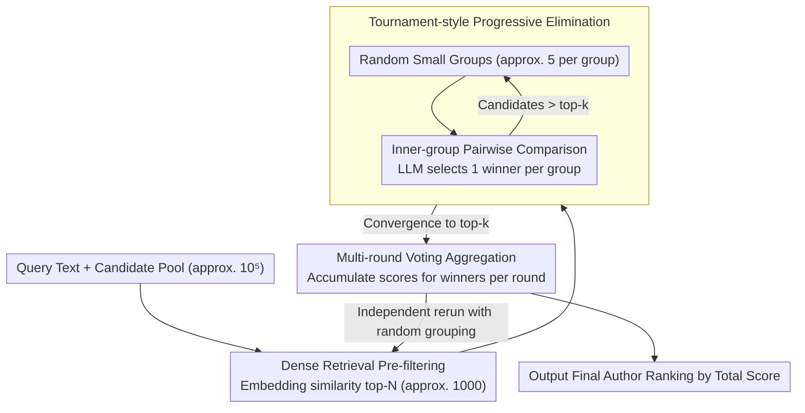

# De-Anonymization at Scale via Tournament-Style Attribution

**Conference**: ACL 2026 Oral  
**arXiv**: [2601.12407](https://arxiv.org/abs/2601.12407)  
**Code**: None  
**Area**: AI Security / Privacy  
**Keywords**: Authorship Attribution, De-anonymization, LLM Privacy Threats, Tournament-Style Matching, Peer Review

## TL;DR

This paper proposes DAS (De-Anonymization at Scale), an LLM-based method for large-scale authorship de-anonymization. By employing a tournament-style elimination strategy combined with dense retrieval pre-filtering and multi-round voting aggregation, the method enables author matching across tens of thousands of candidate texts, revealing the privacy threat LLMs pose to anonymous platforms such as double-blind peer review.

## Background & Motivation

**Background**: Traditional Authorship Attribution (AA) has been studied in closed-set, small-scale scenarios where a small number of candidate authors and labeled samples are given to train classifiers. However, real-world anonymous systems (e.g., academic peer review) may involve tens of thousands of candidates without labeled data.

**Limitations of Prior Work**: (1) Traditional methods are infeasible in large-scale scenarios as they require building author profiles for every candidate; (2) Recent work using GPT-3/4 for AA remains limited to small candidate sets; (3) The text analysis capabilities of LLMs may make large-scale de-anonymization a realistic threat.

**Key Challenge**: Anonymized systems (e.g., double-blind reviews, whistleblower forums) rely on identity concealment to protect fairness and safety, but LLMs may identify anonymous authors by analyzing signals such as writing patterns and domain expertise.

**Goal**: To develop a practical LLM author matching method capable of operating within a pool of tens of thousands of candidate texts and to evaluate the threat level to anonymous systems.

**Key Insight**: Modeling large-scale author matching as a tournament-style elimination—randomly grouping candidates where an LLM selects the most likely match in each group, with winners advancing to the next round to generate a final ranking.

**Core Idea**: Progressive elimination + dense retrieval pre-filtering + multi-round voting aggregation = realizing large-scale de-anonymization under a constrained token budget.

## Method

### Overall Architecture
DAS addresses a scenario beyond the reach of traditional AA: candidate authors numbering in the tens of thousands without labeled samples, where the LLM context window cannot accommodate all candidates. The Mechanism decomposes the "one-to-many" problem of finding the true author among thousands into a three-stage pipeline: "coarse filtering via retrieval, fine comparison via tournament, and final stabilization via voting." First, dense retrieval compresses the candidate pool from $10^5$ to $10^3$. Next, the LLM performs iterative elimination in small groups to narrow the pool to top-k. Finally, multiple independent runs are aggregated by win counts to yield a stable ranking. These stages progressively reduce the search space and uncertainty.

### Key Designs

**1. Dense Retrieval Pre-filtering: Reducing search space to LLM-manageable levels**

It is impractical for an LLM to start from $10^5$ candidates due to the cost of group comparisons. DAS establishes a vector-based coarse filter before the tournament: an embedding model encodes the query and all candidates, retrieving the top-$N$ (e.g., 1000) most similar candidates based on vector similarity. This step reduces the scale from $10^5$ to $10^3$, making subsequent LLM comparisons viable. Beyond efficiency, removing obviously dissimilar candidates provides cleaner input for the tournament, enhancing final matching quality.

**2. Tournament-style Progressive Elimination: Breaking one-to-many matching into small group comparisons**

Even with 1,000 candidates, the LLM context window cannot compare them simultaneously without exceeding budgets or losing accuracy. DAS adopts a tournament structure: candidates are randomly divided into fixed-size small groups (e.g., 5 per group). The LLM compares the query text against these 5 candidates one-to-one and selects the most likely match. Winners are regrouped and compared again, following this iterative contraction until converging to top-k. Each round only requires batch processing of small inner-group comparisons, reducing the cost from linear scanning to logarithmic rounds while staying within token limits.

**3. Multi-round Voting Aggregation: Smoothing randomness with repeated runs**

A single tournament run risks "lucky" eliminations; if the true author is grouped with strong candidates early on, they might be incorrectly eliminated. DAS counters this by rerunning the entire tournament independently multiple times with different random groupings. Scores are assigned to winning candidates in each run, and total scores are aggregated to produce the final ranking. Candidates who consistently win across diverse groupings earn higher scores, while accidental winners are filtered out, increasing ranking stability and precision.

### A Full Example: Localizing an Anonymous Reviewer from Ten Thousand Candidates

Suppose an anonymous review needs to be attributed to a potential author from a pool of $10^5$ participants. First, dense retrieval filters these individuals down to a top-1000 based on writing style similarity. Next, the tournament takes over: the 1000 candidates are randomly grouped into sets of 5. The LLM identifies the most likely author in each group, leaving ~200 after one round, ~40 after the next, and ~8 after the third, quickly converging to a top-k list. Finally, the retrieval and tournament process is rerun several times with different groupings. If an author consistently reaches the final rounds across most iterations, their aggregated score will place them at the top of the list, identifying them as the author of the anonymous review.

### Loss & Training
DAS is a training-free inference-time method. It does not update any weights; its capabilities derive entirely from the LLM's text analysis. The core computation consists of prompt calls for pairwise comparisons.

## Key Experimental Results

### Main Results

**De-anonymization performance on anonymous peer review data**

| Scenario | Candidate Pool Size | DAS Accuracy | Random Baseline |
|------|-----------|----------|---------|
| Peer Review | Thousands | Much higher than random | ~0.01% |
| Enron Emails | Standard Benchmark | Outperforms prior methods | - |
| Blog Posts | Large Scale | Outperforms prior methods | - |

### Ablation Study

| Component | Effect when Removed | Description |
|------|----------|------|
| Dense Retrieval | Infeasible | Candidate pool is too large |
| Multi-round Voting | Accuracy drop | Single round is unstable |
| Tournament Elimination | Accuracy drop | Requires progressive comparison |

### Key Findings

- DAS successfully identifies authors in anonymous review data with thousands of candidates, achieving accuracy far exceeding random chance.
- It outperforms previous direct LLM prompting methods on standard benchmarks (Enron, Blogs).
- Multi-round voting significantly improves ranking precision and stability.
- Dense retrieval pre-filtering is not just an efficiency tool but also improves matching quality by narrowing the candidate pool.

## Highlights & Insights

- Reveals a serious privacy threat—LLMs make large-scale de-anonymization practically feasible.
- The tournament-style design elegantly solves the computational bottleneck of large-scale one-to-many matching.
- The methodology is generalizable and can be applied to any text attribution scenario requiring matching from a large candidate pool.

## Limitations & Future Work

- While higher than random, accuracy remains limited and may not constitute a practical threat in all specific scenarios.
- The recall quality of dense retrieval may limit the final accuracy.
- As a potential privacy attack tool, it requires accompanying defensive measures and ethical discussion.
- Differentiation capabilities may be limited for authors with similar styles (e.g., members of the same laboratory).

## Related Work & Insights

- **vs Huang et al. (2024a)**: Prior work used GPT for small-scale attribution; DAS scales this to the tens of thousands.
- **vs Traditional AA**: Traditional methods require labeled data and small sets; DAS is fully zero-shot and large-scale.
- **vs Stylometry**: DAS leverages the implicit stylistic analysis capabilities of LLMs without requiring explicit feature engineering.

## Rating

- Novelty: ⭐⭐⭐⭐ The tournament-style design for large-scale attribution is novel, and the privacy threat perspective is significant.
- Experimental Thoroughness: ⭐⭐⭐⭐ Uses real review data and standard benchmarks, though the scale of peer review experiments could be larger.
- Writing Quality: ⭐⭐⭐⭐ Clear motivation and systematic method description.
- Value: ⭐⭐⭐⭐ Practical significance for the security assessment of anonymous systems.

<!-- RELATED:START -->

## Related Papers

- [\[ACL 2026\] Subject-level Inference for Realistic Text Anonymization Evaluation](subject-level_inference_for_realistic_text_anonymization_evaluation.md)
- [\[ACL 2026\] ForgeryTalker: Generating Attribution Reports for Manipulated Facial Images](generating_attribution_reports_for_manipulated_facial_images_a_dataset_and_basel.md)
- [\[ACL 2026\] Adaptive Text Anonymization: Learning Privacy-Utility Trade-offs via Prompt Optimization](adaptive_text_anonymization_learning_privacy-utility_trade-offs_via_prompt_optim.md)
- [\[ACL 2026\] Look Twice before You Leap: A Rational Framework for Localized Adversarial Anonymization](look_twice_before_you_leap_a_rational_framework_for_localized_adversarial_anonym.md)
- [\[ICML 2025\] De-mark: Watermark Removal in Large Language Models](../../ICML2025/llm_safety/de-mark_watermark_removal_in_large_language_models.md)

<!-- RELATED:END -->
