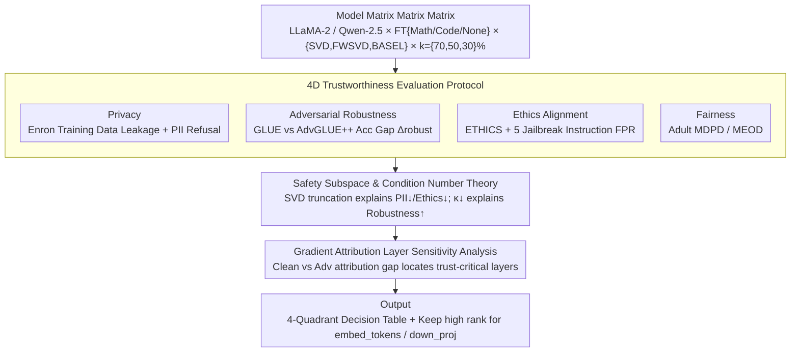

# Decomposed Trust: Privacy, Adversarial Robustness, Ethics, and Fairness in Low-Rank LLMs

**Conference**: ACL 2026 (Findings)  
**arXiv**: [2511.22099](https://arxiv.org/abs/2511.22099)  
**Code**: TBD  
**Area**: LLM Safety / Model Compression / Trustworthy AI  
**Keywords**: Low-rank decomposition, PII leakage, Adversarial robustness, Ethics alignment, Fairness, Layer attribution

## TL;DR
This study provides the first systematic evaluation of the impact of **low-rank decomposition (SVD/FWSVD/BASEL)** on LLM trustworthiness. It identifies an asymmetric trade-off: "training data privacy ↑, adversarial robustness ↑, PII protection ↓, ethics alignment ↓, fairness ↓." Using gradient attribution, the study localizes adversarial vulnerability to the `embed_tokens` and `down_proj` sub-layers.

## Background & Motivation
**Background**: Beyond quantization (GPTQ) and pruning (Wanda), low-rank decomposition (SVD → FWSVD → BASEL → IMPACT) is emerging as a mainstream LLM compression route, significantly reducing VRAM and increasing throughput while maintaining benign accuracy. While Hong et al. (2024, ICML) studied the impact of quantization and pruning on trustworthiness, low-rank decomposition remains unexplored.

**Limitations of Prior Work**: Industry often treats low-rank compression as a "side-effect-free slimming technique" for edge deployment. However, no systematic study has addressed whether compressed models still refuse PII requests, recognize unethical prompts, or maintain fairness. This research gap poses compliance risks in sensitive sectors like healthcare and finance.

**Key Challenge**: Low-rank decomposition **truncates singular value subspaces**. Arditi et al. (2024) demonstrated that the "safety subspace (refusal direction)" of LLMs resides in these truncated directions. As compression intensifies, the refusal vector becomes unconstructible, causing safety mechanisms to be silently "shaved off" even when benign accuracy appears unaffected.

**Goal**: (1) Systematically quantify the impact of low-rank compression across four trustworthy dimensions (privacy, adversarial robustness, ethics, and fairness); (2) Decompose the interactions between model scale × fine-tuning × compression method; (3) Use gradient attribution to identify layers determining adversarial robustness to guide future "safe" compression.

**Key Insight**: The study uses LLaMA-2 (7B/13B, Base/Chat) and Qwen-2.5 (7B/14B) as base models, evaluating 3 low-rank methods (SVD, FWSVD, BASEL) across 3 compression rates (k%=70/50/30) with 4 classes of trustworthy datasets (Enron, GLUE+AdvGLUE++, ETHICS, Adult) in a full orthogonal evaluation.

**Core Idea**: By evaluating trustworthiness across four independent quadrants, it is discovered that low-rank compression does not cause uniform degradation but rather directional changes. These findings are rigorously explained through SVD safety subspace and condition number theories.

## Method

### Overall Architecture
This is an evaluation and interpretability study with the following pipeline: ① **Model Matrix Setup**: LLaMA-2 Base/Chat (7B/13B) and Qwen-2.5 (7B/14B), each with {fine-tuned math, fine-tuned code, no fine-tune} × {SVD, FWSVD, BASEL} × {k=70%, 50%, 30%}; ② **Trustworthiness Evaluation**: Independent testing across four dimensions—Enron Email (5 training-data leakage metrics), Enron PII (leakage & rejection in zero-shot/few-shot/attack scenarios), GLUE/AdvGLUE++ on SST-2/QQP/MNLI (accuracy drop $\Delta_{\text{robust}}$), ETHICS commonsense (accuracy + FPR under 5 jailbreak instructions), and UCI Adult (MDPD/MEOD on race/sex/age); ③ **Theoretical Explanation**: Explaining PII↓/ethics↓, robustness↑, and training-data privacy↑ using safety subspace, condition number, and capacity-memorization theories respectively; ④ **Layer Attribution**: Quantifying each layer's contribution using first-order Taylor expansion $a_i = \|(\partial \ell / \partial \mathbf{h}_i) \mathbf{h}_i\|_2$ and identifying trust-critical layers via $\Delta_i = |a_i^{\text{clean}} - a_i^{\text{adv}}|$.

### Key Designs

**1. Four-Dimensional Trustworthiness Evaluation Protocol**

Relying on a single aggregate metric would mask opposing trade-offs, such as increased PII leakage occurring alongside decreased training-data leakage. This study decomposes trustworthiness into four quadrants: privacy (training-data + PII), adversarial robustness, ethics (standard + jailbreaking), and fairness. Each dimension is paired with industry-standard datasets and metrics: Enron emails for privacy ($L \in \{50,100,200\}$), $\Delta_{\text{robust}}$ between GLUE and AdvGLUE++ for robustness, ETHICS commonsense with jailbreak FPR for ethics, and MDPD/MEOD on UCI Adult for fairness. This granularity results in an actionable "✓/✗ decision table" (Table 2) for engineers.

**2. Safety Subspace and Condition Number Theories**

To move beyond empirical observations, the study provides mathematical explanations. For weight matrices $\mathbf{W} = \mathbf{U} \mathbf{\Sigma} \mathbf{V}^\top$, the refusal vector $\mathbf{v} = \sum_{k=1}^r \lambda_k \mathbf{u}_k$ spans the full singular subspace. Truncating to $r' < r$ introduces reconstruction error:

$$\|\mathbf{v} - \hat{\mathbf{v}}\|_2^2 = \sum_{k=r'+1}^r \lambda_k^2,$$

making the refusal direction unrecoverable and weakening safety mechanisms. Adversarial robustness is governed by the condition number $\kappa(\mathbf{W}) = s_{\max}/s_{\min}$. Low-rank decomposition discards the smallest singular values, increasing $s_{\min}$ and decreasing $\kappa$, which stabilizes the model against perturbations. Training-data privacy follows a capacity route: truncating the subspace reduces model capacity and memorization.

**3. Layer-wise Gradient Attribution Sensitivity Analysis**

Existing low-rank methods (ASVD/AMC) allocate rank based on benign reconstruction error, which may neglect layers essential for safety. The study quantifies layer contribution as $a_i = \|(\partial \ell / \partial \mathbf{h}_i) \mathbf{h}_i\|_2$ using first-order Taylor expansion. Comparing clean and adversarial inputs via $\Delta_i = |a_i^{\text{clean}} - a_i^{\text{adv}}|$ across SST-2/QQP/MNLI tasks reveals that `embed_tokens` and `down_proj` are the most "trust-sensitive" layers. These layers should be assigned higher ranks in trust-aware compression.

## Key Experimental Results

### Main Results

Trustworthiness changes for LLaMA-2 Base 13B (k=70%) vs. original model:

| Dimension | Metric | Base 13B | BASEL-70 | FWSVD-70 | SVD-70 | Trend |
|------|------|----------|----------|----------|---------|------|
| Training-data privacy | leakage @ L=200 (%↓) | 3.99 | **0.00** | 0.79 | 0.11 | ✓ Improved |
| PII (zero-shot) | leakage (%↓) | 2.42 | 0.00 | 0.00 | 0.00 | (Rejected) |
| PII (zero-shot) | **Actual leakage** (%↓) | 5.67 | 42.00 | 26.25 | 47.25 | ✗ Degraded |
| PII (few-shot protected) | leakage (%↓) | 3.33 | 21.42 | 13.25 | 23.63 | ✗ Degraded |
| Adv. robustness SST-2 | acc drop (%↓) | 18.78 | **3.48** | 15.39 | 17.32 | ✓ BASEL Wins |
| Adv. robustness QQP | acc drop (%↓) | 37.51 | **5.63** | 5.57 | 16.42 | ✓ Improved |
| Ethics zero-shot | accuracy (%↑) | 52.92 | 38.45 | 37.80 | 41.87 | ✗ Degraded |
| Ethics few-shot | accuracy (%↑) | 63.11 | 60.36 | **77.15** | 64.77 | ≈ Mitigated |
| Fairness | MDPD (%↓) | 0.01 | - | - | 2.00 | ✗ Degraded |

**Conclusion**: The directional changes are ✓✗✓✗✗ — training data privacy and adversarial robustness improve, while PII protection, ethics alignment, and fairness degrade.

### Ablation Study

Correlation between compression rate $k\%$ and trustworthiness (LLaMA-2 Base 13B + BASEL):

| Metric | k=70% | k=50% | k=30% | Trend |
|------|--------|--------|--------|------|
| Training-data leakage (%↓) | 0.0017 | 0.0300 | - | Consistently low |
| PII zero-shot leakage (%↓) | 42.00 | 42.42 | - | Stable at high |
| Adv. SST-2 drop (%↓) | 3.48 | 13.46 | -0.61 | Non-monotonic |
| Ethics zero-shot acc (%↑) | 38.45 | 13.47 | 7.48 | Rapid collapse |
| Fairness MDPD (%↓) | - | 0.02 | 8.33 | Collapse at 30% |

Jailbreak FPR (Impact of fine-tuning):

| Model | FPR (%↓) | Model | FPR (%↓) |
|------|----------|------|----------|
| Base 7B | 10.20 | Chat 7B | 45.10 |
| Math Base 7B | **91.80** | Math Chat 7B | **99.40** |
| Prog Base 7B | 32.20 | Prog Chat 7B | 89.90 |

→ Math fine-tuning increases jailbreak FPR from 10.20% to 91.80% for 7B Base; **task-specific fine-tuning almost entirely destroys safety alignment**.

### Key Findings
- **Opposing Privacy Trends**: Compression decreases memorization (fewer training email leaks) but weakens the refusal subspace (more PII leaks). A single "privacy" label is insufficient.
- **Non-linear Ethics Collapse**: Accuracy drops sharply as $k$ decreases (BASEL 70%: 38.45% → 50%: 13.47%), indicating that high compression ratios completely dismantle ethics alignment.
- **Math Fine-tuning Risk**: Fine-tuning on math is more dangerous than programming, likely because it lacks refusal samples and dilutes the safety distribution.
- **Trust-critical Layers**: `embed_tokens` and `down_proj` consistently rank highest in sensitivity across all LLaMA-2 variants, identifying them as essential for preservation.

## Highlights & Insights
- **Four-Quadrant Decision Table**: Table 2 provides a concise checklist for engineers on the suitability of low-rank compression.
- **Foundational Theory Linkage**: The connection between Arditi et al.’s safety subspace hypothesis and SVD truncation error provides a robust causal explanation for observed degradations.
- **Reusable Attribution**: The first-order Taylor approach is applied innovatively to define "trust sensitivity" via the difference between clean and adversarial inputs.
- **Cross-Architectural Validation**: Evaluating both LLaMA-2 and Qwen-2.5 ensures findings are not artifacts of a single model architecture or tokenizer.

## Limitations & Future Work
- **Instruction-tuned Models & RLHF**: Only Base models were directly compressed; the impact on RLHF-based safety remains to be analyzed.
- **Limited Ethics Scope**: Only commonsense morality was tested, omitting subsets like deontology or utilitarianism.
- **Qualitative Theory**: The theory assumes a single-direction refusal; multi-turn safety may involve complex multi-subspace encoding.
- **No Remedial Algorithm**: The study is diagnostic; it does not yet propose a rank-allocation algorithm that optimizes for the trust-critical layers identified.

## Related Work & Insights
- **vs. Hong et al. (2024, ICML)**: While they focused on quantization and pruning, this study complements their work by showing that low-rank methods improve adversarial robustness but degrade PII safety.
- **vs. DecodingTrust (Wang et al. 2023)**: This work extends the DecodingTrust protocol from GPT models to open-source compressed models.
- **vs. Arditi et al. (2024)**: Directly applies "safety direction" theory to demonstrate that truncation in compression is the cause of safety loss.

## Rating
- Novelty: ⭐⭐⭐⭐ First systematic low-rank trust evaluation with subspace theory.
- Experimental Thoroughness: ⭐⭐⭐⭐⭐ Comprehensive coverage across methods, models, and trustworthy dimensions.
- Writing Quality: ⭐⭐⭐⭐ Clear decision tables and theoretical appendices.
- Value: ⭐⭐⭐⭐ Critical risk warning for industrial deployment and guide for future trustworthy compression.

<!-- RELATED:START -->

## Related Papers

- [\[NeurIPS 2025\] On the Robustness of Verbal Confidence of LLMs in Adversarial Attacks](../../NeurIPS2025/llm_safety/on_the_robustness_of_verbal_confidence_of_llms_in_adversarial_attacks.md)
- [\[ICLR 2026\] Understanding Sensitivity of Differential Attention through the Lens of Adversarial Robustness](../../ICLR2026/llm_safety/understanding_sensitivity_of_differential_attention_through_the_lens_of_adversar.md)
- [\[NeurIPS 2025\] Demystifying Language Model Forgetting with Low-Rank Example Associations](../../NeurIPS2025/llm_safety/demystifying_language_model_forgetting_with_low-rank_example_associations.md)
- [\[ACL 2026\] Evaluating Answer Leakage Robustness of LLM Tutors against Adversarial Student Attacks](evaluating_answer_leakage_robustness_of_llm_tutors_against_adversarial_student_a.md)
- [\[ACL 2026\] Can Persona-Prompted LLMs Emulate Subgroup Values? An Empirical Analysis of Generalisability and Fairness in Cultural Alignment](can_persona-prompted_llms_emulate_subgroup_values_an_empirical_analysis_of_gener.md)

<!-- RELATED:END -->
