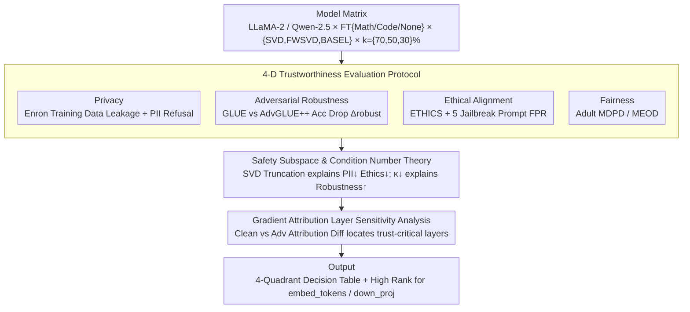

# Decomposed Trust: Privacy, Adversarial Robustness, Ethics, and Fairness in Low-Rank LLMs

**Conference**: ACL 2026 (Findings)  
**arXiv**: [2511.22099](https://arxiv.org/abs/2511.22099)  
**Code**: To be confirmed  
**Area**: LLM Safety / Model Compression / Trustworthy AI  
**Keywords**: Low-rank decomposition, PII leakage, Adversarial robustness, Ethical alignment, Fairness, Layer-wise attribution

## TL;DR
This is the first systematic evaluation of the impact of **low-rank decomposition (SVD/FWSVD/BASEL)** on LLM trustworthiness. The study identifies an asymmetric trade-off: "Training data privacy ↑, Adversarial robustness ↑, PII protection ↓, Ethical alignment ↓, Fairness ↓". Furthermore, gradient attribution is employed to locate adversarial vulnerability within the `embed_tokens` and `down_proj` sub-layers.

## Background & Motivation
**Background**: Beyond quantization (GPTQ) and pruning (Wanda), low-rank decomposition (SVD → FWSVD → BASEL → IMPACT) is emerging as a mainstream LLM compression route, significantly reducing memory and increasing throughput while maintaining benign accuracy. While Hong et al. (2024, ICML) investigated the impact of quantization and pruning on trustworthiness, the effects of low-rank decomposition remain unexplored.

**Limitations of Prior Work**: The industry often treats low-rank compression as "side-effect-free slimming" for edge LLM deployment. However, no systematic study has addressed whether compressed models can still refuse PII requests, identify unethical prompts, or maintain fairness. This research gap represents a compliance-level risk in sensitive sectors like healthcare and finance.

**Key Challenge**: Low-rank decomposition **truncates the singular value subspace**. Arditi et al. (2024) demonstrated that the "safety subspace (refusal direction)" of LLMs resides within these truncated directions. As compression intensifies, the refusal vector becomes irreconstructible, silently stripping away safety mechanisms even when benign accuracy remains stable.

**Goal**: (1) Systematically quantify the impact of low-rank compression across four trustworthiness dimensions (privacy, adversarial robustness, ethics, and fairness); (2) Dissect the interactions between model scale, fine-tuning, and compression methods; (3) Utilize gradient attribution to identify which layers determine adversarial robustness, providing guidance on which layers should remain uncompressed.

**Key Insight**: The study utilizes LLaMA-2 (7B/13B, Base/Chat) and Qwen-2.5 (7B/14B) as base models. It conducts an orthogonal evaluation across three low-rank methods (SVD, FWSVD, BASEL) and three compression rates (k% = 70/50/30) using four types of trustworthiness datasets (Enron, GLUE+AdvGLUE++, ETHICS, Adult).

**Core Idea**: By decomposing "trustworthiness" into four independent quadrants, it is revealed that low-rank compression displays **directional changes** rather than uniform degradation. Rigorous explanations are provided using SVD safety subspace theory and condition number theory.

## Method

### Overall Architecture
This paper constitutes an evaluation and interpretational study. The pipeline is as follows: ① **Model Matrix Setup**—LLaMA-2 Base/Chat (7B/13B) and Qwen-2.5 (7B/14B), tested under various conditions: {fine-tuned for math, fine-tuned for code, no fine-tuning} × {SVD, FWSVD, BASEL} × {k=70%, 50%, 30%}; ② **Trustworthiness Evaluation**—Independent assessment of four dimensions: Enron Email (5 training-data leakage metrics), Enron PII (leakage and rejection across zero-shot, few-shot protected, and few-shot attack scenarios), GLUE/AdvGLUE++ on SST-2/QQP/MNLI (accuracy drop $\Delta_{\text{robust}}$), ETHICS commonsense (zero/few-shot accuracy + FPR under 5 jailbreak instructions), and UCI Adult (MDPD / MEOD on race/sex/age); ③ **Theoretical Explanation**—Use of safety subspace, condition number, and capacity-memorization theories to explain the causes of PII↓/ethics↓, adversarial robustness↑, and training-data privacy↑ respectively; ④ **Layer-wise Attribution**—Quantification of layer contributions using first-order Taylor expansion $a_i = \|(\partial \ell / \partial \mathbf{h}_i) \mathbf{h}_i\|_2$, identifying trust-critical layers via the difference between clean and adversarial samples $\Delta_i = |a_i^{\text{clean}} - a_i^{\text{adv}}|$.

### Key Designs

**1. 4-D Trustworthiness Evaluation Protocol: Independent quadrant assessment.**

Relying on a single aggregate metric would mask opposing trade-offs, such as increased PII leakage occurring alongside decreased training-data leakage. Consequently, this study decomposes trustworthiness into privacy (training-data vs. PII), adversarial robustness, ethics (standard vs. jailbreaking), and fairness. Each dimension is mapped to industry-standard datasets and metrics. This granularity allows for the creation of an actionable "✓/✗ Decision Table" (Table 2), advising engineers on the specific risks associated with low-rank compression.

**2. Safety Subspace and Condition Number Theory: Mathematical causal links.**

To go beyond empirical observations, the study provides theoretical explanations. For each weight matrix $\mathbf{W} = \mathbf{U} \mathbf{\Sigma} \mathbf{V}^\top$, the refusal vector $\mathbf{v} = \sum_{k=1}^r \lambda_k \mathbf{u}_k$ spans the full singular subspace. Truncating to $r' < r$ introduces an irrecoverable reconstruction error:

$$\|\mathbf{v} - \hat{\mathbf{v}}\|_2^2 = \sum_{k=r'+1}^r \lambda_k^2,$$

This error disrupts the refusal mechanism, compromising PII protection and ethical alignment. Conversely, adversarial robustness is governed by the condition number $\kappa(\mathbf{W}) = s_{\max}/s_{\min}$. Low-rank decomposition discards the smallest singular values, thereby increasing $s_{\min}$, decreasing $\kappa$, and making the model more resilient to perturbations. Training-data privacy is explained through model capacity: truncating the subspace reduces capacity and memorization, leading to lower leakage of training emails.

**3. Layer-wise Gradient Attribution: Identifying trust-critical layers.**

Existing low-rank methods (ASVD/AMC) allocate rank based on benign reconstruction error, which might damage layers essential for safety. This study identifies these layers by quantifying the contribution of the $i$-th layer using first-order Taylor expansion: $a_i = \|(\partial \ell / \partial \mathbf{h}_i) \mathbf{h}_i\|_2$. By comparing attribution for clean and adversarial inputs ($\Delta_i = |a_i^{\text{clean}} - a_i^{\text{adv}}|$), "trust sensitivity" is measured. Ranking results across LLaMA-2 variants consistently place `embed_tokens` and `down_proj` at the top, suggesting these layers require higher relative rank in future trust-aware compression algorithms.

### Loss & Training
As an evaluation paper, no new models were trained. Fine-tuning used standard GSM8K (math) and HumanEval-style (code) datasets. Low-rank compression followed original paper implementations, controlling only the compression rate $k\%$. Attribution experiments used first-order Taylor expansion without additional training.

## Key Experimental Results

### Main Results

Comparison between LLaMA-2 Base 13B (k=70%) and the original model across trustworthiness dimensions:

| Dimension | Metric | Base 13B | BASEL-70 | FWSVD-70 | SVD-70 | Trend |
|------|------|----------|----------|----------|---------|------|
| Training-data privacy | leakage @ L=200 (%↓) | 3.99 | **0.00** | 0.79 | 0.11 | ✓ Improved |
| PII (zero-shot) | leakage (refusal) (%↓) | 2.42 | 0.00 | 0.00 | 0.00 | (N/A) |
| PII (zero-shot) | **actual leakage** (%↓) | 5.67 | 42.00 | 26.25 | 47.25 | ✗ Worse |
| PII (few-shot protected) | leakage (%↓) | 3.33 | 21.42 | 13.25 | 23.63 | ✗ Worse |
| Adv. robustness SST-2 | acc drop (%↓) | 18.78 | **3.48** | 15.39 | 17.32 | ✓ BASEL Improved |
| Adv. robustness QQP | acc drop (%↓) | 37.51 | **5.63** | 5.57 | 16.42 | ✓ Improved |
| Ethics zero-shot | accuracy (%↑) | 52.92 | 38.45 | 37.80 | 41.87 | ✗ Worse |
| Ethics few-shot | accuracy (%↑) | 63.11 | 60.36 | **77.15** | 64.77 | ≈ Mitigated |
| Fairness | MDPD (%↓) | 0.01 | - | - | 2.00 | ✗ Worse |

**Conclusion**: The directional changes follow a ✓✗✓✗✗ pattern—training-data privacy and adversarial robustness improve, while PII protection, ethical alignment, and fairness deteriorate.

### Ablation Study

Impact of compression rate $k\%$ on trustworthiness (LLaMA-2 Base 13B + BASEL):

| Metric | k=70% | k=50% | k=30% | Trend |
|------|--------|--------|--------|------|
| Training-data leakage (%↓) | 0.0017 | 0.0300 | - | Consistently low |
| PII zero-shot leakage (%↓) | 42.00 | 42.42 | - | High stable leak |
| Adv. SST-2 drop (%↓) | 3.48 | 13.46 | -0.61 | Non-monotonic |
| Ethics zero-shot acc (%↑) | 38.45 | 13.47 | 7.48 | Rapid collapse |
| Fairness MDPD (%↓) | - | 0.02 | 8.33 | Crashes at 30% |

Jailbreak FPR (Impact of fine-tuning):

| Model | FPR (%↓) | Model | FPR (%↓) |
|------|----------|------|----------|
| Base 7B | 10.20 | Chat 7B | 45.10 |
| Math Base 7B | **91.80** | Math Chat 7B | **99.40** |
| Prog Base 7B | 32.20 | Prog Chat 7B | 89.90 |

→ Math fine-tuning increases base model jailbreak FPR from 10.20% to 91.80%, indicating that **task-specific fine-tuning can severely degrade safety alignment**.

### Key Findings
- **PII vs Training-data Privacy Disconnect**: Compression reduces memorization capacity (improving training data privacy) but also weakens the refusal subspace (worsening PII protection). A single "privacy" label is insufficient to describe these risks.
- **Non-linear Ethical Collapse**: Ethics accuracy drops significantly from k=70 (38.45%) to k=30 (7.48%), suggesting a total breakdown of alignment mechanisms at high compression ratios.
- **Math Fine-tuning Hazards**: Fine-tuning on mathematics is particularly dangerous for safety, possibly because math tasks contain few refusal examples, thereby diluting the safety distribution.
- **Trust-critical Layers**: Across all LLaMA-2 variants, `embed_tokens` consistently ranks as the most sensitive layer for trustworthiness, followed closely by `down_proj`. Future algorithms should maintain higher ranks for these layers.

## Highlights & Insights
- **The "4-Quadrant Decision Table" is the key takeaway**: Table 2 provides a concise checklist for engineers evaluating the suitability of low-rank compression for specific deployments.
- **Theory-Experiment Linkage**: The causal chain from "refusal as a singular direction" (Arditi et al.) to "SVD truncation error" and subsequent "PII/Ethics degradation" is logically robust.
- **Reusable Attribution Framework**: Using the difference between clean and adversarial gradient attribution to define "trust sensitivity" is an innovative application that can be extended to other dimensions like fairness.
- **Broad Model Coverage**: Testing both LLaMA-2 and Qwen-2.5 families ensures that findings are not model-specific artifacts.

## Limitations & Future Work
- **Instruction-tuned Compression Gap**: The study primarily compresses Base models. The impact of low-rank compression specifically on RLHF-tuned safety remains to be fully explored.
- **Limited Ethical Scope**: Only commonsense morality was tested; results may not generalize to complex ethical reasoning like deontology or utilitarianism.
- **Qualitative Theoretical Explanations**: The safety subspace argument assumes a single refusal direction. The paper provides inequality-based derivations but does not yet propose a differentiable "trust-aware" optimization objective.
- **Diagnosis over Cure**: The study identifies problems but does not propose a new compression algorithm. Next steps involve designing adaptive rank allocation based on the discovered trust-critical layers.

## Related Work & Insights
- **vs. Hong et al. (2024, ICML) Decoding Compressed Trust**: While Hong et al. focused on quantization and pruning (showing improvements in PII), this work focuses on low-rank decomposition (showing improvements in adversarial robustness), forming a complementary map of compression risks.
- **vs. DecodingTrust (Wang et al. 2023)**: This work extends the DecodingTrust protocol from GPT series models to open-source compressed models.
- **vs. Arditi et al. (2024, NeurIPS) Single-Direction Refusal**: This research applies the "safety direction" theory to a model compression context to explain safety degradation.
- **Insight**: Any "Compression + Deployment" pipeline should integrate a trustworthiness evaluation protocol into its CI/CD gates, alongside benign accuracy, to prevent compliance risks in critical domains.

## Rating
- Novelty: ⭐⭐⭐⭐ First systematic trust evaluation and safety subspace explanation for low-rank methods, filling a clear gap in the literature.
- Experimental Thoroughness: ⭐⭐⭐⭐⭐ Extensive coverage across model families, methods, rates, and trustworthiness dimensions.
- Writing Quality: ⭐⭐⭐⭐ Clear decision tables and theoretical appendices.
- Value: ⭐⭐⭐⭐ Provides essential risk warnings for industry practitioners and identifies directions for trust-aware compression.

<!-- RELATED:START -->

## Related Papers

- [\[NeurIPS 2025\] On the Robustness of Verbal Confidence of LLMs in Adversarial Attacks](../../NeurIPS2025/llm_safety/on_the_robustness_of_verbal_confidence_of_llms_in_adversarial_attacks.md)
- [\[NeurIPS 2025\] Demystifying Language Model Forgetting with Low-Rank Example Associations](../../NeurIPS2025/llm_safety/demystifying_language_model_forgetting_with_low-rank_example_associations.md)
- [\[ACL 2026\] Evaluating Answer Leakage Robustness of LLM Tutors against Adversarial Student Attacks](evaluating_answer_leakage_robustness_of_llm_tutors_against_adversarial_student_a.md)
- [\[ACL 2026\] Can Persona-Prompted LLMs Emulate Subgroup Values? An Empirical Analysis of Generalisability and Fairness in Cultural Alignment](can_persona-prompted_llms_emulate_subgroup_values_an_empirical_analysis_of_gener.md)
- [\[NeurIPS 2025\] Differentially Private Federated Low Rank Adaptation Beyond Fixed-Matrix](../../NeurIPS2025/llm_safety/differentially_private_federated_low_rank_adaptation_beyond_fixed-matrix.md)

<!-- RELATED:END -->
