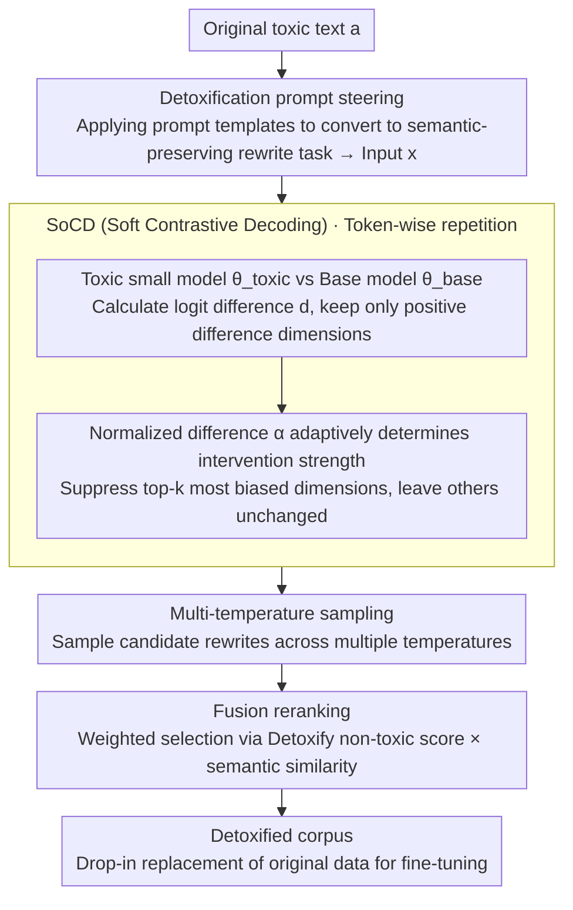

# Detoxification for LLM from Dataset Itself

**Conference**: ACL 2026  
**arXiv**: [2604.19124](https://arxiv.org/abs/2604.19124)  
**Code**: [GitHub](https://github.com/)  
**Area**: LLM/NLP  
**Keywords**: Data-level Detoxification, Contrastive Decoding, Semantic Preservation, Pre-training Corpus Cleaning, Toxicity Mitigation

## TL;DR

This paper proposes the HSPD (Hierarchical Semantic-Preserving Detoxification) pipeline, which uses SoCD (Soft Contrastive Decoding) to guide an LLM in locating and rewriting toxic segments in the original corpus while preserving semantics. This generates a detoxified corpus that can directly replace original data for fine-tuning—reducing toxicity probability from 0.42 to 0.18 on GPT2-XL and achieving optimal detoxification effects on LLaMA2-7B, OPT-6.7B, and Falcon-7B.

## Background & Motivation

**Background**: LLMs learn from internet data and inevitably absorb toxic content. Existing detoxification methods primarily operate during the post-training stage (fine-tuning/RLHF) or at inference time (controlled decoding), but they fail to fundamentally prevent models from acquiring toxic knowledge during pre-training.

**Limitations of Prior Work**: (1) Controlled inference methods (e.g., PPLM, DExperts) may degrade generation quality; (2) Post-training methods (e.g., DAPT) require significant additional computation; (3) Both approaches merely "suppress" rather than "eliminate" toxicity—the model still "knows" toxic content but is merely blocked from outputting it.

**Key Challenge**: Detoxifying during inference or post-training "treats the symptoms rather than the root cause"—the real issue lies in the training data itself. However, direct data detoxification faces the challenge of semantic preservation—crude deletion of toxic content destroys contextual semantics and knowledge coherence.

**Goal**: Detoxify at the dataset level—rewriting toxic segments in the original corpus into non-toxic but semantically equivalent text to generate a detoxified corpus for drop-in replacement.

**Key Insight**: Utilize the LLM's own text generation capabilities to precisely locate and suppress toxic tokens via contrastive decoding while preserving original semantics.

**Core Idea**: Use a small model fine-tuned on toxic data as a "toxicity detector." By analyzing the difference signals generated during contrastive decoding with a base model, the method precisely identifies toxic token dimensions and suppresses only those dimensions to maximize semantic preservation.

## Method

### Overall Architecture

The HSPD pipeline consists of three steps: (1) Detoxification prompt steering—designing prompts to make the model rewrite toxic text into a semantic-preserving non-toxic version; (2) SoCD decoding—adaptively suppressing the top-k most biased token dimensions using the logit difference between a toxic small model and the base model during decoding; (3) Multi-temperature sampling + Fusion reranking—generating candidates across multiple temperatures and selecting the best output based on a weighted score of toxicity × semantic similarity.

### Key Designs

**1. Detoxification prompt steering: Constraining the task to "semantic-preserving rewriting" rather than free continuation**

If a model is directly asked to "continue writing" from toxic text, it will likely follow the original tone and output harmful content. HSPD wraps each toxic text $\bm{a}$ in a prompt template before decoding, converting it into an instruction to "rewrite into a non-toxic/low-toxicity version without changing the original meaning" to get input $\bm{x}$. This step frames the generation process within the track of **semantic-preserving rewriting**—subsequent contrastive decoding only needs to fine-tune tokens within this track rather than fighting the model's impulse to improvise from scratch.

**2. SoCD (Soft Contrastive Decoding): Suppressing only the few dimensions most biased toward toxicity with adaptive intensity**

Classic contrastive decoding uses aggressive masking strategies that eliminate large areas preferred by the toxic model, which often damages information dimensions carrying normal semantics. SoCD's approach is to only modify the truly "toxic" dimensions. A small model $\theta_{\text{toxic}}$ is fine-tuned on toxic data to serve as a toxicity probe. At each decoding step, the logit difference is calculated:

$$\mathbf{d} = \log(p_{\theta_{\text{toxic}}}) - \log(p_{\theta_{\text{base}}}),$$

Only positive difference dimensions (tokens preferred more by the toxic model) are kept. Crucially, a normalized difference $\alpha$ (derived from the logit difference between models, reflecting the degree of toxic deviation) governs two things: **how many dimensions to suppress** and **how strongly to suppress them**. Specifically, $k = \text{clip}(\lceil \alpha V \rceil, k_{\min}, k_{\max})$ limits intervention to the top-$k$ most biased dimensions; larger differences increase $k$ to suppress more dimensions. Furthermore, $\alpha$ determines the suppression intensity for each selected dimension. Toxicity is not uniformly distributed—positions like "fuck" show huge differences and require strong intervention, while positions like "the" show almost no difference and should be left alone. Through adaptive $\alpha$ rather than fixed hyperparameters, intervention strength scales automatically with toxicity intensity.

**3. Multi-temperature sampling + Fusion reranking: Picking the semantic-detoxification Pareto optimal in a larger candidate space**

Single-pass sampling often fails to balance "preserving meaning" and "removing toxicity." HSPD samples a batch of candidate rewrites at multiple temperatures and uses a Detoxify model for non-toxicity scores and sentence embeddings for semantic similarity to the original text. These two metrics are weighted and ranked to select the optimal output, making it more likely to find a version that is both non-toxic and semantically accurate.

### Loss & Training

The toxic small model is obtained via standard fine-tuning on a toxic dataset $\mathbb{D}$. The HSPD pipeline itself does not require training—it is an inference-time detoxification tool. The detoxified corpus is used for subsequent training (simulating a pre-training setting).

## Key Experimental Results

### Main Results

**GPT2-XL Detoxification Performance**

| Method | Toxicity Prob. (TP) ↓ | Expected Max Toxicity (EMT) ↓ | Perplexity ↓ |
|------|---------------|-------------------|---------|
| Original Model | 0.42 | 0.43 | Baseline |
| DExperts | 0.26 | 0.32 | Slight Increase |
| DAPT | 0.30 | 0.35 | Significant Increase |
| **Ours (HSPD)** | **0.18** | **0.20** | Near Baseline |

**Multi-model Validation**

| Model | Original TP | Ours (HSPD) TP | Note |
|------|--------|---------|------|
| GPT2-XL | 0.42 | 0.18 | -57% |
| LLaMA2-7B | - | Best | Consistent Lead |
| OPT-6.7B | - | Best | Consistent Lead |
| Falcon-7B | - | Best | Consistent Lead |

### Ablation Study

| Configuration | TP | Note |
|------|-----|------|
| Full HSPD | 0.18 | Full Pipeline |
| w/o SoCD (Prompt Only) | 0.28 | SoCD contributes significantly |
| w/o Multi-temp Rerank | 0.22 | Reranking provides additional safety |
| Fixed k (Non-adaptive) | 0.24 | Adaptive k outperforms fixed values |
| Classic CD (Non-SoCD) | 0.30 + Semantic Loss | SoCD's soft intervention is superior |

### Key Findings

- Data-level detoxification fundamentally reduces acquired toxicity rather than just suppressing it at inference.
- SoCD's soft intervention (operating only on top-k biased dimensions) achieves a significantly better balance between detoxification and semantic preservation than classic CD.
- Adaptive k-values are critical—ensuring intervention strength at each token position is proportional to the toxicity signal.
- Perplexity of the detoxified corpus is close to the original, indicating that knowledge and linguistic capabilities are effectively preserved.
- Consistently effective across four different model architectures and scales.

## Highlights & Insights

- The "detoxification from the source" strategy shifts the paradigm from post-training/inference "patching" to pre-training "root-cause treatment."
- SoCD's adaptive top-k suppression is a sophisticated engineering design—intervening only in the most toxic dimensions while preserving the rest.
- Multi-temperature + Fusion reranking provides a practical solution for choosing the semantic-safety Pareto optimal.

## Limitations & Future Work

- Requires training a toxic small model for each dataset (adding pipeline complexity despite low cost).
- OOD toxicity (types not covered in training data) may not be effectively handled.
- Rewritten corpus might alter original intent in certain edge cases.
- Future work could explore adaptive detoxification methods that do not require toxic small models.

## Related Work & Insights

- **vs DExperts**: Inference-time logit ensemble cannot fundamentally eliminate toxicity; Ours (HSPD) clears it from the data source.
- **vs DAPT**: Post-training adaptation requires extra computation and incomplete elimination; Ours (HSPD) processes before training.
- **vs UniDetox**: Data distillation still requires post-training applications; Ours (HSPD) directly replaces original data.
- **vs ParaGeDi**: Semantic-preserving rewriting but operates at inference; Ours (HSPD) applies rewriting to the corpus itself.

## Rating

- Novelty: ⭐⭐⭐⭐ Data-level detoxification is a fresh approach, and SoCD is an effective improvement over contrastive decoding.
- Experimental Thoroughness: ⭐⭐⭐⭐⭐ Dual verification of detoxification quality and semantic preservation across four models and multiple ablations.
- Writing Quality: ⭐⭐⭐⭐ Clear method description and logical pipeline design.
- Value: ⭐⭐⭐⭐ Provides a practical solution for addressing LLM toxicity at the data source.

<!-- RELATED:START -->

## Related Papers

- [\[ACL 2026\] CausalDetox: Causal Head Selection and Intervention for Language Model Detoxification](causaldetox_causal_head_selection_and_intervention_for_language_model_detoxifica.md)
- [\[NeurIPS 2025\] CPRet: A Dataset, Benchmark, and Model for Retrieval in Competitive Programming](../../NeurIPS2025/llm_safety/cpret_a_dataset_benchmark_and_model_for_retrieval_in_competitive_programming.md)
- [\[ICCV 2025\] Asynchronous Event Error-Minimizing Noise for Safeguarding Event Dataset](../../ICCV2025/llm_safety/asynchronous_event_error-minimizing_noise_for_safeguarding_event_dataset.md)
- [\[ACL 2026\] SSG: Logit-Balanced Vocabulary Partitioning for LLM Watermarking](ssg_logit-balanced_vocabulary_partitioning_for_llm_watermarking.md)
- [\[ACL 2026\] Illusions of Confidence? Diagnosing LLM Truthfulness via Neighborhood Consistency](illusions_of_confidence_diagnosing_llm_truthfulness_via_neighborhood_consistency.md)

<!-- RELATED:END -->
