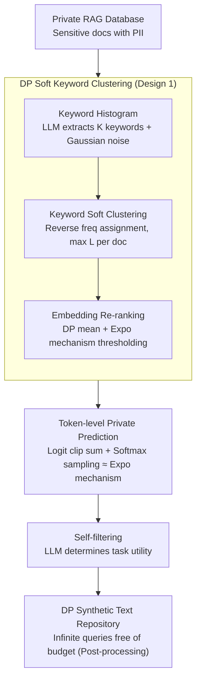

# Differentially Private Synthetic Text Generation for Retrieval-Augmented Generation (RAG)

**Conference**: ACL 2026 Findings  
**arXiv**: [2510.06719](https://arxiv.org/abs/2510.06719)  
**Code**: Extended from https://github.com/sarus-tech/dp-rag  
**Area**: LLM Security / Differential Privacy / RAG  
**Keywords**: Differential Privacy, Synthetic Data, RAG, private prediction, subsample-and-aggregate

## TL;DR
DP-SynRAG utilizes an LLM to distill a private RAG database into a differentially private synthetic text repository in a **one-time** process. Subsequent queries do not consume any privacy budget. On Medical Synth, MovieLens, and SearchQA datasets, its accuracy significantly outperforms query-time DP-RAG, which typically collapses in multi-query scenarios.

## Background & Motivation
**Background**: RAG grounds LLMs by connecting them to external private knowledge bases. However, in medical, customer service, or recommendation scenarios, these databases contain highly sensitive content such as PII and medical records. Studies have shown that (a) even benign queries can cause LLMs to regurgitate private fragments, and (b) targeted extraction and membership inference attacks can efficiently retrieve original records.

**Limitations of Prior Work**: Existing private RAG solutions (e.g., DP-RAG, Koga 2025, Wang 2025) rely on **query-time DP**, adding noise at the output layer for every query response. Consequently, the privacy budget **accumulates linearly with the number of queries**. To maintain $\varepsilon_{\text{query}} = 10$ over 1,000 queries, the total budget $\varepsilon_{\text{total}} \approx 10,000$. Either the budget is exhausted quickly, or the noise per query becomes too high for practical use. Figure 3 shows that DP-RAG completely fails once the query count exceeds 20 under $\varepsilon_{\text{total}}=20$.

**Key Challenge**: A knowledge base is a "frequently read" resource, yet query-time DP assumes "paying for privacy per read." This assumption is fundamentally misaligned with multi-query RAG scenarios. Privacy should be a one-time cost associated with "database construction," after which all queries benefit from DP post-processing immunity.

**Goal**: Construct a solution that (1) keeps the privacy budget fixed regardless of the query count, (2) does not require DP-SGD fine-tuning of the LLM, and (3) **retains task-critical details** (e.g., disease names, user preferences) in synthetic text rather than just learning dataset-average styles.

**Key Insight**: Build upon the private prediction framework (subsample-and-aggregate + multi-document logit aggregation + clipping) but introduce a strategy of **keyword-based clustering followed by intra-cluster synthesis**. While previous works (Amin, Tang, Hong) used random subsampling that only captured global average features, this work uses DP clustering to ensure each subset is themed, thereby generating synthetic text that preserves "locality."

**Core Idea**: A five-step process—"DP Keyword Histogram → DP Soft Clustering → DP Embedding Re-ranking → Intra-cluster Private Prediction rewriting → LLM Self-filtering"—converts query-time DP into data-time DP, exchanging a one-time budget for infinite queries.

## Method

### Overall Architecture
The pipeline consists of two stages (Algorithm 1, 5 sub-steps):

**Stage 1: DP Soft Clustering**  
(a) **Keyword Histogram**: The LLM extracts $K$ representative keywords from each document (limiting $K$ makes sensitivity $\sqrt{K}$). The global sum yields a histogram, perturbed with Gaussian noise $h' = h + \mathcal{N}(0, \sigma_h^2 I)$.  
(b) **Keyword Soft Clustering**: From $h'$, the top-$R$ keywords $W = \{w_1, \ldots, w_R\}$ are selected. Documents are assigned to clusters in **reverse order of frequency** (to prevent high-frequency, non-informative words from dominating). Each document stays in at most $L$ clusters.  
(c) **Embedding Re-ranking**: For each cluster $C_r$, a noisy mean embedding is calculated using the Gaussian mechanism $\mu(C_r) = \sum_{d_i \in C_r} \mathcal{E}(d_i) + \mathcal{N}(0, \sigma_\mu^2 I)$. An exponential mechanism then selects a similarity threshold $\theta_s$ to retain $S_r = \{d_i \in C_r \mid \text{sim}(\mathcal{E}(d_i), \mu(C_r)) > \theta_s\}$.

**Stage 2: Synthetic Text Generation**  
(d) **Private Prediction**: Parallel logit aggregation is performed for each $S_r$. Each document is paired with a rephrase prompt $p_i$. The logit for the $n$-th token is $z_n(S_r) = \sum_{d_i \in S_r} \text{clip}_c(\mathcal{L}(p_i, y_{r, <n}))$. Softmax sampling is equivalent to an exponential mechanism with sensitivity $c$. Repeating this for $T$ steps yields synthetic text $y_r$.  
(e) **Self-filtering**: Each $y_r$ and the downstream task description are fed back to the LLM to determine if the text is useful for the task. Only "YES" samples enter the synthetic repository (post-processing does not consume budget).

**Privacy Cost** (Theorem 1): The entire pipeline satisfies $(\varepsilon, \delta)$-DP, where $\rho = \frac{K}{2\sigma_h^2} + L \left( \frac{1}{8}\varepsilon_{\theta_s}^2 + \frac{1}{2\sigma_\mu^2} + \frac{T}{2}\left(\frac{c}{\tau}\right)^2 \right)$, converted to $\varepsilon = \rho + \sqrt{4\rho\log(1/\delta)}$. A key technique is **overlapping parallel composition**—since each document is in at most $L$ clusters, the privacy cost for parallel processing is $L \cdot \rho_{\text{cluster}}$ rather than $R \cdot \rho_{\text{cluster}}$.

### Key Designs

**1. DP Soft Keyword Clustering: Preserving "local details" like disease names or user preferences.**  
Standard private prediction (e.g., Amin et al.) uses random subsampling, which only learns dataset-average characteristics—useless for RAG tasks requiring specific facts. DP-SynRAG solves this by partitioning the database into themed clusters. Soft clustering ($L>1$) is the backbone; hard clustering ($L=1$) often misclassifies polysemous documents. Ablation shows that on Medical Synth with Llama-3.1, $L=1$ drops accuracy by 31.88% compared to $L=5$, which serves as the "sweet spot" for balancing locality and noise.

**2. Token-level Private Prediction: Using natural randomness of softmax sampling as the DP noise source.**  
Instead of adding explicit Gaussian noise to logits (which distorts the distribution and masks small values), the method leverages the inherent stochasticity of LLM token sampling. By clipping logits to $[-c, c]$ and summing them across the cluster, the softmax sampling process becomes mathematically equivalent to an exponential mechanism with sensitivity $c$. This "free" noise allows for high-quality generation.

**3. Data-time DP + Self-filtering Post-processing: Paying the budget once during "construction".**  
This is the most critical reframing. Unlike query-time DP where the budget scales with query count, DP-SynRAG's pipeline satisfies $(\varepsilon, \delta)$-DP once at the database level. Due to post-processing immunity, all subsequent embedding indexing, retrieval, and LLM inference consume zero budget. Figure 3 highlights this: DP-SynRAG maintains a horizontal accuracy line while DP-RAG's performance plummet as queries increase.

### Loss & Training
**Training-free**. All LLMs are used for frozen inference (keyword extraction, rephrasing, and self-filtering use the same LLM). Main parameters: $K=10$ keywords/doc, $R=500$ or $1000$ clusters, $L=5$ overlap, $k=80-100$ docs/cluster, $T=70$ tokens/synthetic, $\tau=1.0$, $\varepsilon_{\text{total}}=10$.

## Key Experimental Results

### Main Results

Three datasets × Three LLMs × Five methods ($\varepsilon_{\text{total}}=10$ for DP-SynRAG, $\varepsilon_{\text{query}}=10$ for DP-RAG):

| Dataset | Method | Phi-4-mini (3.8B) | Gemma-2-2B | Llama-3.1-8B |
|---------|--------|------------------|------------|---------------|
| **Medical Synth** | Non-RAG | 0.00 | 0.00 | 0.00 |
| | RAG (no DP) | 87.00 | 85.20 | 86.20 |
| | DP-Synth (Amin'24) | 0.00 | 0.00 | 0.00 |
| | Aug-PE | 0.00 | 0.00 | 0.00 |
| | **Ours** | **67.26** | **67.06** | **61.26** |
| | DP-RAG ($\varepsilon_{\text{total}}{\approx}10\text{k}$) | 59.92 | 67.06 | 48.94 |
| **MovieLens** | RAG (no DP) | 67.80 | 54.60 | 70.80 |
| | **Ours** | **42.56** | **41.08** | 54.12 |
| | DP-RAG ($\varepsilon_{\text{total}}{\approx}5\text{k}$) | 34.72 | 40.48 | **56.80** |
| **SearchQA** | RAG (no DP) | 92.16 | 94.12 | 95.10 |
| | **Ours** | **89.61** | **85.10** | **91.18** |
| | DP-RAG ($\varepsilon_{\text{total}}{\approx}1\text{k}$) | 85.10 | 83.14 | 84.90 |

**Conclusion**: DP-SynRAG significantly leads equivalent-budget baselines and often outperforms DP-RAG despite the latter using a 1000x larger actual budget.

### Ablation Study

Impact of components on accuracy (%):

| Dataset / Model | Full | w/o Retrieval | w/o Self-filter | Hard cluster ($L=1$) |
|-----------------|------|---------------|-----------------|----------------------|
| Medical Synth / Phi-4 | 67.26 | 65.92 | 66.78 | 42.52 |
| Medical Synth / Llama | 61.26 | 57.74 | 52.20 | 29.38 |

**Conclusion**: (1) Soft clustering ($L>1$) is the most critical component. (2) Self-filtering improves accuracy by up to 9pp. (3) Embedding re-ranking provides consistent small gains.

### Key Findings
- **Query Count vs Accuracy**: DP-SynRAG maintains a flat curve (fixed budget), whereas DP-RAG collapses after 20 queries even with $\varepsilon_{\text{total}}=20$.
- **Rare Topic Limitations**: Performance drops significantly when a topic is supported by fewer than 30 documents. This is identified as an inherent DP trade-off rather than an algorithmic flaw.
- **Privacy Leakage**: Leakage is reduced to near zero and remains unaffected by adversarial attack prompts.

## Highlights & Insights
- **Shifting the DP Timing**: Moving privacy from "per-query" to "at construction" is the biggest contribution, unlocking high utility for frequently-read resources.
- **Softmax as Exponential Mechanism**: Using inherent sampling randomness avoids distribution distortion from explicit noise addition.
- **Overlapping Parallel Composition**: An elegant application of zCDP principles that allows for multi-cluster document representation with controlled privacy costs.

## Limitations & Future Work
- **Rare Topics**: Accuracy for long-tail knowledge supported by <30 docs is near 0.
- **Database Updates**: Full regeneration is currently required for updates; incremental refresh is needed.
- **Sensitivity to Keywords**: Clustering relies on surface-form keywords; synonym expansion could improve robustness.

## Rating
- Novelty: ⭐⭐⭐⭐ 
- Experimental Thoroughness: ⭐⭐⭐⭐⭐ 
- Writing Quality: ⭐⭐⭐⭐ 
- Value: ⭐⭐⭐⭐⭐ 

<!-- RELATED:START -->

## Related Papers

- [\[ICML 2026\] ACTG-ARL: Differentially Private Conditional Text Generation with RL-Boosted Control](../../ICML2026/llm_safety/actg-arl_differentially_private_conditional_text_generation_with_rl-boosted_cont.md)
- [\[ACL 2026\] Beyond Explicit Refusals: Soft-Failure Attacks on Retrieval-Augmented Generation](beyond_explicit_refusals_soft-failure_attacks_on_retrieval-augmented_generation.md)
- [\[ACL 2026\] Knowledge Poisoning Attacks on Medical Multi-Modal Retrieval-Augmented Generation](knowledge_poisoning_attacks_on_medical_multi-modal_retrieval-augmented_generatio.md)
- [\[AAAI 2026\] Privacy-protected Retrieval-Augmented Generation for Knowledge Graph Question Answering](../../AAAI2026/llm_safety/privacy-protected_retrieval-augmented_generation_for_knowledge_graph_question_an.md)
- [\[ACL 2026\] AGSC: Adaptive Granularity and Semantic Clustering for Uncertainty Quantification in Long-text Generation](agsc_adaptive_granularity_and_semantic_clustering_for_uncertainty_quantification.md)

<!-- RELATED:END -->
