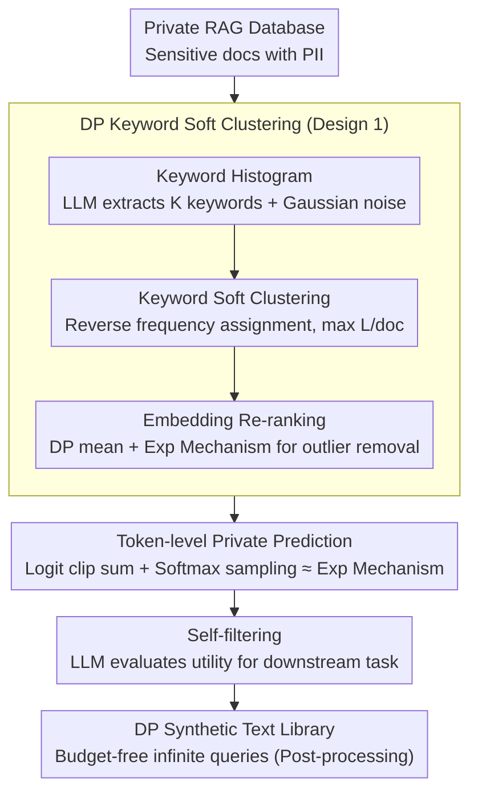

# Differentially Private Synthetic Text Generation for Retrieval-Augmented Generation (RAG)

**Conference**: ACL 2026 Findings  
**arXiv**: [2510.06719](https://arxiv.org/abs/2510.06719)  
**Code**: Extended based on https://github.com/sarus-tech/dp-rag  
**Area**: LLM Security / Differential Privacy / RAG  
**Keywords**: Differential Privacy, Synthetic Data, RAG, Private Prediction, Subsample-and-Aggregate

## TL;DR
DP-SynRAG utilizes LLMs to distill private RAG databases into differentially private synthetic text libraries in a **one-time** process. Subsequent queries do not consume any privacy budget. On Medical Synth, MovieLens, and SearchQA datasets, its accuracy significantly outperforms query-time DP-RAG (which collapses in multi-query scenarios).

## Background & Motivation
**Background**: RAG grounds LLMs using external private knowledge bases. However, in sectors like healthcare or recommendation systems, databases contain highly sensitive content such as PII or medical records. Research indicates that: (a) even benign queries can cause LLMs to replicate private fragments; (b) targeted extraction and membership inference attacks can efficiently retrieve original records.

**Limitations of Prior Work**: Existing private RAG solutions (e.g., DP-RAG / Koga 2025 / Wang 2025) rely on **query-time DP**, adding noise to the output layer of each query response. Consequently, the privacy budget **accumulates linearly with the number of queries**. For 1,000 queries with a per-query budget of $\varepsilon_{\text{query}} = 10$, the total budget $\varepsilon_{\text{total}} \approx 10000$. This either depletes the budget quickly or results in excessive noise that renders the system unusable. Figure 3 shows that DP-RAG becomes entirely ineffective after 20 queries under $\varepsilon_{\text{total}}=20$.

**Key Challenge**: A knowledge base is a resource that is "read repeatedly," yet query-time DP assumes "privacy must be paid for every read." This assumption is fundamentally mismatched for multi-query RAG scenarios. Privacy costs should be paid once for "database construction," after which all queries are considered post-processing (immune to DP degradation).

**Goal**: To construct a solution where: (1) the privacy budget is fixed and independent of the number of queries; (2) no DP-SGD fine-tuning of the LLM is required; (3) **task-critical details** (e.g., disease names, user preferences) are preserved in synthetic text, rather than just learning dataset-average styles.

**Key Insight**: Build upon the private prediction framework (subsample-and-aggregate + logit aggregation + clipping) but introduce a strategy of **clustering by keywords before synthesizing within clusters**. Previous methods (Amin/Tang/Hong) utilized random subsampling of the entire library, which only captured global average features. This paper utilizes DP clustering to ensure each subset is theme-consistent, thereby generating synthetic text that preserves "locality."

**Core Idea**: A five-step pipeline converts query-time DP to data-time DP: "DP Keyword Histogram → DP Soft Clustering → DP Embedding Re-ranking → Intra-cluster Private Prediction Rewriting → LLM Self-filtering." A one-time budget is paid for infinite subsequent queries.

## Method

### Overall Architecture
The pipeline consists of two stages (Algorithm 1, 5 sub-steps):

**Stage 1: DP Soft Clustering**
(a) **Keyword Histogram**: The LLM extracts $K$ representative keywords from each document (limiting to $K$ makes sensitivity $\sqrt{K}$). A global histogram is summed and perturbed with Gaussian noise: $h' = h + \mathcal{N}(0, \sigma_h^2 I)$.
(b) **Keyword Soft Clustering**: The top-$R$ keywords $W = \{w_1, \ldots, w_R\}$ are identified. Traversing in **reverse frequency order** (to prevent high-frequency, non-informative words from dominating), each keyword $w_r$ forms a cluster $C_r = \{d_i \mid w_r \in d_i, \text{ and } d_i \text{ belongs to } <L \text{ clusters}\}$. Each document is assigned to at most $L$ clusters.
(c) **Embedding Re-ranking**: For each $C_r$, a noisy mean embedding is calculated via the Gaussian mechanism: $\mu(C_r) = \sum_{d_i \in C_r} \mathcal{E}(d_i) + \mathcal{N}(0, \sigma_\mu^2 I)$. The exponential mechanism selects a similarity threshold $\theta_s$ to retain $S_r = \{d_i \in C_r \mid \text{sim}(\mathcal{E}(d_i), \mu(C_r)) > \theta_s\}$.

**Stage 2: Synthetic Text Generation**
(d) **Private Prediction**: Logit aggregation is performed in parallel for each $S_r$. Each document is paired with a rephrase prompt $p_i$. The logit for the $n$-th token is $z_n(S_r) = \sum_{d_i \in S_r} \text{clip}_c(\mathcal{L}(p_i, y_{r, <n}))$. Softmax sampling is equivalent to the exponential mechanism with sensitivity $c$. This yields synthetic text $y_r$ of length $T$.
(e) **Self-filtering**: Each $y_r$ along with the downstream task description is fed back to the LLM to determine utility. Only those marked "YES" enter the synthetic library (post-processing does not consume privacy budget).

**Privacy Accounting** (Theorem 1): The entire pipeline satisfies $(\varepsilon, \delta)$-DP, where $\rho = \frac{K}{2\sigma_h^2} + L \left( \frac{1}{8}\varepsilon_{\theta_s}^2 + \frac{1}{2\sigma_\mu^2} + \frac{T}{2}\left(\frac{c}{\tau}\right)^2 \right)$, converted to $\varepsilon = \rho + \sqrt{4\rho\log(1/\delta)}$. The key technique is **overlapping parallel composition**; since each document is in at most $L$ clusters, the cost is $L \cdot \rho_{\text{cluster}}$ rather than $R \cdot \rho_{\text{cluster}}$.

### Key Designs

**1. DP Keyword Soft Clustering: Preserving "Local Details" like disease names or user preferences.**
Standard private prediction (e.g., Amin et al.) uses random subsampling, which only learns dataset-average characteristics. For RAG tasks requiring specific facts, this is ineffective (accuracy = 0% for DP-Synth/Aug-PE on Medical Synth in Table 1). DP-SynRAG solves this by partitioning the library into theme-consistent clusters before synthesis. Soft clustering ($L>1$) is critical; hard clustering ($L=1$) misclassifies polysemous documents. Ablation studies show a 31.88% drop on Medical Synth with $L=1$.

**2. Token-level Private Prediction: Utilizing Softmax sampling randomness as the DP noise source.**
To synthesize text within a cluster, the logit for the $n$-th token from each document is clipped to $[-c, c]$ and summed. This is mathematically equivalent to an exponential mechanism where utility = clipped logits and sensitivity = $c$. The randomness of sampling provides DP "for free" without explicit noise addition that might distort the distribution.

**3. Data-time DP + Self-filtering: Paying the budget once during "Library Construction."**
Existing private RAG solutions are query-time DP, where the budget scales with query count. DP-SynRAG makes the construction process $(\varepsilon, \delta)$-DP. Due to DP post-processing immunity, subsequent indexing, retrieval, and inference consume zero budget. Self-filtering further improves quality by removing low-utility synthetic text without additional privacy costs.

## Loss & Training
**Training-free**. All LLMs are used for inference in a frozen state. Key parameters: $K=10$ keywords/doc, $R=500$ or $1000$, $L=5$ overlap, $k=80-100$ docs/cluster, $T=70$ tokens, $\tau=1.0$, $\varepsilon_{\text{total}}=10$, $\delta=10^{-3}$, $\rho_{\text{hist}}=0.1$.

## Key Experimental Results

### Main Results

Comparison across three datasets, three LLMs, and five methods ($\varepsilon_{\text{total}}=10$ for DP-SynRAG, $\varepsilon_{\text{query}}=10$ for DP-RAG):

| Dataset | Method | Phi-4-mini (3.8B) | Gemma-2-2B | Llama-3.1-8B |
|---------|--------|------------------|------------|---------------|
| **Medical Synth** | Non-RAG | 0.00 | 0.00 | 0.00 |
| | RAG (no DP) | 87.00 | 85.20 | 86.20 |
| | DP-Synth (Amin'24) | 0.00 | 0.00 | 0.00 |
| | Aug-PE | 0.00 | 0.00 | 0.00 |
| | **Ours** | **67.26** | **67.06** | **61.26** |
| | DP-RAG ($\varepsilon_{\text{total}}{\approx}10\text{k}$) | 59.92 | 67.06 | 48.94 |
| **MovieLens** | RAG (no DP) | 67.80 | 54.60 | 70.80 |
| | DP-Synth | 37.60 | 16.64 | 46.12 |
| | Aug-PE | 36.16 | 26.04 | 44.96 |
| | **Ours** | **42.56** | **41.08** | 54.12 |
| | DP-RAG ($\varepsilon_{\text{total}}{\approx}5\text{k}$) | 34.72 | 40.48 | **56.80** |
| **SearchQA** | RAG (no DP) | 92.16 | 94.12 | 95.10 |
| | DP-Synth | 60.20 | 20.20 | 40.00 |
| | **Ours** | **89.61** | **85.10** | **91.18** |
| | DP-RAG ($\varepsilon_{\text{total}}{\approx}1\text{k}$) | 85.10 | 83.14 | 84.90 |

### Ablation Study

Impact of components on DP-SynRAG accuracy (%):

| Dataset / Model | Full | w/o Retrieval | w/o Self-filter | Hard cluster ($L=1$) |
|-----------------|------|---------------|-----------------|----------------------|
| Medical Synth / Phi-4 | 67.26 | 65.92 (-1.34) | 66.78 (-0.48) | 42.52 (**-24.74**) |
| Medical Synth / Llama-3.1 | 61.26 | 57.74 (-3.52) | 52.20 (**-9.06**) | 29.38 (**-31.88**) |
| MovieLens / Llama-3.1 | 54.12 | 53.76 (-0.36) | 45.12 (**-9.00**) | 46.56 (-7.56) |

### Key Findings
- **Distinct Query vs. Accuracy Curves**: DP-SynRAG maintains a horizontal line (fixed budget), while DP-RAG shows a sharp decline. After 20 queries, DP-RAG collapses even with $\varepsilon_{\text{total}}=20$.
- **Failure of Baselines**: DP-Synth and Aug-PE achieve 0% accuracy on Medical Synth, proving that learning global average features is insufficient for RAG; clustering is a prerequisite.
- **DP Ceiling on Rare Subjects**: Accuracy for diseases appearing in <30 documents is nearly 1%. This is a fundamental DP trade-off; a system that reliably answers about rare patients inherently leaks their existence.
- **Privacy Leakage**: DP-SynRAG reduces leakage to near-zero and remains resistant to attack prompts.

## Highlights & Insights
- **DP Timing Shift**: Shifting privacy costs from "per-query" to "one-time construction" is the primary contribution.
- **Softmax as Exponential Mechanism**: This elegantly bypasses the need for explicit logit noise, which often distorts distributions or obscures signal.
- **Overlapping Parallel Composition**: Utilizing zCDP to bound costs by $L$ (overlap factor) rather than $R$ (total clusters) is a precise and effective application of DP theory.

## Limitations & Future Work
- **Rare Subject Ineffectiveness**: Knowledge with low support (<30 docs) results in near-zero utility due to DP constraints.
- **Reconstruction Costs**: Database updates require regenerating the synthetic library (~40 min for 8,000 docs).
- **Surface-form Keyword Dependency**: Clustering may fail if synonyms or different descriptions are used for the same topic; future work could explore semantic expansion.

## Related Work & Insights
- Compared to **DP-RAG (Grislain 2025)**, DP-SynRAG is superior for multi-query scenarios due to fixed budgeting.
- Unlike **DP-Synth (Amin 2024)**, it retains locality via DP clustering instead of random subsampling.
- Compared to **DP Fine-tuning**, DP-SynRAG is training-free, making it significantly more cost-effective for deployment.

## Rating
- Novelty: ⭐⭐⭐⭐
- Experimental Thoroughness: ⭐⭐⭐⭐⭐
- Writing Quality: ⭐⭐⭐⭐
- Value: ⭐⭐⭐⭐⭐

<!-- RELATED:START -->

## Related Papers

- [\[ACL 2026\] Beyond Explicit Refusals: Soft-Failure Attacks on Retrieval-Augmented Generation](beyond_explicit_refusals_soft-failure_attacks_on_retrieval-augmented_generation.md)
- [\[ACL 2026\] Knowledge Poisoning Attacks on Medical Multi-Modal Retrieval-Augmented Generation](knowledge_poisoning_attacks_on_medical_multi-modal_retrieval-augmented_generatio.md)
- [\[AAAI 2026\] Privacy-protected Retrieval-Augmented Generation for Knowledge Graph Question Answering](../../AAAI2026/llm_safety/privacy-protected_retrieval-augmented_generation_for_knowledge_graph_question_an.md)
- [\[NeurIPS 2025\] ImageSentinel: Protecting Visual Datasets from Unauthorized Retrieval-Augmented Image Generation](../../NeurIPS2025/llm_safety/imagesentinel_protecting_visual_datasets_from_unauthorized_retrieval-augmented_i.md)
- [\[ACL 2026\] AGSC: Adaptive Granularity and Semantic Clustering for Uncertainty Quantification in Long-text Generation](agsc_adaptive_granularity_and_semantic_clustering_for_uncertainty_quantification.md)

<!-- RELATED:END -->
