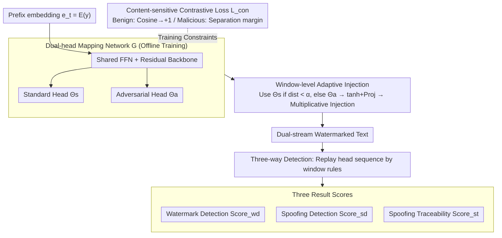

# DualGuard: Dual-stream Large Language Model Watermarking Defense against Paraphrase and Spoofing Attack

**Conference**: ACL 2026 Findings  
**arXiv**: [2512.16182](https://arxiv.org/abs/2512.16182)  
**Code**: https://github.com/hlee-top/DualGuard  
**Area**: LLM Security / Watermarking  
**Keywords**: Dual-stream Watermarking, Spoofing Attack, Paraphrase Attack, Adversarial Traceability, Semantic-invariant Watermarking

## TL;DR
DualGuard proposes the first **dual-stream watermarking** mechanism: it adaptively injects different watermarks using two complementary standard/adversarial watermark heads based on whether content is "benign" or "malicious." This ensures consistency for benign text and divergence for malicious text, maintaining robustness against paraphrasing while enabling the **first-ever detection and traceability** of malicious segments injected via piggyback spoofing.

## Background & Motivation

**Background**: The mainstream approach for LLM watermarking involves adding a "greenlist/redlist" bias to logits (KGW, SIR, XSIR, EWD, SWEET, etc.) or introducing pseudo-random numbers in the sampling layer (AAR, SynthID, DIPmark) to trace text origins via statistical tests. Most optimizations focus on **paraphrase robustness**—ensuring watermarks remain detectable even after word substitutions or rewriting.

**Limitations of Prior Work**: The authors point out that "one-sided pursuit of robustness" creates a significant vulnerability to piggyback spoofing attacks. When an attacker retrieves watermarked LLM output and **inserts malicious/harmful content** (hate speech, misinformation), the watermark persists. Consequently, the harmful content is incorrectly attributed to the model provider, turning the watermark from a "shield" into "incriminating evidence." The only existing spoofing defense, An et al. (2025), can only mark contaminated text as "unwatermarked" after the fact, without identifying which segment is malicious or tracing its source.

**Key Challenge**: To resist paraphrasing, watermarks must be insensitive to local edits; however, this insensitivity allows malicious spoofing injections to be preserved as well. In other words, **robustness against paraphrase and detectability of spoofing are inherently conflicting**.

**Goal**: To achieve four objectives within a single framework: (i) paraphrase robustness, (ii) spoofing detectability, (iii) traceability of malicious segments, and (iv) no degradation in text quality.

**Key Insight**: The authors observe that benign and malicious content are separable in the embedding space. By maintaining "two complementary watermark heads," they can ensure consistency in benign regions and deliberate divergence in malicious regions—where the degree of divergence itself serves as a spoofing signal.

**Core Idea**: A standard and an adversarial watermark head are trained using **contrastive loss** to achieve cosine similarity on benign text and cosine opposition on malicious text. During generation, the heads are dynamically switched based on a window-based mechanism. During detection, dual-stream consistency is used to simultaneously determine the watermark status, detect spoofing, and trace malicious sources.

## Method

### Overall Architecture
The input is the LLM token sequence $y_{:t}$ to be generated, and the output consists of the dual-stream watermarked text along with three types of detection scores: watermark detection score $\text{Score}_{wd}$, spoofing detection score $\text{Score}_{sd}$, and spoofing traceability score $\text{Score}_{st}$. The process involves three stages: (1) Offline training of a mapping model $\mathcal{G}$ with a shared backbone and two watermark heads $\Theta_s, \Theta_a$; (2) During decoding, the dual-stream cosine distance $\text{dist}(y_{:t})$ of the current prefix is calculated for every fixed window $k$. If the distance $<\alpha$, $\Theta_s$ is used; otherwise, the system switches to $\Theta_a$. The output is mapped to $|\mathcal{V}|$ dimensions via tanh and random projection, then injected as $P_{\mathcal{M}'}^t = P_\mathcal{M}^t + \delta\cdot P_\mathcal{M}^t P_\Theta^t$; (3) During detection, the head sequence is replayed using the same window rules, and watermark detection, spoofing detection, and traceability are completed using mean watermark logit, mean dual-stream distance, and adversarial head hit rate.

### Key Designs

**1. Dual-head Mapping Network $\mathcal{G}$ (Standard + Adversarial): Providing a "reference frame" for spoofing detection by generating complementary watermark sets.**

The dilemma of single-stream watermarking is the binary choice between "being detected" and "being bypassed"—there is no second stream for comparison. DualGuard employs a shared multi-layer FFN with a residual backbone that splits into two independent heads, $\Theta_s$ and $\Theta_a$, mapping the prefix embedding $e_t=\mathcal{E}(y_{t-\rho:t})$ to two sets of watermark logits $\Theta_s(e_t), \Theta_a(e_t)$. To ensure watermarks are reproducible after paraphrasing, each head minimizes a semantic loss $\mathcal{L}_{sem}(\Theta)$, which includes three constraints: similar embeddings produce similar watermarks (scaled by $\phi(x)=\tanh(\tau(x-\bar{x}))$), the number of positive and negative watermark values are balanced per sample, and the expected watermark value across the dataset is zero. This ensures semantic invariance without biasing the token distribution.

**2. Content-sensitive Contrastive Loss $\mathcal{L}_{con}$: Training heads to be "consistent when benign, divergent when malicious," making dual-head distance a zero-training statistical measure.**

Spoofing essentially involves inserting malicious content into benign text. DualGuard transforms this insertion into an observable signal using contrastive loss: for the benign subset $\mathcal{D}_s$, it minimizes $-\cos(\Theta_s(e_i),\Theta_a(e_i))$ to push the cosine similarity toward $+1$; for the malicious subset $\mathcal{D}_a$, it uses a hinge loss $\max(0,\cos(\Theta_s,\Theta_a)+\eta)$ to push the cosine similarity below a margin $-\eta$. The total loss $\mathcal{L}=\mathcal{L}_{sem}+\lambda\mathcal{L}_{con}$ balances semantic invariance and content sensitivity. Consequently, the two heads naturally diverge in malicious regions, making the **dual-head cosine distance a direct spoofing signal** without requiring an external classifier.

**3. Window-level Adaptive Injection + Three-way Detection: Encoding "when to switch" into the token sequence for keyless recovery and multi-dimensional scoring.**

During decoding, head selection occurs every $k$ tokens: $\Theta=\Theta_s$ if $\text{dist}(y_{:t})<\alpha$ else $\Theta_a$. The selected head output is projected to the vocabulary via $P_\Theta^t = F(\tanh(\gamma\Theta(e_t)))$ and injected multiplicatively as $P_{\mathcal{M}'}^t = P_\mathcal{M}^t + \delta\cdot P_\mathcal{M}^t P_\Theta^t$ to minimize distribution perturbation. Since the switching rule depends only on the generated prefix, the detector can recover the head sequence without extra keys. Three scores are then computed: $\text{Score}_{wd}=\text{mean}\,P_\Theta^t[y_t]$ for watermark presence, $\text{Score}_{sd}=\text{mean}\,\text{dist}(y_{:t})$ for spoofing detection, and $\text{Score}_{st}=\frac{1}{N}\sum\mathbb{1}(P_\Theta^t[y_t]>0)$ for traceability. Traceability relies on an asymmetry: malicious content generated by the model will be correctly "hit" by the adversarial head (high hit rate), whereas external spoofing injections will not, creating a bimodal signal separable by a threshold.

### Loss & Training
Two heads are trained jointly: $\mathcal{L}=\mathcal{L}_{sem}(\Theta_s)+\mathcal{L}_{sem}(\Theta_a)+\lambda\mathcal{L}_{con}$. $\mathcal{L}_{sem}$ includes a cosine fitting term, a per-sample balance term, and a dataset-level unbiased term. $\mathcal{L}_{con}$ uses contrastive learning with margin $\eta$ to separate malicious subsets. Key injection hyperparameters include window size $k$, threshold $\alpha$, scale $\gamma$, injection strength $\delta$, and prefix length $\rho$. The mapping network can serve multiple backbones (OPT-1.3B, Llama-3.1-8B-Instruct, etc.) as it adapts via random projection $F(\cdot)$.

## Key Experimental Results

### Main Results
Paraphrase robustness ($\text{Robustness}_{para}$) and spoofing robustness ($\text{Robustness}_{spoof}$) were evaluated on RealNewsLike (C4) and BookSum. The table below shows the Overall AUC on OPT-1.3B.

| Dataset | Metric | KGW | SWEET | SIR | XSIR | **DualGuard** |
|--------|------|------|-------|------|------|---------------|
| RealNewsLike | Para AUC | 0.9871 | 0.9731 | 0.9235 | 0.9224 | 0.9680 |
| RealNewsLike | Spoof AUC | 0.5141 | 0.5730 | 0.4190 | 0.4300 | **0.9284** |
| RealNewsLike | Overall AUC | 0.7506 | 0.7730 | 0.6713 | 0.6762 | **0.9482** |
| BookSum | Para AUC | 0.9777 | 0.9849 | 0.9306 | 0.9601 | 0.9760 |
| BookSum | Spoof AUC | 0.4613 | 0.5136 | 0.4190 | 0.3882 | **0.9552** |
| BookSum | Overall AUC | 0.7195 | 0.7492 | 0.6748 | 0.6741 | **0.9656** |

On Llama-3.1-8B-Instruct, Spoof AUC similarly jumped from $\le 0.57$ across all baselines to **0.9159 / 0.9354**, with Overall AUC $\ge 0.92$. Baseline methods degraded significantly under spoofing (AUC ≈ 0.5), confirming the fragility of focusing solely on paraphrase robustness.

### Ablation Study

| Configuration | Para AUC | Spoof AUC | Note |
|------|---------|-----------|------|
| Full DualGuard (OPT-1.3B, RealNewsLike) | 0.9680 | **0.9284** | Full dual-head + contrastive loss + adaptive injection |
| Single-stream (Θs only, approx. SIR) | 0.9235 | 0.4190 | Degrades to traditional semantic-invariant watermarking; Spoof AUC drops to random |
| Single-stream (Θa only, approx. XSIR) | 0.9224 | 0.4300 | Same as above; adversarial head cannot identify spoof without comparison |
| Removing Contrastive Loss $\mathcal{L}_{con}$ | ≈Para Unchanged | Near 0.5 | No divergence between heads; spoofing signal disappears |

### Key Findings
- **Dual-head mechanism is critical**: Removing either head causes Spoof AUC to drop from 0.92+ to 0.4–0.5, indicating spoofing detection stems from dual-stream divergence.
- **Negligible impact on paraphrase performance**: DualGuard's Para AUC is comparable to or better than strong baselines like SWEET and SIR.
- **Cross-model transferability**: The same $\mathcal{G}$ can serve multiple backbones without retraining due to the random projection $F(\cdot)$.
- **High traceability accuracy**: $\text{Score}_{st}$ shows a clear bimodal distribution between "self-generated malicious content" and "inserted malicious content," enabling the first true source attribution for forensics.

## Highlights & Insights
- **Reframing defense as contrastive signals**: While previous works asked "can it be detected," this paper adds "are the two paths consistent," turning adversarial robustness into a computable statistic.
- **Symmetric window switching**: The injection and detection stages use identical switching rules based on prefixes, making the system keyless and compatible with streaming generation.
- **Distinguishing self-generated vs. externally injected malice**: By using the hit-rate asymmetry of the adversarial head, DualGuard provides a mechanism for model providers to prove that specific malicious content was not generated by their system.

## Limitations & Future Work
- **Dependency on benign/malicious data splits**: The contrastive loss requires pre-labeled $\mathcal{D}_s, \mathcal{D}_a$. Performance may degrade if malicious distributions deviate from training data.
- **Vulnerability to window-based adaptive attacks**: If an attacker knows $k$ and $\alpha$, they could theoretically construct inputs that stay near the switching boundary.
- **Narrow quality evaluation**: Text quality was mainly validated via perplexity and task metrics rather than human evaluation.
- **Future Directions**: Extending contrastive learning to multi-heads (standard/safety/privacy/copyright) or implementing the mapping model as a LoRA module for continuous learning.

## Related Work & Insights
- **vs. KGW / SWEET / EWD**: These rely on "greenlist + entropy control." While their paraphrase AUC is high, their spoof AUC is near 0.5. DualGuard demonstrates that "robustness vs. detectability" is a design trade-off rather than a physical limit.
- **vs. SIR / XSIR**: These are single-head semantic-invariant watermarks. DualGuard extends them to a dual-head framework with contrastive loss as a functional upgrade.
- **vs. An et al. (2025)**: They utilize post-hoc removal of watermarks for spoofed text. DualGuard advances this to active "identification + traceability."

## Rating
- Novelty: ⭐⭐⭐⭐⭐ First to integrate spoofing defense into watermarking while providing traceability.
- Experimental Thoroughness: ⭐⭐⭐⭐ Covers 2 backbones, 4 datasets, and 9 baselines; however, lacks extensive adaptive attacker experiments.
- Writing Quality: ⭐⭐⭐⭐ Clear motivation and technical flow; some details are slightly fragmented in the Appendix.
- Value: ⭐⭐⭐⭐⭐ Directly addresses the "framing" risk in LLM deployment, showing high industrial potential.

<!-- RELATED:START -->

## Related Papers

- [\[AAAI 2026\] Multi-Faceted Attack: Exposing Cross-Model Vulnerabilities in Defense-Equipped Vision-Language Models](../../AAAI2026/llm_safety/multi-faceted_attack_exposing_cross-model_vulnerabilities_in_defense-equipped_vi.md)
- [\[ACL 2025\] Defense Against Prompt Injection Attack by Leveraging Attack Techniques](../../ACL2025/llm_safety/defense_prompt_injection.md)
- [\[ICLR 2026\] Stop Tracking Me! Proactive Defense Against Attribute Inference Attack in LLMs](../../ICLR2026/llm_safety/stop_tracking_me_proactive_defense_against_attribute_inference_attack_in_llms.md)
- [\[ACL 2026\] Detecting RAG Extraction Attack via Dual-Path Runtime Integrity Game](detecting_rag_extraction_attack_via_dual-path_runtime_integrity_game.md)
- [\[AAAI 2026\] Perturb Your Data: Paraphrase-Guided Training Data Watermarking](../../AAAI2026/llm_safety/perturb_your_data_paraphrase-guided_training_data_watermarking.md)

<!-- RELATED:END -->
