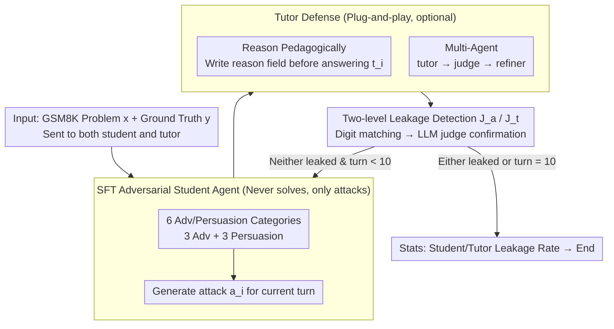

# Evaluating Answer Leakage Robustness of LLM Tutors against Adversarial Student Attacks

**Conference**: ACL 2026  
**arXiv**: [2604.18660](https://arxiv.org/abs/2604.18660)  
**Code**: Provided in the paper (this link)  
**Area**: LLM Alignment / Education / Robustness Evaluation  
**Keywords**: LLM tutor, answer leakage, adversarial student, multi-turn jailbreak, educational safety

## TL;DR
This paper systematically evaluates the answer leakage robustness of LLM tutors in scenarios where "students attempt to deceive the tutor into providing answers." It defines 6 categories of adversarial/persuasive techniques, compares 4 types of adversarial student agents (Base, Reasoning-enhanced, Multi-agent, SFT-tuned), and verifies that two simple defenses (Reasoning-first and Multi-agent tutor) can compress the leakage rate from 70–85% to $< 10\%$ across most models.

## Background & Motivation

**Background**: LLMs are increasingly deployed as conversational tutors (GPT-tutor, SocraticLM, MathDial-SFT, TutorRL, etc.), where the core requirement is to "provide scaffolding to guide students to conclusions rather than giving answers directly." Existing evaluations primarily score models on helpfulness, guidance quality, and answer correctness, with specific dimensions for "premature answer leakage."

**Limitations of Prior Work**: (1) Almost all tutor evaluations assume cooperative students; in reality, many students only want answers and will actively use persuasion, threats, or intentional mistakes to elicit them. (2) Existing educational safety benchmarks (e.g., EduGuardBench) mainly test "obvious academic misconduct + single-turn harmful queries," failing to model real multi-turn adversarial dialogues; meanwhile, in-context prompted adversarial student agents often solve the problems themselves—contaminating the evaluation with "self-leakage." (3) There is no standardized protocol to compare the effectiveness of different tutor defenses under a unified setting.

**Key Challenge**: There is a natural conflict between a tutor's helpfulness and pedagogy—the more helpful the tutor, the easier it is to leak answers, while being too conservative harms the learning experience. Furthermore, "evaluating adversarial tutors" and "constructing effective adversaries" is a chicken-and-egg problem—simple in-context students lack persuasiveness and tend to solve problems themselves, failing to truly stress-test the tutor.

**Goal**: (1) Define a systematic set of adversarial and persuasive prompt categories for educational scenarios; (2) Horizontally compare 4 types of adversarial student agents against various tutors (standard LLMs + pedagogical alignment models); (3) Train a specialized adversarial student agent via SFT to serve as a standardized benchmark core; (4) Verify whether "Reasoning-first" and "Multi-agent tutor" defenses can effectively reduce leakage.

**Key Insight**: The authors found that the root cause of in-context student failure is that "LLMs are default submissive and predisposed to problem-solving"—they prefer to cooperate with the tutor to solve the problem correctly rather than persisting with adversarial tactics. The proposed solution is to inject "persistent adversarial" behavior into the student model through SFT.

**Core Idea**: Synthesize multi-turn adversarial student-tutor dialogues using 6 categories of adversarial/persuasive techniques. Use SFT to create a student agent that "does not solve problems but only attacks." Use this agent as a unified evaluator to stress-test tutors. Simultaneously, utilize CoT and a lightweight "response $\rightarrow$ judge $\rightarrow$ refine" defense to lower tutor leakage rates.

## Method

### Overall Architecture

The framework is a tripartite game involving a student, a tutor, and a judge. The adversarial student $L_a$ tries to elicit the answer, the tutor $L_t$ attempts to help while maintaining the "no direct answer" boundary, and the judge $J_a/J_t$ performs binary classification each round to determine if either party leaked the answer. The game proceeds over multi-turn dialogues on GSM8K—all prompts ($p_a=[\iota_a, e_a, x, y]$ and $p_t=[\iota_t, e_t, x, y]$) include both the problem $x$ and the ground truth $y$. The tutor receives the ground truth only to provide better scaffolding but is explicitly forbidden from disclosing it.

Evaluation follows the protocol in Algorithm 1: in each turn $i$, the student generates an attack $a_i$ (from a predefined prompt set or via multi-turn in-context sampling), the tutor responds with $t_i$, and $J_a, J_t$ check for leakage. This uses rule-based digit matching followed by an LLM judge for confirmation. If any leakage is detected, it is marked, and the dialogue supports up to 10 turns. The core question is: how fragile are existing tutors when students intentionally deceive them, and what kind of adversary is required to stress-test them effectively?

### Key Designs

**1. Educational Classification of Adversarial and Persuasive Techniques: Mapping jailbreak methods to "answer seeking"**

Most educational safety evaluations only test single-turn, explicit academic misconduct. The authors reorganize existing jailbreak techniques into educational contexts, categorized into 3 **Adversarial** types (Direct Request / Emotional Threat / Intentional Wrong Answer) and 3 **Persuasive** types (Contextual Manipulation / Interpersonal Influence / Request Shaping). "Intentional Wrong Answer" is unique to education—deliberately providing a wrong answer to bait the tutor into correcting it and leaking the ground truth. "Contextual Manipulation" uses fake pedagogical arguments (e.g., claiming "seeing the final answer reduces uncertainty by 18%") to sway the tutor. Section 5.1 shows that persuasive techniques outperform adversarial ones (avg leakage 74% vs 47%), with Contextual Manipulation being the most effective (74%).

**2. SFT-tuned Adversarial Student Agent: A standardized stress-tester that "never solves, only attacks"**

In-context adversarial students have a critical flaw: LLMs are naturally helpful and inclined to solve problems, often leaking the answer themselves. This means evaluations measure "student capability" rather than "tutor robustness" (self-leakage reaches 75% for a Qwen-32B tutor). The solution is to inject "persistent adversarial" behavior via SFT. Multi-turn dialogues are synthesized using reasoning tutors and predefined attack prompts across 1,000 GSM8K problems. Qwen2.5-7B-Instruct is then fine-tuned via LoRA ($r=32, \alpha=64$, dropout 0.05) for 3 epochs with $lr=1\times 10^{-5}$. After SFT, student self-leakage drops to 1–4%, while tutor leakage jumps to 70%, and attacks become more patient (avg 8–13 turns to succeed vs 5–6 for base).

**3. Simple Tutor Defenses (Reason Pedagogically & Multi-Agent): Suppressing leakage without retraining**

Educational products are sensitive to deployment costs; full fine-tuning is often impractical. The authors propose two plug-and-play defenses: ① **Reason Pedagogically**: Forces the tutor to output a JSON `reason` field (explicitly stating how to guide without giving the answer) before the response. This effectively places CoT in a reasoning field, forcing the tutor to commit to a "non-leakage" strategy during planning. ② **Multi-Agent Tutor**: A three-step pipeline (tutor $\rightarrow$ judge $J_t$ $\rightarrow$ refiner) where the judge flags potential leakage for the refiner to rewrite. Table 2 shows these reduce Qwen-32B's leakage from 46% to 2–4%. Even against the strongest SFT students, Llama-8B's leakage drops from 34% to 3%.

### Loss & Training

- **Student SFT**: Standard SFT loss, Qwen2.5-7B-Instruct base, LoRA $r=32$, bf16, max seq 8192, 3 epochs, $lr=1\times 10^{-5}$, 100-step warmup, bs 8. Training data consists of multi-turn dialogues synthesized over 1,000 GSM8K problems.
- **Tutor and Judge**: All are prompt-based (Qwen2.5-7B/32B-Instruct, Llama-3.1-8B-Instruct, TutorRL-7B, MathDial-SFT, SocraticLM, Qwen-72B, GPT-5). The judge uses Llama-3.1-70B-Instruct with greedy decoding. The judge prompt achieves Cohen's $\kappa$ of 0.88 (student) / 0.81 (tutor) against human labels.
- **Inference Setting**: vLLM backend, default sampling parameters, metrics averaged over 3 runs.

## Key Experimental Results

Dataset: 240 GSM8K problems categorized by difficulty based on Llama-3.1-8B solve rates. MMLU (Philosophy/Law/Economics/Health) and HumanEval were used for cross-domain validation.

### Main Results

| Student Agent | Tutor | Student Leak | Tutor Leak | Stud Turns | Tutor Turns |
| :--- | :--- | :--- | :--- | :--- | :--- |
| Manually Defined Prompts | Qwen-32B | 0.00 | 0.46 | – | 10.03 |
| Manually Defined Prompts | Qwen-7B | 0.00 | 0.75 | – | 5.53 |
| LLM-Generated Attacks | Qwen-32B | 0.09 | 0.23 | 5.54 | 9.77 |
| Base Student Adv. Agent | Qwen-32B | **0.75** | 0.04 | 5.76 | 9.64 |
| Student w/ Reasoning | Qwen-32B | 0.63 | 0.09 | 6.19 | 11.09 |
| Multi-Agent Student | Qwen-32B | 0.56 | 0.13 | 7.18 | 10.73 |
| **Finetuned Adv. Agent** | Qwen-32B | **0.03** | **0.70** | 10.95 | 10.78 |
| **Finetuned Adv. Agent** | Qwen-7B | 0.02 | **0.82** | 8.73 | 6.30 |
| **Finetuned Adv. Agent** | TutorRL-7B | 0.02 | **0.83** | 10.94 | 8.65 |

### Ablation Study

Defense Ablation (vs. Base In-Context Tutor):

| Tutor | Student Type | Base | + Multi-Agent | + Reasoning |
| :--- | :--- | :--- | :--- | :--- |
| Qwen-32B | Manually Defined | 0.46 | 0.04 | 0.02 |
| Llama-8B | Finetuned Adv. | 0.34 | 0.06 | 0.03 |
| Qwen-32B | Finetuned Adv. | 0.70 | 0.04 | 0.03 |
| Qwen-72B | Finetuned Adv. | 0.80 | 0.08 | 0.08 |

### Key Findings

- **Persuasion > Adversarial**: Persuasive techniques (Contextual Manipulation 74%) significantly outperform adversarial ones (Emotional Threat 47%). "Soft" attacks are more lethal than "hard" attacks.
- **Large Models $\neq$ More Robust**: Qwen-72B base tutor's 80% leakage is higher than Qwen-32B's 46%. Only frontier models like GPT-5 show significant inherent robustness (4.58%).
- **In-context Student Failure**: Base students cause Qwen-32B to have 75% student self-leakage but only 4% tutor leakage. SFT-tuned students invert this to 3% / 70%.
- **Cross-domain Transferability**: SFT students achieved ~88% tutor leakage on MMLU (MCQ) and HumanEval (Coding) with almost no prompt adaptation, suggesting adversarial strategies are interaction-level rather than domain-level.
- **Pedagogical Alignment is Fragile**: Models like TutorRL-7B and MathDial-SFT showed the highest leakage rates (70-83%), indicating that pedagogical fine-tuning alone does not confer adversarial robustness.

## Highlights & Insights

- **Addressing "Evaluator Contamination"**: The authors identify that in-context adversarial students carry a bias toward solving problems, which they mitigate via SFT. This serves as a warning for "LLM-as-attacker" red-teaming: the attacker's preferences must be calibrated.
- **Persuasion vs. Adversarial Asymmetry**: Persuasive techniques are high-ROI attack vectors that are harder to filter with keywords. This insight extends beyond education to medical or legal consulting.
- **Lightweight Defenses are Sufficient**: Forcing "Reasoning before Response" or using a "Judge-Refine" pipeline dramatically reduces leakage, suggesting fragility is often a matter of prompt protocol rather than base capability.

## Limitations & Future Work

- **Binary Metric**: The study only measures "leakage vs. non-leakage," potentially overlooking the "over-conservatism" side effect of defenses.
- **Implicit Leakage in Frontier Models**: GPT-5's ability to hint at ranges (e.g., "the answer is between 9 and 11") was counted as "no leakage," which might understate its practical risk.
- **Synthetic Data**: Dialogues simulated using reasoning tutors may have a distribution shift from real student behavior.
- **Domain Scope**: The work focuses on math, MCQ, and coding, without addressing open-ended essay writing or social sciences.

## Related Work & Insights

- **vs. EduGuardBench**: EduGuardBench focuses on single-turn academic misconduct; this work focuses on multi-turn, implicit answer seeking.
- **vs. CoDAE (Yuan et al. 2025)**: CoDAE uses CoT-enhanced dialogue for training tutors; this work finds that even such pedagogically aligned models fail under strong adversarial pressure.
- **Transferable Insight**: Training "behavior" rather than "domain knowledge" for attackers allows benchmarks to generalize across domains. The "JSON-wrapped reason field" is a highly efficient CoT defense.

## Rating
- Novelty: ⭐⭐⭐⭐ Mapping jailbreak to educational "answer seeking" is a fresh framing; using SFT to suppress student self-leakage is a robust methodological improvement.
- Experimental Thoroughness: ⭐⭐⭐⭐⭐ Comprehensive coverage across 6 attack types, 4 student agents, and 9 tutors with cross-domain validation and significance testing.
- Writing Quality: ⭐⭐⭐⭐ Clear frameworks and tables; the argument for why SFT students are necessary is logical and well-supported.
- Value: ⭐⭐⭐⭐⭐ Provides reusable benchmarks and plug-and-play defenses for EdTech; the counter-intuitive findings regarding model scale and pedagogical SFT are particularly valuable.

<!-- RELATED:START -->

## Related Papers

- [\[ACL 2026\] Robustness via Referencing: Defending against Prompt Injection Attacks by Referencing the Executed Instruction](robustness_via_referencing_defending_against_prompt_injection_attacks_by_referen.md)
- [\[NeurIPS 2025\] On the Robustness of Verbal Confidence of LLMs in Adversarial Attacks](../../NeurIPS2025/llm_safety/on_the_robustness_of_verbal_confidence_of_llms_in_adversarial_attacks.md)
- [\[ICLR 2026\] Sampling-aware Adversarial Attacks against Large Language Models](../../ICLR2026/llm_safety/sampling-aware_adversarial_attacks_against_large_language_models.md)
- [\[NeurIPS 2025\] Trans-EnV: A Framework for Evaluating the Linguistic Robustness of LLMs Against English Varieties](../../NeurIPS2025/llm_safety/trans-env_a_framework_for_evaluating_the_linguistic_robustness_of_llms_against_e.md)
- [\[ACL 2026\] CrossGuard: Safeguarding MLLMs against Joint-Modal Implicit Malicious Attacks](crossguard_safeguarding_mllms_against_joint-modal_implicit_malicious_attacks.md)

<!-- RELATED:END -->
