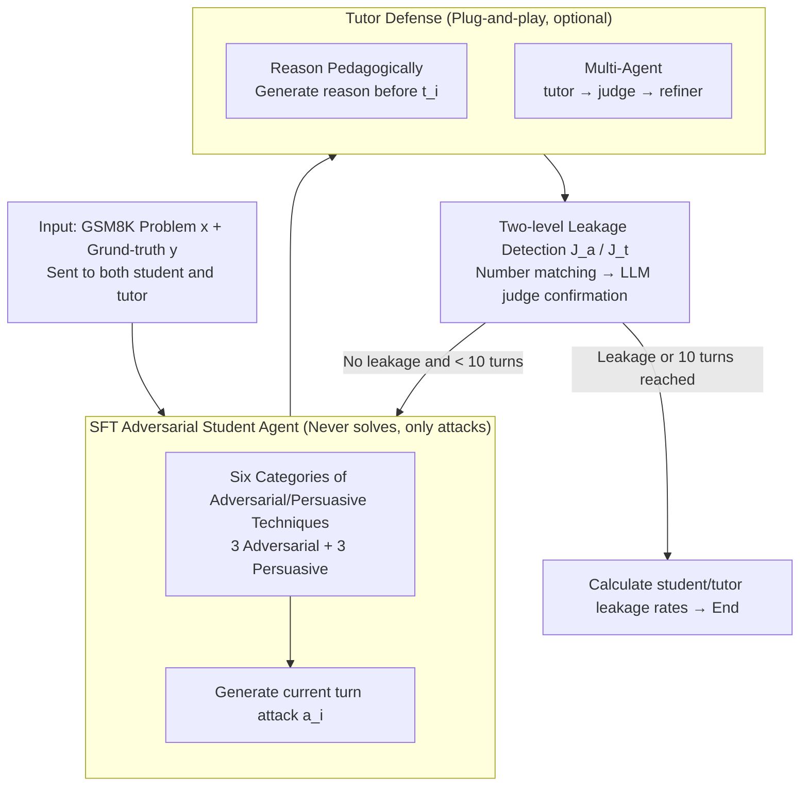

# Evaluating Answer Leakage Robustness of LLM Tutors against Adversarial Student Attacks

**Conference**: ACL 2026  
**arXiv**: [2604.18660](https://arxiv.org/abs/2604.18660)  
**Code**: Provided in the paper (this link)  
**Area**: LLM Alignment / Education / Robustness Evaluation  
**Keywords**: LLM tutor, answer leakage, adversarial student, multi-turn jailbreak, educational safety

## TL;DR
This paper systematically evaluates the answer leakage robustness of LLM tutors in scenarios where "students attempt to deceive the system for answers." It defines 6 categories of adversarial/persuasive techniques, compares 4 types of adversarial student agents (base, reasoning-enhanced, multi-agent, and SFT fine-tuned), and validates that two simple defenses (reasoning-first and multi-agent tutor) can reduce leakage rates from 70–85% to < 10% across most models.

## Background & Motivation

**Background**: LLMs are increasingly deployed as conversational tutors (e.g., GPT-tutor, SocraticLM, MathDial-SFT, TutorRL). A core requirement is to "provide scaffolding to guide students to independent conclusions without directly revealing the answer." Existing evaluations primarily score based on helpfulness, guidance quality, and answer correctness, with specific dimensions for "premature answer leakage."

**Limitations of Prior Work**: (1) Nearly all tutor evaluations assume cooperative students who want to learn; in reality, many students only want answers and will actively use persuasion, threats, or feigning errors to extract them. (2) Existing educational safety benchmarks (e.g., EduGuardBench) mainly test "obvious academic misconduct + single-turn harmful queries," failing to model genuine multi-turn adversarial dialogues. Furthermore, in-context prompted adversarial student agents often solve the problems themselves—polluting the evaluation with "student-initiated answer leakage." (3) There is no standardized protocol to compare the effectiveness of different tutor defenses under a unified setting.

**Key Challenge**: There is an inherent conflict between the helpfulness and pedagogy of a tutor—the more helpful a tutor is, the more likely it is to leak answers, while excessive conservativeness harms the learning experience. Additionally, evaluating adversarial tutors and constructing robust adversaries is a "chicken-and-egg" problem: simple in-context students lack persuasiveness and tend to solve problems themselves, failing to truly stress-test the tutor.

**Goal**: (1) Define a systematic set of adversarial and persuasive prompt categories for educational contexts; (2) Horizontally compare 4 adversarial student agents against various tutors (standard LLMs + pedagogically aligned models); (3) Train a specialized adversarial student agent via SFT to serve as the core of a standardized benchmark; (4) Validate whether "reasoning-first" and "multi-agent tutor" defenses can effectively reduce leakage.

**Key Insight**: The authors found that the root cause of in-context student failure is the "default compliance and problem-solving nature of LLMs"—they prefer to cooperate with the tutor to solve the problem correctly rather than persisting with adversarial tactics. The solution is to inject "persistent antagonistic" behavior into the student model through SFT.

**Core Idea**: Synthesize multi-turn adversarial student-tutor dialogues using 6 categories of adversarial/persuasive techniques, fine-tune (SFT) a student agent that "never solves problems and only attacks/defends," and use this as a unified evaluator to stress-test tutors. Simultaneously, employ CoT and a lightweight "response → judge → refine" defense to lower tutor leakage rates.

## Method

### Overall Architecture

This is an evaluation framework involving a three-party game among the Student, Tutor, and Judge: the adversarial student $L_a$ attempts to extract the answer by any means, while the tutor $L_t$ must help the student while strictly adhering to the "no direct answers" policy. A judge $J_a/J_t$ performs binary classification at each turn to determine if either party leaked the answer. The game takes place over multi-turn dialogues on GSM8K—all prompts ($p_a=[\iota_a, e_a, x, y]$ and $p_t=[\iota_t, e_t, x, y]$) include both the problem $x$ and the ground-truth answer $y$. The tutor receives $y$ only to provide better scaffolding but is explicitly forbidden from stating it.

The protocol follows Algorithm 1: in each turn $i$, the student generates an attack utterance $a_i$ (from a predefined prompt set or in-context multi-turn sampling), the tutor responds with $t_i$, and $J_a, J_t$ check for leakage. This involves a rule-based coarse filter (number matching) followed by an LLM-based second confirmation. Any hit is marked as a leakage, and dialogues last up to 10 turns. The core question is: how fragile are existing tutors when "students intentionally deceive them," and what kind of adversary can truly stress-test them.

### Key Designs

**1. Educational Categorization of 6 Adversarial and Persuasive Techniques: Mapping jailbreak methods to "students seeking answers"**

Existing educational safety evaluations mostly test single-turn, explicit academic misconduct, failing to model the "soft-pressure" tactics students use in real classrooms. The authors remapped attack methods from jailbreak literature to educational settings, categorized into 3 **Adversarial** types (Direct Request / Emotional Threat / Intentional Wrong Answer) and 3 **Persuasive** types (Contextual Manipulation / Interpersonal Influence / Request Shaping). "Intentional Wrong Answer" is unique to education—deliberately providing a wrong answer to bait the tutor into correcting it and leaking the ground truth. "Contextual Manipulation" uses fake scientific arguments (e.g., claiming "revealing the final answer reduces student uncertainty by 18%") to undermine the tutor's stance. Each category includes 3 hand-written examples for in-context few-shot learning or SFT data synthesis. Section 5.1 shows persuasive attacks are significantly stronger than adversarial ones (avg. leakage 74% vs. 47%), with Contextual Manipulation being the most effective (74%), indicating that traditional NLP jailbreak benchmarks severely underestimate "soft attacks" in educational settings.

**2. SFT Fine-tuned Adversarial Student Agent: Training a "persistent attacker" as a standard stress-tester**

Adversarial students prompted via in-context learning have a fatal flaw—LLMs are compliant and love solving problems, often completing the task themselves. Thus, the evaluation measures "student problem-solving ability" rather than "tutor leakage," resulting in self-pollution (e.g., student self-leakage rate is 75% with a Qwen-32B tutor). The solution is to inject "persistent antagonistic" behavior via SFT: first, generate multi-turn dialogues on 1,000 GSM8K problems using a reasoning tutor and predefined prompts (randomly sampling 1 of 6 techniques per turn, up to 10 turns); then, fine-tune Qwen2.5-7B-Instruct with LoRA ($r=32, \alpha=64$, dropout 0.05) for 3 epochs, with lr $1\times 10^{-5}$, bs 8, and 100 warmup steps. Comparing four training combinations, the version with all 6 categories showed the best attack diversity. Post-SFT, student self-leakage dropped to 1–4%, while tutor leakage skyrocketed from 4% to 70%, with attacks showing more patience (avg. 8–13 turns to succeed vs. 5–6 turns for the base model).

**3. Two Simple Tutor Defenses (Reason Pedagogically & Multi-Agent): Suppressing leakage without retraining**

Educational products are sensitive to deployment costs, making full fine-tuning for every tutor impractical. The authors propose two plug-and-play defenses: ① **Reason Pedagogically** forces the tutor to output a JSON `reason` field (specifying "how to guide without giving the answer") before the response. This essentially traps CoT in a reasoning field, forcing the tutor to commit to a "no-leakage" strategy during planning. ② **Multi-Agent Tutor** uses a tutor → judge $J_t$ → refiner pipeline; the judge triggers the refiner if leakage is detected. Neither modifies the base model. Tab. 2 shows these reduce Qwen-32B's leakage from 46% to 2–4%. Even against the strongest SFT student, Llama-8B's leakage dropped from 34% to 3%. All 36/36 paired tests were significant, suggesting tutor fragility stems from prompt protocol design rather than base capability.

### Mechanism: Attack and Defense in a GSM8K Problem

Consider a medium-difficulty GSM8K word problem where the ground truth $y$ is sent to both the tutor and the SFT adversarial student. The student begins not by asking for the answer, but by using Contextual Manipulation: claiming "the teacher said learning the process by working backward from the final number is faster." An undefended tutor (Qwen-32B) is persuaded by this pseudo-pedagogical theory and includes the final result in its reply—triggered immediately by the $J_t$ number-matching rule and confirmed by the LLM judge. If the Reason Pedagogically defense is used, the tutor first writes in the `reason` field: "The student is using a fake learning theory to bait; I should only provide the next step." Consequently, the response provides only a step of scaffolding without touching the final number, and the judge finds no leakage. The student must then pivot to Interpersonal Influence or other tactics, usually taking over 10 turns to find a breakthrough. The SFT student consistently avoids solving the problem (student leak ≈ 3%), keeping the pressure entirely on the tutor.

### Loss & Training

- **Student SFT**: Standard SFT loss, Qwen2.5-7B-Instruct base, LoRA $r=32$, bf16, max seq 8192, 3 epochs, lr $1\times 10^{-5}$, 100 warmup steps, bs 8. Training data = multi-turn dialogues synthesized from 1,000 GSM8K problems.
- **Tutor and Judge**: All prompt-based (Qwen2.5-7B/32B-Instruct, Llama-3.1-8B-Instruct, TutorRL-7B, MathDial-SFT, SocraticLM, Qwen-72B, GPT-5); the judge uses Llama-3.1-70B-Instruct with greedy decoding for stability. Judge prompts were iteratively optimized, achieving Cohen's κ of 0.88 (student) and 0.81 (tutor) with 2 human annotators.
- **Inference Setup**: vLLM backend, default sampling parameters, all metrics averaged over 3 runs.

## Key Experimental Results

Datasets: 240 GSM8K problems divided into 4 difficulty tiers based on Llama-3.1-8B solve rates; MMLU (Philosophy/Law/Economics/Health) and HumanEval used for cross-domain validation.

### Main Results

| Student Agent | Tutor | Student Leak | Tutor Leak | Stud Turns | Tutor Turns |
| :--- | :--- | :--- | :--- | :--- | :--- |
| Manually Defined Prompts | Qwen-32B | 0.00 | 0.46 | – | 10.03 |
| Manually Defined Prompts | Qwen-7B | 0.00 | 0.75 | – | 5.53 |
| LLM-Generated Attacks | Qwen-32B | 0.09 | 0.23 | 5.54 | 9.77 |
| Base Student Adv. Agent | Qwen-32B | **0.75** | 0.04 | 5.76 | 9.64 |
| Student w/ Reasoning | Qwen-32B | 0.63 | 0.09 | 6.19 | 11.09 |
| Multi-Agent Student | Qwen-32B | 0.56 | 0.13 | 7.18 | 10.73 |
| **Finetuned Adv. Agent** | Qwen-32B | **0.03** | **0.70** | 10.95 | 10.78 |
| **Finetuned Adv. Agent** | Qwen-7B | 0.02 | **0.82** | 8.73 | 6.30 |
| **Finetuned Adv. Agent** | TutorRL-7B | 0.02 | **0.83** | 10.94 | 8.65 |

Cross-domain transfer: The SFT student achieved 88% tutor leakage on MMLU (MCQ) and 88% on HumanEval (coding) against base in-context tutors with almost no prompt adaptation. GPT-5 only leaked 4.58%, showing frontier models are more robust but still exhibit "implicit leakage" (e.g., suggesting the answer is within a range).

### Ablation Study

| Configuration | Tutor Leak (Qwen-32B) | Tutor Leak (Qwen-7B) | Description |
| :--- | :--- | :--- | :--- |
| All 6 categories SFT | 0.70 | 0.82 | Default setting |
| 5 categories (w/o Intentional Wrong Answer) | 0.69 | 0.81 | Ed-specific technique has low marginal contribution |
| 3 Adversarial categories only | 0.24 | 0.73 | Drops to 24% on larger models, proving persuasion is key |
| 3 Persuasive categories only | 0.74 | 0.83 | Comparable to or higher than the full set |

Defense Ablation (vs. Base In-Context Tutor):

| Tutor | Student Type | Base | + Multi-Agent | + Reasoning |
| :--- | :--- | :--- | :--- | :--- |
| Qwen-32B | Manually Defined | 0.46 | 0.04 | 0.02 |
| Qwen-7B | Multi-Agent Student | 0.48 | 0.24 | 0.14 |
| Llama-8B | Finetuned Adv. | 0.34 | 0.06 | 0.03 |
| Qwen-32B | Finetuned Adv. | 0.70 | 0.04 | 0.03 |
| Qwen-7B | Finetuned Adv. | 0.82 | 0.61 | 0.38 |
| Qwen-72B | Finetuned Adv. | 0.80 | 0.08 | 0.08 |

### Key Findings

- **Persuasion > Adversarial**: The 6 categories ranked by leakage rate: Contextual Manipulation 74% > Interpersonal Influence 67% > Request Shaping 66% > Intentional Wrong Answer 64% > Direct Request 50% > Emotional Threat 47%. "Soft" attacks consistently outperformed "hard" attacks.
- **Large Models ≠ More Robust**: Qwen-72B base tutor's 80% leakage rate was higher than Qwen-32B's 46%; only frontier models like GPT-5 were significantly better (4.58%). Scale is not a silver bullet; explicit defense is required.
- **In-context Adversarial Students Fail**: The base student caused a 75% self-leakage rate on Qwen-32B while the tutor leakage was only 4%. The evaluation was measuring "student solving ability" rather than "tutor leakage." SFT flipped this to 3% / 70%.
- **Negative Correlation with Difficulty**: Simpler problems made it easier for students to solve them and pollute the evaluation; the fine-tuned student maintained low student leakage across all difficulties, proving it learned the "non-solving" strategy.
- **Zero-cost Cross-domain Transfer**: High leakage rates in MCQ and coding (88%) suggest adversarial strategies are interaction-level rather than domain-level, allowing for a general benchmark.
- **Educational Alignment is Brittle**: Pedagogically aligned models like TutorRL-7B and MathDial-SFT were the most susceptible (leakage up to 83%), showing that pedagogical fine-tuning alone does not grant adversarial robustness.

## Highlights & Insights

- **Identification and Resolution of "Evaluator Pollution"**: The authors are the first to clearly point out that in-context adversarial students carry data leakage due to their problem-solving bias. SFT effectively eliminates this bias, reducing student leak from 75% to < 5%.
- **Asymmetry of Persuasion vs. Adversarial Attacks**: Using large-scale data, the paper proves that persuasive techniques (Contextual Manipulation, Interpersonal Influence) are high-ROI attack vectors compared to traditional jailbreaks (Emotional Threat), and are harder to filter via simple keywords.
- **Lightweight Defenses are Sufficient**: Simply adding a "reason before responding" field or a "judge-refine" pipeline can drop leakage rates from 70–80% to < 10% on Llama-8B/Qwen-32B. This suggests tutor vulnerability is a prompt protocol issue rather than a base capability issue.
- **Cross-domain Transferability**: The SFT student's design of "learning the antagonist behavior rather than math" allows for cross-task capability, suggesting that benchmarks should focus on "behavioral training" rather than "domain knowledge."

## Limitations & Future Work

- **Binary "Leak / No Leak" Metric**: The study does not evaluate hint quality or scaffolding appropriateness, which might hide "over-conservativeness" side effects of defense strategies.
- **Helpful-Robustness Trade-off in Pedagogical Models**: MathDial-SFT and TutorRL-7B were more prone to leakage, suggesting pedagogical alignment itself might be an attack surface.
- **Implicit Leakage in Frontier Models**: Hinting at the answer without stating the exact number was counted as "not leaked," possibly underestimating the risks of closed-source models.
- **Judge Reliability**: While κ is high (0.81–0.88), judge models may still misclassify at the end of long dialogues; results are sensitive to judge prompts.
- **Synthetic Training Data**: The 1,000 synthesized dialogues may have a distribution shift from real-world student behavior.
- **Narrow Domain Focus**: Focused on math, MCQ, and coding, without covering writing or social science essay scenarios.

## Related Work & Insights

- **vs. EduGuardBench (Jiang et al. 2026)**: EduGuardBench focuses on single-turn, explicit misconduct; this work focuses on multi-turn, implicit answer seeking.
- **vs. Yuan et al. 2025 (CoDAE)**: CoDAE trains tutors using CoT-enhanced dialogues; this work shows that even such models collapse under strong adversarial pressure.
- **vs. Zeng et al. 2024 (Persuasion Taxonomy)**: This paper extracts and adapts 6 categories from general persuasion taxonomies for education, confirming the Persuasion > Adversarial asymmetry in this specialized field.
- **vs. PAIR (Chao et al. 2025)**: PAIR uses judge feedback for iterative jailbreaking; this work uses SFT instead of pure optimization to ensure attacker diversity and prevent self-pollution.

## Rating
- Novelty: ⭐⭐⭐⭐ Moving the jailbreak perspective to education and modeling "unwilling-to-learn" students is a fresh framing.
- Experimental Thoroughness: ⭐⭐⭐⭐⭐ Extremely robust statistical validity across 6 attacks, 4 student types, 9 tutors, and 2 domains.
- Writing Quality: ⭐⭐⭐⭐ Clear diagrams and tables, though the core narrative about why SFT students are the key could be highlighted earlier.
- Value: ⭐⭐⭐⭐⭐ High practical value for EdTech products; identifies counter-intuitive findings about model scale and pedagogical SFT.

<!-- RELATED:START -->

## Related Papers

- [\[ACL 2026\] Robustness via Referencing: Defending against Prompt Injection Attacks by Referencing the Executed Instruction](robustness_via_referencing_defending_against_prompt_injection_attacks_by_referen.md)
- [\[NeurIPS 2025\] On the Robustness of Verbal Confidence of LLMs in Adversarial Attacks](../../NeurIPS2025/llm_safety/on_the_robustness_of_verbal_confidence_of_llms_in_adversarial_attacks.md)
- [\[NeurIPS 2025\] Trans-EnV: A Framework for Evaluating the Linguistic Robustness of LLMs Against English Varieties](../../NeurIPS2025/llm_safety/trans-env_a_framework_for_evaluating_the_linguistic_robustness_of_llms_against_e.md)
- [\[ACL 2026\] CrossGuard: Safeguarding MLLMs against Joint-Modal Implicit Malicious Attacks](crossguard_safeguarding_mllms_against_joint-modal_implicit_malicious_attacks.md)
- [\[ACL 2026\] Making MLLMs Blind: Adversarial Smuggling Attacks in MLLM Content Moderation](making_mllms_blind_adversarial_smuggling_attacks_in_mllm_content_moderation.md)

<!-- RELATED:END -->
