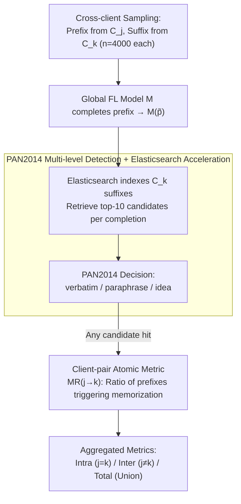

# Exploring Cross-Client Memorization of Training Data in Large Language Models for Federated Learning

**Conference**: ACL 2026  
**arXiv**: [2510.08750](https://arxiv.org/abs/2510.08750)  
**Code**: https://github.com/tinnakitudsa/FL_memorization_framework.git  
**Area**: LLM Security / Federated Learning / Privacy  
**Keywords**: Federated Learning, Training Data Memorization, Privacy Leakage, Cross-Client Leakage, PAN2014

## TL;DR
The authors extend fine-grained cross-sample memorization metrics for centralized LLMs (Zeng 2024 + PAN2014 plagiarism detector) to Federated Learning (FL). They propose a client-pair metric $\text{MR}_{j \to k}$ and derive intra-client and inter-client memorization ratios. The study finds that FL **does not** effectively prevent training data memorization—while intra-client memorization is higher than inter-client, the total memorization in FL vs. Centralized Learning (CL) shows no significant decrease. Memorization is significantly influenced by prefix length, decoding strategies, and FL algorithms (FedProx > FedAvg).

## Background & Motivation
**Background**: Federated Learning (FL) is widely promoted as a privacy-preserving paradigm for sensitive sectors like healthcare and finance by "avoiding raw data sharing" through local training and gradient/parameter updates. However, LLMs "memorize" training data during fine-tuning (Carlini 2022, etc.). Whether this memorization persists under FL and whether it leaks across clients remains an unsystematically quantified problem.

**Limitations of Prior Work**: (a) Memorization metrics for CL (verbatim / k-extractible / paraphrase / idea-level; notably Zeng 2024 using the PAN2014 plagiarism detector) assume that a "memorized suffix can only be triggered by its original prefix"—reasonable for CL, but ignores the dangerous "prefix from client A triggering a suffix from client B" leakage in FL. (b) FL memorization research (Thakkar 2021, Ramaswamy 2020) almost exclusively uses canary injection (inserting out-of-distribution phrases), which only detects same-sample verbatim memorization for OOD data and fails for real in-distribution cross-sample leakage.

**Key Challenge**: There is a measurement gap between FL's privacy claims and actual memorization risks. Fine-grained CL methods are limited to same-sample analysis, while FL cross-client scenarios only utilize coarse-grained tools like canary injection.

**Goal**: (1) Adapt fine-grained cross-sample memorization metrics from CL to multi-client FL scenarios; (2) Use this framework to quantitatively answer: Do FL models memorize training data? What factors influence the level of memorization?

**Key Insight**: Directly extend the PAN2014-based framework (Zeng 2024 + Lee 2023) by relaxing the decision function $F(M(p), s)$ from "prefix $p$ and suffix $s$ belong to the same sample" to "prefix $p$ from client $C_j$ and suffix $s$ from client $C_k$," leading to the client-pair metric $\text{MR}_{j \to k}$.

**Core Idea**: Expand "memorization" from prefix-suffix matching within the same sample/client to **prefix-suffix matching across any client pair**, distinguishing between harm-exposed (intra-client: $C_j = C_k$) and harmful (inter-client: $C_j \neq C_k$) risks.

## Method

### Overall Architecture
The framework follows a five-step process (Steps ①-⑤ in Figure 1): (①) Sample $n=4000$ prefix-suffix pairs from client $C_j$'s training set $D_j$, and sample $n$ suffixes from client $C_k$; (②) Input each prefix $\tilde{p}$ from $C_j$ into the global FL model $M$ to generate completion $M(\tilde{p})$; (③) Use Elasticsearch to index the suffix set $\tilde{S}_k$ from $C_k$ and perform similarity retrieval for each $M(\tilde{p})$ to get the top-$n'=10$ closest real suffixes; (④) Use the PAN2014 plagiarism detector (verbatim / paraphrase $p>0.5$ / paraphrase $p<0.5$ / idea-level) to determine if $M(\tilde{p})$ matches any top-$n'$ candidates; (⑤) If any candidate matches, the prefix is considered to have triggered $C_j \to C_k$ memorization. The ratio is $\text{MR}_{j \to k} = |P_{j,k}| / |P_j|$.

Two core derived metrics: $\text{MR}_{\text{Intra}}$ (weighted average where $j = k$, representing leakage within the same client) and $\text{MR}_{\text{Inter}}$ (weighted average across all $j \neq k$, representing cross-client leakage). For fair comparison with CL, $\text{MR}_{\text{TotalCL}}$ and $\text{MR}_{\text{TotalFL}}$ (union of all prefixes triggering any memorization) are also defined.

### Key Designs

**1. Extension from Same-Sample Hypothesis to Client-Pair Metrics: Quantifying "A's prefix triggering B's suffix"**

CL memorization metrics assume suffixes are triggered by their own prefixes. In FL, this misses the most dangerous leakage: a query from client A fishing out private suffixes from client B. The authors relax the same-sentence assumption in the decision function. Definition 3.1 formalizes this as "there exists $s_k \in S_k$ such that $F(M(p_j), s_k) = \text{True}$," where prefix $p_j$ is from client $j$ and suffix $s_k$ is from client $k$. This categorizes memorization into intra-client ($j=k$, harm-exposed) and inter-client ($j \neq k$, directly harmful). The atomic metric $\text{MR}_{j \to k}$ is the smallest unit of information capable of carrying both granularities, which simple global ratios or single-client counts cannot distinguish.

**2. PAN2014 Fine-grained Detector + Elasticsearch: Capturing paraphrased memorization while managing $O(n^2)$ complexity**

Relying solely on verbatim matching underestimates real memorization, as models often rephrase content. However, comparing every generated prefix against all suffixes is $O(n^2)$ and computationally infeasible. Adopting the design from Zeng 2024 and Lee 2023, the authors use the PAN2014 plagiarism detector to support three levels: verbatim, paraphrase (high/low confidence), and idea labels. To handle complexity, suffixes are indexed via Elasticsearch, reducing comparisons from $n \times n = 1.6 \times 10^7$ to $n \times 10 = 4 \times 10^4$. The authors acknowledge in Appendix E.5 that PAN2014, designed for human-like text, may misidentify mode-collapsed outputs (e.g., repeating "lobes, lobes") as idea memorization.

**3. Client-Pair Matrix → Intra/Inter/Total Aggregated Metrics: One matrix for three questions**

To compare intra-client leakage, inter-client leakage, and overall FL vs. CL memorization, the authors derive all indicators from the $\text{MR}_{j \to k}$ matrix. $\text{MR}_{\text{Intra}} = \sum_j w_j \cdot \text{MR}_{j \to j}$ averages the diagonal terms. $\text{MR}_{\text{Inter}} = \sum_j w_j \cdot \text{MR}_{\text{Inter}}(j)$ averages off-diagonal terms, where weights $w_j = |D_j| / \sum_i |D_i|$ prevent large clients from being drowned by noise from smaller ones. For comparison, $\text{MR}_{\text{TotalFL}} = |\bigcup_{j,k} P_{j,k}| / |\bigcup_j P_j|$ uses the union of prefixes rather than the sum to avoid double-counting prefixes that trigger multiple leakages.

### Loss & Training
The work uses standard FL algorithms: FedAvg (McMahan 2017) and FedProx (Li 2020). Model: Qwen2.5-3B (main), Llama3.2-1B/3B, GPT-2 XL, Qwen2.5-0.5B/1.5B (ablation). Framework: LLaMA Factory, lr=2e-4, bf16, batch=64. Set-up: 3 FL clients, each with 27k training / 3k test samples. Default prefix length 30, top-k decoding (k=40), 3 communication rounds. Tasks: Summarization, Dialog, QA, Classification (all privacy-sensitive).

## Key Experimental Results

### Main Results
**RQ1: Do FL models memorize training data?** (Qwen2.5-3B + FedAvg + top-k + prefix=30):

| Task | $\text{MR}_{\text{Intra}}$ (%) | $\text{MR}_{\text{Inter}}$ (%) | Intra/Inter Ratio |
|------|--------------------------------|--------------------------------|-------------------|
| Summarization | 0.342 | 0.046 | 7.4× |
| Dialog | 1.533 | 1.446 | 1.06× |
| QA | 1.450 | 0.813 | 1.78× |
| Classification | 0.000 | 0.000 | – |

**Total Memorization: FL vs. CL + Performance**:

| Task | Model | Performance | Memorization (%) |
|------|------|-------------|------------------|
| Summarization | $\text{MR}_{\text{TotalCL}}$ | 28.46 | 0.558 |
| Summarization | $\text{MR}_{\text{TotalFL}}$ | 29.88 | 0.433 |
| Dialog | $\text{MR}_{\text{TotalCL}}$ | 19.40 | 3.417 |
| Dialog | $\text{MR}_{\text{TotalFL}}$ | 18.11 | **3.992** |
| QA | $\text{MR}_{\text{TotalCL}}$ | 26.66 | 2.150 |
| QA | $\text{MR}_{\text{TotalFL}}$ | 28.60 | **2.917** |
| Classification | $\text{MR}_{\text{TotalCL}}$ | 76.30 | 0.000 |
| Classification | $\text{MR}_{\text{TotalFL}}$ | 51.22 | 0.000 |

→ In Dialog/QA, FL **memorizes more than CL**, contradicting Thakkar 2021's claim that FL reduces memorization.

### Ablation Study

| Configuration | Summa $\text{MR}_{\text{Intra}}$ | Dialog $\text{MR}_{\text{Intra}}$ | QA $\text{MR}_{\text{Intra}}$ | Description |
|------|--------|--------|--------|------|
| Decoding: temperature | 0.475 | 1.267 | 1.283 | Baseline |
| Decoding: top-k | 0.342 | 1.533 | 1.450 | Slight Increase |
| Decoding: top-p | **0.525** | **3.792** | **2.567** | Top-p maximizes memorization |
| Prefix 10 | 0.508 | 2.108 | 1.525 | Short prefix |
| Prefix 30 | 0.342 | 1.533 | 1.450 | Default |
| Prefix 50 | 0.425 | 1.575 | 1.242 | Mid-length |
| Prefix 100 | **0.208** | **1.408** | **1.125** | Long prefix → least memorization |
| FL algo: FedAvg | 0.342 | 1.533 | 1.450 | Baseline |
| FL algo: FedProx | **0.942** | **1.892** | **3.675** | FedProx 2-3x more memorization |

**Impact of suffix client source** (Dialog, $\text{MR}_{j \to k}$ %):

| Prefix \ Suffix | Group1 | Group2 | Group3 |
|------|--------|--------|--------|
| Group1 | 1.450 | 1.525 | 1.500 |
| Group2 | 1.150 | 1.200 | 1.225 |
| Group3 | **1.725** | 1.550 | **1.950** |

→ Group3's suffixes are always more easily memorized, suggesting **content characteristics** rather than prefix source determine memorization risk.

### Key Findings
- **FL is not a privacy silver bullet**: Intra > Inter suggests that "client's own data is more easily triggered by its own prefix," but Inter is significantly non-zero (Dialog 1.446% is nearly equal to Intra). Cross-client data retrieval is possible, making FL's privacy promise for in-distribution data unreliable.
- **Thakkar 2021's conclusion is challenged**: While prior work used OOD canary injection, this study uses in-distribution PAN2014. In Dialog/QA, FL memorizes more than CL, suggesting that OOD-based "safety" obscures real in-distribution leakage risks.
- **Longer prefixes lead to less memorization**: Increasing prefix length from 10 to 100 tokens significantly drops $\text{MR}_{\text{Inter}}$. Long prefixes provide highly unique "fingerprints" that require precise reproduction, making **short prompts the more dangerous** privacy probes.
- **Top-p/Top-k decoding amplifies memorization**: Temperature sampling is the weakest, while top-p in Dialog tripled Intra-memorization. There is a clear trade-off between "better" decoding strategies and privacy.
- **FedProx > FedAvg in memorization**: FedProx's proximal term, designed to stabilize non-IID training, causes the model to fit local client data more tightly, doubling memorization.
- **Classification's 0% memorization is an artifact**: Suffixes in classification tasks are too short (1-2 tokens/labels) for PAN2014's 50-character threshold.

## Highlights & Insights
- **Paradigm Value of Client-Pair Matrix**: Upgrades FL privacy measurement from a single global number to an $L \times L$ matrix, enabling future research on client heterogeneity and adversarial behaviors.
- **Transparency on PAN2014 Limitations**: Authors openly admit failure modes where repetitive mode-collapsed outputs are misidentified as idea-level memorization.
- **Challenging Consensus**: Contradicts the influential "FL reduces memorization" claim with in-distribution evidence, providing a methodology shift for the field.
- **Counter-intuitive Prefix Finding**: Defies the intuition that more context (longer prefix) helps models "remember" more; instead, long prefixes make reproduction harder.

## Limitations & Future Work
- **Tooling Constraints**: PAN2014 artifacts (false positives for idea-level), language limitation (English-only), and character thresholds (failing for short classification labels).
- **Theoretical Gap**: No theoretical/information-theoretic proof for the observed phenomena.
- **Scale**: Only 3 clients tested; real-world FL involves hundreds of clients, where cross-client retrieval may face scalability bottlenecks ($O(L^2)$).
- **Defense Evaluation**: No assessment of differential privacy (DP) or secure aggregation under this fine-grained metric.

## Related Work & Insights
- **vs. Zeng 2024**: Inherits the three-level detection pipeline but relaxes the same-sample assumption for FL.
- **vs. Thakkar 2021 & Canary Injection**: Moves beyond OOD canary detection (which may underestimate leakage) to fine-grained in-distribution analysis.
- **Generalization**: The cross-client framework is applicable to cross-organization data sharing, cross-domain pre-training, and cross-modal data memorization.

## Rating
- Novelty: ⭐⭐⭐⭐ Client-pair matrix and harm-exposed/harmful dichotomy are clear conceptual increments.
- Experimental Thoroughness: ⭐⭐⭐⭐ High coverage of tasks, models, lengths, algorithms, and decoding; though limited by client count (3).
- Writing Quality: ⭐⭐⭐⭐ Clear formalization (Definitions 1/3.1) and transparent discussion of limitations.
- Value: ⭐⭐⭐⭐ A major wake-up call for FL privacy (FL ≠ secure) and a solid foundation for future defense work.

<!-- RELATED:START -->

## Related Papers

- [\[ACL 2026\] Revisiting Non-Verbatim Memorization in Large Language Models: The Role of Entity Surface Forms](revisiting_non-verbatim_memorization_in_large_language_models_the_role_of_entity.md)
- [\[ACL 2025\] Exploring Forgetting in Large Language Model Pre-Training](../../ACL2025/llm_safety/exploring_forgetting_in_large_language_model_pre-training.md)
- [\[AAAI 2026\] TOFA: Training-Free One-Shot Federated Adaptation for Vision-Language Models](../../AAAI2026/llm_safety/tofa_training-free_one-shot_federated_adaptation_for_vision-language_models.md)
- [\[ACL 2026\] Learning Uncertainty from Sequential Internal Dispersion in Large Language Models](learning_uncertainty_from_sequential_internal_dispersion_in_large_language_model.md)
- [\[ACL 2025\] Private Memorization Editing: Turning Memorization into a Defense to Strengthen Data Privacy in Large Language Models](../../ACL2025/llm_safety/private_memorization_editing_turning_memorization_into_a_defense_to_strengthen_d.md)

<!-- RELATED:END -->
