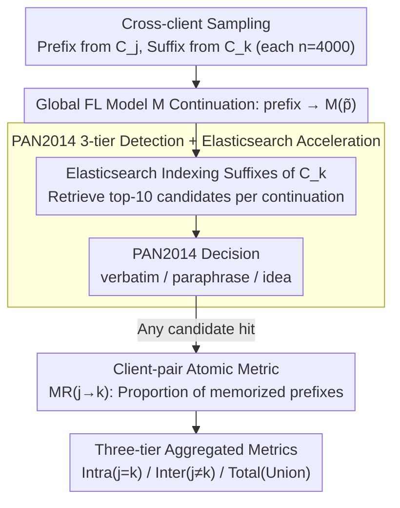

# Exploring Cross-Client Memorization of Training Data in Large Language Models for Federated Learning

**Conference**: ACL 2026  
**arXiv**: [2510.08750](https://arxiv.org/abs/2510.08750)  
**Code**: https://github.com/tinnakitudsa/FL_memorization_framework.git  
**Area**: LLM Security / Federated Learning / Privacy  
**Keywords**: Federated Learning, Training Data Memorization, Privacy Leakage, Cross-Client Leakage, PAN2014

## TL;DR
The authors extend fine-grained cross-sample memorization metrics from centralized LLMs (Zeng 2024 + PAN2014 plagiarism detector) to Federated Learning (FL). They propose a client-pair metric $\text{MR}_{j \to k}$ to derive intra-client and inter-client memorization ratios. The study finds that FL **does not** effectively prevent training data memorization—while intra-client memorization is higher than inter-client, the total memorization ratio of FL vs. CL shows no significant decrease. Memorization is significantly influenced by prefix length, decoding strategies, and FL algorithms (FedProx > FedAvg).

## Background & Motivation
**Background**: Federated Learning (FL) is widely promoted as a privacy-preserving paradigm for sensitive sectors like healthcare and finance by allowing multiple clients to train locally and only upload gradients or parameters, thereby "avoiding the sharing of raw data." However, LLMs "remember" training data during the fine-tuning phase (Carlini 2022, etc.). Whether this memorization persists under FL and leads to cross-client leakage remains a question that has not been systematically quantified.

**Limitations of Prior Work**: (a) Memorization metrics in Centralized Learning (CL) (verbatim / k-extractible / paraphrase / idea-level; notably Zeng 2024 using the PAN2014 plagiarism detector for three-tier granularity) implicitly assume that "a remembered suffix can only be triggered by the prefix of the same sample." This is reasonable in CL but misses the more dangerous cross-client leakage in FL, where "the prefix from client A triggers the suffix from client B." (b) Research on memorization in FL (Thakkar 2021, Ramaswamy 2020) almost exclusively uses canary injection (inserting out-of-distribution phrases into training data to see if the model can reproduce them). This only detects "same-sample verbatim" and is limited to OOD data, making it completely ineffective for real-world, in-distribution cross-sample leakage.

**Key Challenge**: There is a measurement gap between the privacy-preserving claims of FL and the actual risks of memorization—there exist fine-grained CL methods that only support same-sample analysis, and cross-client FL scenarios that only possess coarse-grained tools like canary injection.

**Goal**: (1) To adapt fine-grained cross-sample memorization metrics from CL to multi-client FL scenarios; (2) To use this new framework to quantitatively answer two RQs: Does the FL model truly remember training data? What factors affect the degree of memorization?

**Key Insight**: Directly extend the PAN2014-based framework of Zeng 2024 + Lee 2023 by relaxing the decision function $F(M(p), s)$ from "$p$ and $s$ belong to the same sample" to "$p$ comes from client $C_j$ and $s$ comes from client $C_k$," leading to the client-pair metric $\text{MR}_{j \to k}$.

**Core Idea**: Expand "memorization" from same-sample/same-client prefix-suffix matching to **prefix-suffix matching between any client pair**. Based on this, risks are categorized into harm-exposed (intra-client: $C_j = C_k$) and harmful (cross-client: $C_j \neq C_k$).

## Method

### Overall Architecture
The framework follows a five-step process (Steps ①-⑤ in Figure 1): (①) Sample $n=4000$ prefix-suffix pairs from the training set $D_j$ of client $C_j$, and sample $n$ suffixes from client $C_k$; (②) Input each prefix $\tilde{p}$ from $C_j$ into the global FL model $M$ to generate a continuation $M(\tilde{p})$; (③) Use Elasticsearch to index the suffix set $\tilde{S}_k$ from $C_k$, performing similarity retrieval for each $M(\tilde{p})$ to obtain the top-$n'=10$ most similar real suffixes; (④) Use the PAN2014 plagiarism detector (verbatim / paraphrase $p>0.5$ / paraphrase $p<0.5$ / idea-level) to determine if $M(\tilde{p})$ matches any of the top-$n'$ candidates; (⑤) If any candidate returns True, the prefix is considered to have triggered memorization from $C_j \to C_k$, and the proportion is calculated as $\text{MR}_{j \to k} = |P_{j,k}| / |P_j|$.

Two core metrics are derived from this: $\text{MR}_{\text{Intra}}$ (weighted average of all $j = k$, representing intra-client leakage) and $\text{MR}_{\text{Inter}}$ (weighted average of all $j \neq k$, representing cross-client leakage). For a fair comparison with CL, $\text{MR}_{\text{TotalCL}}$ and $\text{MR}_{\text{TotalFL}}$ (the proportion of the union of all prefixes that trigger memorization) are also defined.

### Key Designs

**1. Extension from Same-sample Hypothesis to Client-pair Metrics: Quantifying "A's Prefix Pulling B's Suffix" for the First Time**

Memorization metrics in the CL era default to the assumption that "a remembered suffix can only be triggered by a prefix from the same sentence." While valid in a centralized context, migrating this to FL misses the most dangerous type of leakage—where a query from client A fishes out a private suffix from client B. The authors unbind the same-sentence assumption in the decision function: Definition 3.1 is formalized as "there exists $s_k \in S_k$ such that $F(M(p_j), s_k) = \text{True}$," where the prefix is from client $j$ and the suffix is from client $k$. This allows categorization into intra-client ($j=k$, harm-exposed) and inter-client ($j \neq k$, explicitly harmful). Building on this, the atomic metric at the client-pair granularity is defined as $\text{MR}_{j \to k} = |P_{j,k}| / |P_j|$, with all higher-level indicators being weighted aggregations of this. This client-pair matrix is essential because the old metric $|\{p \in P : \exists s, F(M(p), s) = \text{True}\}| / |P|$ under FL offers only two flawed paths: either calculating only intra-client (missing cross-client risk) or mixing all client data (failing to distinguish between harm-exposed and harmful). $\text{MR}_{j \to k}$ is the mathematically minimal information unit that carries both granularities.

**2. PAN2014 Three-tier Fine-grained Detector + Elasticsearch Acceleration: Capturing Paraphrased Memory while Optimizing $O(n^2)$ Comparisons**

Relying solely on verbatim matching severely underestimates actual memorization, as models often paraphrase the same information with different words. However, comparing "every prefix against every suffix" leads to $O(n^2)$ complexity, which is computationally prohibitive. The authors adopt a design validated by Zeng 2024, using an improved version of the PAN2014 plagiarism detector (Lee 2023) to support three granularities: verbatim (literal), paraphrase (further subdivided into $p>0.5$ high-confidence and $p<0.5$ low-confidence), and idea (conceptual similarity). This captures more insidious forms of memorization. To reduce complexity, an Elasticsearch index is created for the 4000 suffixes of each client. For each continuation $M(\tilde{p})$, only the top-10 candidates are retrieved before running PAN2014, reducing the number of comparisons from $n \times n = 1.6 \times 10^7$ to $n \times 10 = 4 \times 10^4$. The authors honestly acknowledge the ceiling of this paradigm in Appendix E.5: PAN2014 is designed for human-like text and may misidentify mode-collapsed, incoherent output (e.g., repeatedly generating "lobes, lobes, lobes") as idea-level memorization—an inherent limitation of the tool rather than an implementation bug.

**3. Client-pair Matrix $\to$ Intra/Inter/Total Aggregated Metrics: One Matrix Answering Three Questions**

Researchers want to know three things: how much leaks within a client, how much leaks across clients, and whether FL remembers more or less than CL overall. Defining independent metrics for each would be fragmented and difficult to compare fairly. The authors aggregate all from the same $\text{MR}_{j \to k}$ matrix: $\text{MR}_{\text{Intra}} = \sum_j w_j \cdot \text{MR}_{j \to j}$ takes the weighted average of diagonal entries; $\text{MR}_{\text{Inter}}(j) = \frac{1}{L-1}\sum_{j \neq k} \text{MR}_{j \to k}$ is weighted into $\text{MR}_{\text{Inter}} = \sum_j w_j \cdot \text{MR}_{\text{Inter}}(j)$ (where weights $w_j = |D_j| / \sum_i |D_i|$ are assigned by client data volume to prevent noise from small clients). For comparison with CL, $\text{MR}_{\text{TotalFL}} = |\bigcup_{j,k} P_{j,k}| / |\bigcup_j P_j|$ is used. The key here is using the union for "Total" rather than a sum: the same prefix might remember suffixes from multiple clients simultaneously; "if any leakage is triggered, it counts as one." The union separates "breadth of leakage" from "frequency of leakage" and avoids double counting.

### Loss & Training
This work does not introduce new training algorithms but utilizes existing FL baselines: FedAvg (McMahan 2017) and FedProx (Li 2020). The models include Qwen2.5-3B (main experiment), Llama3.2-1B/3B, GPT-2 XL, and Qwen2.5-0.5B/1.5B (ablation). The framework is LLaMA Factory with lr=2e-4, bf16, and batch=64. There are three FL clients, each with 27k training and 3k test samples. Defaults include a prefix length of 30, top-k decoding (k=40), and 3 communication rounds. Tasks cover summarization (arXiv abstract $\to$ title), dialog (HealthCareMagic patient-physician), QA (PubMedQA), and classification (PubMed 200k RCT), all within privacy-sensitive domains.

## Key Experimental Results

### Main Results
**RQ1: Do FL models memorize training data?** (Qwen2.5-3B + FedAvg + top-k + prefix=30):

| Task | $\text{MR}_{\text{Intra}}$ (%) | $\text{MR}_{\text{Inter}}$ (%) | Intra/Inter Ratio |
|------|--------------------------------|--------------------------------|-------------------|
| Summarization | 0.342 | 0.046 | 7.4× |
| Dialog | 1.533 | 1.446 | 1.06× |
| QA | 1.450 | 0.813 | 1.78× |
| Classification | 0.000 | 0.000 | – |

**Total Memorization Ratio Comparison (FL vs CL) + Performance**:

| Task | Model | Performance | Memorization (%) |
|------|------|-------------|------------------|
| Summarization | $\text{MR}_{\text{TotalCL}}$ | 28.46 | 0.558 |
| Summarization | $\text{MR}_{\text{TotalFL}}$ | 29.88 | 0.433 |
| Dialog | $\text{MR}_{\text{TotalCL}}$ | 19.40 | 3.417 |
| Dialog | $\text{MR}_{\text{TotalFL}}$ | 18.11 | **3.992** |
| QA | $\text{MR}_{\text{TotalCL}}$ | 26.66 | 2.150 |
| QA | $\text{MR}_{\text{TotalFL}}$ | 28.60 | **2.917** |
| Classification | $\text{MR}_{\text{TotalCL}}$ | 76.30 | 0.000 |
| Classification | $\text{MR}_{\text{TotalFL}}$ | 51.22 | 0.000 |

$\to$ On Dialog/QA, FL surprisingly **remembers more than CL**, contradicting Thakkar 2021's conclusion that "FL reduces memorization."

### Ablation Study

| Config | Summa $\text{MR}_{\text{Intra}}$ | Dialog $\text{MR}_{\text{Intra}}$ | QA $\text{MR}_{\text{Intra}}$ | Description |
|------|--------|--------|--------|------|
| Decoding: temperature | 0.475 | 1.267 | 1.283 | baseline |
| Decoding: top-k | 0.342 | 1.533 | 1.450 | Slight increase |
| Decoding: top-p | **0.525** | **3.792** | **2.567** | top-p maximizes memorization (Dialog +2x) |
| Prefix 10 | 0.508 | 2.108 | 1.525 | Short prefix |
| Prefix 30 | 0.342 | 1.533 | 1.450 | Default |
| Prefix 50 | 0.425 | 1.575 | 1.242 | Mid-long |
| Prefix 100 | **0.208** | **1.408** | **1.125** | Long prefix $\to$ Least memorization |
| FL algo: FedAvg | 0.342 | 1.533 | 1.450 | baseline |
| FL algo: FedProx | **0.942** | **1.892** | **3.675** | FedProx has 2-3x more memorization than FedAvg |
| Model size 0.5B/1.5B/3B | 0.550 / 0.992 / 0.342 | – | – | No clear trend |
| Comm rounds 1/3/5 | 0.433 / 0.342 / 0.467 | – | – | No clear trend |

**Impact of Suffix Client Source on Memorization** (Dialog task, $\text{MR}_{j \to k}$ %):

| Prefix \ Suffix | Group1 | Group2 | Group3 |
|------|--------|--------|--------|
| Group1 | 1.450 | 1.525 | 1.500 |
| Group2 | 1.150 | 1.200 | 1.225 |
| Group3 | **1.725** | 1.550 | **1.950** |

$\to$ Group3's suffixes are consistently easier to remember (row average 1.475), suggesting that **dataset content properties**, rather than the prefix source, determine memorization risk.

### Key Findings
- **FL is not a silver privacy bullet**: The general rule of Intra > Inter suggests that "a client's own data is more easily pulled out by its own prefix" is a harm-exposed risk, but Inter is significantly non-zero (Dialog 1.446% is nearly equal to Intra). This means one client's data can indeed be pulled out by a "neighbor," making FL's privacy claims for in-distribution data a hollow promise.
- **Thakkar 2021's "FL reduces memorization" conclusion is refuted**: That paper used canary injection (OOD), while this work uses in-distribution PAN2014. On Dialog and QA, FL actually remembers more than CL—implying that "security" measured by OOD canaries is distinct from real in-distribution leakage, indicating a systematic underestimation in FL privacy research over the past 5 years.
- **Longer prefixes lead to less memorization**: For $\text{MR}_{\text{Inter}}$ in Summa, length 10 to 100 sees a 47x drop from 0.188 $\to$ 0.004. Intuitive explanation: Long prefixes provide a more "unique" fingerprint, requiring precise reproduction rather than fuzzy matching—this suggests to attackers that **short prompts are the most dangerous** privacy probes.
- **top-p / top-k decoding amplifies memorization**: Temperature sampling is the weakest; top-p pushes Dialog Intra from 1.267 to 3.792 (nearly triple). This means deploying FL LLMs with "better decoding strategies" brings more privacy leakage, highlighting a trade-off between security and quality.
- **FedProx > FedAvg in memorization**: The proximal regularization in FedProx, originally designed for stability in non-IID scenarios, causes the model to fit client data more tightly, doubling memorization (Dialog Intra 1.533 $\to$ 1.892, QA Intra 1.450 $\to$ 3.675). This is hard evidence of how FL algorithm choice directly impacts privacy.
- **0% memorization in classification is an artifact**: Because classification outputs are only 1-2 tokens (labels), the generated suffix length (median 1-2 tokens) is shorter than the PAN2014 50-character matching threshold. This is a measurement blind spot, not a lack of memorization.
- **Certain clients are easier to remember**: Group3's suffixes were more easily remembered (1.6x Group2). Dataset content characteristics (repetitive patterns, vocabulary distribution) are the key factors; simple weighted averages by client data volume can mask this heterogeneity.

## Highlights & Insights
- **Paradigm value of the client-pair matrix**: Upgrading FL privacy measurement from a "single globally aggregated number" to an "$L \times L$ matrix" allows future work to study client heterogeneity, adversarial behavior, and precise defense strategies—it is a clean measurement infrastructure.
- **Honest acknowledgment of PAN2014 limitations**: The authors explicitly provide real cases in Appendix E.5 where mode-collapsed output was misjudged as idea memorization (e.g., "lobes, lobes, lobes") and implemented a simple heuristic to filter 10-time repeats of three-word sequences. This transparency is more credible than just stacking numbers.
- **Challenging existing consensus**: Thakkar 2021's "FL reduces memorization" is a landmark conclusion in the FL privacy circle. This work provides the first **counter-experimental data** using in-distribution + fine-grained metrics, creating a significant methodological impact on FL privacy research.
- **Counter-intuitive prefix length finding**: Many might assume "longer prefixes provide more context $\to$ easier for the model to 'recall'," but experiments show the opposite. Long prefixes make reproduction tasks more "fingerprinted" and harder to achieve; this gives direct strategy to prompt-based privacy attack designs (short prompt > long prompt).
- **The privacy cost of FedProx**: The industry generally views FedProx as a "side-effect-free enhancement" of FedAvg, but this work demonstrates its hidden cost in the privacy dimension—the proximal term leads to tighter fitting of local data, and thus stronger memorization.

## Limitations & Future Work
- **PAN2014 Artifacts**: (a) False positives for incoherent output as idea memorization; (b) Only supports English; (c) The 50-character threshold renders measurements for short-output tasks (classification) ineffective. All conclusions are limited by this tool's ceiling.
- **Lack of Theory**: The authors admit they do not provide a theoretical explanation for "why Intra > Inter"—it is an observation of phenomena without probability or information-theoretic proofs.
- **Scale of 3 Clients**: Real-world FL involves 100-1000 clients; whether these conclusions extrapolate is unknown. Additionally, as $L$ increases, cross-client retrieval (searching $L-1$ other clients per $M(\tilde{p})$) faces an $O(L^2)$ scaling bottleneck.
- **No Defense Evaluation**: This work only measures the degree of leakage without evaluating common FL defenses like differential privacy, gradient clipping, or secure aggregation under fine-grained cross-client metrics.
- **No Clear Trend for Model/Communication Rounds**: The search space might be too small (max 3B parameters / 5 rounds); non-linear effects at larger scales cannot be ruled out.
- **Future Directions**: (1) Design fine-grained metrics that handle mode collapse and multiple languages; (2) Use the client-pair matrix for client selection, data curation, or adaptive DP noise; (3) Theoretically prove the relationship between FedProx's proximal term and memorization; (4) Validate with large-scale FL (100+ clients); (5) Use mechanistic interpretability to find the migration patterns of "memorization neurons" under FL.

## Related Work & Insights
- **vs. Zeng 2024 (CL fine-grained memorization)**: Zeng 2024 upgraded CL memorization metrics from verbatim to a three-tier paraphrase/idea level. Ours borrows the PAN2014 pipeline but relaxes the "same sample" assumption to "cross-client" and defines the client-pair matrix as an FL-specific metric layer.
- **vs. Thakkar 2021 (FL canary injection)**: Thakkar used OOD canaries and concluded "FL is safer than CL." Ours uses in-distribution PAN2014 and finds the opposite—indicating that canary-based metrics underestimate real leakage, necessitating a re-evaluation of FL privacy research.
- **vs. Lee 2023 "Do language models plagiarize?"**: Lee 2023 proposed using PAN2014 + Elasticsearch for large-scale plagiarism detection in CL. Ours extends this engineering framework to the multi-client FL scenario.
- **vser. Canary Injection School** (Carlini 2019, Ramaswamy 2020): Canaries are good for detecting memorization of rare OOD patterns but are powerless against common real-world patterns (e.g., "I have high blood pressure") found across thousands of records. Fine-grained metrics are necessary to fill this gap.
- **Inspiration for other fields**: The cross-client memorization framework can be generalized to cross-organization data sharing, cross-domain pre-training (e.g., whether data from one language is pulled out by prompts from another in multilingual models), and cross-modal pre-training (e.g., image-text data memorizing each other).

## Rating
- Novelty: ⭐⭐⭐⭐ The client-pair matrix and harm-exposed/harmful dichotomy are clear conceptual increments; however, the underlying tool is fully inherited from Zeng 2024, limiting theoretical innovation.
- Experimental Thoroughness: ⭐⭐⭐⭐ Covers 4 tasks × 5 models × 4 prefix lengths × 3 decoding strategies × 2 FL algorithms × 3 communication rounds + per-category PAN2014 breakdown + client-pair matrix + suffix source analysis. High coverage, but the 3-client scale is relatively small.
- Writing Quality: ⭐⭐⭐⭐ 5 pages of main text + extensive appendices are clearly organized. Definition 1/3.1 + Equations 1-5 formalize metrics concisely. Limitations honestly point out PAN2014 failure modes.
- Value: ⭐⭐⭐⭐ A significant wake-up call for FL privacy research (FL ≠ safe). The client-pair matrix is a solid foundation for subsequent defense work. Open-source code allows high-stakes sectors like medical/legal to evaluate their own deployments.

<!-- RELATED:START -->

## Related Papers

- [\[ACL 2026\] Revisiting Non-Verbatim Memorization in Large Language Models: The Role of Entity Surface Forms](revisiting_non-verbatim_memorization_in_large_language_models_the_role_of_entity.md)
- [\[ICML 2026\] Decoupled Training with Local Reinforcement Fine-Tuning in Federated Learning](../../ICML2026/llm_safety/decoupled_training_with_local_reinforcement_fine-tuning_in_federated_learning.md)
- [\[ACL 2025\] Exploring Forgetting in Large Language Model Pre-Training](../../ACL2025/llm_safety/exploring_forgetting_in_large_language_model_pre-training.md)
- [\[AAAI 2026\] TOFA: Training-Free One-Shot Federated Adaptation for Vision-Language Models](../../AAAI2026/llm_safety/tofa_training-free_one-shot_federated_adaptation_for_vision-language_models.md)
- [\[ACL 2026\] Learning Uncertainty from Sequential Internal Dispersion in Large Language Models](learning_uncertainty_from_sequential_internal_dispersion_in_large_language_model.md)

<!-- RELATED:END -->
