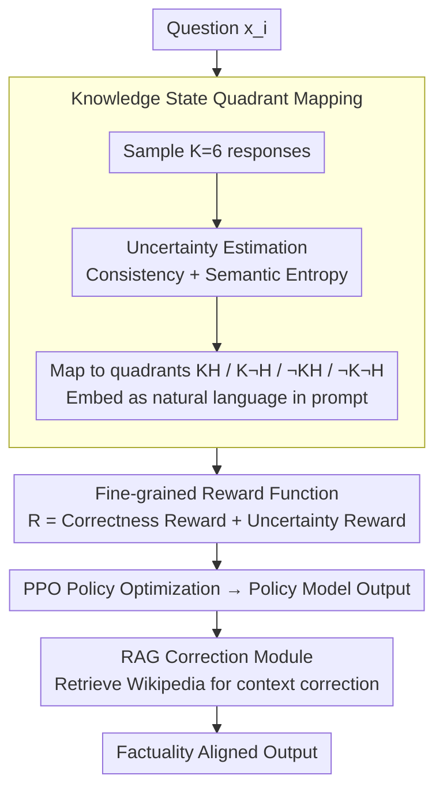

# FAITH: Factuality Alignment through Integrating Trustworthiness and Honestness

**Conference**: ACL 2026 Findings  
**arXiv**: [2604.10189](https://arxiv.org/abs/2604.10189)  
**Code**: [https://github.com/xndong/FAITH](https://github.com/xndong/FAITH)  
**Area**: Information Retrieval  
**Keywords**: Factuality Alignment, Knowledge State Quadrants, Uncertainty Estimation, PPO, Retrieval Augmentation

## TL;DR
This paper proposes the FAITH framework, which maps LLM uncertainty signals (consistency + semantic entropy) to natural language descriptions of knowledge state quadrants (trustworthiness $\times$ honestness). It designs a fine-grained reward function considering uncertainty for PPO training and utilizes a RAG module to correct potential errors, systematically improving the factual accuracy of LLMs.

## Background & Motivation

**Background**: LLMs can generate fluent but factually incorrect content (hallucinations), even when the model possesses the correct knowledge internally. This "know-tell gap" severely undermines reliability. Recent works have attempted to introduce uncertainty signals during training to align factuality.

**Limitations of Prior Work**: (1) Existing methods directly insert numerical uncertainty scores into QA prompts (e.g., "Conf: 0.833"), which lacks semantic richness and is difficult for LLMs to utilize; (2) Use of binary reward functions (correct/incorrect) ignores answering confidence, potentially encouraging "guessing" behavior; (3) Neglect of external knowledge usage fails to correct potential erroneous answers.

**Key Challenge**: Factual inconsistency in LLMs manifests as providing correct or incorrect answers to the same question under different formulations. The root cause is the lack of alignment between the model's knowledge ownership state (whether it truly knows) and its answering behavior (whether it expresses honestly). Numerical uncertainty signals do not help the model understand its own knowledge boundaries.

**Goal**: Design a post-training framework that transforms uncertainty signals into semantically rich knowledge state descriptions to improve factual accuracy and truthfulness through fine-grained rewards and external knowledge retrieval.

**Key Insight**: Categorize the LLM's knowledge state for each question into four quadrants: KH (Knowledgeable & Honest), K¬H (Knowledgeable & Dishonest), ¬KH (Unknowledgeable & Honest), and ¬K¬H (Unknowledgeable & Dishonest), using natural language to describe these states and embedding them in training prompts.

**Core Idea**: Replace numerical uncertainty with natural language knowledge states $\rightarrow$ Fine-grained rewards considering both correctness and uncertainty $\rightarrow$ RAG module to correct answers with weak foundations.

## Method

### Overall Architecture
FAITH aims to solve the "know-tell gap" where a model knows the answer but speaks incorrectly. The core pipeline involves: first quantifying the model's internal uncertainty for each question, translating it into natural language (e.g., "Do you know or should you answer?"), then using a reward function that distinguishes "confidently correct" from "lucky guesses" to train this self-awareness into the policy. Finally, a RAG fallback is implemented to correct questions the model truly does not understand. The implementation is divided into three stages: the data augmentation stage samples multiple answers, estimates uncertainty, maps them to knowledge state quadrants, and writes descriptions into the training data; the training stage follows SFT $\rightarrow$ Reward Model $\rightarrow$ PPO $\rightarrow$ RAG; the inference stage estimates knowledge states, generates policy answers, and performs RAG correction.

### Key Designs

**1. Knowledge State Quadrant Mapping: Translating opaque confidence values into human-readable descriptions**

Previous approaches inserted numbers like "Conf: 0.833" into prompts, but LLMs struggle to infer their own knowledge boundaries from raw values. FAITH instead measures uncertainty accurately and semanticizes it: for each question $x_i$, it samples $K=6$ answers and calculates two metrics—$\text{Consistency}(x_i) = \frac{1}{K}\sum \mathbb{1}\{y_i^k = \hat{y_i}\}$ to measure stability, and semantic entropy $SE(x_i) = -\sum_c p(c|x_i) \log p(c|x_i)$ to measure semantic dispersion. These dimensions intersect into four quadrants: KH (consistency $>0, SE=0$), K¬H (consistency $>0, SE\neq0$), ¬KH (consistency $=0, SE=0$), and ¬K¬H. These are embedded as natural language descriptions in the prompt (e.g., "You are certain and consistent regarding this question"). This aligns better with the model's language understanding capabilities than raw values.

**2. Fine-grained Reward Function: Distinguishing "confidently correct" from "guessing correctly"**

Binary rewards only look at correctness, encouraging models to "guess" for points—a major source of inflated factuality metrics. FAITH splits the reward into $R_{\text{FAITH}} = R_{\text{correctness}} + R_{\text{uncertainty}}$. Correctness reward remains exact matching, while the uncertainty reward is assigned based on knowledge states: $+2$ for KH, $+1$ for K¬H, $-1$ for ¬KH, and $-2$ for ¬K¬H. The total reward ranges from $-2$ to $+3$. This clarifies the training objective: be confident when you know (KH gets the highest score), honestly refuse to answer instead of hallucinating when you don't know (¬KH receives a minor penalty), and most importantly, penalize guessing without knowledge (¬K¬H). This creates a continuous gradient coupled with confidence.

**3. RAG Correction Module: Adding external knowledge fallback for difficult questions**

PPO cannot fill internal knowledge gaps; for ¬K states, the model simply lacks the information. FAITH constructs a vector database based on Wikipedia and trains a RAG model to retrieve relevant passages as context to correct potential errors in the policy model's output. Positioned as the final factuality validation layer, it covers what internal knowledge cannot reach, providing a third layer of defense.

### Loss & Training
Four-stage training: (1) SFT for reference model $\pi_\mu$; (2) Reward model training; (3) PPO policy optimization; (4) RAG model training. Validated on Llama3-8B and Mistral-7B-v0.1, using NQ-Open, SciQ, and TriviaQA for in-domain training, and PopQA for out-of-domain testing.

## Key Experimental Results

### Main Results (Llama3-8B)

| Method | In-domain Acc | In-domain Truth | Out-domain Acc | Out-domain Truth |
|------|---------|-----------|---------|-----------|
| Base Average | Low | Low | Low | Low |
| UAlign | Mid | Mid | Mid | Mid |
| FAITH | **74.26%** | **45.73%** | **67.99%** | **34.03%** |

### Ablation Study

| Configuration | Accuracy | Truthfulness | Description |
|------|------|--------|------|
| Full FAITH | Optimal | Optimal | Complete framework |
| w/o Knowledge State (Numerical) | Decrease | Decrease | Advantage of natural language |
| w/o Uncertainty Reward (Binary) | Decrease | Decrease | Necessity of fine-grained rewards |
| w/o RAG | Decrease | Decrease | RAG correction contribution |

### Key Findings
- Natural language knowledge state descriptions consistently outperform numerical uncertainty signals across two models and four datasets.
- Fine-grained rewards provide better learning signals than binary rewards, reducing "guessing" behaviors.
- The RAG module significantly contributes to out-of-domain generalization by compensating for internal knowledge gaps.
- FAITH outperforms five strong baselines on both Llama3-8B and Mistral-7B, demonstrating cross-model generalizability.

## Highlights & Insights
- **Semanticization of Knowledge States**: Transforming opaque uncertainty numbers into natural language descriptions (e.g., "knowledgeable and honest") allows LLMs to understand their own knowledge boundaries during training.
- **Distinguishing Confidence**: By penalizing low-confidence correct answers via uncertainty rewards, the framework reduces superficial performance, which is critical for high-stakes domains like medicine or law.
- **Three-layer Factuality Protection**: Knowledge state guidance (self-awareness) $\rightarrow$ fine-grained rewards (correct behavior) $\rightarrow$ RAG correction (external validation) forms a complete factuality assurance chain.

## Limitations & Future Work
- Estimating knowledge states requires sampling multiple answers ($K=6$), leading to extra overhead during inference.
- The four-quadrant division might be overly simplified; actual knowledge states could be continuous rather than discrete.
- The RAG module depends on the Wikipedia corpus, which may lack coverage for recent knowledge or niche professional domains.
- The computational cost of PPO training is high and may not scale easily to extremely large models.

## Related Work & Insights
- **vs. UAlign**: UAlign uses numerical uncertainty and binary rewards directly in the prompt. FAITH provides richer signals through natural language states and fine-grained rewards.
- **vs. R-Tuning**: R-Tuning teaches models to refuse when uncertain but does not distinguish fine-grained differences between knowledge ownership and answering behavior.
- **vs. Self-consistency**: Self-consistency detects uncertainty through sampling during inference; FAITH converts this signal into a training signal.

## Rating
- Novelty: ⭐⭐⭐⭐ The combination of knowledge state quadrants and fine-grained rewards is an insightful design.
- Experimental Thoroughness: ⭐⭐⭐⭐ Four datasets, two models, five baselines, and detailed ablations.
- Writing Quality: ⭐⭐⭐⭐ Clear framework description and complete formalization.
- Value: ⭐⭐⭐⭐ Provides a practical and interpretable method for LLM factuality alignment.

## Related Papers

- [\[ACL 2025\] UAlign: Leveraging Uncertainty Estimations for Factuality Alignment on Large Language Models](../../ACL2025/llm_safety/ualign_leveraging_uncertainty_estimations_for_factuality_alignment_on_large_lang.md)
- [\[ACL 2025\] ComparisonQA: Evaluating Factuality Robustness of LLMs Through Knowledge Frequency Control and Uncertainty](../../ACL2025/llm_safety/comparisonqa_evaluating_factuality_robustness_of_llms_through_knowledge_frequenc.md)
- [\[ACL 2026\] Permutation-Consensus Listwise Judging for Robust Factuality Evaluation](permutation-consensus_listwise_judging_for_robust_factuality_evaluation.md)
- [\[ICLR 2026\] AudioTrust: Benchmarking the Multifaceted Trustworthiness of Audio Large Language Models](../../ICLR2026/llm_safety/audiotrust_benchmarking_the_multifaceted_trustworthiness_of_audio_large_language.md)
- [\[NeurIPS 2025\] VMDT: Decoding the Trustworthiness of Video Foundation Models](../../NeurIPS2025/llm_safety/vmdt_decoding_the_trustworthiness_of_video_foundation_models.md)

<!-- RELATED:END -->

<!-- RELATED:START -->

## Related Papers

- [\[ACL 2026\] Permutation-Consensus Listwise Judging for Robust Factuality Evaluation](permutation-consensus_listwise_judging_for_robust_factuality_evaluation.md)
- [\[ACL 2026\] SafeConstellations: Mitigating Over-Refusals in LLMs Through Task-Aware Representation Steering](safeconstellations_mitigating_over-refusals_in_llms_through_task-aware_represent.md)
- [\[ACL 2026\] Reasoning Hijacking: The Fragility of Reasoning Alignment in Large Language Models](reasoning_hijacking_the_fragility_of_reasoning_alignment_in_large_language_model.md)
- [\[ACL 2026\] SafeMERGE: Preserving Safety Alignment in Fine-Tuned Large Language Models via Selective Layer-Wise Model Merging](safemerge_preserving_safety_alignment_in_fine-tuned_large_language_models_via_se.md)
- [\[ACL 2026\] CAP: Controllable Alignment Prompting for Unlearning in LLMs](cap_controllable_alignment_prompting_for_unlearning_in_llms.md)

<!-- RELATED:END -->
